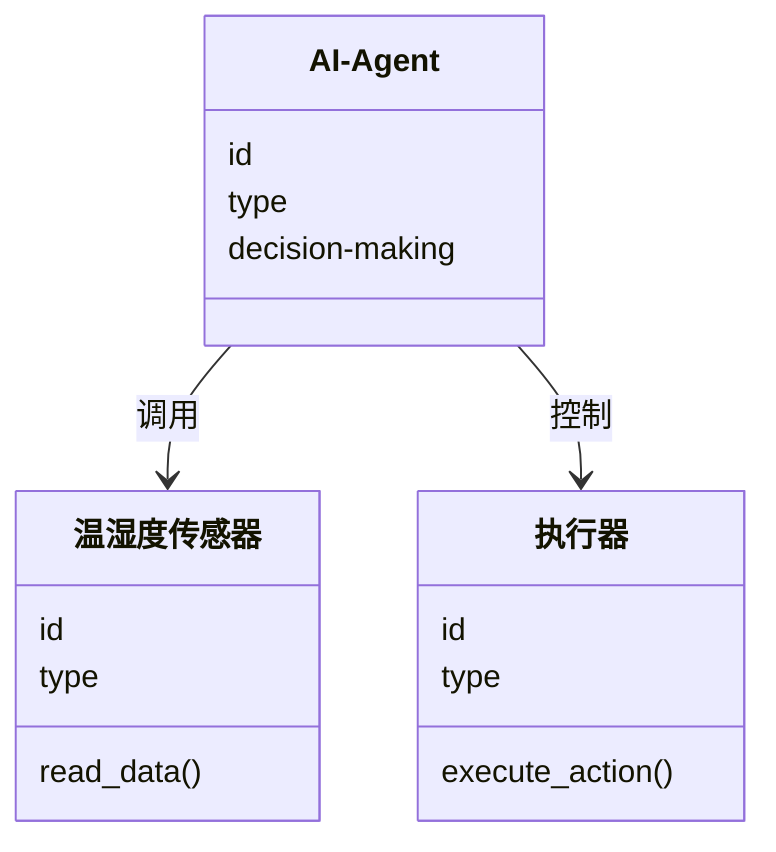
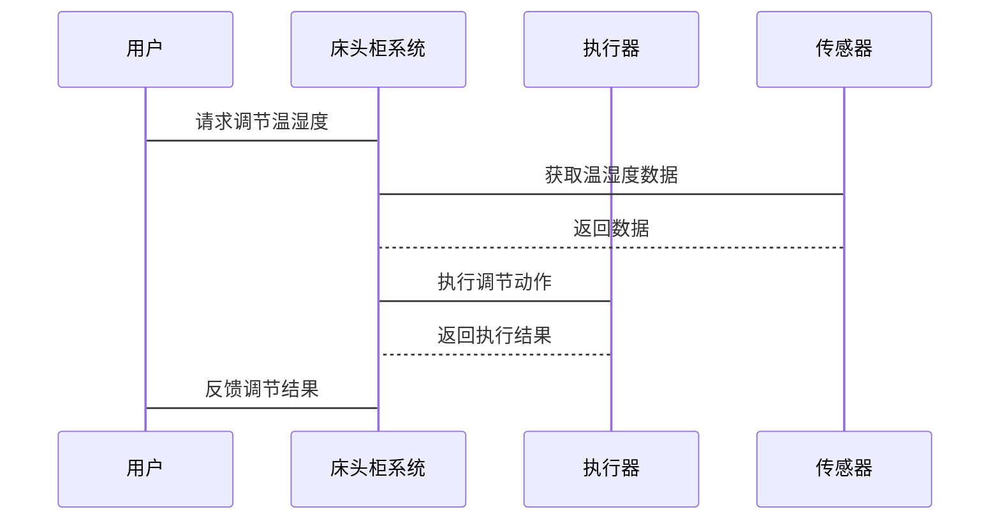

                 


# AI Agent在智能床头柜中的温湿度调节

> 关键词：AI Agent, 智能床头柜, 温湿度调节, 物联网, 人工智能, 算法实现

> 摘要：本文将深入探讨AI Agent在智能床头柜中实现温湿度调节的技术细节。通过系统分析和架构设计，结合具体项目实战，详细讲解AI Agent的算法原理、系统实现及优化方法。文章从背景介绍到系统实现，层层递进，为读者呈现一个完整的智能温湿度调节解决方案。

---

# 第一部分: AI Agent在智能床头柜中的温湿度调节背景介绍

## 第1章: AI Agent与智能床头柜概述

### 1.1 AI Agent的基本概念
- **1.1.1 什么是AI Agent**
  - AI Agent的定义：智能体（AI Agent）是能够感知环境并采取行动以实现目标的实体。
  - AI Agent的核心特征：自主性、反应性、目标导向、社交能力。
  - AI Agent的分类：简单反射型、基于模型的反应型、目标驱动型、效用驱动型。

- **1.1.2 AI Agent的应用场景**
  - 智能家居：通过AI Agent实现设备的自动化控制。
  - 医疗健康：AI Agent用于监测和调节环境条件，改善患者舒适度。
  - 工业自动化：AI Agent用于优化生产环境的温湿度控制。

- **1.1.3 智能床头柜的定义与功能**
  - 智能床头柜的定义：集成AI技术，能够感知环境并主动调节的床头柜。
  - 智能床头柜的功能：环境监测（温湿度、光线、空气质量）、智能调节、用户交互、远程控制。

- **1.1.4 温湿度调节的背景与意义**
  - 温湿度调节的重要性：人体舒适度、防止物品损坏、健康防护。
  - AI Agent在温湿度调节中的作用：实时监测、智能决策、精确控制。

---

## 第2章: AI Agent在智能床头柜中的核心概念与联系

### 2.1 AI Agent的核心原理
- **2.1.1 AI Agent的感知机制**
  - 感知来源：温湿度传感器、空气质量传感器、光照传感器。
  - 数据处理：传感器数据的采集、预处理和特征提取。

- **2.1.2 AI Agent的决策机制**
  - 决策模型：基于规则的决策、基于机器学习的决策。
  - 决策过程：分析环境数据，评估目标状态，制定调节策略。

- **2.1.3 AI Agent的执行机制**
  - 执行器控制：通过执行器调节温湿度。
  - 反馈机制：实时监测调节效果，动态调整策略。

### 2.2 温湿度调节的系统模型
- **2.2.1 温湿度调节的系统组成**
  - 传感器：温度传感器、湿度传感器。
  - 执行器：空调、加湿器、除湿机。
  - 控制器：AI Agent为核心的控制模块。

- **2.2.2 温湿度调节的数学模型**
  - PID控制模型：比例、积分、微分调节。
  - 模型公式：$$u(t) = K_p e(t) + K_i \int e(t) dt + K_d \frac{de(t)}{dt}$$
  - 其中，\(e(t)\) 是误差，\(K_p\)、\(K_i\)、\(K_d\) 是控制器参数。

- **2.2.3 温湿度调节的系统架构**
  - 分层架构：感知层、决策层、执行层。
  - 数据流：传感器 → 数据处理 → 决策 → 执行器。

### 2.3 AI Agent与温湿度调节的实体关系图
```mermaid
er
actor AI-Agent {
  id
  type
}
actor 温湿度传感器 {
  id
  type
}
actor 执行器 {
  id
  type
}
```

---

## 第3章: AI Agent的算法原理与实现

### 3.1 AI Agent的决策算法
- **3.1.1 基于规则的决策算法**
  - 规则定义：如果温度 > 25°C，则开启空调。
  - 优点：简单易懂，实现成本低。
  - 缺点：规则固定，无法适应复杂场景。

- **3.1.2 基于机器学习的决策算法**
  - 算法选择：支持向量机（SVM）、随机森林（Random Forest）。
  - 训练数据：历史温湿度数据、用户行为数据。
  - 模型部署：实时预测温湿度变化，动态调整调节策略。

- **3.1.3 基于强化学习的决策算法**
  - 算法选择：Q-learning、Deep Q-Network。
  - 优势：通过奖励机制优化决策策略，适应动态环境。

### 3.2 温湿度调节的算法实现
- **3.2.1 温湿度数据的采集与预处理**
  - 数据采集：使用传感器获取实时温湿度数据。
  - 数据预处理：去噪、归一化、特征提取。

- **3.2.2 温湿度调节模型的训练**
  - 数据集划分：训练集、验证集、测试集。
  - 模型训练：基于机器学习算法，训练温湿度调节模型。
  - 模型评估：准确率、召回率、F1分数。

- **3.2.3 温湿度调节模型的部署与应用**
  - 模型部署：将训练好的模型部署到床头柜控制模块。
  - 应用流程：实时采集数据 → 模型预测 → 执行调节。

---

## 第4章: 系统分析与架构设计方案

### 4.1 问题场景介绍
- 智能床头柜的应用场景：家庭卧室、医院病房、办公室。
- 温湿度调节的核心问题：如何实现精准、实时的温湿度控制。

### 4.2 系统功能设计
- **4.2.1 领域模型类图**


- **4.2.2 系统架构设计**


- **4.2.3 接口设计与交互流程图**


---

## 第5章: 项目实战

### 5.1 环境安装与配置
- **Python环境安装**
  - 安装Python 3.8及以上版本。
  - 安装依赖库：numpy、pandas、scikit-learn、tensorflow。

- **硬件设备准备**
  - 温湿度传感器（DHT22、DHT11）。
  - 执行器（智能插座、空调控制器）。
  - 开发板（Raspberry Pi）。

### 5.2 系统核心实现
- **代码实现：温湿度调节控制模块**
```python
import numpy as np
from sklearn.svm import SVC
from sklearn.metrics import accuracy_score

# 数据预处理
def preprocess_data(data):
    # 数据归一化处理
    normalized_data = (data - np.min(data)) / (np.max(data) - np.min(data))
    return normalized_data

# 模型训练
def train_model(X_train, y_train):
    model = SVC()
    model.fit(X_train, y_train)
    return model

# 模型预测
def predict(model, X_test):
    return model.predict(X_test)

# 调节控制
def regulate(执行器, target_temp, target_humidity):
    # 调节温度
    if target_temp > current_temp:
        执行器.开启空调()
    elif target_temp < current_temp:
        执行器.关闭空调()
    # 调节湿度
    if target_humidity > current_humidity:
        执行器.开启加湿器()
    elif target_humidity < current_humidity:
        执行器.关闭加湿器()
```

- **代码解读**
  - 数据预处理：对传感器数据进行归一化处理。
  - 模型训练：使用SVM算法训练温湿度预测模型。
  - 模型预测：基于训练好的模型，预测温湿度变化。
  - 调节控制：根据预测结果，控制执行器调节温湿度。

### 5.3 实际案例分析
- **案例1：家庭卧室的温湿度调节**
  - 系统部署：床头柜集成温湿度传感器和空调控制器。
  - 系统运行：AI Agent实时监测温湿度，动态调整空调运行状态。
  - 调节效果：维持室内温湿度在22-26°C，40-60%RH之间。

- **案例2：医院病房的温湿度调节**
  - 系统部署：床头柜集成温湿度传感器和空气净化器。
  - 系统运行：AI Agent根据患者需求，自动调节病房温湿度。
  - 调节效果：确保病房内温湿度符合医疗标准。

### 5.4 项目小结
- **项目总结**
  - AI Agent在智能床头柜中的应用实现了温湿度的智能调节。
  - 系统架构设计合理，算法实现高效，调节效果显著。
  - 项目展示了AI技术在智能家居领域的广泛应用前景。

---

## 第6章: 最佳实践与注意事项

### 6.1 最佳实践
- **传感器选择**
  - 选择高精度、低功耗的温湿度传感器。
  - 定期校准传感器，确保数据准确性。

- **算法优化**
  - 根据实际场景调整模型参数，优化预测精度。
  - 引入强化学习算法，提升动态环境下的调节能力。

- **系统维护**
  - 定期检查硬件设备，确保传感器和执行器正常运行。
  - 更新系统软件，修复潜在的安全漏洞。

### 6.2 注意事项
- **数据隐私**
  - 确保用户数据的安全性，防止数据泄露。
  - 遵守相关隐私保护法规。

- **系统兼容性**
  - 确保床头柜系统与现有智能家居设备的兼容性。
  - 提供多种接口，方便与其他设备集成。

---

## 第7章: 小结与展望

### 7.1 小结
- AI Agent在智能床头柜中的温湿度调节实现了智能化、自动化的目标。
- 系统设计合理，算法实现高效，调节效果显著。
- 项目展示了AI技术在智能家居领域的广泛应用潜力。

### 7.2 展望
- **技术发展**
  - 引入更先进的AI算法，如深度学习和强化学习，提升调节效果。
  - 结合边缘计算，实现更高效的本地推理。

- **应用场景扩展**
  - 智能家居：扩展到更多环境参数的调节。
  - 智慧医疗：应用于更多医疗场景，提升患者舒适度和健康保障。

---

通过以上内容，我们详细介绍了AI Agent在智能床头柜中的温湿度调节的技术实现、系统设计和项目实战。希望本文能为读者提供一个全面的视角，理解AI Agent在智能家居中的应用潜力，并为相关研究和实践提供有价值的参考。

