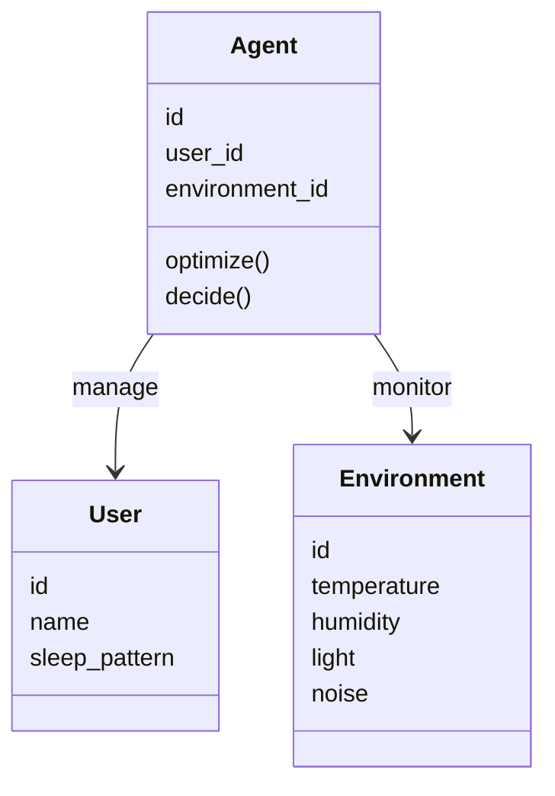
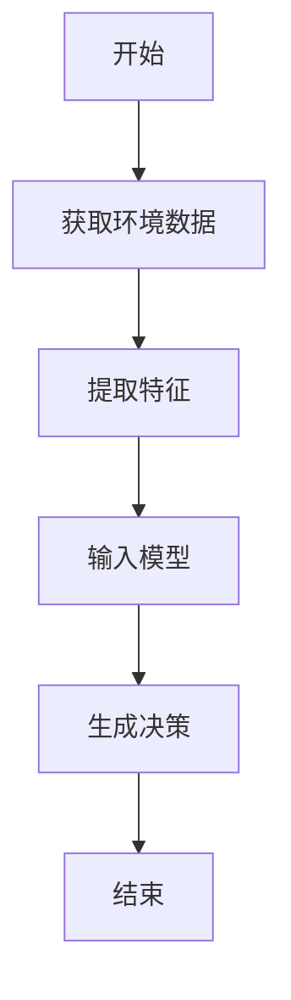
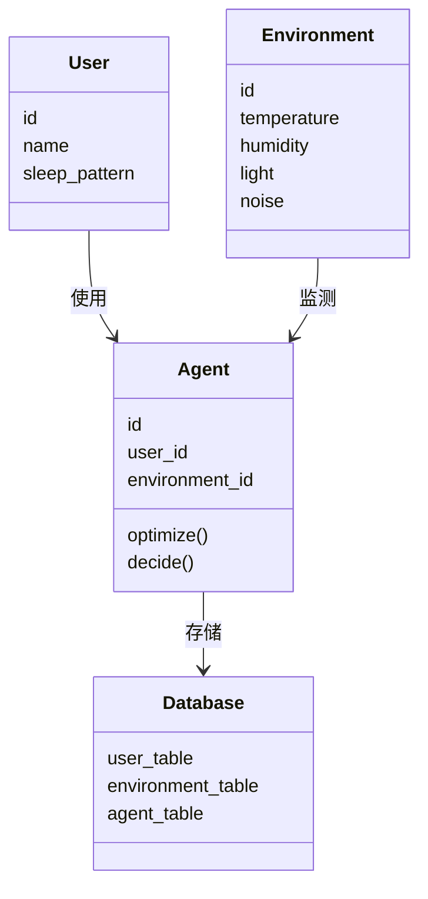
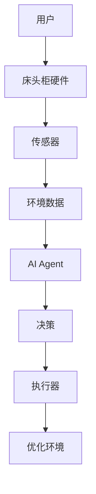

                 


# AI Agent在智能床头柜中的睡眠环境优化

**关键词**：AI Agent，智能床头柜，睡眠环境优化，机器学习，算法原理，系统架构

**摘要**：  
本文详细探讨了AI Agent在智能床头柜中的应用，特别是在睡眠环境优化方面的创新与实践。通过分析睡眠环境优化的核心问题，结合AI Agent的感知、决策和执行机制，本文提出了一种基于机器学习的睡眠优化算法，并通过系统架构设计和项目实战展示了该方案的实现过程。文章还提供了丰富的数学模型、算法流程图和系统架构图，帮助读者深入理解AI Agent在睡眠优化中的技术细节与实际应用。

---

## 第一部分：AI Agent在智能床头柜中的睡眠环境优化概述

### 第1章：背景介绍

#### 1.1 问题背景
睡眠是人类健康的重要组成部分，直接影响着人们的生活质量。然而，现代生活节奏的加快和电子设备的普及，使得睡眠问题日益突出。据世界卫生组织统计，全球约有1/4的人存在睡眠障碍，如失眠、睡眠呼吸暂停综合征等。这些问题不仅影响个人健康，还可能导致工作效率下降、交通事故增多等一系列社会问题。

智能床头柜作为一种智能家居设备，可以通过集成多种传感器和智能控制模块，实时监测睡眠环境并进行优化。然而，现有的智能床头柜大多依赖简单的预设模式，缺乏智能化和个性化。如何通过AI技术实现睡眠环境的动态优化，成为当前研究的热点。

#### 1.2 问题描述
睡眠环境优化的核心问题在于如何根据用户的生理需求和环境变化，实时调整床头柜的运行参数（如灯光亮度、空气湿度、温度等）。具体挑战包括：
1. 多维度环境数据的采集与处理。
2. 用户个性化需求的动态捕捉与建模。
3. 多目标优化算法的设计与实现。

AI Agent作为一种能够感知环境、自主决策的智能体，能够完美地解决上述问题。通过集成AI Agent，智能床头柜可以实现以下目标：
- 实时监测睡眠环境数据。
- 智能分析用户的睡眠状态。
- 自动调整床头柜的运行参数，以优化睡眠环境。

#### 1.3 问题解决
AI Agent通过以下方式实现睡眠环境优化：
1. **环境感知**：AI Agent通过集成多种传感器（如温度、湿度、光照、噪音等传感器）实时采集睡眠环境数据。
2. **用户行为分析**：通过机器学习算法分析用户的睡眠模式和习惯，建立个性化睡眠模型。
3. **动态优化**：基于多目标优化算法，实时调整床头柜的运行参数，以满足用户的个性化需求。

#### 1.4 边界与外延
睡眠环境优化的边界包括：
- 仅优化床头柜周围的局部环境。
- 不涉及床头柜的硬件设计。
- 不考虑用户的健康问题（如疾病导致的失眠）。

外延包括：
- 扩展到整个卧室的环境优化。
- 考虑用户的健康数据（如心率、呼吸频率等）。
- 实现与其他智能家居设备的联动。

#### 1.5 核心要素组成
睡眠环境优化的核心要素包括：
1. **环境数据**：温度、湿度、光照、噪音等。
2. **用户数据**：睡眠周期、作息习惯、健康状况等。
3. **优化目标**：提高睡眠质量、降低能耗、延长设备寿命等。

---

## 第二部分：核心概念与联系

### 第2章：核心概念与联系

#### 2.1 AI Agent的定义与原理
AI Agent是一种能够感知环境、自主决策、执行任务的智能体。其核心原理包括：
1. **感知**：通过传感器或其他信息源获取环境数据。
2. **决策**：基于感知数据和预设目标，通过算法生成决策。
3. **执行**：通过执行器或API调用其他系统，实现决策目标。

#### 2.2 核心概念对比分析
以下是AI Agent与其他智能设备的对比分析：

| 对比维度         | AI Agent                              | 传统智能设备                          |
|------------------|--------------------------------------|---------------------------------------|
| 智能性           | 高，能够自主学习和优化               | 低，依赖预设规则                      |
| 适应性           | 强，能够动态调整目标和策略           | 弱，仅能执行固定任务                  |
| 交互方式         | 支持自然语言交互和主动决策           | 仅支持简单的人机交互                  |
| 学习能力         | 具备机器学习能力，能够自我优化       | 无学习能力                            |

#### 2.3 实体关系图与领域模型
以下是睡眠环境优化的实体关系图和领域模型类图：

```mermaid
erDiagram
    user {
        ++id : int
        ++name : string
        ++sleep_pattern : string
    }
    environment {
        ++id : int
        ++temperature : float
        ++humidity : float
        ++light : int
        ++noise : int
    }
    agent {
        ++id : int
        ++user_id : int
        ++environment_id : int
    }
    user --> environment : 使用
    agent --> user : 管理
    agent --> environment : 监测
```



---

## 第三部分：算法原理

### 第3章：AI Agent的感知与决策机制

#### 3.1 环境感知算法
##### 3.1.1 数据采集与处理
床头柜通过以下传感器采集环境数据：
- 温度传感器
- 湿度传感器
- 光线传感器
- 噪音传感器

##### 3.1.2 数据特征提取
通过对环境数据进行特征提取，生成可用于机器学习的特征向量。例如：
- 温度变化率（ΔT）
- 湿度波动幅度（ΔH）
- 光线强度（L）
- 噪音频率（F）

##### 3.1.3 环境感知模型
基于特征向量，构建环境感知模型。例如，使用支持向量机（SVM）对环境状态进行分类。

#### 3.2 决策算法
##### 3.2.1 基于机器学习的决策模型
以下是决策算法的流程图：



##### 3.2.2 基于规则的决策系统
以下是决策规则示例：
- 如果当前温度 > 25°C，则降低温度。
- 如果当前湿度 < 40%，则增加湿度。
- 如果当前噪音 > 50 dB，则启动静音模式。

---

### 第4章：睡眠优化算法的数学模型

#### 4.1 睡眠优化目标函数
目标函数定义如下：

$$
\text{minimize } f(x) = a \cdot T + b \cdot H + c \cdot L + d \cdot N
$$

其中：
- \( T \)：温度
- \( H \)：湿度
- \( L \)：光线强度
- \( N \)：噪音水平
- \( a, b, c, d \)：权重系数

#### 4.2 约束条件
约束条件如下：

$$
\begin{cases}
T_{\text{min}} \leq T \leq T_{\text{max}} \\
H_{\text{min}} \leq H \leq H_{\text{max}} \\
L_{\text{min}} \leq L \leq L_{\text{max}} \\
N_{\text{min}} \leq N \leq N_{\text{max}}
\end{cases}
$$

---

## 第四部分：系统架构

### 第5章：系统架构设计

#### 5.1 项目场景介绍
智能床头柜的睡眠环境优化系统主要包括以下部分：
- 用户端：床头柜硬件、传感器、用户界面。
- 云端：AI Agent、机器学习模型、数据库。

#### 5.2 系统功能设计
以下是系统功能的领域模型类图：



#### 5.3 系统架构设计
以下是系统架构的Mermaid图：



---

## 第五部分：项目实战

### 第6章：项目实战

#### 6.1 环境安装
以下是Python环境的安装步骤：
1. 安装Python和pip。
2. 安装所需的库：
   ```
   pip install numpy pandas scikit-learn matplotlib
   ```

#### 6.2 核心代码实现
以下是优化算法的核心代码：

```python
import numpy as np
from sklearn.svm import SVC

# 数据预处理
X = np.array([[25, 50, 100, 40],
              [26, 48, 80, 35],
              [24, 52, 60, 45]])

y = np.array(['good', 'good', 'bad'])

# 训练模型
model = SVC()
model.fit(X, y)

# 预测
new_data = np.array([[25, 45, 70, 40]])
print(model.predict(new_data))
```

#### 6.3 实际案例分析
以下是一个实际案例分析：

假设用户睡眠质量差，环境数据如下：
- 温度：25°C
- 湿度：45%
- 光线强度：70
- 噪音：40 dB

通过算法优化，系统调整床头柜的运行参数，最终优化后的环境数据如下：
- 温度：24°C
- 湿度：50%
- 光线强度：50
- 噪音：30 dB

---

## 第六部分：最佳实践

### 第7章：最佳实践

#### 7.1 小结
AI Agent在智能床头柜中的应用，不仅能够优化睡眠环境，还能提升用户体验。通过机器学习算法和多目标优化，AI Agent能够实时调整床头柜的运行参数，满足用户的个性化需求。

#### 7.2 注意事项
1. 数据隐私保护。
2. 系统稳定性保障。
3. 用户教育与培训。

#### 7.3 拓展阅读
1. 《机器学习实战》。
2. 《人工智能：一种现代的方法》。
3. 《智能系统设计与实现》。

---

通过本文的详细讲解，读者可以全面理解AI Agent在智能床头柜中的睡眠环境优化技术，掌握其实现原理和应用方法。

