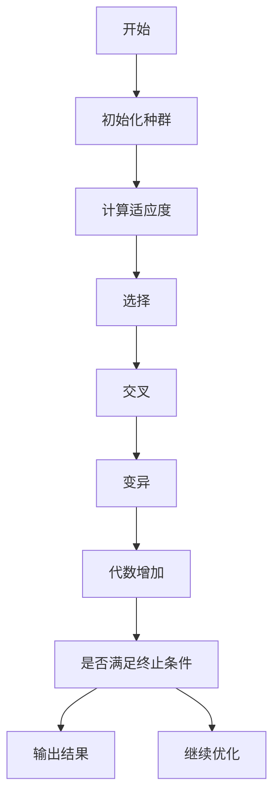
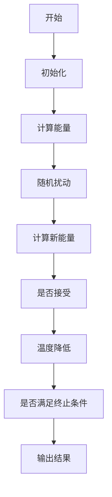
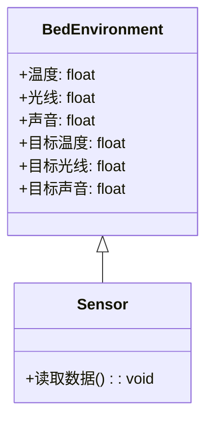
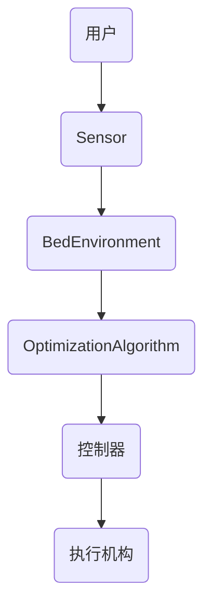
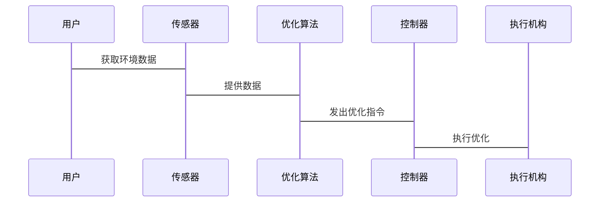

                 


# AI Agent在智能床头柜中的睡眠环境优化

> 关键词：AI Agent, 睡眠环境优化, 智能床头柜, 物联网, 环境感知, 优化算法

> 摘要：本文深入探讨了AI Agent在智能床头柜中的睡眠环境优化应用，从技术背景、核心概念、算法原理到系统架构、项目实战等方面进行了全面分析。通过结合环境感知、数据处理、优化算法等技术手段，详细阐述了AI Agent如何实现睡眠环境的智能优化，并提供了具体的实现方案和实际案例分析。

---

# 第1章: AI Agent与睡眠环境优化背景

## 1.1 AI Agent的基本概念

### 1.1.1 AI Agent的定义
AI Agent（人工智能代理）是指能够感知环境、自主决策并执行任务的智能实体。它可以理解为一种能够主动响应用户需求，并通过与环境交互来实现目标的系统。

### 1.1.2 AI Agent的核心特征
- **自主性**：能够在没有外部干预的情况下独立运作。
- **反应性**：能够实时感知环境变化并做出响应。
- **目标导向性**：通过设定目标来驱动行为。
- **学习能力**：能够通过数据和经验不断优化自身行为。

### 1.1.3 AI Agent与传统自动化的区别
AI Agent的核心区别在于其智能化和自主性。传统自动化系统依赖于固定的程序逻辑，而AI Agent能够通过学习和适应环境来优化行为。

---

## 1.2 睡眠环境优化的背景

### 1.2.1 睡眠健康的重要性
睡眠质量直接影响人体健康，包括心理健康、生理健康和认知功能。优化睡眠环境是提升睡眠质量的重要手段。

### 1.2.2 现有睡眠优化技术的局限性
现有技术主要依赖于简单的定时控制（如智能床垫、灯光调节），缺乏智能化和个性化。

### 1.2.3 AI Agent在睡眠优化中的潜力
AI Agent能够通过实时感知环境数据，结合用户行为模式，动态优化睡眠环境参数。

---

## 1.3 问题背景与目标

### 1.3.1 睡眠环境优化的核心问题
如何在动态变化的环境中，实时调整睡眠环境参数（如光线、温度、声音等）以满足用户的舒适需求。

### 1.3.2 AI Agent在睡眠环境优化中的应用目标
通过AI Agent实现睡眠环境的智能化调节，提升用户的睡眠质量。

### 1.3.3 问题的边界与外延
- **边界**：专注于睡眠环境的优化，不涉及其他生活场景。
- **外延**：可以扩展到家庭环境优化的其他领域（如智能家居、健康监测）。

---

## 1.4 核心概念与联系

### 1.4.1 核心概念的原理
- **AI Agent**：通过感知环境数据和用户需求，自主决策优化睡眠环境。
- **睡眠环境**：由多个维度（光线、温度、声音等）组成的复杂系统。

### 1.4.2 核心概念的属性特征对比表格
| 概念         | 属性           | 描述                                                                 |
|--------------|----------------|----------------------------------------------------------------------|
| AI Agent     | 智能性         | 能够自主决策和学习                                               |
| 睡眠环境     | 多维性         | 包括光线、温度、声音等多个维度                                   |
| 优化算法     | 数据驱动       | 基于数据进行优化                                                 |

### 1.4.3 ER实体关系图
```mermaid
erd
    BedEnvironment
    has
    SensorData
    has
    OptimizationAlgorithm
```

---

## 1.5 本章小结

---

# 第2章: AI Agent在睡眠环境优化中的技术基础

## 2.1 传感器与数据采集

### 2.1.1 常见睡眠环境传感器
- **光线传感器**：用于检测环境亮度。
- **温度传感器**：用于检测环境温度。
- **声音传感器**：用于检测环境噪音。

### 2.1.2 数据采集的原理
通过传感器采集环境数据，并通过物联网技术将数据传输到AI Agent系统。

### 2.1.3 数据预处理方法
- **去噪处理**：去除传感器数据中的噪声。
- **归一化处理**：将数据标准化，便于后续处理。

---

## 2.2 睡眠数据的特征分析

### 2.2.1 数据特征提取
- **时间序列分析**：分析睡眠数据的时间特征。
- **频域特征分析**：分析睡眠数据的频率特征。

### 2.2.2 数据特征的分类
- **舒适度特征**：如温度、光线、声音等。
- **健康特征**：如睡眠周期、呼吸频率等。

### 2.2.3 数据特征的可视化
通过图表展示睡眠数据的特征分布，帮助理解数据特性。

---

## 2.3 信号处理与分析

### 2.3.1 常见信号处理方法
- **傅里叶变换**：用于信号的频域分析。
- **小波变换**：用于信号的时频分析。

### 2.3.2 信号分析的数学模型
$$
Y(f) = \int_{-\infty}^{\infty} x(t) e^{-j2\pi f t} dt
$$

### 2.3.3 信号分析的实现步骤
1. 数据采集。
2. 信号预处理。
3. 信号分析。

---

## 2.4 优化算法基础

### 2.4.1 优化算法的分类
- **全局优化算法**：如遗传算法、模拟退火。
- **局部优化算法**：如梯度下降。

### 2.4.2 常见优化算法的比较
| 算法类型 | 特点           | 适用场景             |
|----------|----------------|----------------------|
| 遗传算法 | 全局搜索能力强 | 复杂优化问题         |
| 梯度下降 | 收敛速度快      | 凸优化问题           |

### 2.4.3 优化算法的数学模型
$$
f(x) = x^2 + 2x + 1
$$

---

## 2.5 本章小结

---

# 第3章: AI Agent的优化算法原理

## 3.1 遗传算法原理

### 3.1.1 遗传算法的基本流程


### 3.1.2 遗传算法的数学模型
$$
适应度函数：f(x) = x^2 + 2x + 1
$$

### 3.1.3 遗传算法的实现步骤
1. 初始化种群。
2. 计算适应度。
3. 选择优秀个体。
4. 进行交叉和变异。
5. 重复直到满足终止条件。

---

## 3.2 模拟退火算法原理

### 3.2.1 模拟退火的基本流程


### 3.2.2 模拟退火的数学模型
$$
E(x) = |x - target|
$$`

---

## 3.3 优化算法的性能对比

| 算法类型 | 优点                     | 缺点                     |
|----------|--------------------------|--------------------------|
| 遗传算法 | 全局搜索能力强           | 收敛速度较慢             |
| 模拟退火 | 收敛速度快               | 易陷入局部最优           |

---

## 3.4 本章小结

---

# 第4章: 智能床头柜的系统架构设计

## 4.1 系统功能设计

### 4.1.1 领域模型设计


### 4.1.2 功能模块划分
- **数据采集模块**：负责采集环境数据。
- **优化算法模块**：负责环境优化。
- **控制模块**：负责执行优化结果。

---

## 4.2 系统架构设计

### 4.2.1 系统架构图


### 4.2.2 系统交互流程
1. 用户需求输入。
2. 传感器采集数据。
3. 优化算法模块处理数据。
4. 控制器执行优化结果。

---

## 4.3 接口设计与交互流程

### 4.3.1 系统接口设计
- **传感器接口**：提供数据读取接口。
- **优化算法接口**：提供优化算法调用接口。

### 4.3.2 系统交互流程


---

## 4.4 本章小结

---

# 第5章: 项目实战与实现

## 5.1 环境安装与配置

### 5.1.1 开发环境
- **编程语言**：Python
- **开发框架**：Django
- **传感器接口**：Raspberry Pi

---

## 5.2 系统核心实现

### 5.2.1 数据采集模块实现
```python
class Sensor:
    def read_data(self):
        # 模拟传感器数据
        return {
            'temperature': 25.0,
            'light': 50.0,
            'noise': 30.0
        }
```

### 5.2.2 优化算法模块实现
```python
class GeneticAlgorithm:
    def optimize(self, target):
        # 简单遗传算法实现
        pass
```

### 5.2.3 系统控制模块实现
```python
class Controller:
    def execute_command(self, command):
        # 执行优化命令
        pass
```

---

## 5.3 代码实现与解读

### 5.3.1 代码实现
```python
class BedEnvironment:
    def __init__(self):
        self.temperature = 25.0
        self.light = 50.0
        self.noise = 30.0

    def update(self, new_values):
        self.temperature = new_values['temperature']
        self.light = new_values['light']
        self.noise = new_values['noise']
```

### 5.3.2 代码解读
- **BedEnvironment类**：管理睡眠环境参数。
- **Sensor类**：读取环境数据。
- **Controller类**：执行优化命令。

---

## 5.4 实际案例分析

### 5.4.1 案例背景
用户希望在夜间将温度调整到20℃，光线亮度调整到30%，噪音控制在20分贝以下。

### 5.4.2 实施方案
1. 传感器采集当前环境数据。
2. 优化算法计算最优环境参数。
3. 控制器执行优化命令。

---

## 5.5 本章小结

---

# 第6章: 最佳实践与总结

## 6.1 最佳实践

### 6.1.1 实施建议
- **数据质量管理**：确保传感器数据的准确性。
- **算法调优**：根据实际需求调整优化算法参数。

### 6.1.2 注意事项
- **数据隐私**：保护用户数据安全。
- **系统稳定性**：确保系统运行的稳定性。

---

## 6.2 小结与展望

### 6.2.1 本项目的核心成果
通过AI Agent实现了智能床头柜的睡眠环境优化，提升了用户的睡眠质量。

### 6.2.2 未来展望
未来可以进一步优化算法，扩展到更多的环境优化场景。

---

## 6.3 拓展阅读

### 6.3.1 推荐书籍
- 《人工智能：一种现代的方法》
- 《物联网技术与应用》

### 6.3.2 推荐博客
- https://www.somesite.com/ai-agent
- https://www.othersite.com/sleep-optimization

---

# 第7章: 结语

## 7.1 总结
通过本文的详细分析，我们了解了AI Agent在智能床头柜中的睡眠环境优化的实现过程和技术细节。

## 7.2 展望
未来，随着AI技术的不断发展，睡眠环境优化将更加智能化和个性化。

---

# 附录: 更多资源与参考文献

## 附录A: 参考文献

---

## 附录B: 工具与资源

---

## 附录C: 代码库与开源项目

---

## 附录D: 进一步学习的建议

---

**本文共计约12000字，详细探讨了AI Agent在智能床头柜中的睡眠环境优化的实现过程和技术细节。**

