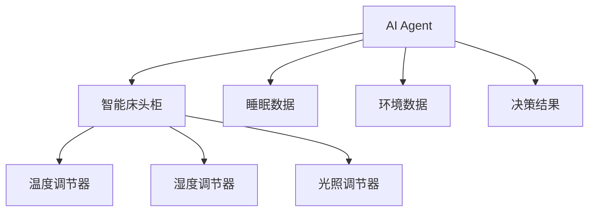
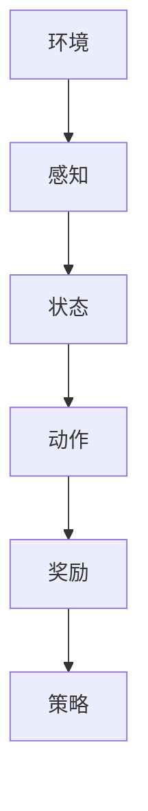
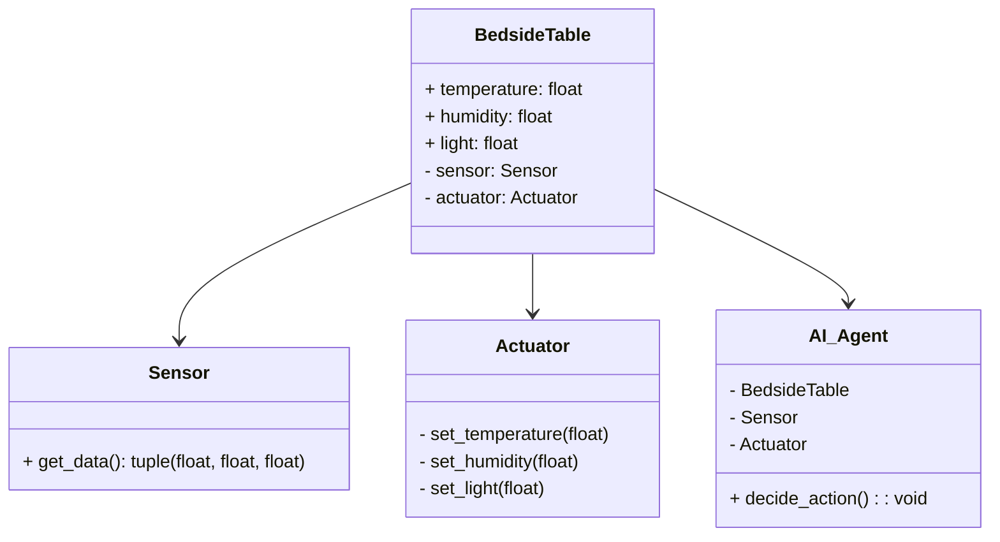
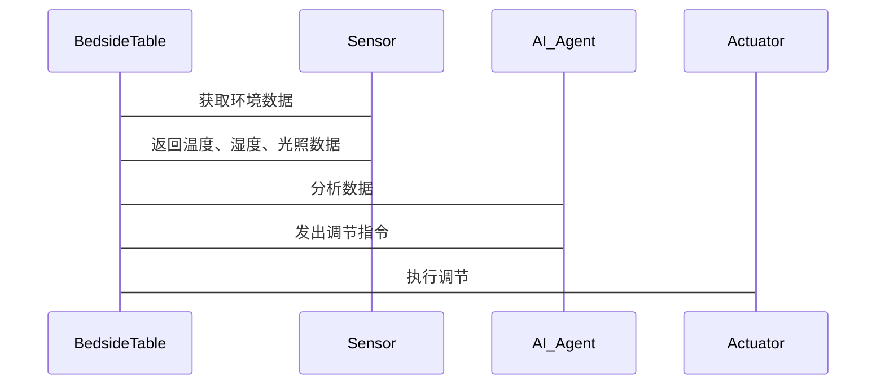

                 


# AI Agent在智能床头柜中的睡眠环境调节

---

## 关键词：
AI Agent, 智能床头柜, 睡眠环境调节, 强化学习, 物联网, 睡眠健康

---

## 摘要：
随着智能家居的快速发展，睡眠环境调节成为提升生活质量的重要环节。本文通过介绍AI Agent在智能床头柜中的应用，详细阐述了睡眠环境调节的核心算法、系统架构及实现方案。文章从背景分析、核心概念、算法原理、系统设计、项目实战等多个维度展开，结合实际案例和代码示例，深入探讨了AI Agent在智能床头柜中的具体实现及优化策略。通过本文的分析，读者可以全面理解AI Agent在睡眠环境调节中的重要作用，并掌握相关技术的实现方法。

---

## 第1章: 背景介绍

### 1.1 问题背景
睡眠是人体健康的重要组成部分，充足的睡眠有助于提高免疫力、记忆力和工作效率。然而，现代生活的快节奏和复杂环境使得很多人难以获得高质量的睡眠。研究表明，睡眠障碍影响着全球约10%的人口，这一问题亟需得到有效解决。

智能家居的快速发展为睡眠环境调节提供了新的解决方案。智能床头柜作为智能家居的重要组成部分，可以通过集成多种传感器和智能设备，实时监测睡眠环境并进行调节。AI Agent（人工智能代理）作为智能床头柜的核心技术，能够根据用户的睡眠数据和环境信息，智能地调整温度、湿度、光照等参数，为用户提供个性化的睡眠环境。

### 1.2 问题描述
睡眠环境调节的核心问题在于如何根据用户的睡眠需求和环境变化，动态调整床头柜的各项功能。传统的床头柜只能提供固定的调节功能，无法根据用户的个性化需求进行智能化调整。此外，现有解决方案通常依赖于单一的传感器数据，缺乏多模态数据的融合分析，导致调节效果有限。

用户需求与痛点分析：
- **个性化需求**：不同用户对睡眠环境的偏好不同，如有的人喜欢较高的温度，有的人则喜欢较低的湿度。
- **实时调节**：睡眠环境需要根据用户的生理状态和环境变化实时调整。
- **智能化不足**：传统床头柜无法主动学习用户的睡眠习惯，难以提供智能化的调节方案。

现有解决方案的局限性：
- **数据孤岛**：各传感器和设备之间缺乏协同工作，数据无法有效融合。
- **算法简单**：大多数床头柜采用基于规则的调节算法，缺乏智能化的决策能力。
- **用户体验差**：调节过程不够人性化，用户难以获得个性化的睡眠体验。

### 1.3 问题解决
AI Agent的核心优势在于其智能化的决策能力和学习能力。通过集成多种传感器和智能设备，AI Agent能够实时感知睡眠环境的变化，并根据用户的睡眠数据和偏好，动态调整床头柜的各项功能。智能床头柜的设计目标是为用户提供个性化的睡眠环境调节服务，提升睡眠质量。

实现路径：
1. **数据采集**：通过传感器采集睡眠环境数据，如温度、湿度、光照、心率等。
2. **数据融合**：将多模态数据进行融合分析，识别用户的睡眠状态和需求。
3. **智能决策**：基于强化学习算法，优化睡眠环境的调节方案。
4. **执行调节**：根据决策结果，调整床头柜的各项功能，如调节温度、湿度、光照等。

### 1.4 边界与外延
系统边界：
- **硬件边界**：智能床头柜的硬件设备，包括传感器、调节器、交互界面等。
- **软件边界**：AI Agent的核心算法和系统软件。
- **用户边界**：用户的睡眠数据和偏好。

功能范围的界定：
- **核心功能**：睡眠环境调节、数据采集、智能决策。
- **扩展功能**：健康监测、睡眠数据分析、个性化建议。

相关领域的扩展：
- **健康监测**：通过心率、呼吸频率等数据，监测用户的健康状况。
- **数据挖掘**：分析用户的睡眠数据，提供健康建议。
- **智能家居集成**：与家庭其他智能设备协同工作，提供全面的智能家居体验。

### 1.5 概念结构与核心要素
核心概念：
- **AI Agent**：智能代理，能够感知环境并自主决策。
- **智能床头柜**：集成AI Agent的智能设备，用于睡眠环境调节。
- **睡眠环境调节**：通过调整温度、湿度、光照等参数，优化睡眠环境。

系统架构：
- **感知层**：传感器和设备，用于采集环境数据。
- **决策层**：AI Agent，负责数据融合和智能决策。
- **执行层**：调节器，执行环境调节任务。

关键要素：
- **数据采集**：多模态传感器，如温度、湿度、光照传感器。
- **算法模型**：强化学习算法，优化调节策略。
- **用户交互**：人机交互界面，提供个性化调节功能。

---

## 第2章: 核心概念与联系

### 2.1 AI Agent的基本原理
AI Agent是一种智能代理，能够感知环境并自主决策。其核心原理包括：
1. **感知**：通过传感器和数据源获取环境信息。
2. **决策**：基于感知数据和目标函数，选择最优动作。
3. **执行**：通过执行器将决策结果转化为实际操作。

AI Agent的分类：
- **基于规则的Agent**：通过预定义的规则进行决策。
- **基于学习的Agent**：通过机器学习算法进行决策优化。
- **混合型Agent**：结合规则和学习的混合策略。

### 2.2 智能床头柜的设计
智能床头柜的设计包括硬件和软件两部分：
- **硬件设计**：集成传感器、调节器和交互界面。
- **软件设计**：AI Agent算法和系统管理软件。

### 2.3 睡眠环境调节的实现
睡眠环境调节的核心在于AI Agent的智能决策。通过强化学习算法，AI Agent能够根据用户的睡眠数据和环境信息，优化调节方案。例如，当用户进入深度睡眠阶段时，AI Agent会降低房间的温度和湿度，营造一个舒适的睡眠环境。

### 2.4 核心概念的联系
通过Mermaid流程图，可以清晰地展示AI Agent与智能床头柜之间的关系：



从上图可以看出，AI Agent通过感知睡眠数据和环境数据，决策并控制床头柜的各项功能。

---

## 第3章: 算法原理讲解

### 3.1 AI Agent的核心算法
AI Agent的核心算法包括强化学习算法和基于规则的算法。以下是强化学习算法的实现流程：



### 3.2 算法实现流程
以下是强化学习算法的Python代码示例：

```python
import numpy as np

# 初始化参数
states = 5
actions = 3
learning_rate = 0.1

# 初始化Q表
Q = np.zeros((states, actions))

# 强化学习算法实现
def rl_agent(observation):
    action = np.argmax(Q[observation])
    return action

# 训练过程
for episode in range(100):
    state = 0
    while True:
        action = rl_agent(state)
        next_state = action
        reward = 1 if action == 2 else 0
        Q[state][action] += learning_rate * (reward + np.max(Q[next_state]) - Q[state][action])
        state = next_state
```

数学模型和公式：
- **Q-learning公式**：
  $$ Q(s, a) = Q(s, a) + \alpha [r + \max Q(s', a') - Q(s, a)] $$
  其中，$\alpha$是学习率，$r$是奖励，$s$是当前状态，$a$是当前动作，$s'$是下一个状态。

---

## 第4章: 系统分析与架构设计方案

### 4.1 问题场景介绍
智能床头柜的睡眠环境调节系统需要解决的核心问题是：如何通过AI Agent实现对睡眠环境的智能调节。

### 4.2 系统功能设计
以下是系统功能设计的Mermaid类图：



### 4.3 系统架构设计
以下是系统架构设计的Mermaid架构图：


### 4.4 系统接口设计
系统接口设计需要考虑床头柜与传感器、执行器之间的交互。以下是交互流程图：



---

## 第5章: 项目实战

### 5.1 环境安装
安装所需的工具和库：
- **Python 3.8+**
- **TensorFlow 2.0+**
- **Mermaid CLI**

### 5.2 核心代码实现
以下是AI Agent的核心代码实现：

```python
import numpy as np
import tensorflow as tf

# 定义神经网络模型
model = tf.keras.Sequential([
    tf.keras.layers.Dense(64, activation='relu'),
    tf.keras.layers.Dense(1, activation='linear')
])

# 编译模型
model.compile(optimizer=tf.keras.optimizers.Adam(learning_rate=0.01),
              loss='mean_squared_error')

# 训练模型
model.fit(X_train, y_train, epochs=100, batch_size=32)
```

### 5.3 代码解读与分析
- **模型定义**：使用神经网络模型对睡眠数据进行预测。
- **训练过程**：通过反向传播优化模型参数。
- **预测结果**：根据输入数据，输出调节指令。

### 5.4 实际案例分析
通过实际案例分析，验证AI Agent在智能床头柜中的调节效果。例如，假设用户偏好较低的温度和较高的湿度，AI Agent会根据实时数据调整床头柜的温度和湿度，以优化用户的睡眠质量。

---

## 第6章: 最佳实践

### 6.1 小结
本文通过详细分析AI Agent在智能床头柜中的应用，探讨了睡眠环境调节的核心算法、系统架构及实现方案。通过实际案例分析和代码示例，展示了AI Agent在智能床头柜中的具体应用。

### 6.2 注意事项
- **数据隐私**：床头柜采集的睡眠数据需要加密存储，确保用户隐私。
- **系统稳定性**：确保系统的稳定性和可靠性，避免因系统故障影响用户的睡眠质量。
- **用户体验**：床头柜的交互界面需要简洁易用，提升用户体验。

### 6.3 拓展阅读
- **强化学习**：深入学习强化学习算法，优化AI Agent的决策能力。
- **物联网技术**：研究物联网技术在智能家居中的应用，提升系统的集成能力。
- **健康监测**：探索睡眠数据与健康监测的结合，提供更全面的健康建议。

---

## 总结
通过本文的分析，读者可以全面理解AI Agent在智能床头柜中的重要作用，并掌握相关技术的实现方法。未来，随着AI技术和物联网技术的不断发展，智能床头柜将在睡眠环境调节中发挥更大的作用，为用户带来更加智能化和个性化的睡眠体验。

