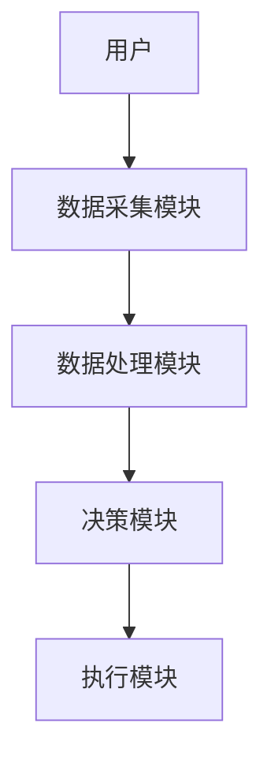

                 


# AI Agent在智能床头柜中的睡眠辅助功能

> 关键词：AI Agent, 智能床头柜, 睡眠辅助, 睡眠健康, 人工智能, 智能家居

> 摘要：本文探讨了AI Agent在智能床头柜中的睡眠辅助功能，详细分析了AI Agent的基本概念、算法原理、系统架构设计以及实际应用场景。通过结合睡眠健康的重要性，本文展示了如何利用AI技术提升睡眠质量，并提供了具体的实现方案和项目案例。

---

# 第一部分: 背景介绍与核心概念

## 第1章: 睡眠健康与AI技术的结合

### 1.1 睡眠对身体和心理的影响
睡眠是人类健康的重要组成部分，直接影响着身体的恢复、免疫功能、情绪调节以及认知能力。长期的睡眠不足会导致注意力不集中、记忆力减退、情绪波动等问题，甚至可能引发严重的健康问题，如心脏病、糖尿病等。

### 1.2 AI Agent的基本概念
AI Agent（人工智能代理）是一种能够感知环境、自主决策并执行任务的智能实体。它通过传感器获取数据，利用算法进行分析和推理，并根据结果采取相应的行动。AI Agent的核心在于其智能性，能够根据环境的变化动态调整行为。

### 1.3 智能床头柜的定义与特点
智能床头柜是一种结合了物联网技术和人工智能的智能家居设备，具有多种智能化功能，如睡眠监测、环境调节、信息交互等。其特点包括：
- **智能化**：能够通过传感器和AI算法实时监测用户的状态。
- **个性化**：根据用户的睡眠数据提供个性化的改善建议。
- **便捷性**：通过智能控制实现对睡眠环境的精准调节。

---

## 第2章: AI Agent在睡眠辅助中的核心作用

### 2.1 AI Agent如何辅助睡眠
AI Agent通过以下方式帮助改善睡眠质量：
1. **睡眠监测**：通过传感器收集用户的睡眠数据，如心率、体温、呼吸频率等。
2. **数据分析**：利用机器学习算法分析睡眠数据，识别睡眠周期和问题。
3. **个性化建议**：根据分析结果，提供个性化的睡眠改善建议，如调整睡眠环境、作息时间等。

### 2.2 智能床头柜的睡眠辅助功能
智能床头柜的睡眠辅助功能包括：
1. **睡眠监测**：实时监测用户的睡眠状态，记录睡眠数据。
2. **环境调节**：根据睡眠数据自动调节床头柜的灯光、温度、湿度等。
3. **智能交互**：通过语音或触摸交互，提供睡眠改善建议和相关信息。

---

# 第二部分: 核心概念与系统架构

## 第3章: AI Agent与睡眠辅助系统的原理

### 3.1 AI Agent的原理
AI Agent的工作原理可以分为以下几个步骤：
1. **数据采集**：通过传感器获取环境数据和用户数据。
2. **数据处理**：对采集到的数据进行预处理和分析。
3. **决策制定**：基于分析结果，通过算法生成决策。
4. **执行行动**：根据决策执行相应的动作，如调节灯光、播放白噪音等。

### 3.2 睡眠辅助系统的原理
睡眠辅助系统的原理主要包括：
1. **数据采集**：通过可穿戴设备或床头柜内的传感器采集用户的睡眠数据。
2. **数据分析**：利用机器学习算法分析睡眠数据，识别睡眠问题。
3. **个性化建议**：根据分析结果，生成个性化的睡眠改善建议。

---

## 第4章: 系统架构与实体关系

### 4.1 系统架构设计
睡眠辅助系统的架构可以分为以下几个部分：
1. **数据采集层**：负责采集用户的睡眠数据。
2. **数据处理层**：对数据进行预处理和分析。
3. **决策层**：基于分析结果生成决策。
4. **执行层**：根据决策执行相应的动作。

### 4.2 实体关系图
以下是睡眠辅助系统的实体关系图：

```mermaid
er
actor 用户
(actor) --- (1..*) sensor 数据
(actor) --- (1..*) sleep 数据
(actor) --- (1) AI Agent
(actor) --- (1..*) 改善建议
```

---

# 第三部分: 算法原理与数学模型

## 第5章: AI Agent的核心算法

### 5.1 基于规则的推理算法
基于规则的推理算法是一种简单且易于实现的算法，适用于规则明确的场景。以下是其实现步骤：
1. **数据采集**：获取用户的睡眠数据。
2. **规则匹配**：将数据与预设的规则进行匹配。
3. **决策生成**：根据匹配结果生成决策。

例如，假设规则为：如果用户的睡眠时间少于6小时，则建议延长睡眠时间。

### 5.2 基于机器学习的推理算法
基于机器学习的推理算法能够处理复杂的场景，具有更高的灵活性和准确性。以下是其实现步骤：
1. **数据采集**：获取用户的睡眠数据。
2. **数据预处理**：对数据进行清洗和归一化处理。
3. **模型训练**：利用机器学习算法（如随机森林、神经网络等）训练模型。
4. **预测与决策**：基于训练好的模型预测用户的睡眠质量，并生成相应的决策。

---

## 第6章: 数学模型与公式

### 6.1 基于规则的数学模型
基于规则的数学模型可以表示为：
$$
\text{如果 } x \text{ 满足条件，那么 } y \text{ 采取行动}
$$

### 6.2 基于机器学习的数学模型
基于机器学习的数学模型可以表示为：
$$
y = f(x) + \epsilon
$$
其中，\( y \) 是输出，\( x \) 是输入，\( f \) 是模型函数，\( \epsilon \) 是误差项。

---

# 第四部分: 系统分析与架构设计

## 第7章: 系统分析与架构设计

### 7.1 系统功能模块划分
睡眠辅助系统的功能模块包括：
1. **数据采集模块**：负责采集用户的睡眠数据。
2. **数据处理模块**：对数据进行预处理和分析。
3. **决策模块**：基于分析结果生成决策。
4. **执行模块**：根据决策执行相应的动作。

### 7.2 系统架构设计
以下是睡眠辅助系统的架构图：



---

# 第五部分: 项目实战

## 第8章: 项目实战

### 8.1 环境安装
以下是项目所需的环境和工具：
1. Python 3.8+
2. NumPy
3. Pandas
4. Scikit-learn
5. Mermaid

### 8.2 核心代码实现
以下是基于规则的推理算法的Python代码示例：

```python
def sleep_improvement_recommendation():
    # 采集睡眠数据
    sleep_duration = 5  # 睡眠时长（小时）
    
    # 基于规则的推理
    if sleep_duration < 6:
        print("建议延长睡眠时间")
    else:
        print("睡眠时间正常")
    
sleep_improvement_recommendation()
```

---

## 第9章: 总结与展望

### 9.1 小结
本文详细探讨了AI Agent在智能床头柜中的睡眠辅助功能，从理论到实践，全面分析了其核心算法、系统架构和实现方案。

### 9.2 注意事项
在实际应用中，需要注意数据隐私和算法的可解释性问题。

### 9.3 拓展阅读
读者可以进一步研究基于深度学习的睡眠辅助算法，以及如何将AI Agent应用于其他智能家居设备中。

---

以上是《AI Agent在智能床头柜中的睡眠辅助功能》的完整目录和内容框架。希望对您有所帮助！

