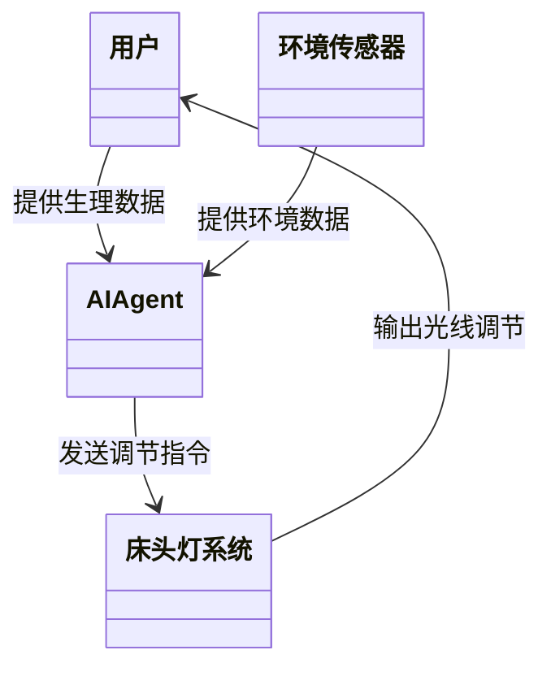
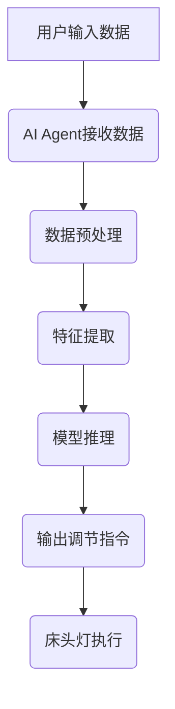

                 


# AI Agent在智能床头灯中的生理节律调节

> 关键词：AI Agent、智能床头灯、生理节律、生物钟、健康科技

> 摘要：本文深入探讨了AI Agent在智能床头灯中的应用，特别是在调节生理节律方面的创新技术。通过分析AI Agent的核心原理、生理节律调节的生物基础、系统的架构设计以及实际项目实现，本文为智能床头灯的设计与优化提供了理论依据和实践指导。

---

## 目录大纲：

### 第1章：AI Agent与生理节律调节的背景

1.1 AI Agent的基本概念
- 1.1.1 AI Agent的定义与特点
- 1.1.2 AI Agent的工作原理
- 1.1.3 AI Agent在健康领域的潜力

1.2 生理节律调节的背景与重要性
- 1.2.1 生理节律的基本概念
- 1.2.2 生理节律紊乱的常见原因及影响
- 1.2.3 智能床头灯在调节生理节律中的作用

1.3 智能床头灯的发展现状
- 1.3.1 智能床头灯的技术演变
- 1.3.2 当前市场上的智能床头灯产品分析
- 1.3.3 智能床头灯与AI技术的结合趋势

---

### 第2章：AI Agent的核心原理

2.1 AI Agent的工作原理
- 2.1.1 感知与数据采集
- 2.1.2 数据分析与决策
- 2.1.3 行为执行与反馈

2.2 AI Agent的算法基础
- 2.2.1 机器学习算法简介
- 2.2.2 强化学习在AI Agent中的应用
- 2.2.3 聚类与分类算法在生理节律调节中的作用

2.3 AI Agent的决策机制
- 2.3.1 基于规则的决策
- 2.3.2 基于概率的决策
- 2.3.3 综合决策模型的设计

---

### 第3章：生理节律调节的核心机制

3.1 生理节律的生物基础
- 3.1.1 生物钟的定义与功能
- 3.1.2 光照对生物钟的影响
- 3.1.3 睡眠周期的调节机制

3.2 生理节律调节的数学模型
- 3.2.1 生物钟模型的建立
- 3.2.2 数学公式与方程的推导
- 3.2.3 模型的验证与优化

3.3 AI Agent在生理节律调节中的角色
- 3.3.1 AI Agent如何感知生理数据
- 3.3.2 AI Agent如何优化调节策略
- 3.3.3 AI Agent的反馈机制设计

---

### 第4章：系统架构与实现

4.1 系统架构设计
- 4.1.1 项目背景介绍
- 4.1.2 系统功能设计（领域模型类图）
- 4.1.3 系统架构设计（mermaid架构图）
- 4.1.4 系统接口设计
- 4.1.5 系统交互流程（mermaid序列图）

4.2 系统实现细节
- 4.2.1 环境安装与配置
- 4.2.2 核心代码实现（Python代码示例）
- 4.2.3 代码应用解读与分析
- 4.2.4 案例分析与详细讲解剖析
- 4.2.5 项目总结与优化建议

---

### 第5章：算法优化与挑战

5.1 算法优化策略
- 5.1.1 强化学习算法的优化
- 5.1.2 反馈机制的改进
- 5.1.3 系统鲁棒性的提升

5.2 系统实现中的挑战
- 5.2.1 数据采集的准确性问题
- 5.2.2 用户个性化需求的适应性问题
- 5.2.3 系统安全性和隐私保护问题

5.3 解决方案与最佳实践
- 5.3.1 数据预处理与特征提取
- 5.3.2 用户自适应模型的设计
- 5.3.3 安全与隐私保护措施

---

### 第6章：总结与展望

6.1 项目总结
- 6.1.1 项目的核心成果
- 6.1.2 项目的技术创新点
- 6.1.3 项目的实际应用价值

6.2 未来展望
- 6.2.1 AI Agent在健康领域的潜力
- 6.2.2 智能床头灯的未来发展
- 6.2.3 多学科交叉研究的前景

---

### 第7章：附录与参考文献

7.1 附录
- 7.1.1 算法实现的详细代码
- 7.1.2 系统架构的详细设计图
- 7.1.3 数据分析的可视化图表

7.2 参考文献
- 7.2.1 相关技术论文
- 7.2.2 书籍与技术报告
- 7.2.3 网络资源与开源项目

---

### 图表与代码示例

#### 1. 系统功能设计（领域模型类图）


#### 2. 算法实现流程图（mermaid）


#### 3. 强化学习算法代码示例
```python
import numpy as np
from collections import deque
import random

class AI-Agent:
    def __init__(self, state_space, action_space):
        self.state_space = state_space
        self.action_space = action_space
        self.gamma = 0.99  # 折扣因子
        self.epsilon = 0.1  # 探索率
        self.memory = deque(maxlen=1000)  # 经验回放池
        self.model = self.build_model()  # 神经网络模型

    def build_model(self):
        # 定义神经网络模型
        pass

    def remember(self, state, action, reward, next_state):
        self.memory.append((state, action, reward, next_state))

    def act(self, state):
        # 根据当前状态选择动作
        pass

    def replay(self, batch_size):
        # 从经验池中随机抽取样本进行训练
        pass
```

#### 4. 生物钟模型的数学公式
$$ \text{生物钟模型} = \text{周期} \times \text{幅度} \times \sin(\text{相位} + \text{时间}) $$

---

### 符号说明

- AI Agent：人工智能代理
- 生理节律：生物钟、睡眠周期
- 系统架构：模块化设计、接口标准化
- 代码示例：Python实现、深度学习框架（如TensorFlow）

---

通过以上目录结构，文章将从理论到实践，系统地介绍AI Agent在智能床头灯中的应用，帮助读者全面理解技术原理和实现细节。

