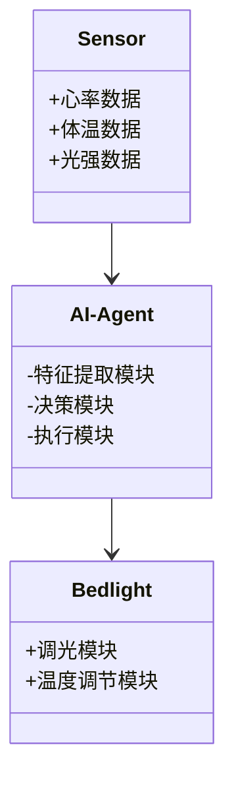
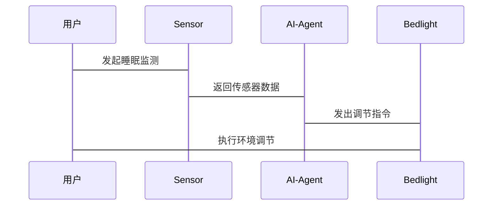

                 


# AI Agent在智能床头灯中的睡眠辅助

## 关键词：AI Agent, 智能床头灯, 睡眠辅助, 睡眠监测, 机器学习, 系统架构, 实际应用

## 摘要：  
本文详细探讨了AI Agent在智能床头灯中的睡眠辅助应用，从睡眠监测技术到AI Agent的设计与实现，再到系统架构和实际项目案例，全面解析了如何利用人工智能技术改善睡眠质量。文章结合理论与实践，通过详细的算法原理、系统架构设计和项目实战，为读者提供了全面的技术指导。

---

## 目录大纲

### 第一部分：背景与概念

#### 第1章：AI Agent与智能床头灯概述

##### 1.1 AI Agent的基本概念
- **1.1.1 AI Agent的定义与特点**  
  AI Agent是一种智能体，能够感知环境、自主决策并执行任务，具有学习、推理和自适应能力。  
- **1.1.2 AI Agent的核心功能与应用场景**  
  在智能床头灯中，AI Agent主要用于睡眠监测、环境调节和个性化建议。  
- **1.1.3 AI Agent与传统床头灯的对比**  
  通过表格对比AI Agent床头灯与传统床头灯的功能差异：

| **功能特性**      | **传统床头灯**       | **AI Agent床头灯**          |
|-------------------|----------------------|-----------------------------|
| 基本功能          | 调光、定时开关        | 调光、定时开关、睡眠监测     |
| 智能性            | 无                   | 集成AI算法，主动辅助睡眠     |
| 个性化            | 无                   | 根据用户习惯提供定制化服务    |

##### 1.2 智能床头灯的睡眠辅助功能
- **1.2.1 智能床头灯的功能概述**  
  智能床头灯通过集成传感器和AI算法，实时监测用户的睡眠状态，并根据数据调整环境参数。  
- **1.2.2 睡眠辅助的目标与意义**  
  提高睡眠质量，解决失眠、浅睡眠等问题，提升用户整体健康水平。  
- **1.2.3 睡眠辅助的核心要素**  
  数据采集、算法处理、环境调节和用户反馈。

##### 1.3 AI Agent在睡眠辅助中的作用
- **1.3.1 AI Agent如何改善睡眠质量**  
  AI Agent通过分析睡眠数据，优化床头灯的光照、温度和湿度，营造最佳睡眠环境。  
- **1.3.2 AI Agent与床头灯的结合方式**  
  AI Agent作为床头灯的智能控制系统，接收传感器数据并驱动床头灯执行调节任务。

---

### 第二部分：睡眠监测与分析

#### 第2章：睡眠监测技术

##### 2.1 睡眠监测的生理指标
- **2.1.1 心率变化与睡眠阶段的关系**  
  心率在REM睡眠阶段会显著增加，而在深度睡眠阶段则相对稳定。  
- **2.1.2 体温变化对睡眠的影响**  
  体温下降通常预示着进入深度睡眠阶段。  
- **2.1.3 脑电波在睡眠分析中的应用**  
  不同睡眠阶段（如REM、N1、N2、N3）对应的脑电波频率和幅度不同。

##### 2.2 环境因素对睡眠的影响
- **2.2.1 光线强度与睡眠周期**  
  光线强度影响褪黑素分泌，间接影响睡眠周期。  
- **2.2.2 温度与湿度对睡眠质量的影响**  
  理想的睡眠环境温度为16-22°C，湿度为40%-60%。  
- **2.2.3 噪音水平与睡眠干扰**  
  噪音水平超过40分贝会影响睡眠质量。

##### 2.3 数据采集与传感器技术
- **2.3.1 常用的睡眠监测传感器**  
  包括心率传感器、体温传感器、光传感器和噪音传感器。  
- **2.3.2 传感器数据的采集与处理**  
  数据采集需实时性高、精度高，处理时需进行滤波和归一化处理。  
- **2.3.3 数据预处理方法与挑战**  
  数据清洗、异常值处理和数据增强是数据预处理的关键步骤。

#### 第3章：睡眠数据分析与机器学习模型

##### 3.1 数据分析方法
- **3.1.1 时间序列分析在睡眠数据中的应用**  
  使用ARIMA模型预测睡眠质量，公式为：  
  $$ ARIMA(p, d, q) = y_t = \phi_1 y_{t-1} + \theta_1 e_{t-1} + \epsilon_t $$
- **3.1.2 基于统计学的睡眠阶段分类**  
  使用K-means聚类算法将睡眠数据分成不同的阶段。

##### 3.2 机器学习模型在睡眠监测中的应用
- **3.2.1 基于深度学习的睡眠监测模型**  
  使用LSTM（长短期记忆网络）模型进行睡眠阶段分类，模型结构如下：


- **3.2.2 模型训练与优化**  
  使用交叉验证和网格搜索优化超参数，提升模型准确率。

---

### 第三部分：AI Agent的设计与实现

#### 第4章：AI Agent的设计与实现

##### 4.1 AI Agent的算法原理
- **4.1.1 睡眠数据的特征提取**  
  从心率、体温、光强等数据中提取特征，如均值、标准差、最大值等。  
- **4.1.2 基于机器学习的决策逻辑**  
  使用随机森林模型进行决策，公式为：  
  $$ P(y|x) = \sum_{i=1}^n \omega_i I(f_i(x) \leq t_i) $$
  其中，$\omega_i$为权重，$f_i(x)$为决策函数，$t_i$为阈值。

##### 4.2 AI Agent的系统架构
- **4.2.1 系统功能设计**  
  通过领域模型类图展示系统组件之间的关系：



- **4.2.2 系统架构设计**  
  分层架构，包括数据采集层、数据处理层和应用层。

##### 4.3 系统接口与交互设计
- **4.3.1 系统接口设计**  
  AI Agent通过API与床头灯交互，接口如下：

  ```json
  {
      "command": "调节亮度",
      "params": {
          "brightness": 50
      }
  }
  ```

- **4.3.2 系统交互流程**  
  使用序列图展示AI Agent与床头灯的交互过程：



---

### 第四部分：项目实战

#### 第5章：项目实战

##### 5.1 环境安装与配置
- **5.1.1 硬件设备**  
  需要心率传感器、温度传感器和床头灯控制器。  
- **5.1.2 软件工具**  
  使用Python、TensorFlow、Flask进行开发。

##### 5.2 核心代码实现
- **5.2.1 数据采集模块**  
  ```python
  import serial

  ser = serial.Serial('COM3', 9600)
  def get_sensor_data():
      data = ser.readline().decode().strip()
      return data
  ```

- **5.2.2 睡眠数据分析模块**  
  ```python
  import numpy as np
  from sklearn.ensemble import RandomForestClassifier

  def preprocess_data(data):
      # 数据预处理
      pass

  def train_model(X_train, y_train):
      model = RandomForestClassifier()
      model.fit(X_train, y_train)
      return model

  def predict_sleep_phase(model, X_test):
      y_pred = model.predict(X_test)
      return y_pred
  ```

- **5.2.3 AI Agent控制模块**  
  ```python
  def control_bedlight(brightness):
      # 调节床头灯亮度
      pass
  ```

##### 5.3 实际案例分析
- **5.3.1 案例背景**  
  用户A长期失眠，希望通过AI Agent改善睡眠质量。  
- **5.3.2 数据分析与处理**  
  收集并分析用户A的睡眠数据，发现其主要在浅睡眠阶段。  
- **5.3.3 系统优化与实现**  
  AI Agent通过调整床头灯亮度和温度，帮助用户A进入深度睡眠。

##### 5.4 项目总结与优化
- **5.4.1 项目总结**  
  通过实际项目验证了AI Agent在睡眠辅助中的有效性。  
- **5.4.2 系统优化建议**  
  增加更多传感器数据，优化算法模型，提升系统响应速度。

---

### 第五部分：总结与展望

#### 第6章：总结与展望

##### 6.1 总结
- AI Agent在智能床头灯中的应用显著改善了睡眠质量。  
- 通过传感器数据采集、机器学习算法和系统优化，实现了个性化的睡眠辅助功能。

##### 6.2 未来展望
- 结合更多传感器数据，提升睡眠监测的准确性。  
- 开发更智能的AI算法，实现主动式睡眠管理。  
- 探索AI Agent在更多健康领域的应用。

##### 6.3 最佳实践Tips
- 定期校准传感器，确保数据准确性。  
- 合理设置环境参数，避免过度干预。  
- 定期更新AI模型，保持系统的先进性。

---

### 小结

通过本文的详细讲解，读者可以全面了解AI Agent在智能床头灯中的睡眠辅助应用。从理论到实践，从系统设计到项目实现，文章为技术爱好者和开发者提供了丰富的知识和实用的代码示例。未来，随着AI技术的不断进步，智能床头灯将在健康领域发挥更大的作用。

