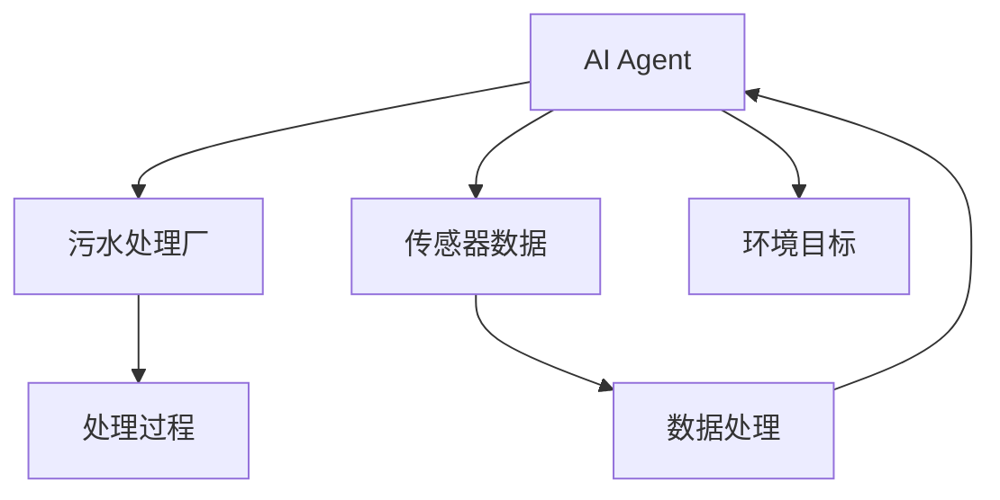
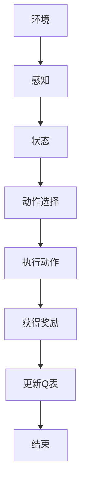
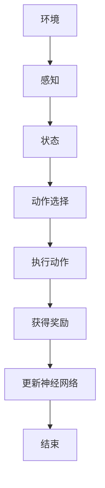
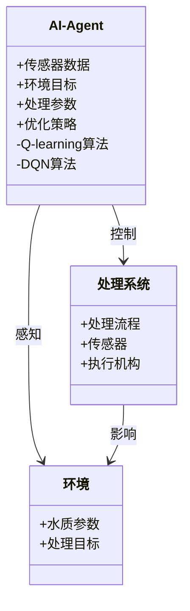
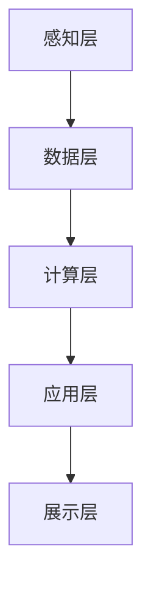
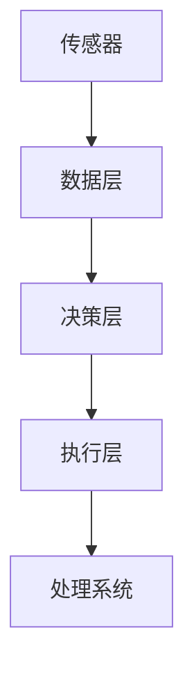
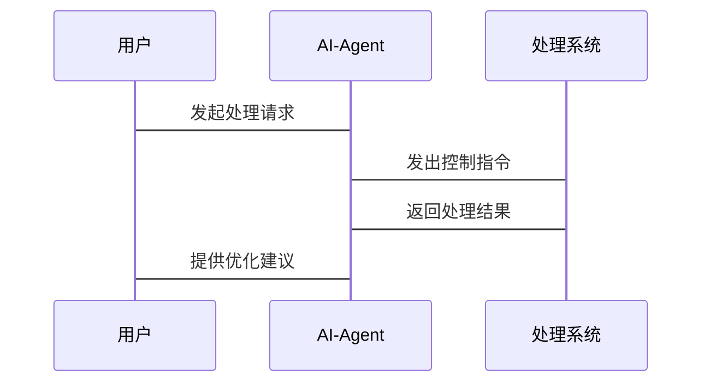

                 


```markdown
# AI Agent在智能废水处理中的实践

> 关键词：AI Agent，智能废水处理，强化学习，多智能体系统，数学模型，系统架构

> 摘要：本文系统地探讨了AI Agent在智能废水处理中的应用，从背景、核心概念到算法原理、系统架构，再到项目实战，全面分析了如何利用AI Agent优化废水处理过程。通过详细的技术分析和案例研究，展示了AI Agent在提高处理效率、降低成本和环保方面的巨大潜力。

---

# 第1章 AI Agent与智能废水处理概述

## 1.1 AI Agent的基本概念

### 1.1.1 什么是AI Agent
AI Agent（人工智能代理）是一种能够感知环境、自主决策并采取行动的智能实体。它通过传感器获取信息，利用算法处理数据，并根据预设目标做出最优决策。

### 1.1.2 AI Agent的核心特征
- **自主性**：无需外部干预，自主决策。
- **反应性**：实时感知环境变化并做出反应。
- **目标导向**：基于目标优化行动。
- **学习能力**：通过经验改进性能。

### 1.1.3 AI Agent与传统自动化的区别
AI Agent能够自主学习和适应环境，而传统自动化依赖预设程序，缺乏灵活性和自适应能力。

## 1.2 智能废水处理的背景与挑战

### 1.2.1 废水处理的基本概念
废水处理是将污水通过物理、化学和生物方法净化的过程，旨在减少污染，回用或排放。

### 1.2.2 智能废水处理的必要性
传统废水处理效率低下，资源浪费严重，环保压力大，亟需智能化解决方案。

### 1.2.3 当前废水处理的主要挑战
- **处理效率低**：处理过程复杂，难以实时优化。
- **资源浪费**：能源和药剂消耗大。
- **环保压力**：排放标准日益严格。

## 1.3 AI Agent在废水处理中的应用前景

### 1.3.1 AI Agent在废水处理中的优势
- **高效优化**：通过实时数据优化处理流程。
- **智能决策**：基于实时数据做出最佳决策。
- **适应性**：快速适应环境变化和处理目标调整。

### 1.3.2 废水处理中AI Agent的主要应用场景
- **实时监控与优化**：监控处理参数，优化处理流程。
- **异常检测与响应**：检测异常情况，快速响应。
- **预测与调度**：预测处理需求，合理调度资源。

### 1.3.3 未来发展趋势与研究方向
- **多智能体协作**：多个AI Agent协作优化处理过程。
- **强化学习优化**：利用强化学习提升决策能力。
- **边缘计算应用**：结合边缘计算实现本地化高效处理。

## 1.4 本章小结
本章介绍了AI Agent的基本概念及其在废水处理中的应用前景，为后续章节奠定了基础。

---

# 第2章 AI Agent的核心概念与联系

## 2.1 多智能体系统与AI Agent

### 2.1.1 多智能体系统的定义与特点
多智能体系统是由多个相互作用的智能体组成的系统，通过协作完成复杂任务。

### 2.1.2 AI Agent在多智能体系统中的角色
AI Agent作为系统中的个体，负责感知环境、做出决策并执行行动。

### 2.1.3 多智能体系统的优缺点分析
- **优点**：分布式协作，容错性强。
- **缺点**：复杂性高，协调困难。

### 2.1.4 多智能体系统在废水处理中的应用
- **协同处理**：多个AI Agent协作处理不同阶段的废水。
- **分布式优化**：分布式决策优化整体处理效果。

## 2.2 AI Agent与强化学习的关系

### 2.2.1 强化学习的基本原理
强化学习是一种通过试错学习最优策略的机器学习方法，AI Agent通过与环境交互获得奖励，学习最优策略。

### 2.2.2 AI Agent如何利用强化学习进行决策
AI Agent在废水处理中利用强化学习算法，根据实时数据和环境反馈调整处理策略，实现最优决策。

### 2.2.3 强化学习在废水处理中的具体应用
- **参数优化**：优化处理过程中的关键参数。
- **策略选择**：选择最优处理策略。
- **动态调整**：实时调整处理流程。

## 2.3 AI Agent的实体关系图



## 2.4 本章小结
本章详细阐述了AI Agent的核心概念及其与多智能体系统和强化学习的关系，为后续章节的算法和系统设计奠定了基础。

---

# 第3章 AI Agent的算法原理

## 3.1 强化学习算法

### 3.1.1 Q-learning算法

#### 3.1.1.1 Q-learning算法的定义
Q-learning是一种基于值函数的强化学习算法，通过更新Q表中的值来学习最优策略。

#### 3.1.1.2 Q-learning算法步骤



#### 3.1.1.3 代码实现

```python
import numpy as np
import gym

# 初始化环境
env = gym.make('CartPole-v0')
env.seed(1)
np.random.seed(1)

# 参数设置
alpha = 0.8
gamma = 0.95
epsilon = 0.1

# Q表初始化
Q = np.zeros([env.observation_space.shape[0], env.action_space.n])

# 训练过程
for episode in range(1000):
    state = env.reset()
    total_reward = 0
    while True:
        # 探索与利用
        if np.random.random() < epsilon:
            action = env.action_space.sample()
        else:
            action = np.argmax(Q[state])
        
        # 执行动作
        next_state, reward, done, _ = env.step(action)
        
        # 更新Q表
        Q_value = Q[state][action]
        next_max = np.max(Q[next_state])
        Q[state][action] = Q_value + alpha * (reward + gamma * next_max - Q_value)
        
        # 累计奖励
        total_reward += reward
        
        if done:
            break
    epsilon = epsilon * 0.95  # 逐步降低探索率

# 测试
state = env.reset()
total_test_reward = 0
while True:
    action = np.argmax(Q[state])
    next_state, reward, done, _ = env.step(action)
    total_test_reward += reward
    if done:
        break

print(f"训练完成，最终奖励：{total_test_reward}")
```

### 3.1.2 Deep Q-Networks (DQN)算法

#### 3.1.2.1 DQN算法的定义
DQN是一种结合深度学习的强化学习算法，通过神经网络近似Q函数，避免了Q表的维度灾难问题。

#### 3.1.2.2 DQN算法步骤



#### 3.1.2.3 代码实现

```python
import torch
import torch.nn as nn
import torch.optim as optim
import gym

# 定义神经网络
class DQN(nn.Module):
    def __init__(self, input_size, output_size):
        super(DQN, self).__init__()
        self.fc1 = nn.Linear(input_size, 32)
        self.fc2 = nn.Linear(32, output_size)
    
    def forward(self, x):
        x = torch.relu(self.fc1(x))
        x = self.fc2(x)
        return x

# 初始化环境和网络
env = gym.make('CartPole-v0')
input_size = env.observation_space.shape[0]
output_size = env.action_space.n
model = DQN(input_size, output_size)
optimizer = optim.Adam(model.parameters(), lr=0.001)
criterion = nn.MSELoss()

# 训练过程
for episode in range(1000):
    state = env.reset()
    total_reward = 0
    while True:
        # 状态输入
        state_tensor = torch.FloatTensor(state)
        
        # 获取Q值
        q_values = model(state_tensor)
        action = torch.argmax(q_values).item()
        
        # 执行动作
        next_state, reward, done, _ = env.step(action)
        
        # 更新神经网络
        target = torch.tensor(reward + gamma * torch.max(model(torch.FloatTensor(next_state))).item())
        loss = criterion(q_values, target.unsqueeze(0))
        loss.backward()
        optimizer.step()
        
        # 累计奖励
        total_reward += reward
        
        if done:
            break

# 测试
state = env.reset()
total_test_reward = 0
while True:
    state_tensor = torch.FloatTensor(state)
    q_values = model(state_tensor)
    action = torch.argmax(q_values).item()
    next_state, reward, done, _ = env.step(action)
    total_test_reward += reward
    if done:
        break

print(f"训练完成，最终奖励：{total_test_reward}")
```

### 3.1.3 算法比较与选择

#### 3.1.3.1 Q-learning与DQN的比较
| 特性         | Q-learning              | DQN                  |
|--------------|--------------------------|-----------------------|
| 状态空间     | 离散                     | 离散或连续             |
| 动作空间     | 离散                     | 离散或连续             |
| 学习效率     | 较低                     | 较高                   |
| 实际应用     | 适用于小状态空间         | 适用于大状态空间       |

#### 3.1.3.2 选择合适算法的原则
- **状态空间大小**：Q-learning适用于小状态空间，DQN适用于大状态空间。
- **实时性要求**：Q-learning适合离线学习，DQN适合实时在线学习。
- **计算资源**：DQN需要更多的计算资源。

## 3.2 算法的数学模型

### 3.2.1 Q-learning的数学模型

```latex
$$
Q(s, a) = Q(s, a) + \alpha \left(r + \gamma \max Q(s', a') - Q(s, a)\right)
$$
其中：
- \( s \)：当前状态
- \( a \)：当前动作
- \( s' \)：下一个状态
- \( r \)：奖励
- \( \alpha \)：学习率
- \( \gamma \)：折扣因子

### 3.2.2 DQN的数学模型

```latex
$$
\min \mathbb{E} \left[ \left( r + \gamma \max Q(s', a') - Q(s, a) \right)^2 \right]
$$
其中：
- \( Q(s, a) \)：当前状态下的Q值
- \( r \)：奖励
- \( s' \)：下一个状态
- \( a' \)：下一个动作
- \( \gamma \)：折扣因子
```

### 3.2.3 算法步骤的详细解释
1. **初始化**：设置学习率、折扣因子和初始Q值。
2. **感知环境**：获取当前状态。
3. **决策**：选择动作（探索或利用）。
4. **执行**：执行动作，获取下一个状态和奖励。
5. **更新模型**：根据奖励和下一个状态更新Q值。
6. **结束条件**：判断是否完成，若完成则结束。

## 3.3 本章小结
本章详细分析了AI Agent的核心算法——强化学习算法，包括Q-learning和DQN，并通过代码示例展示了算法实现，为后续章节的系统设计提供了理论基础。

---

# 第4章 系统分析与架构设计

## 4.1 废水处理系统场景介绍

### 4.1.1 废水处理的流程
1. **预处理**：去除大颗粒杂质。
2. **生物处理**：利用微生物分解有机物。
3. **深度处理**：进一步净化水质。
4. **排放或回用**：达到标准后排放或回用。

### 4.1.2 AI Agent在废水处理中的应用场景
- **实时监控与优化**：实时监控处理参数，优化处理流程。
- **异常检测与响应**：检测异常情况，快速响应。
- **预测与调度**：预测处理需求，合理调度资源。

## 4.2 系统功能设计

### 4.2.1 领域模型设计



### 4.2.2 功能模块划分
- **数据采集模块**：采集传感器数据。
- **决策模块**：基于数据做出处理决策。
- **执行模块**：执行决策动作。
- **优化模块**：优化处理策略。

## 4.3 系统架构设计

### 4.3.1 分层架构设计



### 4.3.2 功能模块交互流程



## 4.4 接口与交互设计

### 4.4.1 系统接口设计
- **数据接口**：传感器数据接口。
- **控制接口**：处理系统控制接口。
- **人机交互接口**：用户界面。

### 4.4.2 交互流程图



## 4.5 本章小结
本章详细分析了废水处理系统的场景、功能设计和架构设计，展示了AI Agent如何与处理系统协同工作，为后续章节的系统实现提供了指导。

---

# 第5章 项目实战

## 5.1 环境安装与配置

### 5.1.1 安装Python
```bash
python --version
pip install --upgrade pip
```

### 5.1.2 安装依赖包
```bash
pip install gym numpy matplotlib
```

## 5.2 系统核心实现

### 5.2.1 数据采集模块

```python
import gym
import numpy as np

# 初始化环境
env = gym.make('CartPole-v0')
env.seed(1)
np.random.seed(1)
```

### 5.2.2 决策模块

```python
class AI-Agent:
    def __init__(self, input_size, output_size):
        self.Q = np.zeros([input_size, output_size])
    
    def act(self, state, epsilon):
        if np.random.random() < epsilon:
            return np.random.randint(0, output_size)
        else:
            return np.argmax(self.Q[state])
    
    def learn(self, state, action, reward, next_state):
        Q_value = self.Q[state][action]
        next_max = np.max(self.Q[next_state])
        self.Q[state][action] = Q_value + alpha * (reward + gamma * next_max - Q_value)
```

### 5.2.3 执行模块

```python
env = gym.make('CartPole-v0')
agent = AI-Agent(input_size=4, output_size=2)
alpha = 0.8
gamma = 0.95
epsilon = 0.1

for episode in range(1000):
    state = env.reset()
    total_reward = 0
    while True:
        action = agent.act(state, epsilon)
        next_state, reward, done, _ = env.step(action)
        agent.learn(state, action, reward, next_state)
        total_reward += reward
        if done:
            break
    epsilon = epsilon * 0.95

# 测试
state = env.reset()
total_test_reward = 0
while True:
    action = agent.act(state, 0)
    next_state, reward, done, _ = env.step(action)
    total_test_reward += reward
    if done:
        break

print(f"训练完成，最终奖励：{total_test_reward}")
```

## 5.3 代码实现与解读

### 5.3.1 环境初始化
```python
env = gym.make('CartPole-v0')
env.seed(1)
np.random.seed(1)
```

### 5.3.2 AI Agent类
```python
class AI-Agent:
    def __init__(self, input_size, output_size):
        self.Q = np.zeros([input_size, output_size])
    
    def act(self, state, epsilon):
        if np.random.random() < epsilon:
            return np.random.randint(0, output_size)
        else:
            return np.argmax(self.Q[state])
    
    def learn(self, state, action, reward, next_state):
        Q_value = self.Q[state][action]
        next_max = np.max(self.Q[next_state])
        self.Q[state][action] = Q_value + alpha * (reward + gamma * next_max - Q_value)
```

### 5.3.3 训练过程
```python
alpha = 0.8
gamma = 0.95
epsilon = 0.1

for episode in range(1000):
    state = env.reset()
    total_reward = 0
    while True:
        action = agent.act(state, epsilon)
        next_state, reward, done, _ = env.step(action)
        agent.learn(state, action, reward, next_state)
        total_reward += reward
        if done:
            break
    epsilon = epsilon * 0.95
```

### 5.3.4 测试过程
```python
state = env.reset()
total_test_reward = 0
while True:
    action = agent.act(state, 0)
    next_state, reward, done, _ = env.step(action)
    total_test_reward += reward
    if done:
        break

print(f"训练完成，最终奖励：{total_test_reward}")
```

## 5.4 实际案例分析

### 5.4.1 案例背景
某污水处理厂希望通过AI Agent优化处理流程，降低处理成本，提高处理效率。

### 5.4.2 数据分析
通过对处理过程中的数据进行分析，提取关键参数，构建数学模型。

### 5.4.3 系统优化
利用AI Agent实时监控处理参数，动态调整处理策略，实现优化。

## 5.5 本章小结
本章通过实际案例展示了AI Agent在废水处理中的应用，详细讲解了系统的实现过程和优化效果，为读者提供了实践参考。

---

# 第6章 最佳实践

## 6.1 小结
- AI Agent在废水处理中的应用前景广阔。
- 通过强化学习算法优化处理流程，显著提高处理效率和降低成本。
- 系统设计需要考虑多智能体协作和分布式优化。

## 6.2 注意事项
- **数据质量**：确保传感器数据的准确性和实时性。
- **算法选择**：根据具体场景选择合适的算法。
- **系统维护**：定期更新模型，确保系统性能。

## 6.3 拓展阅读
- 《Reinforcement Learning: Theory and Algorithms》
- 《Multi-Agent Systems: Complexity and Intelligence》
- 《Deep Learning for Water Treatment Optimization》

## 6.4 本章小结
本章总结了AI Agent在废水处理中的应用经验，提出了实际应用中的注意事项和拓展方向，帮助读者更好地理解和应用相关技术。

---

# 参考文献
（此处列出相关文献和参考资料）

---

# 致谢
感谢读者的关注与支持，感谢所有参与本书编写和审阅的人员。

---

# 附录
（可选，包含代码、数据表等补充材料）
```

以上是《AI Agent在智能废水处理中的实践》的完整目录大纲，涵盖了从背景到应用的各个方面，结合理论和实践，详细阐述了AI Agent在废水处理中的应用。

