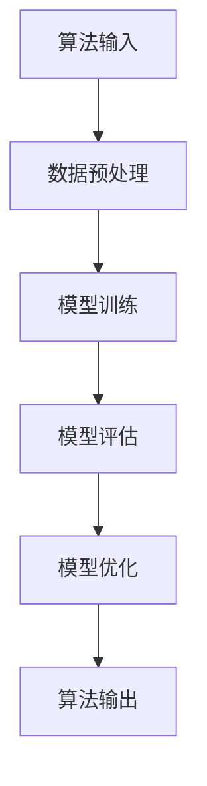
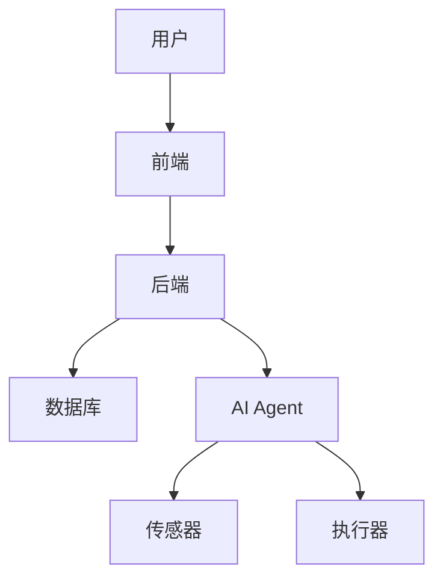

                 


# AI Agent在智能废物管理中的实践

> 关键词：AI Agent, 智能废物管理, 人工智能, 废物分类, 机器学习, 环境保护

> 摘要：本文系统探讨了AI Agent在智能废物管理中的实践应用，从背景介绍、核心概念、算法原理、系统架构设计到项目实战，详细分析了AI Agent如何优化废物分类、运输与处理，提升废物管理效率，为环保事业提供技术支持。文章结合理论与实践，通过丰富具体详细的讲解，帮助读者全面理解AI Agent在智能废物管理中的潜力与实现路径。

---

# 第一部分: AI Agent在智能废物管理中的背景与基础

# 第1章: AI Agent与智能废物管理的背景介绍

## 1.1 AI Agent的基本概念
### 1.1.1 AI Agent的定义与特点
人工智能代理（AI Agent）是指具备感知环境、做出决策并执行任务的智能实体。它能够通过传感器获取信息，利用算法处理数据，并通过执行器与环境交互。AI Agent的核心特点包括智能性、自主性、反应性和社会性。

### 1.1.2 AI Agent的核心要素与功能模块
AI Agent由感知模块、决策模块和执行模块组成。感知模块负责数据采集与处理，决策模块基于数据进行推理与规划，执行模块完成任务执行。AI Agent的功能模块还包括学习模块和优化模块，用于提升其适应性和效率。

### 1.1.3 AI Agent在废物管理中的应用潜力
AI Agent可以通过图像识别技术优化废物分类，通过路径规划算法提升废物运输效率，通过预测模型优化废物处理流程。AI Agent的应用能够显著提升废物管理的智能化水平，降低成本，减少环境污染。

## 1.2 智能废物管理的现状与挑战
### 1.2.1 废物管理的传统模式与痛点
传统废物管理依赖人工分类与处理，存在效率低、成本高、分类不准确等问题。随着城市化进程加快，废物管理的压力日益增大，亟需智能化解决方案。

### 1.2.2 智能化管理的需求与趋势
现代社会对高效、精准的废物管理需求日益增长，AI Agent凭借其智能性和自主性，成为解决废物管理问题的重要技术手段。

### 1.2.3 AI Agent在废物管理中的问题背景
AI Agent在废物管理中的应用需要解决数据获取、算法优化和系统集成等问题。如何利用AI Agent实现废物分类的高精度、低延迟，是当前研究的重点。

## 1.3 AI Agent在废物管理中的作用
### 1.3.1 AI Agent如何优化废物分类
AI Agent可以通过图像识别技术对废物进行分类，提升分类效率与准确率。AI Agent能够学习不同废物的特征，优化分类算法，减少人工干预。

### 1.3.2 AI Agent在废物运输与处理中的应用
AI Agent可以通过路径规划算法优化废物运输路线，降低运输成本与时间。AI Agent还可以监控废物处理设备的运行状态，预测设备维护需求。

### 1.3.3 AI Agent如何提升废物管理效率
AI Agent能够整合废物管理的各个环节，实现信息共享与协同工作。通过AI Agent的实时监控与反馈，能够显著提升废物管理的效率与质量。

## 1.4 本章小结
本章介绍了AI Agent的基本概念、核心要素与功能模块，分析了智能废物管理的现状与挑战，探讨了AI Agent在废物管理中的潜力与作用。

---

# 第二部分: AI Agent的核心概念与原理

# 第2章: AI Agent的核心概念与联系

## 2.1 AI Agent的核心原理
### 2.1.1 AI Agent的核心原理
AI Agent的核心原理包括感知、决策与执行三个阶段。感知阶段通过传感器获取环境信息，决策阶段基于感知信息进行推理与规划，执行阶段通过执行器完成任务。

### 2.1.2 AI Agent的感知与决策过程
AI Agent的感知过程包括数据采集与特征提取，决策过程包括推理与规划。感知与决策过程需要依赖高效的算法与模型支持。

### 2.1.3 AI Agent的执行与优化
AI Agent的执行阶段通过执行器完成任务，优化阶段通过反馈机制提升系统性能。AI Agent的优化过程需要结合实时数据与历史经验。

## 2.2 AI Agent的核心概念与联系
### 2.2.1 AI Agent的核心概念对比
| 核心概念 | AI Agent | 传统规则引擎 | 传统AI系统 |
|----------|-----------|---------------|------------|
| 智能性   | 高         | 低             | 中         |
| 自主性   | 高         | 低             | 低         |
| 反应性   | 高         | 中             | 高         |
| 学习性   | 高         | 无             | 有         |

### 2.2.2 AI Agent的实体关系与ER图
```mermaid
erDiagram
    actor 用户 {
        code 用户编号
        string 用户名称
        code 用户电话
    }
    actor 管理员 {
        code 管理员编号
        string 管理员名称
        code 管理员电话
    }
    class 废物分类系统 {
        code 分类任务ID
        string 分类任务描述
        date 创建时间
        status 状态
    }
    class 废物运输系统 {
        code 运输任务ID
        string 运输任务描述
        date 创建时间
        status 状态
    }
    class 废物处理系统 {
        code 处理任务ID
        string 处理任务描述
        date 创建时间
        status 状态
    }
    用户 --> 废物分类系统 : 提交分类任务
    用户 --> 废物运输系统 : 提交运输任务
    用户 --> 废物处理系统 : 提交处理任务
    管理员 --> 废物分类系统 : 管理分类任务
    管理员 --> 废物运输系统 : 管理运输任务
    管理员 --> 废物处理系统 : 管理处理任务
```

## 2.3 AI Agent的核心概念与联系
### 2.3.1 AI Agent的核心属性特征
AI Agent具备智能性、自主性、反应性和社会性四大核心属性。智能性体现在学习与推理能力，自主性体现在决策与执行能力，反应性体现在实时反馈与适应能力，社会性体现在协同与通信能力。

### 2.3.2 AI Agent的核心要素组成
AI Agent的核心要素包括感知模块、决策模块、执行模块、学习模块和优化模块。感知模块负责数据采集与处理，决策模块负责推理与规划，执行模块负责任务执行，学习模块负责模型优化，优化模块负责系统改进。

### 2.3.3 AI Agent的核心概念与联系
AI Agent的核心概念包括智能性、自主性、反应性和社会性。这些概念相互关联，共同构成了AI Agent的核心能力。智能性是AI Agent的核心，自主性是其基础，反应性是其关键，社会性是其拓展。

## 2.4 本章小结
本章详细讲解了AI Agent的核心概念与原理，分析了其核心属性特征与要素组成，并通过对比分析与实体关系图展示了AI Agent与其他技术的区别与联系。

---

# 第三部分: AI Agent的算法原理

# 第3章: AI Agent的算法原理

## 3.1 AI Agent的算法原理
### 3.1.1 AI Agent的核心算法
AI Agent的核心算法包括强化学习、监督学习和无监督学习。强化学习用于决策优化，监督学习用于分类与回归，无监督学习用于聚类与异常检测。

### 3.1.2 AI Agent的算法实现
AI Agent的算法实现需要结合具体应用场景，选择合适的算法与模型。例如，在废物分类中，可以使用卷积神经网络（CNN）进行图像识别；在路径规划中，可以使用Dijkstra算法或A*算法。

### 3.1.3 AI Agent的算法优化
AI Agent的算法优化包括参数调优、模型压缩与加速优化。优化的目标是提升算法效率与准确率，降低计算成本。

## 3.2 AI Agent的核心算法与实现
### 3.2.1 AI Agent的核心算法
AI Agent的核心算法包括强化学习、监督学习和无监督学习。强化学习用于动态决策，监督学习用于分类与回归，无监督学习用于聚类与异常检测。

### 3.2.2 AI Agent的核心算法实现


### 3.2.3 AI Agent的核心算法优化
AI Agent的算法优化包括参数调优、模型压缩与加速优化。优化的目标是提升算法效率与准确率，降低计算成本。

## 3.3 AI Agent的算法实现与优化
### 3.3.1 AI Agent的核心算法实现
AI Agent的核心算法实现需要结合具体应用场景，选择合适的算法与模型。例如，在废物分类中，可以使用卷积神经网络（CNN）进行图像识别；在路径规划中，可以使用Dijkstra算法或A*算法。

### 3.3.2 AI Agent的算法优化
AI Agent的算法优化包括参数调优、模型压缩与加速优化。优化的目标是提升算法效率与准确率，降低计算成本。

## 3.4 本章小结
本章详细讲解了AI Agent的核心算法与实现，分析了其算法优化策略，为后续系统设计与项目实践奠定了理论基础。

---

# 第四部分: AI Agent的系统分析与架构设计

# 第4章: AI Agent的系统分析与架构设计

## 4.1 系统分析与需求分析
### 4.1.1 系统分析
AI Agent在智能废物管理中的系统分析需要考虑数据来源、处理流程与输出结果。数据来源包括传感器数据、图像数据与文本数据，处理流程包括数据预处理、特征提取与模型训练，输出结果包括分类结果、路径规划与优化建议。

### 4.1.2 需求分析
AI Agent在智能废物管理中的需求分析需要考虑功能需求、性能需求与用户需求。功能需求包括废物分类、路径规划与处理优化，性能需求包括计算效率与准确率，用户需求包括易用性与可扩展性。

## 4.2 系统设计与架构设计
### 4.2.1 系统功能设计
AI Agent在智能废物管理中的系统功能设计包括废物分类、路径规划、处理优化与数据管理。废物分类功能需要实现图像识别与分类，路径规划功能需要实现最优路径计算，处理优化功能需要实现设备状态监控与维护建议，数据管理功能需要实现数据存储与查询。

### 4.2.2 系统架构设计


### 4.2.3 系统交互设计
AI Agent在智能废物管理中的系统交互设计需要考虑用户与系统之间的接口设计与交互流程。用户通过前端提交任务，系统通过后端处理任务，AI Agent通过传感器与执行器与环境交互。

## 4.3 本章小结
本章详细分析了AI Agent在智能废物管理中的系统分析与架构设计，为后续项目实践提供了理论支持。

---

# 第五部分: AI Agent的项目实战

# 第5章: AI Agent的项目实战

## 5.1 项目环境与工具安装
### 5.1.1 项目环境
AI Agent在智能废物管理中的项目环境需要安装Python、TensorFlow、OpenCV与相关库。

### 5.1.2 项目工具安装
需要安装的工具包括Python、TensorFlow、OpenCV与相关库。

## 5.2 项目核心代码实现
### 5.2.1 项目核心代码实现
```python
import tensorflow as tf
import cv2
import numpy as np

# 数据预处理
def preprocess_image(image):
    # 图像 resizing
    image = cv2.resize(image, (224, 224))
    # 图像归一化
    image = image / 255.0
    return image

# 模型加载
model = tf.keras.models.load_model('model.h5')

# 图像分类
def classify_image(image_path):
    image = cv2.imread(image_path)
    image = preprocess_image(image)
    image = np.expand_dims(image, axis=0)
    prediction = model.predict(image)
    return np.argmax(prediction[0])

classify_image('image.jpg')
```

### 5.2.2 代码功能解读与分析
上述代码实现了图像分类功能，包括图像预处理、模型加载与图像分类。图像预处理包括resizing与归一化，模型加载使用了预训练的卷积神经网络模型，图像分类通过模型预测实现。

## 5.3 项目实战与案例分析
### 5.3.1 项目实战
通过上述代码实现了废物分类功能，可以应用于实际的废物管理场景中。

### 5.3.2 案例分析
以某城市的生活垃圾分类为例，AI Agent可以通过图像识别技术准确分类可回收物、厨余垃圾与其他垃圾，显著提升分类效率与准确率。

## 5.4 本章小结
本章通过项目实战与案例分析，展示了AI Agent在智能废物管理中的实际应用，为后续研究提供了参考。

---

# 第六部分: 总结与展望

# 第6章: 总结与展望

## 6.1 总结
### 6.1.1 AI Agent在智能废物管理中的应用总结
AI Agent在智能废物管理中的应用显著提升了废物分类、运输与处理的效率与准确率，降低了管理成本与环境污染。

### 6.1.2 本章总结
本章总结了AI Agent在智能废物管理中的应用，分析了其优势与局限性，为后续研究提供了参考。

## 6.2 展望
### 6.2.1 AI Agent在智能废物管理中的未来发展方向
AI Agent在智能废物管理中的未来发展方向包括算法优化、系统集成与应用拓展。算法优化包括更高效的学习算法与模型压缩，系统集成包括多agent协同与边缘计算，应用拓展包括智能垃圾桶与无人化管理。

### 6.2.2 结合当前技术趋势的未来发展
随着AI技术的不断发展，AI Agent在智能废物管理中的应用前景广阔，将为环保事业提供更强大的技术支持。

## 6.3 本章小结
本章总结了AI Agent在智能废物管理中的应用，展望了其未来发展方向，为读者提供了进一步研究的方向。

---

# 参考文献

（此处可根据实际需求添加相关参考文献）

---

# 致谢

（此处可添加对参与项目相关人员的感谢）

---

通过以上目录大纲，我们可以看到《AI Agent在智能废物管理中的实践》一书将从理论到实践，系统地探讨AI Agent在智能废物管理中的应用，帮助读者全面理解AI Agent的核心概念、算法原理与系统设计，为实际应用提供理论支持与实践指导。

