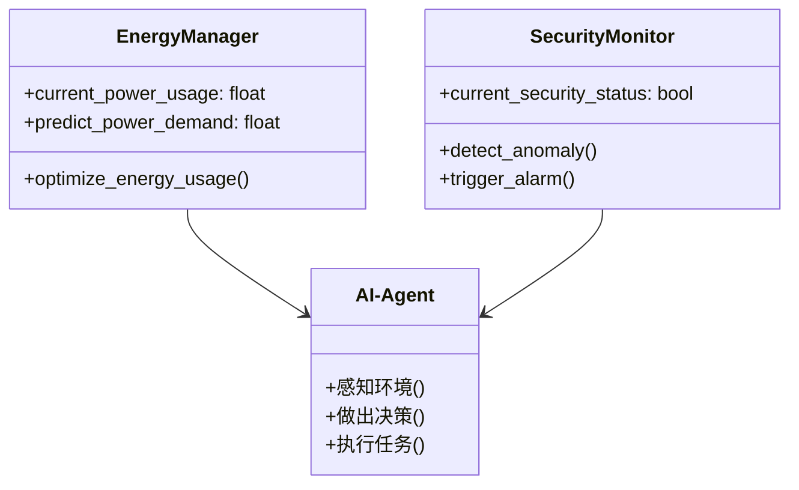
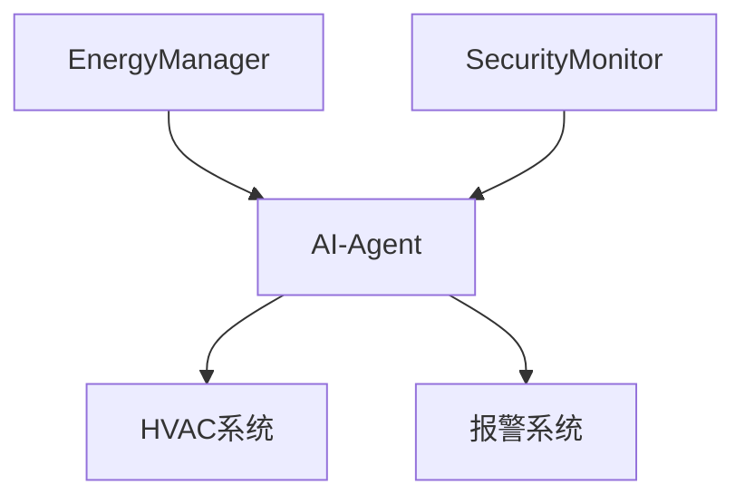
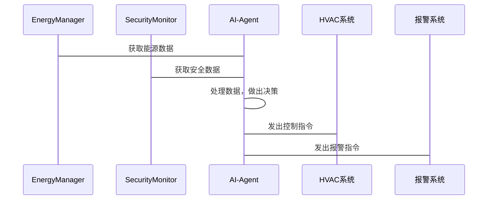

                 


# AI Agent在智能建筑中的应用：能源管理与安全监控

> 关键词：AI Agent, 智能建筑, 能源管理, 安全监控, 强化学习, 监督学习, 系统架构

> 摘要：本文系统阐述了AI Agent在智能建筑中的应用，重点分析了AI Agent在能源管理和安全监控中的核心原理、算法实现和系统架构设计。通过实际项目案例的分析，详细展示了AI Agent在智能建筑中的具体应用，并提供了最佳实践和开发经验，帮助读者更好地理解和应用相关技术。

---

### 第一部分: AI Agent与智能建筑的背景介绍

#### 第1章: AI Agent概述

##### 1.1 AI Agent的基本概念

###### 1.1.1 什么是AI Agent
人工智能代理（AI Agent）是一种能够感知环境、自主决策并执行任务的智能实体。AI Agent通过传感器获取信息，利用算法进行分析和推理，并通过执行器与环境交互。AI Agent的核心特征包括自主性、反应性、目标导向和学习能力。

###### 1.1.2 AI Agent的核心特征
- **自主性**：AI Agent能够在没有外部干预的情况下自主运行。
- **反应性**：AI Agent能够实时感知环境变化并做出响应。
- **目标导向**：AI Agent的行为围绕特定目标展开。
- **学习能力**：AI Agent能够通过数据和经验不断优化自身的决策能力。

###### 1.1.3 AI Agent的分类与应用场景
AI Agent可以根据智能水平分为**反应式代理**（基于当前感知做出反应）和**认知式代理**（具备复杂推理和规划能力）。AI Agent广泛应用于自动驾驶、智能助手、机器人控制、金融交易等领域。

##### 1.2 AI Agent在智能建筑中的应用
智能建筑通过AI Agent实现能源管理、安全监控、用户服务等智能化功能。AI Agent能够优化建筑的能源使用效率，提升安全监控的准确性，并为用户提供个性化的服务。

---

#### 第2章: 智能建筑的概念与特点

##### 2.1 智能建筑的定义
智能建筑是指通过先进的信息技术和自动化系统，实现建筑内部设施和服务的智能化管理。智能建筑的核心目标是提高能源利用效率、保障安全、提升用户体验和降低运营成本。

##### 2.2 智能建筑的关键系统
- **能源管理系统**：通过AI Agent优化能源使用，实现节能减排。
- **安全监控系统**：利用AI Agent实时监测建筑环境，预防和应对安全威胁。
- **智能化服务系统**：为用户提供个性化的物业服务和设施管理。

---

#### 第3章: 能源管理与安全监控的挑战

##### 3.1 能源管理的现状与问题
传统能源管理存在效率低下、资源浪费和响应不及时等问题。智能化能源管理通过AI Agent实现能源消耗的实时监控、预测和优化，能够显著提高能源利用效率。

##### 3.2 安全监控的现状与问题
传统安全监控系统依赖人工值守，存在响应速度慢、误报率高和覆盖范围有限等问题。智能化安全监控通过AI Agent实现智能识别、实时预警和自主响应，能够显著提升安全管理水平。

---

### 第二部分: AI Agent的核心概念与联系

#### 第4章: AI Agent的原理与实现

##### 4.1 AI Agent的结构与功能

###### 4.1.1 知识表示与推理
AI Agent通过知识表示技术（如逻辑推理、规则引擎）理解和处理环境信息。知识推理是AI Agent做出决策的基础。

###### 4.1.2 感知与决策机制
AI Agent通过传感器（如摄像头、温度计）感知环境信息，并利用算法（如强化学习、监督学习）进行决策。

###### 4.1.3 行为规划与执行
AI Agent根据决策结果制定行动计划，并通过执行器（如智能设备）执行任务。

##### 4.2 AI Agent在智能建筑中的应用

###### 4.2.1 能源管理中的AI Agent
AI Agent通过实时监测能源消耗数据，优化建筑的能源使用策略。例如，AI Agent可以根据天气预报和用户行为预测能源需求，并动态调整 HVAC 系统的运行模式。

###### 4.2.2 安全监控中的AI Agent
AI Agent通过分析视频流数据，实时识别异常行为和潜在威胁。例如，AI Agent可以识别出未经授权的人员进入敏感区域，并立即触发报警系统。

---

### 第三部分: 算法原理

#### 第5章: 强化学习算法在能源管理中的应用

##### 5.1 强化学习的基本原理
强化学习是一种通过试错机制优化决策策略的算法。AI Agent通过与环境交互，学习最优行为策略，以最大化预期奖励。

##### 5.2 强化学习在能源管理中的应用
AI Agent可以通过强化学习算法优化能源使用策略。例如，AI Agent可以根据历史用电数据和天气预测，动态调整 HVAC 系统的运行模式，以最小化能源消耗。

##### 5.3 强化学习算法的实现
```python
class Agent:
    def __init__(self, state_space, action_space):
        self.state_space = state_space
        self.action_space = action_space
        # 初始化策略参数
        self.theta = np.random.randn(...)
    
    def act(self, state):
        # 根据当前状态选择动作
        action_probs = self.policy(state)
        action = np.random.choice(self.action_space, p=action_probs)
        return action
    
    def update(self, state, action, reward, next_state):
        # 更新策略参数
        self.theta += learning_rate * (gradient of log(policy) * reward)
```

---

#### 第6章: 监督学习算法在安全监控中的应用

##### 6.1 监督学习的基本原理
监督学习是一种通过训练数据学习输入与输出之间的映射关系的算法。AI Agent可以通过监督学习算法识别图像中的异常行为。

##### 6.2 监督学习在安全监控中的应用
AI Agent可以通过监督学习算法分析视频流数据，识别出异常行为和潜在威胁。例如，AI Agent可以识别出未经授权的人员进入敏感区域，并立即触发报警系统。

##### 6.3 监督学习算法的实现
```python
class Classifier:
    def __init__(self, input_dim, output_dim):
        self.weights = np.random.randn(input_dim, output_dim)
    
    def predict(self, X):
        # 预测输出
        return np.argmax(X.dot(self.weights), axis=1)
    
    def train(self, X, y):
        # 训练模型
        self.weights += learning_rate * (X.T.dot(y - y_pred))
```

---

### 第四部分: 系统设计

#### 第7章: 智能建筑系统设计

##### 7.1 项目介绍
本项目旨在设计一个基于AI Agent的智能建筑系统，实现能源管理与安全监控的智能化。

##### 7.2 功能设计

###### 7.2.1 领域模型


##### 7.3 架构设计

###### 7.3.1 系统架构


##### 7.4 接口设计
- **EnergyManager 接口**：提供能源消耗数据和预测需求
- **SecurityMonitor 接口**：提供安全状态和报警信息
- **AI-Agent 接口**：接收输入数据，输出决策指令

##### 7.5 交互设计

###### 7.5.1 交互流程


---

### 第五部分: 项目实战

#### 第8章: 项目实战

##### 8.1 环境安装
```bash
pip install numpy matplotlib scikit-learn tensorflow
```

##### 8.2 代码实现

###### 8.2.1 AI-Agent实现
```python
class AI-Agent:
    def __init__(self):
        self.energy_manager = EnergyManager()
        self.security_monitor = SecurityMonitor()
    
    def感知环境(self):
        self.energy_data = self.energy_manager.get_data()
        self.security_data = self.security_monitor.get_data()
    
    def 做出决策(self):
        # 根据环境数据做出决策
        self.decision = self.analyze_data(self.energy_data, self.security_data)
    
    def 执行任务(self):
        # 根据决策执行任务
        self.execute_task(self.decision)
```

##### 8.3 案例分析
通过实际案例分析，展示了AI Agent在智能建筑中的具体应用。例如，AI Agent可以根据能源消耗数据和天气预报，动态调整 HVAC 系统的运行模式，以最小化能源消耗。

---

### 第六部分: 最佳实践与总结

#### 第9章: 最佳实践

##### 9.1 小结
通过本文的系统阐述和实际案例分析，读者可以全面了解AI Agent在智能建筑中的应用，包括能源管理、安全监控和系统设计等方面。

##### 9.2 注意事项
- 开发过程中需要注意算法的实时性和响应速度
- 需要处理大量数据时，建议使用分布式计算和高效的数据存储技术
- 在实际应用中，需要结合具体场景进行算法优化和参数调优

##### 9.3 拓展阅读
- 推荐阅读《强化学习入门》、《机器学习实战》等书籍
- 关注领域内的最新研究和技术创新

---

### 附录

#### 附录A: 算法代码

##### A.1 强化学习算法代码
```python
# 简单的强化学习算法实现
class Agent:
    def __init__(self, state_space, action_space):
        self.state_space = state_space
        self.action_space = action_space
        self.theta = np.random.randn(state_space, 1)
    
    def act(self, state):
        q_values = state.dot(self.theta)
        action_probs = softmax(q_values)
        action = np.random.choice(self.action_space, p=action_probs)
        return action
    
    def update(self, state, action, reward, next_state):
        target = reward + next_state.dot(self.theta)
        loss = (target - (state.dot(self.theta)) ** 2).mean()
        self.theta -= learning_rate * loss * state.T
```

##### A.2 监督学习算法代码
```python
# 简单的监督学习算法实现
class Classifier:
    def __init__(self, input_dim, output_dim):
        self.weights = np.random.randn(input_dim, output_dim)
    
    def predict(self, X):
        return np.argmax(X.dot(self.weights), axis=1)
    
    def train(self, X, y):
        y_pred = self.predict(X)
        loss = (y - y_pred).mean()
        self.weights += learning_rate * (X.T.dot(y - y_pred))
```

---

### 参考文献

- Russell, S., & Norvig, P. (2010).《人工智能:一种现代方法》
- 周志华. (2016).《机器学习》
- LeCun, Y., Bengio, Y., & Hinton, G. (2015).《Deep Learning》

---

以上是《AI Agent在智能建筑中的应用：能源管理与安全监控》的详细目录大纲，涵盖从基础概念到实际应用的各个方面，确保读者能够系统地理解和应用AI Agent在智能建筑中的应用。

