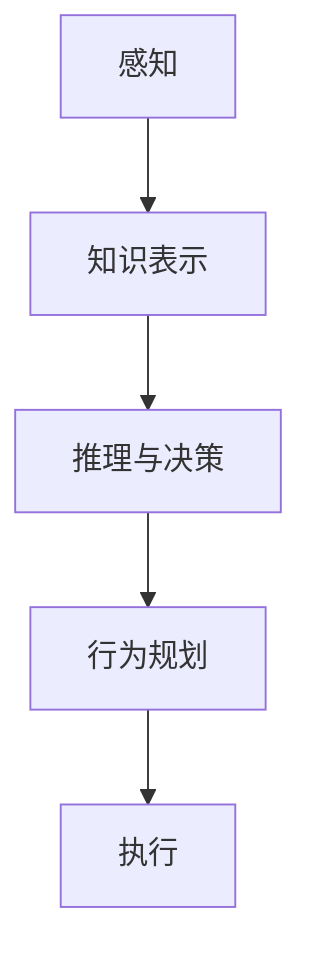
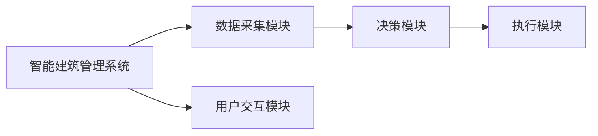
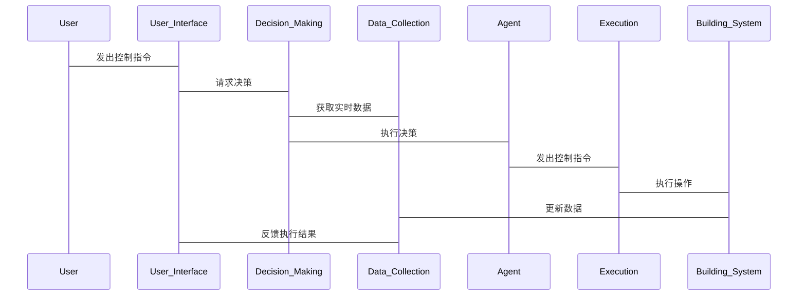

                 


# AI Agent在智能建筑管理中的应用

> 关键词：AI Agent，智能建筑，智能体，能源管理，建筑自动化

> 摘要：本文详细探讨了AI Agent在智能建筑管理中的应用，从基本概念到算法原理，再到系统架构设计和项目实战，全面分析了AI Agent如何优化智能建筑的管理效率，降低成本，并提升用户体验。

---

## 第一部分: AI Agent与智能建筑管理的背景与概念

### 第1章: AI Agent的基本概念与原理

#### 1.1 AI Agent的定义与核心要素
- **1.1.1 AI Agent的基本定义**
  AI Agent是一种智能体，能够感知环境、自主决策并执行任务。它具备目标导向性、反应性和适应性，能够在动态环境中解决问题。

- **1.1.2 AI Agent的核心属性与特征**
  - **目标导向性**：AI Agent的行为以实现特定目标为导向。
  - **反应性**：能够实时感知环境变化并做出反应。
  - **自主性**：能够在没有外部干预的情况下独立运行。
  - **学习能力**：通过数据和经验不断优化自身的决策能力。

- **1.1.3 AI Agent的分类与应用场景**
  - **简单反射型Agent**：基于当前感知做出反应，适用于简单任务。
  - **基于模型的反射型Agent**：利用内部模型进行推理和决策，适用于复杂任务。
  - **目标驱动型Agent**：以目标为导向，适用于需要长期规划的任务。
  - **实用驱动型Agent**：以效用最大化为目标，适用于资源优化任务。

#### 1.2 智能建筑管理的现状与挑战
- **1.2.1 智能建筑的基本概念**
  智能建筑是指通过智能化系统实现建筑设备、资源和信息的高效管理，以提高能源效率、降低成本并提升用户体验。

- **1.2.2 当前智能建筑管理的主要问题**
  - **信息孤岛**：不同系统之间的数据无法有效集成。
  - **能源浪费**：缺乏智能化的能源管理导致浪费。
  - **维护成本高**：传统管理方式需要大量人工干预。
  - **用户体验差**：用户需求无法及时响应。

- **1.2.3 AI Agent在智能建筑管理中的潜力**
  AI Agent能够通过实时感知和自主决策，优化建筑的能源管理、设备维护和用户服务，显著提升管理效率和用户体验。

#### 1.3 AI Agent与智能建筑管理的结合
- **1.3.1 AI Agent在智能建筑管理中的角色**
  AI Agent作为智能建筑管理的核心，负责协调建筑内的设备、系统和用户需求，实现智能化的管理。

- **1.3.2 AI Agent与智能建筑管理系统的协同工作**
  AI Agent与建筑管理系统（BMS）协同工作，通过实时数据分析和决策优化，提升系统的整体性能。

- **1.3.3 AI Agent在智能建筑管理中的核心价值**
  AI Agent能够实现建筑的智能化管理，降低运营成本，提高能源效率，并为用户提供个性化的服务。

### 第2章: AI Agent的核心概念与联系

#### 2.1 AI Agent的核心原理
- **2.1.1 知识表示与推理**
  AI Agent通过知识表示（如符号逻辑、概率模型）来表示环境中的信息，并通过推理过程（如逻辑推理、概率推理）来推导出新的知识。

- **2.1.2 感知与决策机制**
  AI Agent通过传感器和数据源感知环境，利用感知信息进行决策，选择最优的行为策略。

- **2.1.3 行为规划与执行**
  AI Agent根据决策结果制定行为计划，并通过执行机构将计划转化为实际行为。

#### 2.2 AI Agent的属性特征对比
- **2.2.1 基于表格的核心概念属性对比**
  | 属性         | 简单反射型Agent | 基于模型的反射型Agent | 目标驱动型Agent | 实用驱动型Agent |
  |--------------|-----------------|-----------------------|-----------------|-----------------|
  | 行为策略     | 反应式          | 基于模型的推理         | 目标导向         | 效用最大化       |
  | 学习能力     | 无              | 有                    | 有              | 有              |
  | 复杂性       | 低              | 中                    | 高              | 高              |

- **2.2.2 使用ER图展示AI Agent与智能建筑的实体关系**
```mermaid
er
    Building {
        BuildingID
        Name
        Location
    }
    Agent {
        AgentID
        Function
        Status
    }
    Sensor {
        SensorID
        Type
        Data
    }
    Action {
        ActionID
        Type
        Result
    }
    Building -[1..n]-> Sensor
    Agent -[1]-> Sensor
    Agent -[1]-> Action
    Sensor -[1]-> Action
```

#### 2.3 AI Agent的核心算法流程


### 第3章: AI Agent在智能建筑管理中的算法原理

#### 3.1 基于马尔可夫决策过程的AI Agent算法
- **3.1.1 算法原理**
  马尔可夫决策过程（MDP）是一种用于描述决策过程的数学模型，适用于动态环境下的决策问题。AI Agent通过与环境的交互，学习最优策略以最大化累积奖励。

- **3.1.2 数学模型与公式**
  $$ V(s) = \max_{a} [ r(s,a) + \gamma V(s') ] $$
  其中：
  - \( V(s) \) 表示状态 \( s \) 的价值函数。
  - \( r(s,a) \) 表示在状态 \( s \) 下采取动作 \( a \) 的即时奖励。
  - \( \gamma \) 表示折扣因子，用于平衡当前奖励和未来奖励的重要性。
  - \( V(s') \) 表示从状态 \( s' \) 开始的未来累积奖励。

- **3.1.3 代码实现示例**
```python
import numpy as np

class Agent:
    def __init__(self, states, actions, gamma=0.99):
        self.states = states
        self.actions = actions
        self.gamma = gamma
        self.Q = np.zeros((states, actions))

    def take_action(self, state, epsilon=0.1):
        if np.random.random() < epsilon:
            return np.random.randint(self.actions)
        return np.argmax(self.Q[state])

    def update_Q(self, state, action, reward, next_state):
        self.Q[state][action] = reward + self.gamma * np.max(self.Q[next_state])
```

---

## 第四部分: AI Agent在智能建筑管理中的系统架构设计

### 第4章: 系统功能设计与架构

#### 4.1 系统功能模块设计
- **数据采集模块**：负责采集建筑内的各种数据，如温度、湿度、光照强度等。
- **决策模块**：基于数据进行分析和推理，制定最优决策。
- **执行模块**：根据决策结果执行相应的操作，如调整设备参数。
- **用户交互模块**：提供用户界面，供用户查看和控制建筑系统。

#### 4.2 系统架构设计


#### 4.3 系统接口设计
- **数据采集接口**：与传感器和数据源对接，获取实时数据。
- **决策接口**：与决策模块交互，提供数据和接收决策结果。
- **执行接口**：与执行模块对接，发送控制指令。
- **用户接口**：与用户交互模块对接，提供用户操作界面。

#### 4.4 系统交互设计


---

## 第五部分: 项目实战与案例分析

### 第5章: 项目实战

#### 5.1 环境配置
```bash
pip install numpy matplotlib scikit-learn
```

#### 5.2 核心代码实现
```python
import numpy as np
from sklearn.neural_network import MLPClassifier

class AI-Agent:
    def __init__(self, input_dim, output_dim):
        self.model = MLPClassifier(hidden_layer_sizes=(100, 50), max_iter=1000)
        self.input_dim = input_dim
        self.output_dim = output_dim

    def train(self, X, y):
        self.model.fit(X, y)

    def predict(self, X):
        return self.model.predict(X)

# 示例使用
agent = AI-Agent(5, 3)
X = np.random.rand(100, 5)
y = np.random.randint(0, 3, 100)
agent.train(X, y)
print(agent.predict(X))
```

#### 5.3 案例分析
假设我们有一个智能建筑，需要优化能源管理。AI Agent通过实时采集建筑内的能源消耗数据，利用机器学习算法进行预测和优化，制定最优的能源使用计划，从而降低能源浪费和成本。

---

## 第六部分: 最佳实践与总结

### 第6章: 最佳实践

#### 6.1 小结
AI Agent在智能建筑管理中的应用能够显著提升管理效率、降低成本，并优化用户体验。通过实时感知、自主决策和持续学习，AI Agent为智能建筑的智能化管理提供了强有力的支持。

#### 6.2 注意事项
- **数据质量**：确保数据的准确性和完整性，避免决策失误。
- **算法选择**：根据具体场景选择合适的算法，避免过度复杂化。
- **安全性**：确保系统的安全性，防止数据泄露和网络攻击。
- **可扩展性**：设计时考虑系统的可扩展性，便于未来升级和维护。

#### 6.3 拓展阅读
- **推荐书籍**：《人工智能：一种现代的方法》
- **推荐论文**：《强化学习在智能建筑管理中的应用》
- **在线资源**：AI Agent在智能建筑管理中的应用案例研究

---

通过以上步骤，我们可以看到AI Agent在智能建筑管理中的巨大潜力和实际应用价值。未来，随着技术的不断进步，AI Agent将为智能建筑管理带来更多的创新和优化，推动建筑行业向更智能化、更可持续的方向发展。

