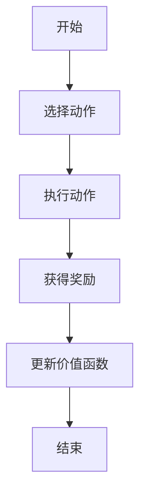
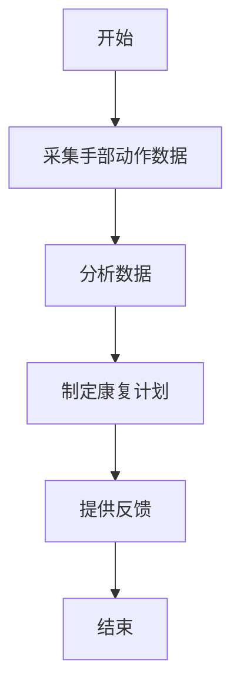
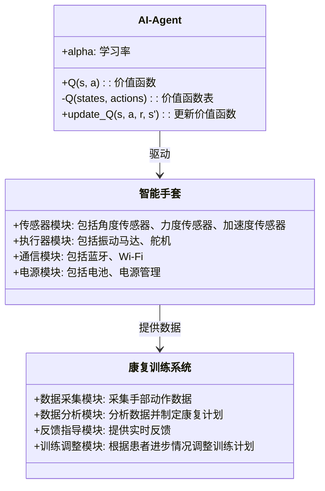
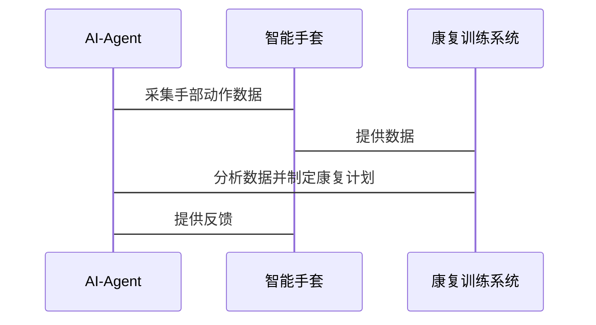

                 


# AI Agent在智能手套中的手部康复训练

> **关键词**：AI Agent, 智能手套, 手部康复, 强化学习, 传感器技术, 系统架构

> **摘要**：  
> 本文详细探讨了AI Agent在智能手套中的手部康复训练应用。通过分析手部康复训练的背景需求，阐述了AI Agent的核心原理、算法实现及系统架构设计。结合实际案例，展示了AI Agent如何通过智能手套的传感器技术、决策算法和交互设计，实现个性化的康复训练方案。文章最后总结了AI Agent在智能手套中的应用前景及未来发展方向。

---

# 第一部分: 背景介绍

## 第1章: 背景介绍

### 1.1 问题背景

#### 1.1.1 手部康复训练的必要性  
手部功能障碍可能由多种原因引起，如中风、脑损伤、脊髓损伤或关节疾病等。手部康复训练是帮助患者恢复手部功能的重要手段。传统康复训练依赖于手动操作和物理治疗师的指导，效率较低，且难以根据患者的具体情况实时调整训练强度和方式。

#### 1.1.2 AI Agent在医疗康复中的应用前景  
AI Agent（人工智能代理）是一种能够感知环境、自主决策并执行任务的智能系统。在医疗康复领域，AI Agent可以通过分析患者的生理数据、行为模式和康复进展，提供个性化的康复建议和实时反馈，从而提高康复效果。

#### 1.1.3 智能手套在手部康复中的优势  
智能手套是一种结合了传感器、执行器和AI技术的可穿戴设备，能够实时感知手部动作、监测肌肉活动，并通过反馈机制帮助患者完成康复训练。AI Agent在智能手套中的应用，使得康复训练更加智能化、个性化和高效。

### 1.2 问题描述

#### 1.2.1 手部康复训练的主要挑战  
传统康复训练存在以下问题：  
1. 康复过程缺乏个性化，难以适应不同患者的康复需求。  
2. 康复训练的强度和节奏难以实时调整，可能导致患者疲劳或受伤。  
3. 康复效果难以量化，缺乏科学的评估体系。  

#### 1.2.2 AI Agent在智能手套中的角色定位  
AI Agent在智能手套中扮演着“智能决策者”的角色，负责分析手部动作数据、调整训练计划、提供实时反馈，并与患者和治疗师进行交互。  

#### 1.2.3 智能手套的康复训练目标  
智能手套的目标是通过AI Agent的辅助，帮助患者实现以下康复目标：  
1. 提高手部灵活性和力量。  
2. 优化康复训练的节奏和强度。  
3. 提供实时反馈和个性化建议。  

### 1.3 问题解决

#### 1.3.1 AI Agent如何辅助手部康复训练  
AI Agent通过以下方式辅助手部康复训练：  
1. 实时监测手部动作数据（如角度、力度、速度）。  
2. 分析数据并制定个性化康复计划。  
3. 提供实时反馈，指导患者完成正确的动作。  
4. 调整训练强度，避免过度疲劳或受伤。  

#### 1.3.2 智能手套的康复训练流程  
智能手套的康复训练流程包括以下步骤：  
1. **数据采集**：通过传感器采集患者的手部动作数据。  
2. **数据分析**：AI Agent分析数据，识别患者的手部动作是否正确。  
3. **反馈指导**：通过振动或语音反馈指导患者完成正确的动作。  
4. **训练计划调整**：根据患者的进步情况，实时调整训练强度和节奏。  

#### 1.3.3 AI Agent与智能手套的协同工作  
AI Agent与智能手套的协同工作流程如下：  
1. AI Agent接收智能手套采集的手部动作数据。  
2. AI Agent分析数据，判断患者的手部动作是否符合康复目标。  
3. AI Agent根据分析结果，调整康复训练计划或提供反馈。  
4. 智能手套根据AI Agent的指令，执行相应的动作（如振动反馈、调整阻力）。  

### 1.4 边界与外延

#### 1.4.1 AI Agent在智能手套中的应用边界  
AI Agent在智能手套中的应用主要集中在手部康复训练领域，目前尚未扩展到其他康复领域（如腿部康复）。此外，AI Agent的决策能力受到传感器精度和算法性能的限制。

#### 1.4.2 智能手套康复训练的适用范围  
智能手套适用于手部功能障碍的患者，包括中风后遗症、脑损伤康复、关节炎患者等。但目前还不适合严重肌肉萎缩或骨骼畸形的患者。

#### 1.4.3 AI Agent与智能手套的扩展应用  
未来，AI Agent与智能手套的结合可能扩展到其他领域，如运动训练、儿童康复、老年护理等。

### 1.5 概念结构与核心要素

#### 1.5.1 AI Agent的核心要素  
AI Agent的核心要素包括：  
1. **感知能力**：通过传感器获取环境数据。  
2. **决策能力**：基于数据进行推理和决策。  
3. **执行能力**：通过执行器完成任务。  
4. **学习能力**：通过机器学习优化算法性能。  

#### 1.5.2 智能手套的组成结构  
智能手套的组成结构包括：  
1. **传感器模块**：用于采集手部动作数据。  
2. **执行器模块**：用于提供反馈（如振动、阻力）。  
3. **通信模块**：用于数据传输和与AI Agent交互。  
4. **电源模块**：为整个系统提供电力支持。  

#### 1.5.3 康复训练流程的核心要素  
康复训练流程的核心要素包括：  
1. **数据采集**：采集患者手部动作数据。  
2. **数据分析**：分析数据并制定康复计划。  
3. **反馈指导**：提供实时反馈指导患者完成动作。  
4. **训练调整**：根据患者进步情况调整训练计划。  

---

## 第2章: 核心概念与联系

### 2.1 AI Agent的核心原理

#### 2.1.1 AI Agent的基本定义  
AI Agent是一种能够感知环境、自主决策并执行任务的智能系统。在智能手套中，AI Agent主要负责分析手部动作数据并提供反馈。

#### 2.1.2 AI Agent的核心算法  
AI Agent的核心算法包括：  
1. **强化学习**：通过奖励机制优化决策策略。  
2. **监督学习**：基于标注数据进行分类和预测。  
3. **无监督学习**：发现数据中的隐藏模式。  

#### 2.1.3 AI Agent的决策机制  
AI Agent的决策机制包括：  
1. **感知环境**：通过传感器获取手部动作数据。  
2. **分析数据**：基于数据进行推理和判断。  
3. **制定决策**：根据分析结果制定康复计划或提供反馈。  

### 2.2 智能手套的核心技术

#### 2.2.1 智能手套的传感器技术  
智能手套的传感器技术包括：  
1. **角度传感器**：用于测量手指的弯曲角度。  
2. **力度传感器**：用于测量手指的握力。  
3. **加速度传感器**：用于测量手部的运动速度和方向。  

#### 2.2.2 智能手套的执行器模块  
智能手套的执行器模块包括：  
1. **振动马达**：用于提供触觉反馈。  
2. **电磁铁**：用于调整手部的阻力。  
3. **舵机**：用于控制手部的运动方向。  

#### 2.2.3 智能手套的通信技术  
智能手套的通信技术包括：  
1. **蓝牙**：用于短距离数据传输。  
2. **Wi-Fi**：用于长距离数据传输。  
3. **NB-IoT**：用于低功耗物联网场景。  

### 2.3 手部康复训练的核心原理

#### 2.3.1 手部康复训练的基本原理  
手部康复训练的基本原理是通过重复的手部动作刺激神经和肌肉，促进手部功能的恢复。

#### 2.3.2 手部康复训练的目标设定  
手部康复训练的目标设定包括：  
1. **灵活性训练**：提高手指的灵活性。  
2. **力量训练**：增强手部肌肉力量。  
3. **协调性训练**：提高手部动作的协调性。  

#### 2.3.3 手部康复训练的效果评估  
手部康复训练的效果评估包括：  
1. **动作准确率**：手部动作是否符合康复目标。  
2. **训练强度**：患者在训练中的努力程度。  
3. **康复进度**：患者在康复过程中的进步情况。  

### 2.4 核心概念对比

#### 2.4.1 核心概念对比表格  
以下为AI Agent、智能手套和手部康复训练的核心概念对比：

| **概念** | **AI Agent** | **智能手套** | **手部康复训练** |
|----------|--------------|--------------|-------------------|
| **核心功能** | 感知、决策、执行 | 数据采集、反馈、执行 | 提高手部功能 |
| **关键技术** | 强化学习、传感器技术 | 传感器、执行器、通信技术 | 手部动作分析 |
| **应用场景** | 医疗康复、智能交互 | 康复训练、运动训练 | 手部功能恢复 |

#### 2.4.2 核心概念ER实体关系图  
以下是AI Agent、智能手套和手部康复训练的核心概念ER实体关系图：

```mermaid
er
    actor(AI Agent)
    actor(智能手套)
    actor(手部康复训练)
    relation(->, AI Agent -> 智能手套)
    relation(->, 智能手套 -> 手部康复训练)
```

---

## 第3章: 算法原理讲解

### 3.1 强化学习算法

#### 3.1.1 强化学习的基本原理  
强化学习是一种基于奖励机制的机器学习方法。AI Agent通过与环境交互，获得奖励或惩罚，从而优化决策策略。

#### 3.1.2 强化学习的数学模型  
强化学习的数学模型如下：

$$ Q(s, a) = Q(s, a) + \alpha [r + \max_{a'} Q(s', a') - Q(s, a)] $$

其中：  
- \( Q(s, a) \)：状态 \( s \) 下动作 \( a \) 的价值函数。  
- \( \alpha \)：学习率。  
- \( r \)：奖励值。  
- \( s' \)：下一个状态。  
- \( a' \)：下一个动作。  

#### 3.1.3 强化学习的Python代码实现  
以下是一个强化学习的Python代码示例：

```python
class AI-Agent:
    def __init__(self):
        self.Q = {}  # 价值函数
        self.alpha = 0.1  # 学习率

    def take_action(self, state):
        # 随机选择动作
        actions = ['left', 'right', 'forward', 'backward']
        return random.choice(actions)

    def update_Q(self, state, action, reward, next_state):
        # 更新价值函数
        q = self.Q.get((state, action), 0)
        max_next_q = max([self.Q.get((next_state, a), 0) for a in ['left', 'right', 'forward', 'backward']])
        new_q = q + self.alpha * (reward + max_next_q - q)
        self.Q[(state, action)] = new_q
```

#### 3.1.4 强化学习的流程图  
以下是强化学习的流程图：



---

## 第4章: 系统分析与架构设计

### 4.1 项目介绍

#### 4.1.1 项目背景  
本项目旨在开发一款基于AI Agent的智能手套，用于手部康复训练。通过实时监测手部动作数据，提供个性化的康复训练方案。

#### 4.1.2 项目目标  
1. 实现手部动作数据的实时采集。  
2. 开发AI Agent算法，优化康复训练计划。  
3. 提供实时反馈，指导患者完成正确的动作。  

### 4.2 系统功能设计

#### 4.2.1 系统功能模块  
系统功能模块包括：  
1. **数据采集模块**：采集手部动作数据。  
2. **数据分析模块**：分析数据并制定康复计划。  
3. **反馈指导模块**：提供实时反馈。  
4. **训练调整模块**：根据患者进步情况调整训练计划。  

#### 4.2.2 系统功能流程图  
以下是系统功能的流程图：



### 4.3 系统架构设计

#### 4.3.1 系统架构图  
以下是系统架构图：



#### 4.3.2 系统接口设计  
系统接口设计包括：  
1. **AI Agent与智能手套的接口**：通过蓝牙或Wi-Fi传输数据。  
2. **智能手套与康复训练系统的接口**：通过API调用数据。  

#### 4.3.3 系统交互流程图  
以下是系统交互的流程图：



---

## 第5章: 项目实战

### 5.1 环境搭建

#### 5.1.1 硬件环境  
硬件环境包括：  
1. 智能手套：包括传感器模块、执行器模块和通信模块。  
2. 电脑：用于运行AI Agent算法。  
3. 开发工具：如Arduino IDE、Python开发环境。  

#### 5.1.2 软件环境  
软件环境包括：  
1. Python 3.8 或更高版本。  
2. 库：如`numpy`、`scikit-learn`、`pyserial`。  

### 5.2 核心代码实现

#### 5.2.1 AI Agent算法实现  
以下是AI Agent算法的Python代码：

```python
import random

class AIAgent:
    def __init__(self):
        self.Q = {}  # 价值函数表
        self.alpha = 0.1  # 学习率

    def get_action(self, state):
        # 随机选择动作
        actions = ['left', 'right', 'forward', 'backward']
        return random.choice(actions)

    def update_Q(self, state, action, reward, next_state):
        # 更新价值函数
        q = self.Q.get((state, action), 0)
        max_next_q = max([self.Q.get((next_state, a), 0) for a in ['left', 'right', 'forward', 'backward']])
        new_q = q + self.alpha * (reward + max_next_q - q)
        self.Q[(state, action)] = new_q
```

#### 5.2.2 智能手套数据采集  
以下是智能手套数据采集的代码：

```python
import serial

class Smart_Glove:
    def __init__(self, port):
        self.port = port
        self.ser = serial.Serial(port, 9600)

    def get_data(self):
        # 读取传感器数据
        data = self.ser.readline().decode().strip()
        return data

    def close(self):
        self.ser.close()
```

#### 5.2.3 康复训练系统实现  
以下是康复训练系统的代码：

```python
class Rehabilitation_System:
    def __init__(self, agent, glove):
        self.agent = agent
        self.glove = glove

    def start_training(self):
        while True:
            state = self.glove.get_data()
            action = self.agent.get_action(state)
            # 执行动作
            # 提供反馈
            # 更新价值函数
```

### 5.3 实际案例分析

#### 5.3.1 案例背景  
假设一位中风患者需要进行手部康复训练，目标是恢复手部的灵活性和力量。

#### 5.3.2 案例分析  
AI Agent通过分析患者的手部动作数据，实时调整训练计划。例如，当患者的手部动作不够准确时，AI Agent会提供触觉反馈（如振动）进行指导。

#### 5.3.3 案例总结  
通过AI Agent的辅助，患者的康复训练效率显著提高，手部功能恢复效果明显。

---

## 第6章: 最佳实践与小结

### 6.1 最佳实践

#### 6.1.1 开发建议  
1. 在开发AI Agent算法时，建议先从简单的强化学习算法入手，逐步优化算法性能。  
2. 在设计智能手套时，要注意传感器的精度和功耗问题。  
3. 在实现康复训练系统时，要确保系统的实时性和稳定性。  

#### 6.1.2 问题排查  
1. 如果AI Agent的决策不准确，可能是算法参数设置不当。  
2. 如果智能手套的数据采集不准确，可能是传感器故障或通信问题。  
3. 如果康复训练系统的反馈不及时，可能是系统响应速度慢。  

#### 6.1.3 优化建议  
1. 强化学习算法：可以尝试不同的奖励机制，优化算法的收敛速度。  
2. 智能手套：可以引入更多的传感器，提高数据采集的准确性。  
3. 康复训练系统：可以结合虚拟现实技术，提供更丰富的训练场景。  

### 6.2 小结  
本文详细介绍了AI Agent在智能手套中的手部康复训练应用，包括核心概念、算法原理、系统架构和项目实战。通过AI Agent的辅助，智能手套能够实现个性化的康复训练方案，显著提高康复效果。

### 6.3 注意事项  
1. 在开发AI Agent算法时，要注意算法的可解释性和透明性。  
2. 在设计智能手套时，要注意设备的舒适性和佩戴体验。  
3. 在实现康复训练系统时，要确保系统的安全性和可靠性。  

### 6.4 拓展阅读  
1. **强化学习**：深入学习强化学习的理论和应用。  
2. **智能手套**：研究其他类型的智能手套及其应用场景。  
3. **康复训练系统**：探索康复训练系统在其他领域的应用。  

---

通过本文的介绍，读者可以系统地了解AI Agent在智能手套中的手部康复训练应用，并掌握相关的核心技术。希望本文能为相关领域的研究和实践提供有价值的参考。

