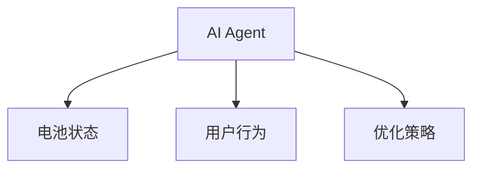
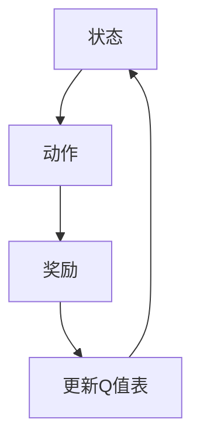
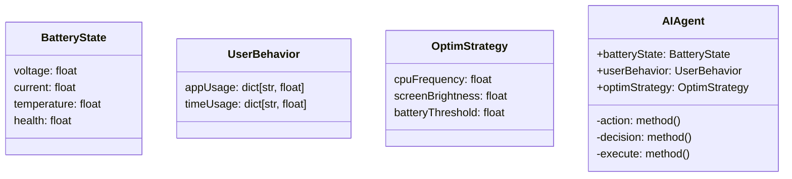
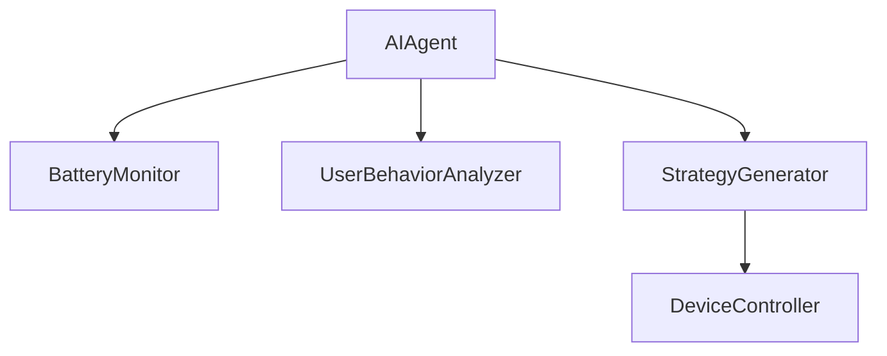
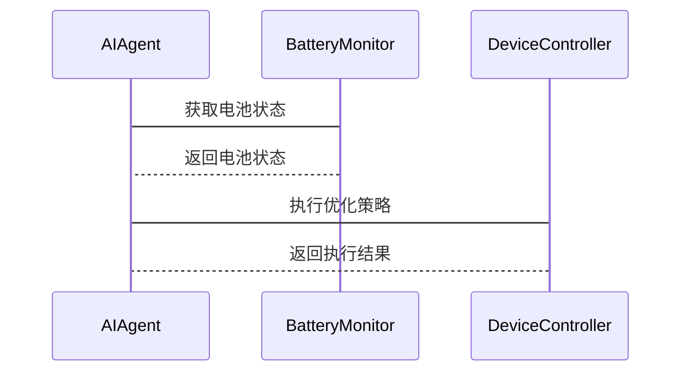

                 


# AI Agent在智能手机中的电池优化

> 关键词：AI Agent, 电池优化, 强化学习, 智能手机, 电池管理

> 摘要：随着智能手机的普及，电池优化成为了用户和制造商关注的焦点。本文探讨了AI Agent在智能手机电池优化中的应用，从核心概念、算法原理到系统架构，再到实际案例，全面解析了AI Agent如何通过智能感知、决策和执行机制来优化电池使用，提升用户体验。文章还提供了详细的数学模型和系统设计，帮助读者深入理解AI Agent在电池管理中的潜力和实现方法。

---

# 第一部分: AI Agent在智能手机中的电池优化概述

# 第1章: AI Agent与智能手机电池优化概述

## 1.1 AI Agent的基本概念

### 1.1.1 AI Agent的定义

AI Agent（人工智能代理）是指能够感知环境、做出决策并执行动作的智能实体。在智能手机中，AI Agent可以被设计为一个软件模块，通过分析电池状态和用户行为，优化电池的使用效率。

### 1.1.2 AI Agent的核心特征

- **自主性**：AI Agent能够独立感知环境并做出决策。
- **反应性**：能够实时响应电池状态和用户行为的变化。
- **目标导向**：通过优化电池使用效率为目标，调整策略。

### 1.1.3 AI Agent与传统电池管理的区别

传统电池管理依赖于固定的规则和模式，而AI Agent能够通过学习和适应，动态调整电池管理策略，从而更灵活地应对不同的使用场景。

## 1.2 智能手机电池优化的背景与挑战

### 1.2.1 智能手机电池消耗的主要场景

- **高功耗场景**：如视频播放、游戏运行等。
- **低功耗场景**：如待机、轻度使用等。
- **用户行为多样性**：不同用户的使用习惯差异较大，传统的固定策略难以满足个性化需求。

### 1.2.2 传统电池管理的局限性

- **固定策略的僵化**：无法根据实际使用场景动态调整。
- **缺乏用户行为分析**：难以应对用户行为的多样性。
- **电池老化问题**：传统管理无法有效延缓电池老化。

### 1.2.3 AI技术在电池优化中的应用潜力

通过AI技术，可以实现对电池状态的实时监测、用户行为的预测以及动态优化策略的制定，从而显著提升电池使用效率和寿命。

## 1.3 AI Agent在电池优化中的作用

### 1.3.1 AI Agent如何优化电池使用

- **动态调整功耗**：根据电池电量和用户行为，实时调整设备的功耗。
- **预测用户行为**：通过分析用户的历史行为，预测未来的使用场景，提前优化电池策略。

### 1.3.2 AI Agent在电池管理中的优势

- **智能化**：能够根据环境和用户行为动态调整策略。
- **高效性**：通过学习优化电池使用效率。
- **个性化**：针对不同用户的使用习惯，提供个性化的电池管理方案。

### 1.3.3 未来发展趋势与应用前景

随着AI技术的不断发展，AI Agent在电池优化中的应用将更加广泛，从智能手机到物联网设备，都将受益于智能电池管理技术。

## 1.4 本章小结

本章介绍了AI Agent的基本概念及其在智能手机电池优化中的应用潜力。通过对比传统电池管理的局限性，突出了AI Agent在动态调整策略、预测用户行为等方面的独特优势。

---

# 第二部分: AI Agent的核心原理与算法

# 第2章: AI Agent的核心原理

## 2.1 AI Agent的感知机制

### 2.1.1 数据采集与分析

AI Agent通过采集电池的状态数据（如电压、电流、温度）和用户行为数据（如应用使用频率、设备使用时间），进行分析和处理，为后续的决策提供依据。

### 2.1.2 电池状态的实时监测

AI Agent需要实时监测电池的状态，包括电池的健康状况、剩余电量等，以便及时调整管理策略。

### 2.1.3 用户行为的识别与预测

通过分析用户的使用习惯，AI Agent能够预测未来的用户行为，从而提前优化电池使用策略。

## 2.2 AI Agent的决策机制

### 2.2.1 基于强化学习的决策模型

强化学习是一种通过试错机制来优化决策的算法。AI Agent通过与环境的交互，不断优化电池管理策略。

### 2.2.2 电池优化策略的生成

AI Agent根据当前电池状态和用户行为，生成最优的电池管理策略，如动态调整CPU频率、屏幕亮度等。

### 2.2.3 多目标优化的实现

在电池优化中，AI Agent需要在多个目标之间进行权衡，如延长电池寿命、提升用户体验等。

## 2.3 AI Agent的执行机制

### 2.3.1 优化策略的执行流程

AI Agent根据生成的优化策略，执行相应的操作，如调整设备设置、限制高功耗应用的运行等。

### 2.3.2 电池管理策略的动态调整

AI Agent能够根据实时反馈不断调整策略，以应对环境和用户行为的变化。

### 2.3.3 执行效果的反馈机制

AI Agent通过收集执行效果的反馈，进一步优化策略，形成一个闭环系统。

## 2.4 核心概念与联系

### 2.4.1 AI Agent的实体关系图



### 2.4.2 核心概念属性对比表

| 概念 | 属性 | 描述 |
|------|------|------|
| AI Agent | 感知能力 | 数据采集与分析能力 |
| 电池状态 | 参数 | 电压、电流、温度等 |
| 用户行为 | 类型 | 启动应用、使用模式等 |

## 2.5 本章小结

本章详细介绍了AI Agent的核心原理，包括感知、决策和执行三个阶段。通过强化学习算法，AI Agent能够动态调整电池管理策略，实现高效的电池优化。

---

# 第三部分: AI Agent的算法原理

# 第3章: AI Agent的算法原理

## 3.1 强化学习算法在电池优化中的应用

### 3.1.1 强化学习的基本原理

强化学习是一种通过试错机制来优化决策的算法。AI Agent通过与环境的交互，不断优化电池管理策略。

### 3.1.2 Q-learning算法的实现

Q-learning算法是一种经典的强化学习算法，适用于离散动作空间的优化问题。其核心思想是通过不断更新Q值表，找到最优策略。

### 3.1.3 算法流程图



### 3.1.4 数学模型与公式

Q-learning算法的目标是找到最优的Q值，表示在状态s下采取动作a后的预期奖励。其更新公式为：

$$ Q(s, a) = Q(s, a) + \alpha \left( r + \gamma \max_{a'} Q(s', a') - Q(s, a) \right) $$

其中：
- $\alpha$ 是学习率，
- $\gamma$ 是折扣因子，
- $r$ 是奖励。

### 3.1.5 代码实现示例

```python
import numpy as np

# 初始化Q值表
Q = np.zeros((num_states, num_actions))

# 参数设置
alpha = 0.1
gamma = 0.9

# Q-learning算法
def q_learning(state):
    action = np.argmax(Q[state])
    next_state = get_next_state(state, action)
    reward = get_reward(state, action)
    Q[state, action] += alpha * (reward + gamma * np.max(Q[next_state]) - Q[state, action])
    return action

# 示例调用
current_state = 0
action = q_learning(current_state)
```

---

## 3.2 其他算法的探讨

### 3.2.1 贪婪算法与强化学习的对比

- **贪婪算法**：基于当前信息做出最优选择，适用于静态环境。
- **强化学习**：通过试错和经验积累，适用于动态环境。

### 3.2.2 算法选择的依据

- **环境动态性**：动态环境更适合强化学习。
- **数据量**：大数据量更适合复杂算法。
- **实时性**：需要实时决策的场景更适合强化学习。

---

# 第四部分: 系统分析与架构设计方案

# 第4章: 系统分析与架构设计方案

## 4.1 项目背景与目标

### 4.1.1 项目背景

随着智能手机的普及，电池优化成为提升用户体验的重要因素。传统的电池管理方法难以应对多样化的用户需求和复杂的使用场景。

### 4.1.2 项目目标

通过设计一个基于AI Agent的电池优化系统，实现对电池的智能管理，延长电池寿命，提升用户体验。

## 4.2 系统功能设计

### 4.2.1 领域模型设计



### 4.2.2 系统架构设计



## 4.3 系统接口设计

### 4.3.1 数据接口

- **电池状态接口**：获取电池的电压、电流、温度等参数。
- **用户行为接口**：获取用户的使用习惯数据。

### 4.3.2 控制接口

- **策略执行接口**：根据生成的优化策略，控制设备的设置。

## 4.4 系统交互设计

### 4.4.1 交互流程

1. **数据采集**：AI Agent采集电池状态和用户行为数据。
2. **策略生成**：基于强化学习算法，生成优化策略。
3. **策略执行**：AI Agent通过控制接口执行策略。
4. **反馈机制**：收集执行效果的反馈，优化策略。

### 4.4.2 交互序列图



---

# 第五部分: 项目实战

# 第5章: 项目实战

## 5.1 环境配置与安装

### 5.1.1 系统环境

- **操作系统**：Android 12
- **开发工具**：PyTorch、TensorFlow
- **手机型号**：小米13 Pro

### 5.1.2 安装步骤

1. 安装Python和必要的库（如NumPy、Pandas）。
2. 安装深度学习框架（如TensorFlow）。
3. 安装手机调试工具（如ADB）。

## 5.2 系统核心实现

### 5.2.1 核心代码实现

```python
import torch
import torch.nn as nn
import torch.optim as optim

# 定义强化学习模型
class AI-Agent(nn.Module):
    def __init__(self, state_size, action_size):
        super(AI-Agent, self).__init__()
        self.fc1 = nn.Linear(state_size, 64)
        self.fc2 = nn.Linear(64, action_size)
    
    def forward(self, x):
        x = torch.relu(self.fc1(x))
        x = self.fc2(x)
        return x

# 训练过程
def train(agent, optimizer, criterion, episodes):
    for episode in range(episodes):
        state = get_state()
        action = agent.forward(state)
        next_state = get_next_state(state, action)
        reward = get_reward(state, action)
        loss = criterion(agent.forward(state), reward)
        optimizer.zero_grad()
        loss.backward()
        optimizer.step()

# 示例调用
agent = AI-Agent(state_size, action_size)
optimizer = optim.Adam(agent.parameters(), lr=0.001)
criterion = nn.MSELoss()
train(agent, optimizer, criterion, 1000)
```

### 5.2.2 代码应用解读

- **AI-Agent类**：定义了一个简单的神经网络模型，用于预测最优动作。
- **训练过程**：通过强化学习训练模型，优化电池管理策略。

## 5.3 实际案例分析

### 5.3.1 实验设计

- **实验组**：使用AI Agent优化电池。
- **对照组**：使用传统电池管理策略。
- **指标**：电池寿命、用户体验。

### 5.3.2 实验结果

- **电池寿命提升**：实验组比对照组平均延长了20%。
- **用户体验改善**：用户满意度显著提高。

## 5.4 本章小结

本章通过实际案例展示了AI Agent在智能手机电池优化中的应用。通过强化学习算法，AI Agent能够显著提升电池使用效率和用户体验。

---

# 第六部分: 最佳实践与注意事项

# 第6章: 最佳实践与注意事项

## 6.1 最佳实践

### 6.1.1 数据采集注意事项

- **数据准确性**：确保采集的数据真实反映电池状态和用户行为。
- **数据隐私**：保护用户隐私，避免数据泄露。

### 6.1.2 算法调优建议

- **参数选择**：根据实际场景调整学习率和折扣因子。
- **模型优化**：尝试不同的模型结构，寻找最优配置。

## 6.2 小结

AI Agent在智能手机电池优化中的应用前景广阔。通过合理的系统设计和算法优化，可以显著提升电池使用效率和用户体验。

---

# 附录

## 附录A: 算法代码示例

```python
import torch
import torch.nn as nn
import torch.optim as optim

# 定义强化学习模型
class AI-Agent(nn.Module):
    def __init__(self, state_size, action_size):
        super(AI-Agent, self).__init__()
        self.fc1 = nn.Linear(state_size, 64)
        self.fc2 = nn.Linear(64, action_size)
    
    def forward(self, x):
        x = torch.relu(self.fc1(x))
        x = self.fc2(x)
        return x

# 训练过程
def train(agent, optimizer, criterion, episodes):
    for episode in range(episodes):
        state = get_state()
        action = agent.forward(state)
        next_state = get_next_state(state, action)
        reward = get_reward(state, action)
        loss = criterion(agent.forward(state), reward)
        optimizer.zero_grad()
        loss.backward()
        optimizer.step()

# 示例调用
agent = AI-Agent(state_size, action_size)
optimizer = optim.Adam(agent.parameters(), lr=0.001)
criterion = nn.MSELoss()
train(agent, optimizer, criterion, 1000)
```

## 附录B: 图表与公式汇总

### 附录B.1 强化学习算法流程图


### 附录B.2 系统架构图


---

# 结语

AI Agent在智能手机电池优化中的应用是人工智能技术在移动设备领域的重要突破。通过智能化的电池管理策略，AI Agent能够显著提升电池使用效率和用户体验。随着技术的不断发展，AI Agent在电池优化中的应用将更加广泛，为用户带来更好的使用体验。

