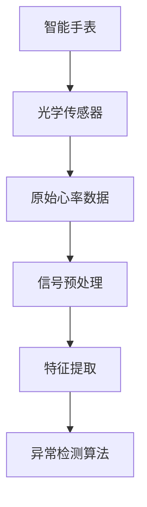
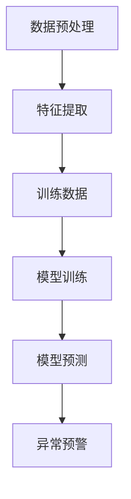
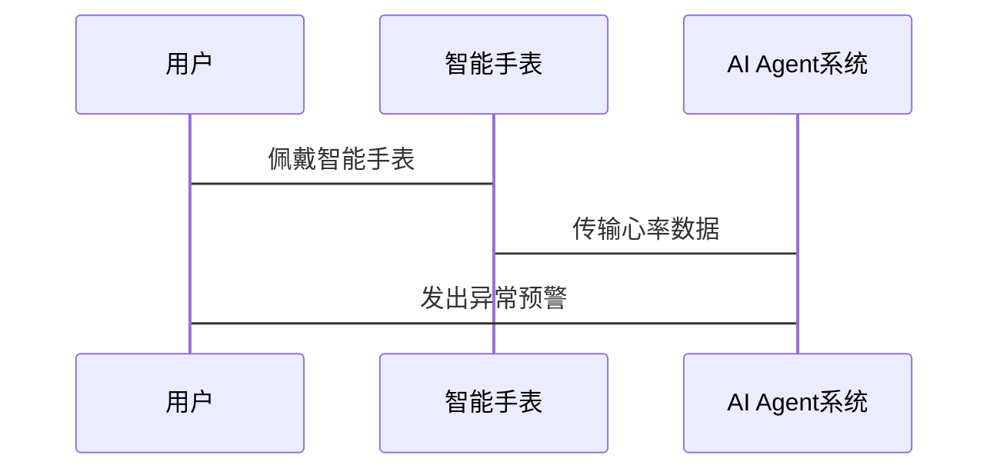

                 


# AI Agent在智能手表中的心律失常预警系统

## 关键词：AI Agent，智能手表，心律失常，预警系统，算法原理，系统架构

## 摘要：  
本文详细探讨了AI Agent在智能手表中用于心律失常预警系统的实现与应用。从问题背景、算法原理、系统架构到项目实战，全面分析了该系统的构建过程和实际应用价值。通过结合AI技术与智能手表的实时监测能力，提出了一个高效、准确的心律失常预警解决方案，为医疗健康领域的人工智能应用提供了新的思路。

---

# 第3章: AI Agent与心律失常预警系统的算法原理

## 3.1 数据流处理流程

### 3.1.1 数据采集与预处理
- 心率数据通过智能手表的光学传感器采集，信号经过滤波、降噪处理。
- 数据流处理的流程如下：


### 3.1.2 特征提取
- 从心率数据中提取关键特征，如心率变异性（HRV）、最大心率、最小心率、平均心率等。
- 使用滑动窗口技术，计算每个窗口内的统计特征，为后续的异常检测提供输入。

## 3.2 异常检测算法实现

### 3.2.1 算法选择
- 采用基于机器学习的分类算法，如支持向量机（SVM）或随机森林（Random Forest）。
- 选择这些算法的原因在于它们在处理小规模数据时表现良好，且易于优化。

### 3.2.2 算法流程


### 3.2.3 数学模型
- 心律失常的分类模型基于支持向量机（SVM）实现，数学模型如下：
  $$ y = \text{sign}(w \cdot x + b) $$
  其中，$w$ 是权重向量，$x$ 是输入特征向量，$b$ 是偏置项。

## 3.3 算法实现的Python代码

```python
import numpy as np
from sklearn import svm
from sklearn.model_selection import train_test_split
from sklearn.metrics import accuracy_score

# 示例数据集：心律数据，其中标签为0（正常）或1（异常）
X = np.array([[60, 70, 65, 75], [70, 65, 75, 80], [80, 85, 90, 95], [95, 90, 85, 80]])
y = np.array([0, 0, 1, 1])

# 划分训练集和测试集
X_train, X_test, y_train, y_test = train_test_split(X, y, test_size=0.25)

# 初始化SVM模型
model = svm.SVC()

# 模型训练
model.fit(X_train, y_train)

# 模型预测
y_pred = model.predict(X_test)

# 模型评估
print("Accuracy:", accuracy_score(y_test, y_pred))
```

---

# 第4章: AI Agent与心律失常预警系统的系统分析与架构设计

## 4.1 系统架构设计

### 4.1.1 分层架构
- 系统分为数据采集层、数据处理层和预警层：
  ```mermaid
  layered
  第一层: 数据采集层
  第二层: 数据处理层
  第三层: 预警层
  ```

### 4.1.2 关键模块
- **数据采集模块**：负责从智能手表获取心率数据。
- **数据处理模块**：进行数据预处理和特征提取。
- **预警模块**：运行异常检测算法，并根据结果触发预警。

## 4.2 系统接口设计

### 4.2.1 接口描述
- **输入接口**：接收心率数据流。
- **输出接口**：发送异常预警信号。

### 4.2.2 接口交互流程


---

# 第5章: AI Agent与心律失常预警系统的项目实战

## 5.1 环境搭建

### 5.1.1 工具安装
- 安装Python、NumPy、scikit-learn等库：
  ```bash
  pip install numpy scikit-learn
  ```

## 5.2 核心代码实现

### 5.2.1 数据采集与处理
```python
import numpy as np
import pandas as pd
from sklearn.preprocessing import StandardScaler

# 数据采集（模拟）
data = pd.DataFrame({
    '时间': range(100),
    '心率': np.random.normal(70, 5, 100)
})
```

### 5.2.2 模型训练与部署
```python
from sklearn.neighbors import KNeighborsClassifier

# 特征工程
X = data[['时间', '心率']]
y = data['心率'] > 75

# 划分数据集
X_train, X_test, y_train, y_test = train_test_split(X, y, test_size=0.25)

# 标准化处理
scaler = StandardScaler()
X_train_scaled = scaler.fit_transform(X_train)
X_test_scaled = scaler.transform(X_test)

# 模型训练
model = KNeighborsClassifier(n_neighbors=3)
model.fit(X_train_scaled, y_train)

# 预测与评估
y_pred = model.predict(X_test_scaled)
print("准确率:", accuracy_score(y_test, y_pred))
```

## 5.3 实际案例分析

### 5.3.1 数据分析
- 分析心率数据中的异常点，例如心率突然升高或降低的情况。

### 5.3.2 模型评估
- 通过混淆矩阵、精确率、召回率等指标评估模型的性能。

---

# 第6章: AI Agent与心律失常预警系统的最佳实践

## 6.1 总结
- AI Agent在心律失常预警系统中的应用显著提高了检测的准确性和及时性。
- 该系统能够帮助用户及时发现潜在的心脏问题，降低健康风险。

## 6.2 注意事项
- 数据隐私保护至关重要，需确保心率数据的安全传输与存储。
- 系统的准确性和可靠性直接影响用户体验，需进行充分的测试和优化。

## 6.3 未来展望
- 引入更多的生理指标，如血压、血氧饱和度等，提升预警系统的全面性。
- 结合边缘计算技术，进一步提升系统的实时性和响应速度。

---

# 第7章: AI Agent与心律失常预警系统的总结与展望

## 7.1 总结
- 本文详细探讨了AI Agent在智能手表中用于心律失常预警系统的实现与应用。
- 通过系统的构建过程和实际案例分析，展示了该技术在医疗健康领域的巨大潜力。

## 7.2 展望
- 随着人工智能技术的不断进步，心律失常预警系统将更加智能化、个性化。
- 未来的系统可能会集成更多的健康监测功能，为用户提供全方位的健康保障。

---

**注意事项**：
- 本文内容基于假设场景，实际应用需结合具体医疗规范和伦理要求。
- 系统的实际部署需遵循相关法律法规，确保数据安全和用户隐私。

通过以上章节的详细阐述，读者可以全面了解AI Agent在智能手表中的心律失常预警系统的构建过程、技术原理和实际应用。

