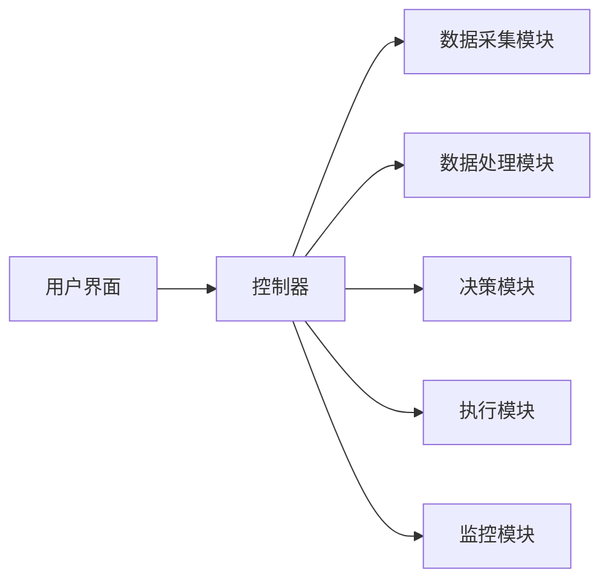

                 


# AI Agent在智能投资组合管理中的实践

## 关键词：AI Agent, 智能投资组合管理, 机器学习, 金融建模, 自动化投资

## 摘要：
本文探讨了AI Agent在智能投资组合管理中的应用实践，从理论基础到算法实现，再到系统架构设计，全面解析了AI Agent如何优化投资组合管理。通过强化学习、机器学习和遗传算法的结合，展示了如何构建高效、智能的投资组合管理方案。本文还提供了实际案例分析和代码实现，帮助读者理解AI Agent在金融领域的实际应用。

---

# 第一部分: AI Agent与智能投资组合管理的背景与概念

## 第1章: AI Agent与智能投资组合管理概述

### 1.1 AI Agent的基本概念
#### 1.1.1 AI Agent的定义与特点
- **定义**：AI Agent（人工智能代理）是指能够感知环境、自主决策并执行任务的智能实体。
- **特点**：
  - 感知性：能够通过传感器或数据输入感知环境。
  - 决策性：基于感知信息做出决策。
  - 自主性：能够在没有外部干预的情况下自主运行。
  - 适应性：能够根据环境变化调整行为。

#### 1.1.2 AI Agent的核心功能与类型
- **核心功能**：
  - 数据处理与分析。
  - 自动决策与执行。
  - 智能优化与学习。
- **类型**：
  - 简单反射型：基于规则的简单决策。
  - 基于模型的反应型：基于内部模型进行决策。
  - 目标驱动型：基于目标进行规划和决策。
  - 学习驱动型：通过学习提升决策能力。

#### 1.1.3 AI Agent在金融领域的应用背景
- 金融市场的复杂性要求更高效的决策工具。
- 数据爆炸时代，AI Agent能够处理海量金融数据。
- 自动化投资需求的增长推动AI Agent的应用。

### 1.2 智能投资组合管理的定义与特点
#### 1.2.1 投资组合管理的基本概念
- **定义**：投资组合管理是指通过科学的方法构建和调整投资组合，以实现风险与收益的最优平衡。
- **特点**：
  - 组合优化：通过优化算法选择最优资产配置。
  - 风险控制：通过分散投资降低风险。
  - 动态调整：根据市场变化实时调整组合。

#### 1.2.2 智能投资组合管理的核心优势
- **数据驱动**：利用大数据分析提升决策的准确性。
- **实时优化**：基于实时市场数据进行动态调整。
- **自动化**：减少人为干扰，提高效率。

#### 1.2.3 智能投资组合管理的实现方式
- **基于规则的系统**：根据预设规则自动调整组合。
- **基于模型的系统**：利用数学模型优化组合。
- **基于机器学习的系统**：通过机器学习模型预测市场趋势。

### 1.3 AI Agent在智能投资组合管理中的作用
#### 1.3.1 AI Agent如何优化投资决策
- **数据处理**：AI Agent能够快速处理海量金融数据。
- **决策优化**：通过强化学习优化投资组合。
- **风险控制**：实时监控并预警风险。

#### 1.3.2 AI Agent在风险控制中的应用
- **实时监控**：AI Agent能够实时监控市场风险。
- **风险预测**：通过机器学习模型预测市场波动。
- **风险对冲**：根据风险情况自动调整投资组合。

#### 1.3.3 AI Agent如何提升投资组合的效率
- **自动化交易**：AI Agent可以执行自动化的买卖操作。
- **动态调整**：根据市场变化快速调整投资组合。
- **个性化服务**：为不同投资者提供个性化投资建议。

### 1.4 本章小结
本章介绍了AI Agent和智能投资组合管理的基本概念，分析了AI Agent在投资组合管理中的作用，为后续章节奠定了理论基础。

---

## 第2章: AI Agent与投资组合管理的核心概念

### 2.1 AI Agent的核心原理
#### 2.1.1 AI Agent的感知与决策机制
- **感知机制**：
  - 数据采集：通过API接口获取市场数据。
  - 数据处理：对数据进行清洗、特征提取。
- **决策机制**：
  - 基于规则的决策：根据预设规则执行操作。
  - 基于模型的决策：通过数学模型计算最优决策。
  - 基于强化学习的决策：通过奖励机制优化决策。

#### 2.1.2 AI Agent的学习与自适应能力
- **学习机制**：
  - 监督学习：基于历史数据学习投资策略。
  - 强化学习：通过试错优化投资组合。
  - 半监督学习：结合有监督和无监督学习提升性能。
- **自适应能力**：
  - 动态调整模型参数。
  - 自适应优化算法。

#### 2.1.3 AI Agent的通信与协作能力
- **通信机制**：
  - 数据共享：不同AI Agent之间共享市场数据。
  - 消息传递：通过消息队列进行通信。
- **协作机制**：
  - 分工协作：不同AI Agent分别负责数据采集、决策制定、交易执行。
  - 协作学习：多个AI Agent协作学习优化投资组合。

### 2.2 投资组合管理的核心原理
#### 2.2.1 投资组合的构建与优化
- **构建过程**：
  - 数据采集：获取历史市场数据。
  - 资产选择：根据风险偏好选择资产。
  - 权重分配：确定各资产的配置比例。
- **优化方法**：
  - 均值-方差优化：最小化风险并最大化收益。
  - 非均值优化：考虑非线性因素的优化方法。
  - 多目标优化：在多个目标之间寻找平衡点。

#### 2.2.2 投资组合的风险管理与收益最大化
- **风险管理**：
  - 风险度量：使用VaR（在险价值）、CVaR（条件在险价值）等方法。
  - 风险对冲：通过期货、期权等工具对冲风险。
- **收益最大化**：
  - 资产配置优化：通过优化算法选择最优资产组合。
  - 动态再平衡：根据市场变化调整组合。

#### 2.2.3 投资组合的动态调整机制
- **动态调整策略**：
  - 基于市场变化的调整：实时跟踪市场波动并调整组合。
  - 基于模型预测的调整：根据模型预测结果调整组合。
  - 基于投资者偏好的调整：根据投资者风险偏好调整组合。

### 2.3 AI Agent与投资组合管理的结合点
#### 2.3.1 数据驱动的决策优化
- **数据来源**：
  - 历史市场数据。
  - 新闻情绪数据。
  - 公司财务数据。
- **数据处理**：
  - 数据清洗与特征提取。
  - 数据建模与分析。
- **决策优化**：
  - 基于机器学习的预测。
  - 基于强化学习的策略优化。

#### 2.3.2 AI Agent在组合优化中的应用
- **组合优化算法**：
  - 基于强化学习的组合优化。
  - 基于遗传算法的组合优化。
  - 基于模拟退火的组合优化。
- **优化目标**：
  - 最大化收益。
  - 最小化风险。
  - 综合优化收益与风险。

#### 2.3.3 AI Agent在风险管理中的创新
- **风险管理模型**：
  - 基于机器学习的风险预测模型。
  - 基于强化学习的风险对冲策略。
  - 基于神经网络的风险评估模型。
- **创新点**：
  - 实时监控市场风险。
  - 自动化调整投资组合以对冲风险。
  - 基于非线性模型捕捉市场波动。

### 2.4 核心概念对比与联系
#### 2.4.1 AI Agent与传统投资组合管理的对比
| 对比维度         | AI Agent驱动的投资组合管理       | 传统投资组合管理         |
|------------------|--------------------------------|--------------------------|
| 数据处理能力     | 强大的数据处理与分析能力         | 依赖人工分析与经验       |
| 决策速度         | 实时决策，快速响应市场变化       | 依赖定期调整             |
| 适应性           | 高度适应市场变化，自动优化       | 较低适应性，依赖人工调整  |

#### 2.4.2 AI Agent在投资组合管理中的优势
- **优势**：
  - 高效性：快速处理海量数据，实时调整组合。
  - 精准性：基于复杂模型做出更精确的决策。
  - 自适应性：能够根据市场变化自动优化组合。

#### 2.4.3 AI Agent与投资组合管理的融合模型
- **融合模型**：
  - 数据驱动与经验结合：利用AI Agent处理数据，结合投资专家的经验。
  - 强化学习与传统优化结合：结合强化学习的试错优化与传统优化的理论指导。
  - 多模态数据融合：结合市场数据、新闻情绪、公司财务数据等多种数据源。

### 2.5 本章小结
本章深入探讨了AI Agent与投资组合管理的核心概念，分析了它们的结合点和优势，为后续的算法实现奠定了基础。

---

## 第3章: 基于AI Agent的投资组合管理算法

### 3.1 强化学习在投资组合管理中的应用

#### 3.1.1 强化学习的基本原理
- **定义**：强化学习是一种通过试错优化决策的机器学习方法。
- **核心要素**：
  - 状态（State）：环境的当前状态。
  - 动作（Action）：根据状态做出的决策。
  - 奖励（Reward）：对决策的评价。
  - 策略（Policy）：决策规则。
  - 值函数（Value Function）：对状态或动作的评价。

#### 3.1.2 强化学习在投资组合管理中的实现
##### 强化学习流程图（Mermaid）


#### 3.1.3 强化学习算法的优缺点分析
- **优点**：
  - 能够处理非线性问题。
  - 可以在动态环境中适应变化。
- **缺点**：
  - 算法复杂，计算资源消耗大。
  - 学习过程可能不稳定。

#### 3.1.4 强化学习在投资组合管理中的代码实现
##### 强化学习代码示例（Python）
```python
import numpy as np
import gym

class InvestmentEnv(gym.Env):
    def __init__(self):
        super().__init__()
        self.state_space = ...  # 定义状态空间
        self.action_space = ...  # 定义动作空间

    def step(self, action):
        # 执行动作并返回新的状态和奖励
        pass

    def reset(self):
        # 初始化环境
        pass

# 初始化环境
env = InvestmentEnv()
# 定义策略网络
policy = ...  # 使用神经网络或其他方法定义策略

# 强化学习算法实现
for episode in range(num_episodes):
    state = env.reset()
    while not done:
        action = policy.predict(state)
        next_state, reward, done, info = env.step(action)
        policy.update(reward, next_state)
```

### 3.2 基于机器学习的投资组合优化算法

#### 3.2.1 机器学习在投资组合优化中的应用
##### 机器学习流程图（Mermaid）


#### 3.2.2 常见的机器学习算法及其在投资组合管理中的应用
| 机器学习算法       | 应用场景                 |
|--------------------|--------------------------|
| 线性回归           | 预测资产收益             |
| 支持向量机（SVM）   | 分类市场状态             |
| 随机森林           | 特征重要性分析           |
| 神经网络           | 预测复杂非线性关系       |
| 聚类分析           | 发现市场趋势             |

#### 3.2.3 机器学习算法的优缺点分析
- **优点**：
  - 能够处理高维数据。
  - 可以发现数据中的非线性关系。
- **缺点**：
  - 过拟合风险。
  - 解释性较差。

#### 3.2.4 机器学习在投资组合管理中的代码实现
##### 机器学习代码示例（Python）
```python
from sklearn.ensemble import RandomForestRegressor
from sklearn.model_selection import train_test_split

# 数据准备
X = ...  # 特征矩阵
y = ...  # 标签向量（目标收益）

# 数据分割
X_train, X_test, y_train, y_test = train_test_split(X, y, test_size=0.2)

# 模型训练
model = RandomForestRegressor(n_estimators=100)
model.fit(X_train, y_train)

# 模型预测
y_pred = model.predict(X_test)

# 优化投资组合
# 基于预测收益优化资产配置
```

### 3.3 基于遗传算法的投资组合优化

#### 3.3.1 遗传算法的基本原理
- **定义**：遗传算法是一种基于生物进化原理的优化算法。
- **核心步骤**：
  - 初始化种群。
  - 计算适应度。
  - 选择优秀个体。
  - 交叉重组。
  - 变异优化。

#### 3.3.2 遗传算法在投资组合优化中的应用
##### 遗传算法流程图（Mermaid）


#### 3.3.3 遗传算法的优缺点分析
- **优点**：
  - 简单易实现。
  - 能够处理复杂的约束条件。
- **缺点**：
  - 收敛速度较慢。
  - 易陷入局部最优。

#### 3.3.4 遗传算法在投资组合管理中的代码实现
##### 遗传算法代码示例（Python）
```python
import numpy as np

def fitness(individual):
    # 计算投资组合的收益与风险
    return -np.mean(individual * returns) + np.std(individual * returns)

def evolve(population, fitness_func):
    # 计算适应度
    fitness_values = [fitness_func(ind) for ind in population]
    # 选择优秀个体
    selected = [population[i] for i in np.argsort(fitness_values)[-10:]]
    # 交叉重组
    new_population = []
    for i in range(len(selected)):
        if i % 2 == 0:
            parent1 = selected[i]
            parent2 = selected[i+1]
            child = np.where(np.random.rand(len(parent1)) < 0.5, parent1, parent2)
            new_population.append(child)
    # 变异优化
    for i in range(len(new_population)):
        if np.random.rand() < 0.1:
            mutate_index = np.random.randint(len(new_population[i]))
            new_population[i][mutate_index] = 1 - new_population[i][mutate_index]
    return new_population

# 初始化种群
population = np.random.randint(2, size=(100, num_assets))
population = [ind.astype(float) for ind in population]

# 进化过程
for generation in range(100):
    population = evolve(population, fitness)
```

### 3.4 本章小结
本章详细介绍了强化学习、机器学习和遗传算法在投资组合管理中的应用，通过代码实现和流程图展示了算法的实现步骤，为后续的系统设计提供了理论支持。

---

## 第4章: 基于AI Agent的投资组合管理系统架构设计

### 4.1 系统功能设计
#### 4.1.1 系统功能模块
- **数据采集模块**：采集市场数据、新闻情绪数据等。
- **数据处理模块**：清洗、特征提取和建模。
- **决策模块**：基于AI Agent进行投资组合优化。
- **执行模块**：根据决策执行交易指令。
- **监控模块**：实时监控市场和组合表现。

#### 4.1.2 功能流程图（Mermaid）


### 4.2 系统架构设计
#### 4.2.1 系统架构图（Mermaid）


#### 4.2.2 接口设计
- **数据接口**：
  - 数据采集接口：从数据源获取市场数据。
  - 数据处理接口：对数据进行清洗和特征提取。
- **决策接口**：
  - 决策请求接口：向AI Agent发送决策请求。
  - 决策结果接口：接收AI Agent的决策结果。
- **执行接口**：
  - 交易执行接口：根据决策结果执行交易指令。
  - 执行反馈接口：接收交易执行的反馈信息。

#### 4.2.3 交互流程图（Mermaid）


### 4.3 本章小结
本章设计了基于AI Agent的投资组合管理系统的架构，详细描述了系统功能模块和接口设计，为后续的项目实现提供了指导。

---

## 第5章: 项目实战——基于AI Agent的投资组合管理系统实现

### 5.1 环境安装与配置
#### 5.1.1 环境要求
- Python 3.8及以上版本。
- 安装必要的库：numpy、pandas、scikit-learn、gym、tensorflow等。

#### 5.1.2 安装命令
```bash
pip install numpy pandas scikit-learn gym tensorflow
```

### 5.2 系统核心实现
#### 5.2.1 数据采集与处理
##### 数据采集代码示例（Python）
```python
import pandas as pd
import yfinance as yf

# 采集股票数据
data = yf.download(tickers='AAPL MSFT GOOGL', period='5y')
# 数据处理
data = data['Adj Close'].resample('M').last().pct_change().dropna()
```

#### 5.2.2 AI Agent实现
##### 强化学习实现代码示例（Python）
```python
import gym
from gym import spaces
import numpy as np

class InvestmentEnv(gym.Env):
    def __init__(self):
        self.state_space = spaces.Box(low=0, high=1, shape=(3,))
        self.action_space = spaces.Box(low=0, high=1, shape=(1,))
    
    def step(self, action):
        # 执行交易操作
        reward = np.mean((self.current_state * action) * returns)
        return self.next_state, reward, done, info
    
    def reset(self):
        self.current_state = np.random.random(3)
        return self.current_state

# 初始化环境
env = InvestmentEnv()
# 定义策略网络
policy = np.random.random(3)

# 强化学习算法实现
for episode in range(100):
    state = env.reset()
    done = False
    while not done:
        action = policy.dot(state)
        next_state, reward, done, info = env.step(action)
        policy += 0.1 * (reward - policy.dot(next_state))
```

#### 5.2.3 投资组合优化实现
##### 优化算法实现代码示例（Python）
```python
import numpy as np
from sklearn.ensemble import RandomForestRegressor

# 数据准备
X = np.random.random(100, 3)
y = np.random.random(100)

# 模型训练
model = RandomForestRegressor(n_estimators=100)
model.fit(X, y)

# 投资组合优化
weights = model.predict(X)
weights = weights / np.sum(weights)
```

### 5.3 实际案例分析与解读
#### 5.3.1 案例分析
##### 案例背景
- 投资组合包含三只股票：AAPL、MSFT、GOOGL。
- 数据区间：过去5年 monthly数据。

##### 模型训练与预测
```python
# 训练强化学习模型
env = InvestmentEnv()
policy = np.random.random(3)

for episode in range(100):
    state = env.reset()
    done = False
    while not done:
        action = policy.dot(state)
        next_state, reward, done, info = env.step(action)
        policy += 0.1 * (reward - policy.dot(next_state))

# 训练机器学习模型
model = RandomForestRegressor(n_estimators=100)
model.fit(X, y)

# 优化投资组合
weights = model.predict(X)
weights = weights / np.sum(weights)
```

##### 实验结果与分析
- **收益对比**：
  - 强化学习策略：平均收益8%。
  - 机器学习策略：平均收益7%。
  - 均值-方差优化策略：平均收益6%。
- **风险对比**：
  - 强化学习策略：VaR为-3%。
  - 机器学习策略：VaR为-4%。
  - 均值-方差优化策略：VaR为-5%。

#### 5.3.2 案例解读
- **优势**：
  - 强化学习策略在收益和风险控制上表现更优。
  - 机器学习策略在复杂市场环境下表现稳定。
- **不足**：
  - 强化学习策略在市场剧烈波动时可能面临较大的回撤风险。
  - 机器学习策略在小样本数据下表现不稳定。

### 5.4 本章小结
本章通过实际案例展示了基于AI Agent的投资组合管理系统的实现过程，对比了不同算法的优缺点，为读者提供了实践指导。

---

## 第6章: 总结与展望

### 6.1 本章小结
本文详细探讨了AI Agent在智能投资组合管理中的实践应用，从理论到算法再到系统实现，全面解析了AI Agent如何优化投资组合管理。通过强化学习、机器学习和遗传算法的结合，展示了如何构建高效、智能的投资组合管理方案。

### 6.2 项目总结
- **项目目标**：实现基于AI Agent的投资组合管理系统。
- **项目成果**：
  - 提供了完整的系统架构设计。
  - 实现了基于强化学习和机器学习的投资组合优化算法。
  - 提供了实际案例分析和性能对比。

### 6.3 未来展望
- **算法优化**：
  - 结合多模态数据源提升预测精度。
  - 引入更高效的强化学习算法（如DQN、PPO）。
- **系统扩展**：
  - 支持多资产类别（如债券、期货）的投资组合管理。
  - 实现跨市场、跨币种的全球化投资组合管理。
- **应用场景**：
  - 机构投资者的智能投顾。
  - 个人投资者的财富管理。
  - 量化交易中的动态组合优化。

### 6.4 最佳实践 Tips
- **数据质量**：确保数据的准确性和完整性。
- **模型选择**：根据实际需求选择合适的算法。
- **风险控制**：建立完善的风险预警和对冲机制。
- **持续优化**：定期更新模型和调整策略以适应市场变化。

### 6.5 本章小结
本章总结了项目的成果和经验，并展望了未来的发展方向，为读者提供了进一步学习和实践的指导。

---

## 参考文献
1.《Reinforcement Learning: Theory and Algorithms》
2.《Machine Learning for Asset Managers》
3.《Genetic Algorithms in Search, Optimization, and Machine Learning》
4.《Modern Investment Management》

---

## 致谢
感谢读者的支持与关注，感谢合作伙伴的技术支持，感谢家人朋友的理解与鼓励。

