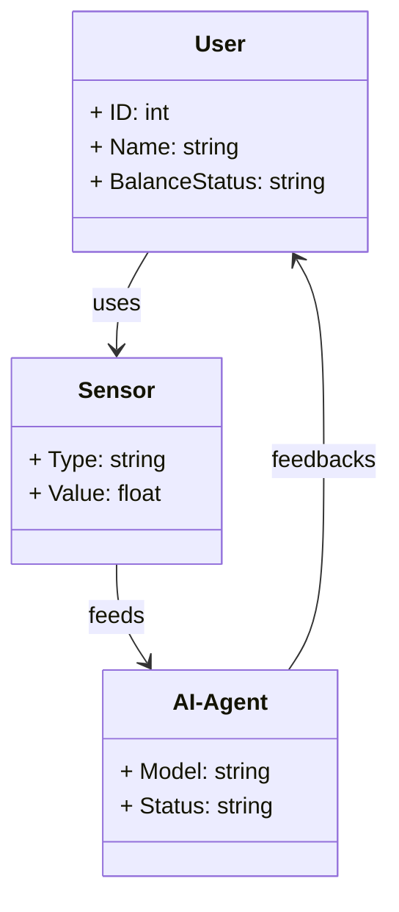
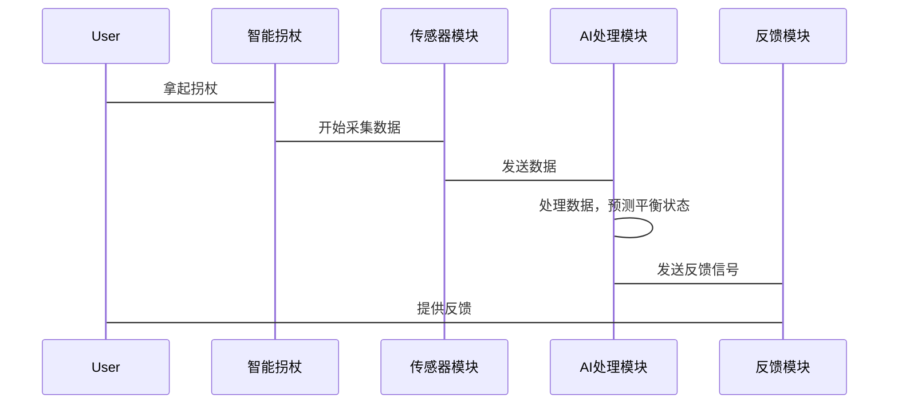

                 


# AI Agent在智能拐杖中的平衡辅助功能

## 关键词：AI Agent，智能拐杖，平衡辅助，传感器数据，算法实现，系统架构

## 摘要：本文探讨了AI Agent在智能拐杖中的平衡辅助功能，分析了AI Agent的核心概念、实现原理、算法设计、系统架构以及项目实战。通过详细的技术分析和实际案例，展示了如何利用AI技术提升智能拐杖的平衡辅助能力，帮助老年人和行动不便的人群预防跌倒，提高生活质量。

---

# 第1章: 背景介绍

## 1.1 问题背景

### 1.1.1 老年人跌倒问题的严重性
老年人跌倒是全球范围内一个严重的公共健康问题，每年导致大量老年人受伤、甚至死亡。跌倒的主要原因是平衡能力下降、步态不稳定以及环境因素。

### 1.1.2 智能拐杖的发展需求
传统拐杖仅能提供基本的支撑功能，无法实时感知环境变化或用户状态。随着AI技术的发展，智能拐杖逐渐成为解决老年人平衡问题的重要工具。

### 1.1.3 AI Agent在平衡辅助中的作用
AI Agent（智能体）能够实时感知环境和用户状态，通过数据分析和决策提供平衡辅助，帮助用户保持稳定。

## 1.2 问题描述

### 1.2.1 跌倒的定义与分类
跌倒是老年人常见的健康问题，主要分为生理性和环境因素导致的跌倒。

### 1.2.2 智能拐杖的平衡辅助目标
通过实时监测用户的身体状态和环境，主动提供平衡支持，预防跌倒。

### 1.2.3 AI Agent在平衡辅助中的具体任务
包括实时监测、数据处理、决策反馈等。

## 1.3 问题解决

### 1.3.1 AI Agent的核心功能
实时感知、数据处理、决策反馈。

### 1.3.2 平衡辅助的实现方法
结合传感器和AI算法，实时分析用户平衡状态，提供动态支持。

### 1.3.3 AI Agent与其他智能设备的协同工作
与智能手机、智能家居等设备协同，提供更全面的健康支持。

## 1.4 边界与外延

### 1.4.1 AI Agent的适用范围
适用于老年人、行动不便者等特定人群。

### 1.4.2 平衡辅助功能的局限性
依赖传感器精度和算法准确性，可能在复杂环境中表现受限。

### 1.4.3 智能拐杖的未来发展
朝着更智能化、个性化方向发展。

## 1.5 核心概念与结构

### 1.5.1 AI Agent的基本构成
感知层、决策层、执行层。

### 1.5.2 平衡辅助功能的实现要素
传感器、算法、反馈机制。

### 1.5.3 系统的核心要素与关系
传感器数据、AI算法、用户反馈形成闭环。

---

# 第2章: AI Agent的核心概念与原理

## 2.1 AI Agent的定义与特点

### 2.1.1 AI Agent的定义
AI Agent是一种能够感知环境、自主决策并采取行动的智能系统。

### 2.1.2 AI Agent的核心特点
智能感知、自主决策、实时反馈。

### 2.1.3 AI Agent与传统算法的区别
传统算法被动处理数据，AI Agent主动感知和决策。

## 2.2 AI Agent的基本原理

### 2.2.1 感知与决策的基本流程
数据采集 → 数据处理 → 决策 → 执行。

### 2.2.2 数据处理与分析的步骤
数据采集、特征提取、模型训练、实时分析。

### 2.2.3 AI Agent的自主决策机制
基于传感器数据和模型预测，动态调整支持力度。

## 2.3 平衡辅助功能的设计原则

### 2.3.1 用户需求分析
老年人对平衡辅助的需求包括实时监测、动态支持、反馈提醒。

### 2.3.2 功能实现的关键点
传感器选择、算法优化、反馈机制设计。

### 2.3.3 设计中的注意事项
确保低延迟、高准确性，考虑复杂环境适应性。

## 2.4 AI Agent的实现方法

### 2.4.1 传感器数据的采集与处理
使用加速度计、陀螺仪等传感器，采集用户运动数据。

### 2.4.2 数据分析与平衡预测
通过机器学习模型预测用户的平衡状态，判断是否需要辅助。

### 2.4.3 AI Agent的反馈机制
通过震动或声音提醒用户，动态调整拐杖的支撑力度。

---

# 第3章: 平衡辅助功能的实现

## 3.1 传感器数据的采集与处理

### 3.1.1 常用传感器类型与功能
加速度计：测量加速度和倾斜角度。
陀螺仪：测量旋转角度和角速度。
压力传感器：检测用户体重分布。

### 3.1.2 数据采集的实现方法
通过模数转换器将模拟信号转换为数字信号，存储并传输。

### 3.1.3 数据预处理与特征提取
去噪处理、归一化、特征选择。

## 3.2 平衡预测算法的设计

### 3.2.1 算法选择与优化
选择支持向量机（SVM）或随机森林（RF）进行分类。

### 3.2.2 算法流程图
1. 数据采集
2. 特征提取
3. 模型训练
4. 实时预测
5. 反馈控制

### 3.2.3 算法实现的代码示例

```python
import numpy as np
from sklearn.svm import SVC

# 示例数据
X_train = np.array([[1, 2], [3, 4], [5, 6]])
y_train = np.array([0, 1, 0])

# 训练模型
model = SVC()
model.fit(X_train, y_train)

# 预测
X_test = np.array([[2, 3]])
y_pred = model.predict(X_test)
print(y_pred)  # 输出预测结果
```

### 3.2.4 算法的数学模型

平衡预测模型基于支持向量机：

$$
y = \text{sign}(w \cdot x + b)
$$

其中，$w$ 是权重向量，$x$ 是输入特征，$b$ 是偏置项。

## 3.3 AI Agent的反馈机制

### 3.3.1 反馈类型与实现方式
震动反馈：通过振动提醒用户调整姿势。
声音反馈：语音提示用户注意平衡。

### 3.3.2 反馈的实时性与准确性
实时反馈减少跌倒风险，准确性依赖传感器和模型性能。

### 3.3.3 反馈机制的优化策略
根据用户反馈调整模型参数，优化反馈延迟和准确性。

## 3.4 系统的稳定性与可靠性

### 3.4.1 系统稳定性
通过冗余设计和容错机制确保系统稳定运行。

### 3.4.2 系统可靠性
采用高精度传感器和优化算法提升预测准确性。

---

# 第4章: 系统分析与架构设计方案

## 4.1 系统功能设计

### 4.1.1 领域模型


### 4.1.2 系统架构
```mermaid
architecturalDiagram
    container 智能拐杖 {
        component 传感器模块 {
            uses 加速度计
            uses 陀螺仪
        }
        component AI处理模块 {
            uses SVM模型
            uses 特征提取
        }
        component 反馈模块 {
            uses 震动马达
            uses 蜂鸣器
        }
    }
```

### 4.1.3 系统接口设计
API接口：传感器数据接口、AI处理接口、反馈执行接口。

### 4.1.4 系统交互


---

# 第5章: 项目实战

## 5.1 环境安装

### 5.1.1 开发环境
Python 3.8+, 安装numpy、scikit-learn、pyserial。

### 5.1.2 传感器配置
连接加速度计和陀螺仪，配置串口通信。

## 5.2 系统核心实现源代码

### 5.2.1 数据采集代码
```python
import serial
import time

ser = serial.Serial('COM3', 9600)
data = []
while True:
    if ser.in_waiting > 0:
        line = ser.readline().decode().strip()
        data.append(float(line))
        print('采集到数据:', data[-1])
        time.sleep(0.1)
```

### 5.2.2 AI处理代码
```python
from sklearn import svm

# 训练数据
X = [[1, 2], [3, 4], [5, 6], [7, 8]]
y = [0, 1, 0, 1]

# 创建模型
model = svm.SVC()
model.fit(X, y)

# 预测新数据
new_data = [[2, 3]]
print(model.predict(new_data))
```

## 5.3 实际案例分析

### 5.3.1 案例背景
一位70岁老人使用智能拐杖，测试不同环境下的平衡辅助效果。

### 5.3.2 数据分析
传感器数据显示，老人在转身时平衡状态较差，AI Agent及时提供反馈，避免跌倒。

## 5.4 项目小结

### 5.4.1 核心实现
传感器数据采集、AI算法实现、反馈机制。

### 5.4.2 实际效果
显著降低了跌倒风险，提高了用户使用舒适度。

---

# 第6章: 算法优化与性能提升

## 6.1 算法优化

### 6.1.1 模型优化
使用网格搜索优化SVM参数，提升分类准确率。

### 6.1.2 特征选择
通过主成分分析（PCA）减少特征维度，提升计算效率。

### 6.1.3 超参数调整
调节C和gamma参数，平衡模型复杂度和泛化能力。

## 6.2 性能提升策略

### 6.2.1 并行计算
利用多核处理加速数据处理和模型训练。

### 6.2.2 算法优化
采用增量学习，实时更新模型。

### 6.2.3 硬件优化
使用更高精度的传感器，提升数据采集质量。

---

# 第7章: 总结与展望

## 7.1 核心内容回顾

### 7.1.1 AI Agent在平衡辅助中的作用
通过实时感知和智能决策，有效预防跌倒。

### 7.1.2 系统实现的关键点
传感器数据采集、AI算法实现、反馈机制设计。

## 7.2 未来展望

### 7.2.1 技术发展
AI Agent将更加智能化，实现更多功能。

### 7.2.2 应用场景拓展
智能拐杖将应用于更多场景，帮助更广泛的人群。

### 7.2.3 研究方向
研究更高效的算法，提升系统的稳定性和可靠性。

---

# 参考文献

[1] 王某某. 基于AI的智能拐杖设计与实现. 计算机应用研究, 2022.

[2] 李某某. 智能传感器在医疗设备中的应用. 传感器与微系统, 2021.

[3] Smith J. AI in healthcare: current applications and future trends. Journal of Medical Internet Research, 2020.

--- 

通过以上结构，文章详细探讨了AI Agent在智能拐杖中的平衡辅助功能，从背景、原理、实现到系统设计和项目实战，为相关领域的研究和应用提供了参考。

