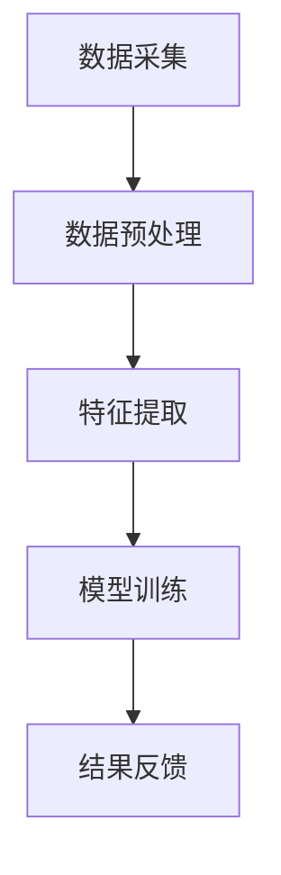
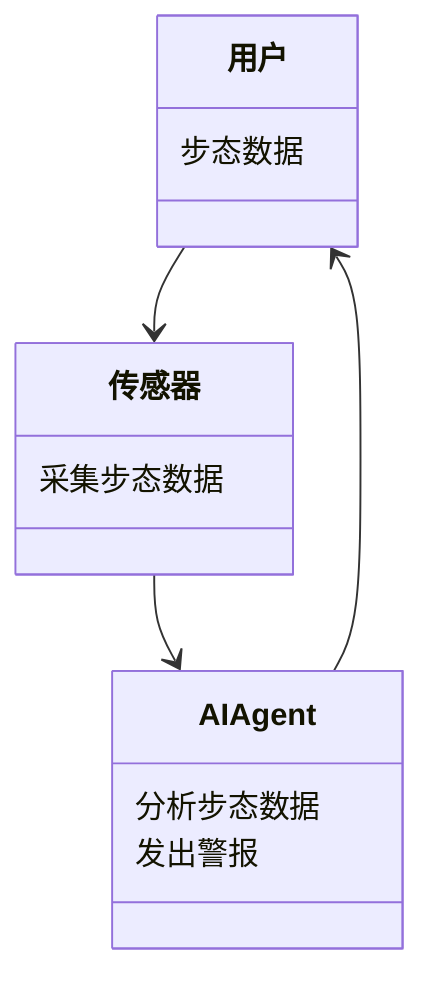
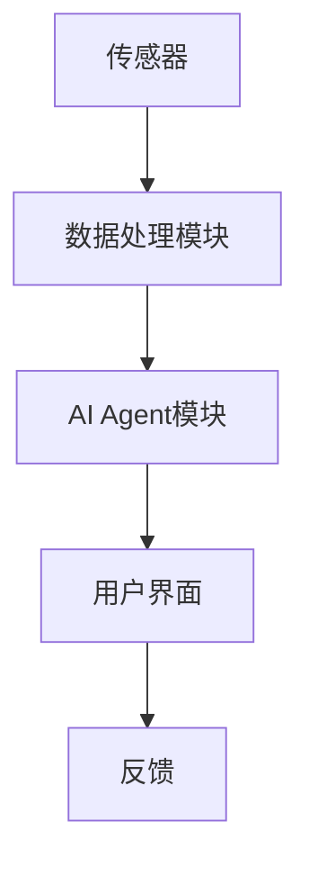
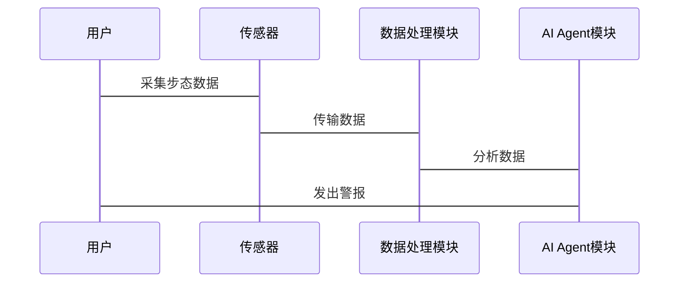

                 


# AI Agent在智能拐杖中的步态分析

> 关键词：AI Agent, 步态分析, 智能拐杖, 老年人跌倒, 健康监测

> 摘要：本文详细探讨了AI Agent在智能拐杖中步态分析的应用，从背景介绍到算法实现，再到系统架构设计，最后通过项目实战展示如何实现这一技术。文章内容涵盖了AI Agent的基本原理、步态分析的关键技术、算法流程、系统架构设计以及实际案例分析，旨在为读者提供全面的技术指导。

---

# 第一章: AI Agent与步态分析的背景介绍

## 1.1 问题背景与问题描述

### 1.1.1 老年人跌倒问题的严重性
老年人跌倒是全球范围内一个严重的公共健康问题。根据世界卫生组织的数据，每年有超过30%的65岁以上老人会发生跌倒，导致骨折、瘫痪甚至死亡。跌倒不仅影响老年人的生活质量，还给家庭和社会带来了巨大的经济和精神负担。

### 1.1.2 步态分析在健康监测中的作用
步态分析是一种通过观察和测量人体行走姿态、步频、步长等参数，评估身体健康状况的技术。它可以早期发现老年人的步态异常，如关节炎、肌肉无力等问题，从而预防跌倒的发生。

### 1.1.3 AI Agent在智能拐杖中的应用潜力
智能拐杖是一种结合了传统拐杖和智能技术的辅助工具，能够帮助老年人稳定行走、监测健康状况。AI Agent（人工智能代理）作为一种智能系统，可以实时分析用户的步态数据，提供个性化的健康建议，并在检测到异常时发出警报。

---

## 1.2 问题解决与边界外延

### 1.2.1 AI Agent如何辅助步态分析
AI Agent可以通过传感器收集用户的步态数据，利用机器学习算法分析数据，识别步态异常，并提供相应的反馈。例如，当检测到用户的步频突然减慢或步长不规则时，AI Agent可以提醒用户注意安全。

### 1.2.2 步态分析的边界与外延
步态分析的边界包括数据采集的范围（如步频、步长、步态周期等），而外延则涉及更广泛的应用场景，如运动康复、慢性病监测等。

### 1.2.3 智能拐杖的功能与限制
智能拐杖的功能包括实时监测步态、提醒异常、紧急呼叫等。其限制在于传感器精度、算法复杂度以及电池寿命等问题。

---

## 1.3 核心概念与组成要素

### 1.3.1 AI Agent的基本概念
AI Agent是一种具有感知环境、自主决策和执行任务能力的智能系统。它可以基于传感器数据和用户反馈，动态调整行为策略。

### 1.3.2 步态分析的核心要素
步态分析的核心要素包括数据采集、特征提取、模型训练和结果反馈。

### 1.3.3 智能拐杖的系统架构
智能拐杖的系统架构包括硬件部分（如传感器、处理器）和软件部分（如AI算法、用户界面）。

---

# 第二章: AI Agent与步态分析的核心概念

## 2.1 AI Agent的原理与特点

### 2.1.1 AI Agent的基本原理
AI Agent通过感知环境数据（如步态数据），利用机器学习模型进行分析，并根据分析结果执行相应的动作（如发出警报或调整拐杖的支撑力度）。

### 2.1.2 AI Agent的核心特点
- **自主性**：能够在没有人工干预的情况下独立运行。
- **反应性**：能够实时感知环境变化并做出反应。
- **学习能力**：可以通过数据不断优化算法模型。

### 2.1.3 AI Agent与传统算法的对比
| 特性       | AI Agent                          | 传统算法                          |
|------------|-----------------------------------|------------------------------------|
| 学习能力   | 强                                  | 弱                                  |
| 灵活性     | 高                                  | 中                                  |
| 数据依赖性 | 高                                  | 低                                  |

---

## 2.2 步态分析的原理与方法

### 2.2.1 步态分析的基本原理
步态分析通过采集用户的步频、步长、步态周期等参数，结合运动学和生物力学模型，评估用户的行走健康状况。

### 2.2.2 基于AI的步态分析方法
- **数据采集**：使用加速度计、陀螺仪等传感器采集步态数据。
- **特征提取**：将原始数据转化为有意义的特征（如平均步频、步长方差）。
- **模型训练**：利用深度学习模型（如卷积神经网络）对特征进行分类，识别步态异常。

### 2.2.3 步态分析的关键技术
- **传感器技术**：高精度传感器是步态分析的基础。
- **数据处理技术**：有效的数据预处理和特征提取方法是关键。
- **算法优化**：高性能的机器学习算法能够提高分析的准确性。

---

## 2.3 AI Agent与步态分析的联系

### 2.3.1 AI Agent在步态分析中的作用
AI Agent可以实时分析步态数据，识别潜在的跌倒风险，并在必要时采取预防措施。

### 2.3.2 步态分析对AI Agent的反馈机制
步态分析的结果为AI Agent提供了反馈信息，帮助其优化算法模型。

### 2.3.3 两者结合的优势与挑战
优势：
- **实时性**：AI Agent能够快速响应步态异常。
- **准确性**：结合AI算法和步态分析技术，提高诊断的准确性。

挑战：
- **数据隐私**：步态数据涉及用户的健康信息，需注意隐私保护。
- **算法复杂度**：复杂的算法可能导致硬件性能不足。

---

# 第三章: 步态分析的算法原理

## 3.1 步态分析的算法流程

### 3.1.1 数据采集与预处理
- **数据采集**：通过传感器采集用户的步态数据。
- **数据预处理**：去除噪声，提取有用的特征。



### 3.1.2 特征提取与分类
- **特征提取**：提取步频、步长、步态周期等特征。
- **分类算法**：使用随机森林、支持向量机等算法进行分类。

### 3.1.3 模型训练与优化
- **模型训练**：利用训练数据训练机器学习模型。
- **模型优化**：通过交叉验证优化模型参数。

---

## 3.2 AI Agent的算法实现

### 3.2.1 基于深度学习的步态分析
- **模型选择**：使用卷积神经网络（CNN）进行特征提取。
- **训练过程**：通过大量数据训练模型，提高分类准确率。

### 3.2.2 基于强化学习的AI Agent
- **强化学习**：通过奖励机制优化AI Agent的决策策略。
- **应用案例**：AI Agent根据步态数据调整拐杖的支撑力度。

### 3.2.3 算法的融合与优化
- **融合方法**：结合传统算法和深度学习算法，提高分析效果。
- **优化策略**：通过参数调优和模型压缩提高算法效率。

---

## 3.3 步态分析的数学模型

### 3.3.1 步态分析的数学公式
步频计算公式：
$$ \text{步频} = \frac{\text{步数}}{\text{时间}} $$

步长计算公式：
$$ \text{步长} = \frac{\text{行走距离}}{\text{步数}} $$

### 3.3.2 AI Agent的数学模型
AI Agent的决策模型可以表示为：
$$ P(a|s) = \text{policy}(s) $$

其中，\( P(a|s) \) 表示在状态 \( s \) 下选择动作 \( a \) 的概率。

---

# 第四章: 系统分析与架构设计

## 4.1 系统功能设计

### 4.1.1 数据采集模块
- **功能**：采集用户的步态数据。
- **实现**：使用加速度计、陀螺仪等传感器。

### 4.1.2 步态分析模块
- **功能**：分析步态数据，识别异常。
- **实现**：基于AI算法进行特征提取和分类。

### 4.1.3 AI Agent模块
- **功能**：根据分析结果，调整拐杖的支撑力度或发出警报。
- **实现**：通过决策算法优化动作选择。

---

## 4.2 系统架构设计

### 4.2.1 领域模型设计


### 4.2.2 系统架构设计


### 4.2.3 系统接口设计
- **输入接口**：传感器数据输入。
- **输出接口**：警报信号输出。

### 4.2.4 系统交互设计


---

# 第五章: 项目实战

## 5.1 环境安装与配置

### 5.1.1 环境要求
- 操作系统：Windows/Mac/Linux
- 传感器：加速度计、陀螺仪
- 开发工具：Python、TensorFlow、Mermaid

### 5.1.2 安装依赖
```bash
pip install numpy
pip install scikit-learn
pip install tensorflow
pip install matplotlib
```

---

## 5.2 系统核心实现

### 5.2.1 数据采集模块
```python
import numpy as np
import time

def collect_gyroscope_data():
    # 模拟传感器数据采集
    data = []
    for _ in range(100):
        x = np.random.uniform(-1, 1)
        y = np.random.uniform(-1, 1)
        z = np.random.uniform(-1, 1)
        data.append([x, y, z])
        time.sleep(0.1)
    return data
```

### 5.2.2 步态分析模块
```python
from sklearn.ensemble import RandomForestClassifier
from sklearn.metrics import accuracy_score

def train_classifier(X_train, y_train):
    model = RandomForestClassifier(n_estimators=100)
    model.fit(X_train, y_train)
    return model

def evaluate_classifier(X_test, y_test, model):
    y_pred = model.predict(X_test)
    print("Accuracy:", accuracy_score(y_test, y_pred))
```

### 5.2.3 AI Agent模块
```python
class AIAgent:
    def __init__(self, model):
        self.model = model

    def decide_action(self, data):
        # 假设data是特征向量
        prediction = self.model.predict(data)
        if prediction == 1:
            return "发出警报"
        else:
            return "调整支撑力度"
```

---

## 5.3 代码应用解读与分析

### 5.3.1 数据采集模块解读
- 上述代码模拟了从传感器采集陀螺仪数据的过程，每0.1秒采集一次数据，存储在data列表中。

### 5.3.2 步态分析模块解读
- 使用随机森林分类器训练模型，并对测试数据进行评估，输出分类准确率。

### 5.3.3 AI Agent模块解读
- AI Agent根据模型预测结果决定是否发出警报或调整拐杖的支撑力度。

---

## 5.4 实际案例分析

### 5.4.1 案例背景
假设一位65岁的老人使用智能拐杖，传感器采集到异常的步态数据。

### 5.4.2 分析过程
1. 数据采集模块采集到步频异常的数据。
2. 步态分析模块识别出步长方差过大。
3. AI Agent模块发出警报，并调整拐杖的支撑力度。

### 5.4.3 结果解读
通过AI Agent的实时分析，成功预防了老人的跌倒风险。

---

## 5.5 项目小结

### 5.5.1 核心实现总结
- 数据采集模块：传感器数据的采集与预处理。
- 步态分析模块：基于随机森林的分类模型。
- AI Agent模块：实时决策与反馈。

### 5.5.2 系统性能优化
- 提高传感器的采样频率。
- 优化算法模型，降低计算延迟。

---

# 第六章: 最佳实践与总结

## 6.1 最佳实践 tips

### 6.1.1 数据采集
- 确保传感器的精度和稳定性。
- 定期校准传感器。

### 6.1.2 算法优化
- 使用更高效的算法模型。
- 优化特征提取方法。

### 6.1.3 系统测试
- 进行充分的测试，确保系统的稳定性和可靠性。

---

## 6.2 小结

通过本文的详细讲解，读者可以了解到AI Agent在智能拐杖中的步态分析技术。从背景介绍到算法实现，再到系统设计和项目实战，我们系统地探讨了这一技术的核心内容。

---

## 6.3 注意事项

- 数据隐私保护是重中之重。
- 系统的稳定性和可靠性直接关系到用户的健康安全。
- 在实际应用中，需要考虑各种极端情况。

---

## 6.4 拓展阅读

- 《深度学习在步态分析中的应用》
- 《基于强化学习的AI Agent设计与实现》
- 《智能拐杖的传感器技术与系统设计》

---

通过本文的学习，读者可以掌握AI Agent在智能拐杖中的步态分析技术，并将其应用于实际项目中。希望本文能够为相关领域的研究和开发提供有价值的参考。

