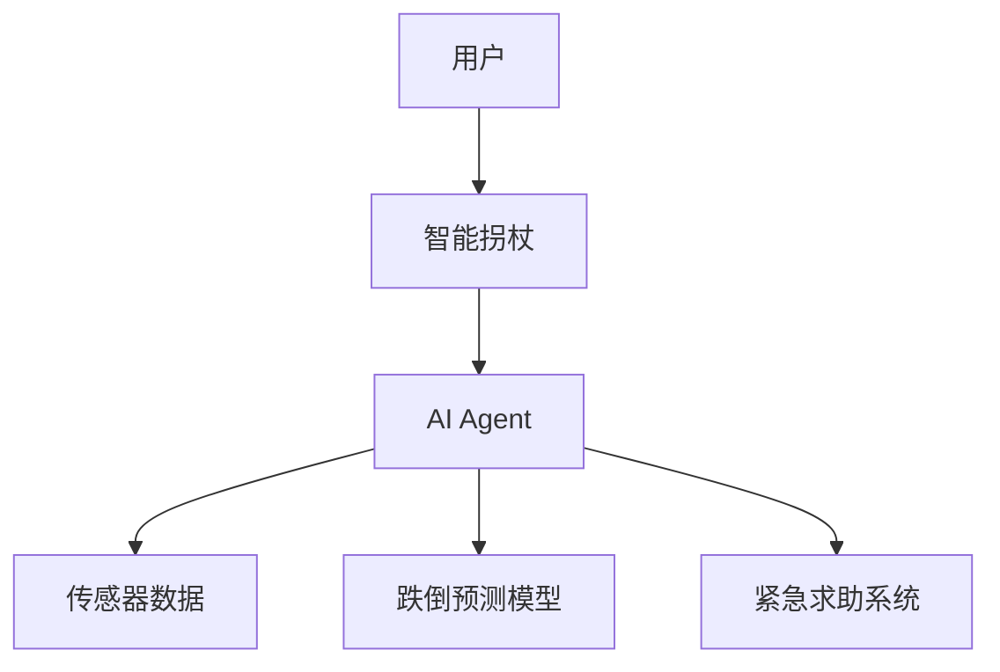
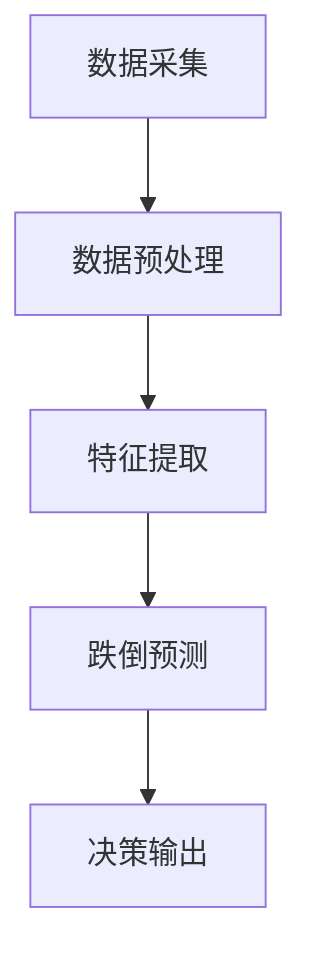
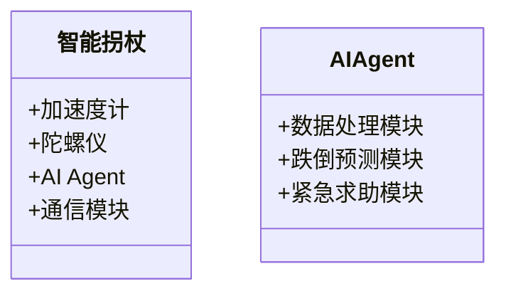

                 


# AI Agent在智能拐杖中的跌倒预防与紧急求助

## 关键词：AI Agent, 智能拐杖, 跌倒预防, 紧急求助, 传感器技术, 机器学习, 系统架构

## 摘要：AI Agent在智能拐杖中的应用通过先进的传感器技术和机器学习算法，实现跌倒预防和紧急求助功能。本文详细探讨了AI Agent的核心原理、系统架构设计、算法实现，以及实际项目中的应用场景，帮助读者理解如何通过技术手段提升老年人的生活安全。

---

# 第1章 背景介绍

## 1.1 问题背景

### 1.1.1 老龄化社会与跌倒问题
随着全球人口老龄化的加剧，跌倒已成为老年人群中常见的健康问题。据统计，约三分之一的老年人每年会经历跌倒，导致骨折、头部受伤等严重后果。这一问题不仅影响老年人的健康，也给家庭和社会带来了沉重的经济负担。

### 1.1.2 智能拐杖的必要性
传统拐杖仅能提供物理支撑，无法主动监测和预防跌倒。智能拐杖通过集成传感器和AI技术，能够实时监测用户的步态、平衡状态，提前预测跌倒风险，并在紧急情况下启动求助机制。

### 1.1.3 AI Agent在跌倒预防中的作用
AI Agent（人工智能代理）通过分析传感器数据，识别用户的异常行为模式，预测跌倒风险，并触发相应的预警或求助功能，从而有效减少跌倒事故的发生。

## 1.2 问题描述

### 1.2.1 跌倒的定义与分类
跌倒是人体失去平衡导致的非故意倒地事件。根据跌倒的原因，可分为生理性和环境性跌倒两类。

### 1.2.2 智能拐杖的功能需求
智能拐杖需要具备以下功能：实时监测用户步态，分析环境信息，预测跌倒风险，发出预警信号，连接紧急联系人或医疗救援机构。

### 1.2.3 AI Agent的核心任务
AI Agent的任务包括数据采集与处理、跌倒风险评估、预警触发、紧急求助等功能。

## 1.3 问题解决

### 1.3.1 AI Agent的技术解决方案
通过传感器采集用户行为数据，结合机器学习模型，实时分析数据并做出决策。

### 1.3.2 智能拐杖的设计目标
设计目标是实现跌倒预防和紧急求助功能，提升老年人的行动安全。

### 1.3.3 用户需求与技术实现的匹配
用户需求包括实时监测、预警功能、紧急求助等，技术实现通过传感器、AI算法和通信模块来满足。

## 1.4 边界与外延

### 1.4.1 AI Agent的功能边界
AI Agent仅处理跌倒预防和紧急求助，不涉及其他功能，如导航或娱乐。

### 1.4.2 智能拐杖的适用场景
适用于老年人、行动不便者，以及在复杂环境中行走的人群。

### 1.4.3 与其他智能设备的协同
可以与智能家居、健康监测设备协同工作，形成完整的健康监测系统。

## 1.5 核心要素组成

### 1.5.1 AI Agent的核心模块
- 数据采集模块：采集用户的运动数据。
- 数据处理模块：对数据进行预处理和特征提取。
- 跌倒预测模块：基于机器学习模型预测跌倒风险。
- 紧急求助模块：在预测跌倒时触发求助功能。

### 1.5.2 智能拐杖的硬件组成
- 传感器：加速度计、陀螺仪、压力传感器。
- 通信模块：蓝牙、Wi-Fi或4G模块。
- 电源模块：电池和充电电路。
- 显示屏：显示当前状态和预警信息。

### 1.5.3 系统的交互流程
用户使用拐杖时，传感器实时采集数据，AI Agent处理数据并预测跌倒风险，触发预警或求助信号。

---

# 第2章 AI Agent的核心概念与联系

## 2.1 核心概念原理

### 2.1.1 AI Agent的基本原理
AI Agent通过感知环境、分析数据、做出决策并执行动作。在智能拐杖中，AI Agent分析传感器数据，识别跌倒风险。

### 2.1.2 智能拐杖的传感器技术
传感器包括加速度计、陀螺仪等，用于监测用户的运动状态。

### 2.1.3 跌倒预防的算法逻辑
算法逻辑包括数据采集、特征提取、跌倒预测和决策输出。

## 2.2 核心概念对比表

| 对比项 | AI Agent | 传统传感器 | AI算法 |
|--------|-----------|------------|--------|
| 功能   | 自主决策 | 数据采集   | 模型训练 |
| 优势   | 灵活性高 | 实时性强   | 高准确性 |
| 局限性  | 资源消耗大 | 无法分析复杂数据 | 需大量数据训练 |

## 2.3 ER实体关系图


---

# 第3章 算法原理讲解

## 3.1 算法流程


## 3.2 算法实现

### 3.2.1 数据预处理
```python
import numpy as np

def preprocess_data(data):
    # 删除噪声
    filtered_data = np.where(data < 0.1, 0, data)
    return filtered_data
```

### 3.2.2 特征提取
```python
from sklearn.feature_selection import SelectKBest

features = SelectKBest(k=5).fit_transform(normalized_data)
```

### 3.2.3 跌倒预测模型
使用随机森林分类器：
```python
from sklearn.ensemble import RandomForestClassifier

model = RandomForestClassifier(n_estimators=100, random_state=42)
model.fit(X_train, y_train)
```

### 3.2.4 数学模型
跌倒风险评估模型：
$$ P(\text{fall}) = \frac{\sum_{i=1}^{n} w_i x_i}{\sum_{i=1}^{n} w_i} $$
其中，$w_i$为特征权重，$x_i$为特征值。

---

# 第4章 系统分析与架构设计方案

## 4.1 问题场景介绍
用户在复杂环境中行走，拐杖实时监测其步态，预测跌倒风险。

## 4.2 项目介绍
开发一个基于AI Agent的智能拐杖，实现跌倒预防和紧急求助功能。

## 4.3 系统功能设计


## 4.4 系统架构设计


## 4.5 系统接口设计
- 智能拐杖与AI Agent的接口：传感器数据传递。
- AI Agent与通信模块的接口：发送预警信号。

## 4.6 系统交互
```mermaid
sequenceDiagram
    用户 -> 智能拐杖: 开始行走
    智能拐杖 -> AI Agent: 传输传感器数据
    AI Agent -> AI Agent: 分析数据
    如果预测到跌倒风险：
        AI Agent -> 通信模块: 发送预警信号
        通信模块 -> 紧急联系人: 通知
    否则：
        继续监测
```

---

# 第5章 项目实战

## 5.1 环境安装
安装Python、NumPy、Scikit-learn、Mermaid等工具。

## 5.2 核心实现

### 5.2.1 数据采集模块
```python
import serial

ser = serial.Serial('COM3', 9600)
data = ser.readline()
```

### 5.2.2 数据处理模块
```python
import numpy as np

def process_data(raw_data):
    data = raw_data.split()
    data = list(map(int, data))
    return data
```

### 5.2.3 跌倒预测模块
```python
from sklearn.ensemble import RandomForestClassifier

model = RandomForestClassifier()
model.fit(X_train, y_train)
```

### 5.2.4 紧急求助模块
```python
import smtplib

def send_email(message):
    server = smtplib.SMTP('smtp.gmail.com', 587)
    server.starttls()
    server.login('user@example.com', 'password')
    server.sendmail('user@example.com', 'emergency_contact@example.com', message)
    server.quit()
```

## 5.3 实际案例分析
通过实际数据测试模型，调整参数以提高准确性。

---

# 第6章 最佳实践

## 6.1 小结
AI Agent在智能拐杖中的应用显著降低了跌倒风险，提高了老年人的生活质量。

## 6.2 注意事项
- 数据隐私保护
- 系统稳定性测试
- 用户培训和指导

## 6.3 拓展阅读
- 机器学习在医疗健康中的应用
- 智能传感器技术的发展

---

通过以上章节，我们系统地介绍了AI Agent在智能拐杖中的跌倒预防与紧急求助功能，从理论到实践，为读者提供了全面的技术指导和实践方案。

