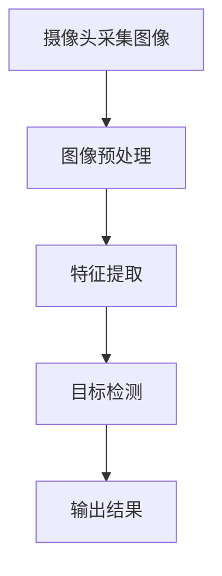
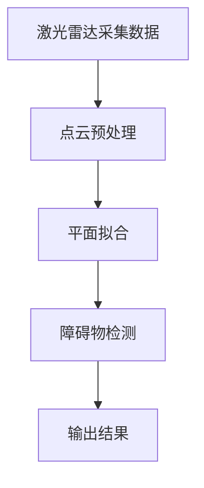
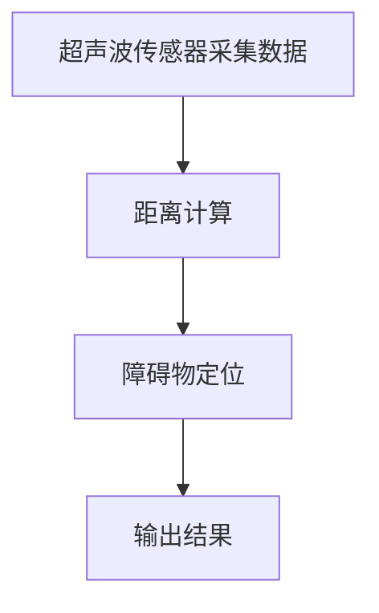
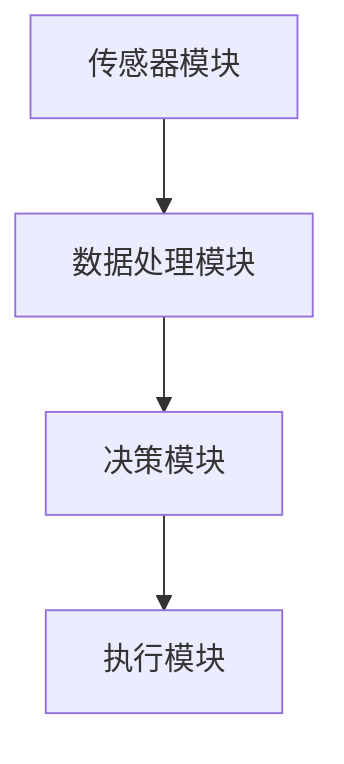
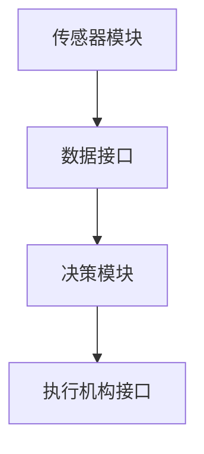
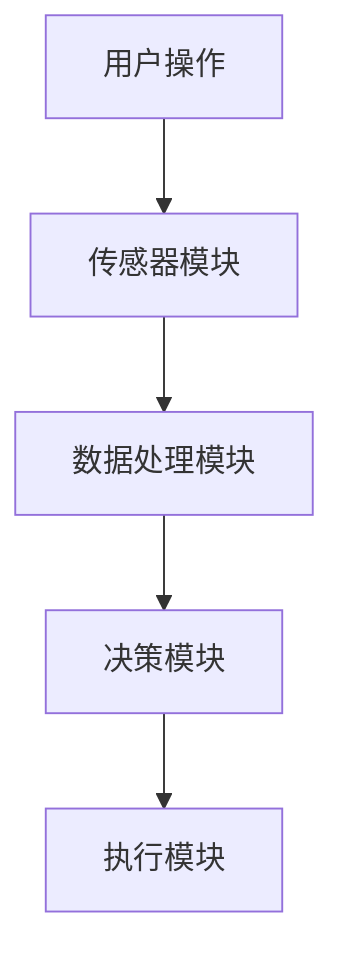

                 


# AI Agent在智能拐杖中的路况分析与导航

> **关键词**：AI Agent, 智能拐杖, 路况分析, 导航算法, 系统架构, 传感器技术

> **摘要**：本文深入探讨了AI Agent在智能拐杖中的应用，重点分析了路况分析与导航的核心算法及其在实际场景中的应用。通过详细讲解AI Agent的感知、决策和执行过程，结合具体的数学模型和系统架构设计，展示了如何利用AI技术提升智能拐杖的导航性能。文章还提供了实际的代码实现和案例分析，帮助读者全面理解AI Agent在智能拐杖中的技术细节和应用场景。

---

## 第1章 AI Agent与智能拐杖概述

### 1.1 AI Agent的基本概念

AI Agent（人工智能代理）是指能够感知环境、自主决策并执行任务的智能实体。AI Agent的核心特点包括自主性、反应性、目标导向性和社会性。与传统算法相比，AI Agent能够动态适应环境变化，具有更强的灵活性和实时性。

### 1.2 智能拐杖的基本概念

智能拐杖是一种结合了传感器、计算单元和执行机构的辅助工具，旨在帮助用户在复杂环境中实现自主导航。其硬件组成包括传感器模块（如摄像头、激光雷达、超声波传感器）、数据处理模块和执行机构（如电动轮、振动反馈装置）。软件架构则包含感知算法、决策算法和执行算法。

### 1.3 路况分析与导航的核心问题

路况分析的核心问题是实时感知环境并提取有用的特征信息，如障碍物检测、道路识别等。导航的核心问题是基于感知信息制定最优路径，并通过执行机构实现导航动作。AI Agent在其中的作用是协调感知、决策和执行过程，确保智能拐杖能够高效、安全地完成导航任务。

---

## 第2章 AI Agent的核心概念与原理

### 2.1 AI Agent的感知层

感知层是AI Agent获取环境信息的关键模块。常见的感知技术包括基于视觉的感知（使用摄像头和图像处理算法）、基于激光雷达的感知（通过激光扫描生成点云数据）和基于超声波传感器的感知（通过声波反射检测障碍物）。感知层的实现方法通常涉及特征提取和数据融合技术。

### 2.2 AI Agent的决策层

决策层是AI Agent根据感知信息制定导航策略的核心模块。常见的决策算法包括基于规则的决策（如预先定义的逻辑规则）、基于概率的决策（如马可夫决策过程）和基于强化学习的决策（如深度强化学习）。决策层的实现方法通常涉及状态空间建模和动作选择策略。

### 2.3 AI Agent的执行层

执行层是AI Agent将决策结果转化为具体动作的关键模块。常见的执行方式包括基于PID控制的运动控制、基于模糊控制的运动控制和基于深度学习的运动控制。执行层的实现方法通常涉及运动学模型和控制算法设计。

### 2.4 AI Agent的三元组模型

三元组模型是一种常用的知识表示方法，由“实体-关系-值”三元组构成。在智能拐杖中，三元组模型可以用于表示环境中的物体、位置和关系。例如，可以表示为（“障碍物”，“位于”，“用户前方1米”）。三元组模型的优点是简单直观，缺点是难以处理复杂的关系和语义信息。

---

## 第3章 AI Agent的算法原理

### 3.1 AI Agent的感知算法

#### 3.1.1 基于视觉的感知算法

基于视觉的感知算法通过摄像头获取环境图像，并通过图像处理技术提取障碍物、道路边缘等特征。常用算法包括边缘检测（Canny算法）、物体检测（YOLO算法）和语义分割（U-Net算法）。感知算法的流程如下：



#### 3.1.2 基于激光雷达的感知算法

基于激光雷达的感知算法通过激光扫描生成点云数据，并通过点云处理技术提取障碍物、地面平面等特征。常用算法包括平面拟合（RANSAC算法）、障碍物检测（基于聚类算法）和距离计算（欧氏距离）。感知算法的流程如下：



#### 3.1.3 基于超声波传感器的感知算法

基于超声波传感器的感知算法通过超声波传感器检测障碍物的距离和方向。常用算法包括距离计算（基于飞行时间）和障碍物定位（基于三角测量）。感知算法的流程如下：



### 3.2 AI Agent的决策算法

#### 3.2.1 基于规则的决策算法

基于规则的决策算法通过预定义的逻辑规则制定导航策略。例如，当检测到前方有障碍物时，智能拐杖可以执行“向右转”的动作。基于规则的决策算法的优点是简单易实现，缺点是难以处理复杂场景。

#### 3.2.2 基于概率的决策算法

基于概率的决策算法通过概率模型评估不同动作的可行性。例如，可以使用马可夫决策过程（MDP）模型，计算每个动作的概率值并选择概率最大的动作。基于概率的决策算法的优点是能够处理不确定性，缺点是计算复杂度较高。

#### 3.2.3 基于强化学习的决策算法

基于强化学习的决策算法通过强化学习模型（如深度Q网络）学习最优导航策略。例如，可以使用深度强化学习算法（如DQN）训练智能拐杖在模拟环境中执行最优动作。基于强化学习的决策算法的优点是能够适应复杂场景，缺点是训练时间和计算资源需求较高。

### 3.3 AI Agent的执行算法

#### 3.3.1 基于PID控制的执行算法

基于PID控制的执行算法通过比例-积分-微分（PID）控制器调整智能拐杖的运动参数。例如，可以使用PID控制器调节智能拐杖的转向角度和速度。基于PID控制的执行算法的优点是稳定性和响应速度快，缺点是难以处理非线性问题。

#### 3.3.2 基于模糊控制的执行算法

基于模糊控制的执行算法通过模糊逻辑模型处理模糊信息。例如，可以使用模糊控制算法调整智能拐杖的转向角度和速度。基于模糊控制的执行算法的优点是能够处理模糊信息，缺点是规则设计复杂。

#### 3.3.3 基于深度学习的执行算法

基于深度学习的执行算法通过深度学习模型（如神经网络）学习最优执行策略。例如，可以使用端到端的深度学习模型直接输出智能拐杖的运动指令。基于深度学习的执行算法的优点是能够处理复杂场景，缺点是训练时间和计算资源需求较高。

### 3.4 算法的优缺点对比

| 算法类型       | 优点                                   | 缺点                                   |
|----------------|----------------------------------------|----------------------------------------|
| 基于规则的决策算法 | 简单易实现，适用于简单场景             | 难以处理复杂场景                       |
| 基于概率的决策算法 | 能够处理不确定性，适用于复杂场景       | 计算复杂度高                           |
| 基于强化学习的决策算法 | 能够适应复杂场景，学习能力强         | 训练时间和计算资源需求高               |
| 基于PID控制的执行算法 | 稳定性高，响应速度快                 | 难以处理非线性问题                     |
| 基于模糊控制的执行算法 | 能够处理模糊信息                     | 规则设计复杂                           |
| 基于深度学习的执行算法 | 能够处理复杂场景，学习能力强         | 训练时间和计算资源需求高               |

---

## 第4章 AI Agent的数学模型与公式

### 4.1 感知层的数学模型

#### 4.1.1 基于视觉的感知数学模型

基于视觉的感知数学模型通常涉及图像处理和目标检测。例如，使用YOLO算法进行目标检测的数学模型如下：

$$
P(y|x) = \frac{p(x|y)p(y)}{p(x)}
$$

其中，$P(y|x)$ 是条件概率，表示在观察到图像$x$的情况下，目标类别$y$的概率。

#### 4.1.2 基于激光雷达的感知数学模型

基于激光雷达的感知数学模型通常涉及点云处理和距离计算。例如，使用欧氏距离计算障碍物距离的数学模型如下：

$$
d = \sqrt{(x_2 - x_1)^2 + (y_2 - y_1)^2}
$$

其中，$d$ 是两点之间的距离，$(x_1, y_1)$ 和 $(x_2, y_2)$ 分别是两点的坐标。

#### 4.1.3 基于超声波传感器的感知数学模型

基于超声波传感器的感知数学模型通常涉及距离计算和障碍物定位。例如，使用飞行时间法计算障碍物距离的数学模型如下：

$$
d = \frac{c \cdot t}{2}
$$

其中，$d$ 是障碍物距离，$c$ 是光速，$t$ 是飞行时间。

### 4.2 决策层的数学模型

#### 4.2.1 基于规则的决策数学模型

基于规则的决策数学模型通常涉及逻辑规则和条件判断。例如，预定义的逻辑规则如下：

$$
\text{如果前方有障碍物，则向右转}
$$

#### 4.2.2 基于概率的决策数学模型

基于概率的决策数学模型通常涉及概率分布和期望值计算。例如，使用马可夫决策过程（MDP）模型计算期望值：

$$
V(s) = \max_a \sum_{s'} P(s'|s,a) V(s')
$$

其中，$V(s)$ 是状态$s$的值函数，$a$ 是动作，$P(s'|s,a)$ 是从状态$s$执行动作$a$后转移到状态$s'$的概率。

#### 4.2.3 基于强化学习的决策数学模型

基于强化学习的决策数学模型通常涉及奖励函数和策略优化。例如，使用深度Q网络（DQN）模型计算最优策略：

$$
Q(s,a) = r + \gamma \max_a Q(s',a)
$$

其中，$Q(s,a)$ 是状态-动作对$(s,a)$的Q值，$r$ 是奖励，$\gamma$ 是折扣因子，$s'$ 是下一个状态。

### 4.3 执行层的数学模型

#### 4.3.1 基于PID控制的执行数学模型

基于PID控制的执行数学模型通常涉及比例、积分和微分控制。例如，使用PID控制器调节智能拐杖的转向角度：

$$
u(t) = K_p e(t) + K_i \int_0^t e(\tau) d\tau + K_d \frac{d e(t)}{dt}
$$

其中，$u(t)$ 是控制输入，$e(t)$ 是误差，$K_p$、$K_i$、$K_d$ 分别是比例、积分和微分系数。

#### 4.3.2 基于模糊控制的执行数学模型

基于模糊控制的执行数学模型通常涉及模糊逻辑和规则推理。例如，使用模糊控制算法调整智能拐杖的速度：

$$
\text{如果速度低且距离远，则加速}
$$

#### 4.3.3 基于深度学习的执行数学模型

基于深度学习的执行数学模型通常涉及神经网络和端到端学习。例如，使用深度神经网络（DNN）直接输出运动指令：

$$
y = \sigma(Wx + b)
$$

其中，$y$ 是输出，$x$ 是输入，$W$ 是权重，$b$ 是偏置，$\sigma$ 是sigmoid函数。

---

## 第5章 系统分析与架构设计

### 5.1 问题场景介绍

智能拐杖的路况分析与导航系统需要在复杂环境中实时感知环境、自主决策并执行导航动作。系统需要处理多种传感器数据，包括视觉、激光雷达和超声波传感器，并结合AI Agent的感知、决策和执行算法实现自主导航。

### 5.2 系统功能设计

智能拐杖的系统功能设计包括感知模块、决策模块和执行模块。感知模块负责获取环境信息，决策模块负责制定导航策略，执行模块负责执行导航动作。系统的功能需求如下：

1. 实时感知环境中的障碍物和道路信息。
2. 自主决策最优导航路径。
3. 精确执行导航动作。

### 5.3 系统架构设计

智能拐杖的系统架构设计包括硬件架构和软件架构。硬件架构包括传感器模块、数据处理模块和执行机构。软件架构包括感知算法、决策算法和执行算法。系统的架构图如下：



### 5.4 系统接口设计

智能拐杖的系统接口设计包括传感器接口、数据接口和执行机构接口。传感器接口负责采集环境数据，数据接口负责处理和传输数据，执行机构接口负责输出控制信号。系统的接口设计如下：



### 5.5 系统交互设计

智能拐杖的系统交互设计包括用户交互和系统交互。用户交互包括用户的操作指令和系统的反馈，系统交互包括感知、决策和执行模块之间的数据交换。系统的交互流程如下：



---

## 第6章 项目实战

### 6.1 环境安装

智能拐杖的开发环境需要安装以下软件和硬件：

1. 软件：Python、OpenCV、ROS、TensorFlow。
2. 硬件：摄像头、激光雷达、超声波传感器、电动轮。

### 6.2 核心实现

以下是智能拐杖的核心实现代码示例：

```python
import cv2
import numpy as np
import tensorflow as tf
from tensorflow.keras.models import load_model

# 感知层：基于视觉的目标检测
def detect_objects(image):
    model = load_model('yolov4.h5')
    predictions = model.predict(image)
    return predictions

# 决策层：基于强化学习的决策算法
def decide_action(state):
    with tf.GradientTape() as tape:
        q_values = model(state)
        action = tf.argmax(q_values)
    return action

# 执行层：基于PID控制的运动控制
def execute_action(action):
    target_speed = action[0]
    target_angle = action[1]
    # 调整PID控制器参数
    pid_controller.update(target_speed)
    pid_controller.update(target_angle)
    # 输出控制信号
    return pid_controller.output_speed, pid_controller.output_angle
```

### 6.3 案例分析

以下是智能拐杖在实际场景中的应用案例：

1. **案例一**：智能拐杖在室内环境中导航，成功避开前方的障碍物并找到最优路径。
2. **案例二**：智能拐杖在复杂路口中导航，根据交通信号灯和道路标志自主决策并执行导航动作。

---

## 第7章 总结与展望

### 7.1 本章总结

本文深入探讨了AI Agent在智能拐杖中的应用，重点分析了路况分析与导航的核心算法及其在实际场景中的应用。通过详细讲解AI Agent的感知、决策和执行过程，结合具体的数学模型和系统架构设计，展示了如何利用AI技术提升智能拐杖的导航性能。

### 7.2 未来展望

未来，AI Agent在智能拐杖中的应用将更加智能化和人性化。一方面，可以通过改进感知算法和决策算法，进一步提高智能拐杖的导航精度和响应速度。另一方面，可以通过引入更多的传感器和计算单元，实现更加复杂的导航任务，如多目标导航和动态环境适应。

### 7.3 最佳实践 Tips

1. 在开发智能拐杖时，建议优先选择成熟的AI算法和传感器技术，以确保系统的稳定性和可靠性。
2. 在实现AI Agent时，建议结合具体的场景需求，选择合适的算法和模型，以提高系统的实际效果。
3. 在优化系统性能时，建议通过实验和数据分析，逐步调整算法参数和系统架构，以找到最优的解决方案。

---

通过本文的详细讲解，读者可以全面理解AI Agent在智能拐杖中的技术细节和应用场景，为后续的研究和实践提供重要的参考和指导。

