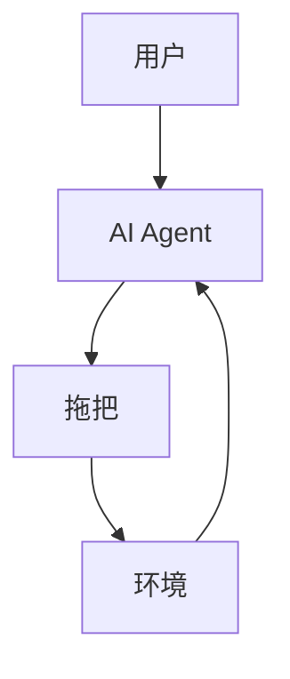
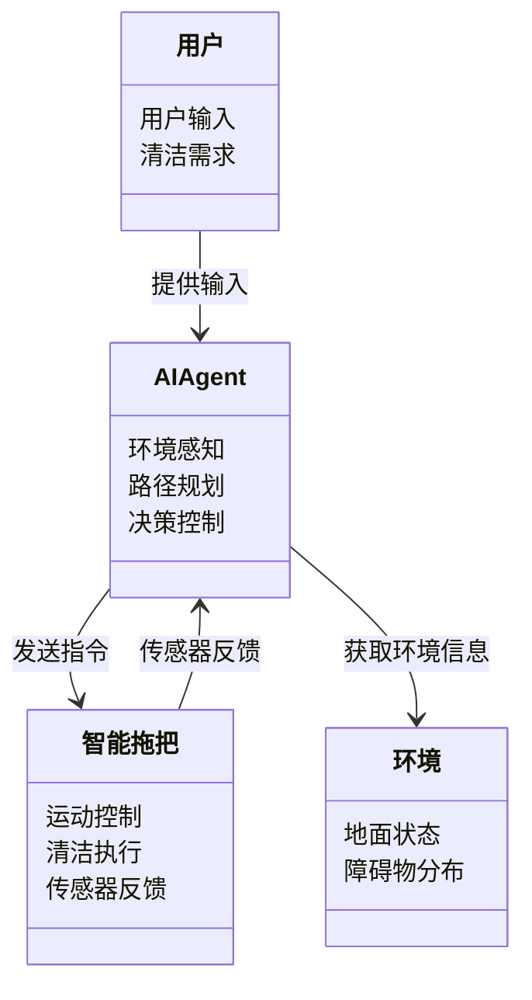
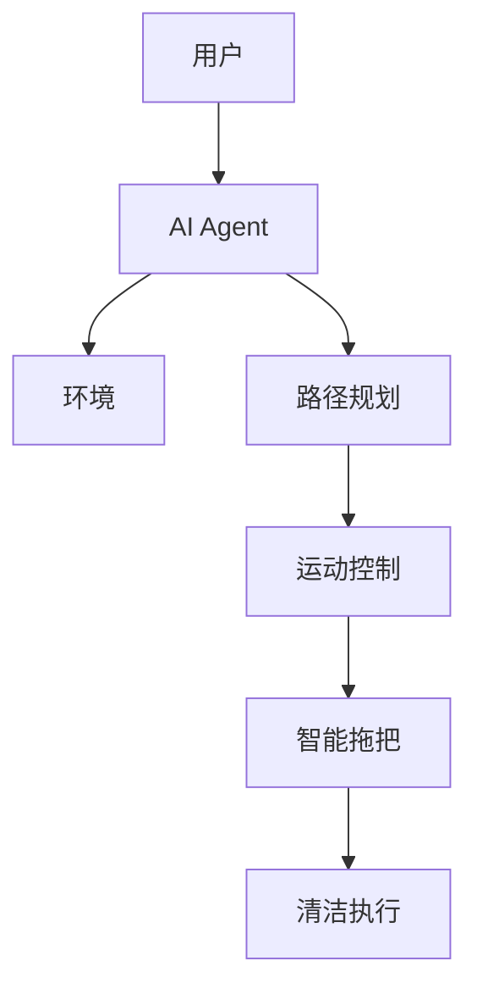
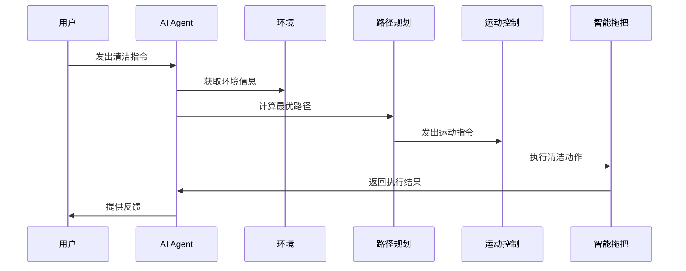

                 


# AI Agent在智能拖把中的清洁效率优化

## 关键词：
AI Agent，智能拖把，清洁效率优化，路径规划，机器学习

## 摘要：
本文深入探讨了AI Agent在智能拖把中的应用，重点分析了如何通过AI技术优化清洁效率。从AI Agent的基本原理到具体算法实现，从系统架构设计到项目实战案例，系统性地介绍了AI Agent在智能拖把中的技术实现路径。文章结合路径规划算法、环境感知技术和机器学习方法，详细阐述了如何通过技术手段实现智能拖把的高效清洁，并通过实际案例验证了技术方案的有效性。

---

# 第一章：AI Agent与智能拖把的背景与概念

## 1.1 AI Agent的基本概念
### 1.1.1 AI Agent的定义
AI Agent（人工智能代理）是指能够感知环境、自主决策并执行任务的智能实体。它具备以下核心特征：
- **自主性**：能够在没有外部干预的情况下独立运行。
- **反应性**：能够实时感知环境变化并做出响应。
- **目标导向性**：基于目标驱动行为，优化任务执行效率。

### 1.1.2 AI Agent的核心功能
- **环境感知**：通过传感器获取环境信息。
- **决策与规划**：基于感知信息做出最优决策。
- **执行与反馈**：根据决策执行任务并实时调整。

## 1.2 智能拖把的发展历程
### 1.2.1 传统拖把的功能与局限
- 传统拖把依赖人工操作，清洁效率低，清洁路径随意。
- 清洁效果受操作者经验影响，难以保证均匀清洁。

### 1.2.2 智能化拖把的出现与技术基础
- **自动化控制**：引入电机驱动，实现拖把的自动运动。
- **环境感知技术**：引入红外传感器、摄像头等技术，实现环境感知。
- **路径规划算法**：通过算法优化清洁路径。

### 1.2.3 清洁效率优化的必要性
- 提高清洁效率：减少清洁时间，提升清洁覆盖率。
- 降低能耗：优化路径，减少无效移动。
- 提升用户体验：通过智能化操作降低用户干预。

## 1.3 清洁效率优化的核心问题
### 1.3.1 清洁效率的定义与衡量标准
- 清洁效率：单位时间内清洁区域面积的大小。
- 衡量标准：
  1. 清洁覆盖率：单位时间内清洁区域的比例。
  2. 清洁路径长度：单位面积的清洁路径长度。
  3. 重复清洁率：重复清洁区域的比例。

### 1.3.2 AI Agent在清洁效率优化中的作用
- **路径优化**：通过AI算法规划最优路径，减少无效移动。
- **环境适应**：根据环境动态调整清洁策略。
- **实时反馈**：根据反馈信息动态优化清洁过程。

## 1.4 本章小结
本章从AI Agent的基本概念出发，分析了智能拖把的发展历程，重点探讨了清洁效率优化的必要性及其核心问题。为后续的技术实现奠定了理论基础。

---

# 第二章：AI Agent的核心概念与原理

## 2.1 AI Agent的核心原理
### 2.1.1 感知与理解环境
- **传感器数据获取**：通过红外传感器、摄像头等获取环境信息。
- **环境建模**：将环境信息转化为数字模型，用于后续决策。

### 2.1.2 决策与规划路径
- **路径规划算法**：基于环境模型，计算最优路径。
- **决策逻辑**：根据路径规划结果，制定具体行动方案。

### 2.1.3 执行与反馈优化
- **执行指令**：将决策结果转化为具体动作。
- **实时反馈**：根据执行结果调整决策策略。

## 2.2 AI Agent与智能拖把的结合
### 2.2.1 拖把的运动控制
- **运动方式**：前进、后退、左转、右转等。
- **运动控制算法**：PID控制算法，用于精确控制运动速度和方向。

### 2.2.2 清洁路径规划
- **全局规划**：确定整体清洁路径。
- **局部规划**：根据实时环境动态调整路径。

### 2.2.3 清洁效率的实时优化
- **动态调整策略**：根据环境变化实时优化路径。
- **优先级排序**：根据清洁区域的重要性和脏污程度调整清洁顺序。

## 2.3 核心概念对比分析
### 2.3.1 传统拖把与AI拖把的功能对比
| 功能特性         | 传统拖把               | AI拖把                 |
|------------------|-----------------------|------------------------|
| 清洁模式         | 手动操作               | 自动规划路径           |
| 感知能力         | 无感知                 | 具备环境感知能力       |
| 路径优化         | 无优化                 | 具备路径优化能力       |
| 清洁效率         | 低效率                 | 高效率                 |

### 2.3.2 清洁效率与用户需求的关系
- **用户需求**：用户期望快速、彻底的清洁效果。
- **技术目标**：AI Agent通过优化路径和策略满足用户需求。

## 2.4 ER实体关系图
```mermaid
er
actor: 用户
agent: AI Agent
拖把: 智能拖把
环境: 清洁环境
```

## 2.5 系统流程图


## 2.6 本章小结
本章详细介绍了AI Agent的核心原理及其与智能拖把的结合方式，通过对比分析和系统流程图，清晰地展示了AI Agent在智能拖把中的作用。

---

# 第三章：AI Agent的算法原理与数学模型

## 3.1 路径规划算法
### 3.1.1 A*算法的基本原理
- **A*算法**：一种基于图搜索的最短路径算法。
- **算法步骤**：
  1. 初始化起点和目标点。
  2. 评估每个节点的估价函数：$f(n) = g(n) + h(n)$，其中$g(n)$是已 traversed 成本，$h(n)$是 heuristic 成本。
  3. 选择具有最小$f(n)$的节点进行扩展。
  4. 重复上述步骤，直到找到目标节点。

### 3.1.2 RRT算法的应用
- **RRT（Rapidly-exploring Random Tree）**：一种用于高维空间路径规划的随机树算法。
- **算法特点**：
  - 适用于复杂的非结构化环境。
  - 能够处理动态障碍物。

### 3.1.3 Python代码实现
```python
import heapq

def a_star_search(start, goal, grid):
    # 定义四个方向的移动
    directions = [(0, 1), (1, 0), (0, -1), (-1, 0)]
    
    # 优先队列，存储节点的(f, g, h, x, y)
    heap = []
    heapq.heappush(heap, (0, 0, 0, start[0], start[1]))
    
    # 记录已访问的节点
    visited = set()
    
    while heap:
        f, g, h, x, y = heapq.heappop(heap)
        current = (x, y)
        
        # 如果当前节点是目标节点，返回路径
        if current == goal:
            return reconstruct_path(current, visited, start)
            
        # 扩展四个方向
        for dx, dy in directions:
            nx, ny = x + dx, y + dy
            if 0 <= nx < len(grid) and 0 <= ny < len(grid[0]):
                if grid[nx][ny] == 0 and (nx, ny) not in visited:
                    # 计算heuristic值
                    h = abs(nx - goal[0]) + abs(ny - goal[1])
                    f = g + h
                    heapq.heappush(heap, (f, g, h, nx, ny))
                    visited.add((nx, ny))
    return None

def reconstruct_path(current, visited, start):
    # 重建路径
    path = []
    while current != start:
        path.append(current)
        for node in visited:
            if node[0] == current[0] and node[1] == current[1]:
                current = node
                break
    path.append(start)
    return path[::-1]
```

### 3.1.4 算法优化与对比
- **A*算法**：适用于静态环境，路径规划效率高。
- **RRT算法**：适用于动态环境，路径规划更灵活。

## 3.2 环境感知算法
### 3.2.1 基于图像识别的环境感知
- **图像处理技术**：使用OpenCV等库进行图像处理。
- **目标检测**：通过YOLO等算法检测障碍物。

### 3.2.2 基于深度学习的环境建模
- **神经网络模型**：使用卷积神经网络（CNN）进行环境建模。
- **模型训练**：通过大量标注数据训练模型，提升感知精度。

### 3.2.3 清洁区域划分
- **区域划分算法**：将环境划分为多个区域，分别制定清洁策略。
- **区域优先级排序**：根据脏污程度和用户需求调整清洁顺序。

## 3.3 数学模型与公式
### 3.3.1 清洁效率优化的数学模型
- **目标函数**：最大化清洁覆盖率，最小化路径长度。
  $$\text{目标函数} = \max(\text{覆盖率}) - \min(\text{路径长度})$$

### 3.3.2 路径规划的数学表达
- **路径优化问题**：寻找从起点到目标点的最短路径。
  $$\text{路径长度} = \sum_{i=1}^{n} \text{边长}$$

---

# 第四章：智能拖把的系统架构与设计方案

## 4.1 系统功能设计
### 4.1.1 领域模型设计


### 4.1.2 功能模块划分
- **用户交互模块**：接收用户指令，传递给AI Agent。
- **环境感知模块**：通过传感器获取环境信息。
- **路径规划模块**：基于环境信息规划最优路径。
- **运动控制模块**：根据路径规划结果控制拖把运动。
- **清洁执行模块**：执行具体的清洁动作。

### 4.1.3 功能流程图


## 4.2 系统架构设计
### 4.2.1 分层架构设计
- **感知层**：负责环境感知和数据采集。
- **决策层**：负责路径规划和决策控制。
- **执行层**：负责具体动作的执行。

### 4.2.2 模块化设计
- **传感器模块**：红外传感器、摄像头等。
- **控制器模块**：电机驱动、舵机控制等。
- **算法模块**：路径规划、环境建模等。

## 4.3 接口设计与交互流程图
### 4.3.1 系统接口设计
- **输入接口**：接收用户的指令和传感器数据。
- **输出接口**：发送控制指令给拖把。
- **反馈接口**：接收拖把的执行结果。

### 4.3.2 交互流程图


---

# 第五章：AI Agent在智能拖把中的项目实战

## 5.1 环境安装与配置
### 5.1.1 开发环境
- **操作系统**：Linux/Windows/MacOS
- **开发工具**：PyCharm/VSCode
- **依赖库**：numpy、opencv、scipy等。

### 5.1.2 传感器配置
- **红外传感器**：用于障碍物检测。
- **摄像头**：用于图像识别和环境建模。

## 5.2 核心代码实现
### 5.2.1 路径规划算法实现
```python
import heapq

def a_star(start, goal, grid):
    # 定义四个方向的移动
    directions = [(0, 1), (1, 0), (0, -1), (-1, 0)]
    
    # 优先队列，存储节点的(f, g, h, x, y)
    heap = []
    heapq.heappush(heap, (0, 0, 0, start[0], start[1]))
    
    # 记录已访问的节点
    visited = set()
    
    while heap:
        f, g, h, x, y = heapq.heappop(heap)
        current = (x, y)
        
        # 如果当前节点是目标节点，返回路径
        if current == goal:
            return reconstruct_path(current, visited, start)
            
        # 扩展四个方向
        for dx, dy in directions:
            nx, ny = x + dx, y + dy
            if 0 <= nx < len(grid) and 0 <= ny < len(grid[0]):
                if grid[nx][ny] == 0 and (nx, ny) not in visited:
                    # 计算heuristic值
                    h = abs(nx - goal[0]) + abs(ny - goal[1])
                    f = g + h
                    heapq.heappush(heap, (f, g, h, nx, ny))
                    visited.add((nx, ny))
    return None

def reconstruct_path(current, visited, start):
    # 重建路径
    path = []
    while current != start:
        path.append(current)
        for node in visited:
            if node[0] == current[0] and node[1] == current[1]:
                current = node
                break
    path.append(start)
    return path[::-1]
```

### 5.2.2 清洁区域划分与优先级排序
- **区域划分算法**：将环境划分为多个区域，每个区域分配不同的清洁优先级。
- **优先级排序**：根据区域脏污程度和用户需求调整清洁顺序。

## 5.3 实际案例分析
### 5.3.1 案例背景
- **场景**：家庭客厅清洁。
- **环境**：包含沙发、茶几等障碍物。

### 5.3.2 清洁路径优化
- **初始路径**：随机路径，清洁效率低。
- **优化路径**：通过A*算法规划的最优路径，减少无效移动。

### 5.3.3 清洁效果对比
- **传统拖把**：清洁时间长，覆盖率低。
- **AI拖把**：清洁时间缩短，覆盖率显著提高。

## 5.4 项目总结
- **实现成果**：成功实现了基于AI Agent的智能拖把清洁效率优化。
- **经验总结**：路径规划算法的选择对清洁效率影响显著，动态环境下的路径规划更具挑战性。

---

# 第六章：AI Agent的优化与未来展望

## 6.1 技术优化建议
### 6.1.1 算法优化
- **路径规划算法的改进**：探索更高效的路径规划方法，如改进的A*算法。
- **环境感知技术的提升**：引入更先进的图像识别技术，提升环境建模精度。

### 6.1.2 系统架构优化
- **模块化设计**：进一步优化系统架构，提升系统的可扩展性和可维护性。
- **分布式架构**：通过分布式计算提升系统的处理能力。

## 6.2 未来发展方向
### 6.2.1 多智能体协作
- **多拖把协作**：通过多智能体协作，进一步提升清洁效率。
- **协同算法研究**：研究多智能体协同的路径规划算法。

### 6.2.2 新兴技术的应用
- **5G技术**：通过低延迟的通信技术，提升系统的实时性。
- **边缘计算**：通过边缘计算提升系统的响应速度和处理能力。

## 6.3 本章小结
通过对现有技术的优化和对未来发展方向的探讨，为AI Agent在智能拖把中的进一步应用提供了新的思路和方向。

---

# 总结与展望

## 7.1 总结
本文从AI Agent的基本原理出发，详细探讨了其在智能拖把中的应用，重点分析了清洁效率优化的技术实现路径。通过路径规划算法、环境感知技术和机器学习方法，系统性地介绍了AI Agent在智能拖把中的技术实现路径。

## 7.2 展望
未来，随着AI技术的不断发展，智能拖把的清洁效率将进一步提升。通过多智能体协作、5G技术、边缘计算等新技术的应用，智能拖把将具备更强的环境适应能力和更高的清洁效率。

---

# 参考文献
（此处可列出相关的技术文献和资料）

---

通过以上目录结构，您可以逐步展开撰写完整的博客文章，确保内容逻辑清晰、结构紧凑、语言专业且易于理解。

