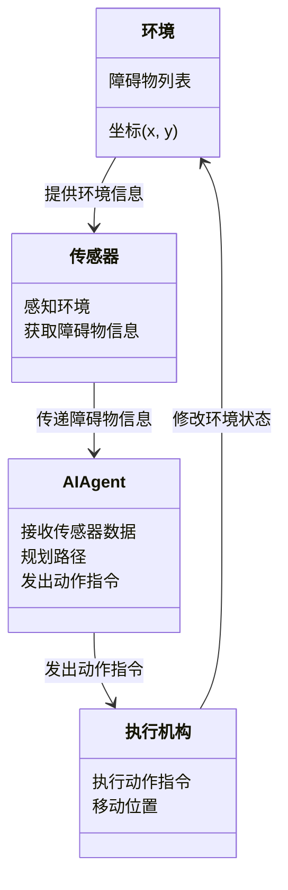
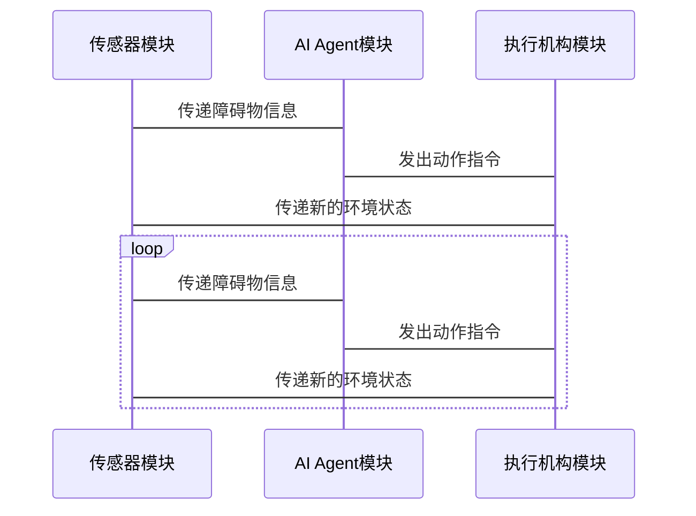

                 


# 第四部分: 路径规划的数学模型与优化

# 第4章: 路径规划的数学模型与优化

## 4.1 路径规划的数学模型

### 4.1.1 数学模型的基本概念
路径规划的数学模型是用来描述从起点到终点的最优路径的数学表达式。它通常涉及到空间中的几何形状、障碍物分布、目标函数等因素。

#### 4.1.1.1 状态空间
在路径规划问题中，我们通常将状态定义为位置坐标 $(x, y)$，其中 $x$ 和 $y$ 分别表示横向和纵向坐标。在智能拖把的清洁路径规划中，我们还需要考虑角度 $\theta$，即方向。

$$
状态 = (x, y, \theta)
$$

#### 4.1.1.2 动作空间
动作空间定义了智能拖把在每一个状态下可以执行的动作。在二维平面上，智能拖把可以向四个方向移动，分别对应不同的角度变化：

$$
动作 = \{ \text{forward}, \text{backward}, \text{left}, \text{right} \}
$$

每个动作对应一个角度变化 $\Delta\theta$ 和位移 $(\Delta x, \Delta y)$。

### 4.1.2 状态转移方程
状态转移方程描述了智能拖把在执行一个动作后，从当前状态到下一个状态的变化。假设当前状态为 $(x, y, \theta)$，执行一个动作后，新的状态为：

$$
(x', y', \theta') = (x + \Delta x, y + \Delta y, \theta + \Delta\theta)
$$

其中，$\Delta x$ 和 $\Delta y$ 是动作对应的位移，$\Delta\theta$ 是角度变化。

### 4.1.3 路径规划的目标函数
路径规划的目标是找到一条从起点到终点的最优路径。最优路径通常定义为满足以下条件的路径：

1. 最短路径：路径的长度最短。
2. 最低能耗：路径的能量消耗最低。
3. 最优避障：路径避开所有障碍物。

在智能拖把中，通常以最短路径为目标函数，同时考虑障碍物的影响。

$$
\text{目标函数} = \argmin_{\text{路径}} \{ \text{路径长度} + \text{障碍物惩罚} \}
$$

### 4.1.4 障碍物检测与避障

在路径规划中，障碍物的检测和避障是关键步骤。假设我们有一个障碍物检测算法，可以检测到路径中的障碍物，并计算出避障路径。

$$
\text{避障路径} = \argmin_{\text{无碰撞路径}} \{ \text{路径长度} \}
$$

#### 4.1.4.1 障碍物检测算法
常用的障碍物检测算法包括：

- 基于距离的检测：计算智能拖把与障碍物之间的距离，当距离小于某个阈值时，认为存在障碍物。
- 基于深度的检测：使用深度传感器检测障碍物的距离和位置。
- 基于图像的检测：使用摄像头识别障碍物的位置和形状。

#### 4.1.4.2 避障策略
智能拖把在检测到障碍物后，需要根据当前状态和环境信息，选择一个最优的避障策略。常用的避障策略包括：

- 原地旋转：智能拖把在检测到障碍物后，原地旋转一定的角度，避开障碍物。
- 后退再前进：智能拖把后退一定的距离，重新规划路径。
- 绕道而行：智能拖把选择一个绕过障碍物的路径。

### 4.1.5 动态环境下的路径规划
在实际应用中，环境通常是动态变化的，障碍物的位置和形状可能会发生变化。因此，路径规划算法需要能够实时更新路径，适应环境的变化。

动态环境下的路径规划问题可以转化为一个实时优化问题，路径规划算法需要在每一步都重新计算最优路径。

$$
\text{实时路径规划} = \argmin_{\text{当前路径}} \{ \text{路径长度} + \text{障碍物惩罚} \}
$$

## 4.2 路径规划的优化方法

### 4.2.1 基于Dijkstra算法的优化
Dijkstra算法是一种经典的单源最短路径算法，适用于静态图中的最短路径问题。在智能拖把的路径规划中，我们可以将环境建模为一个图，节点代表位置，边代表可能的动作。

Dijkstra算法的步骤如下：

1. 初始化：将起点的优先级设为0，其他节点的优先级设为无穷大。
2. 优先队列：使用优先队列（优先级队列）来选择优先级最高的节点。
3. 松弛操作：对于当前节点的邻居，检查是否可以通过当前节点找到更短的路径。如果是，则更新邻居的优先级。
4. 重复步骤2和3，直到队列为空或者找到目标节点。

#### 4.2.1.1 Dijkstra算法的Python实现

```python
import heapq

def dijkstra(start, goal, grid):
    # 初始化距离数组
    dist = [[float('inf')] * len(grid[0]) for _ in range(len(grid))]
    dist[start[0]][start[1]] = 0

    # 优先队列：(距离, 坐标)
    heap = []
    heapq.heappush(heap, (0, start[0], start[1]))

    # 记录前驱节点
    prev = [[None] * len(grid[0]) for _ in range(len(grid))]

    while heap:
        current_dist, x, y = heapq.heappop(heap)
        if (x, y) == goal:
            break
        if current_dist > dist[x][y]:
            continue
        # 四个方向
        directions = [(0, 1), (1, 0), (0, -1), (-1, 0)]
        for dx, dy in directions:
            nx, ny = x + dx, y + dy
            if 0 <= nx < len(grid) and 0 <= ny < len(grid[0]):
                new_dist = current_dist + grid[nx][ny]
                if new_dist < dist[nx][ny]:
                    dist[nx][ny] = new_dist
                    prev[nx][ny] = (x, y)
                    heapq.heappush(heap, (new_dist, nx, ny))
    # 回溯路径
    path = []
    current = goal
    while current != start:
        path.append(current)
        current = prev[current[0]][current[1]]
    path.append(start)
    return path[::-1]
```

### 4.2.2 基于A*算法的优化
A*算法是一种在Dijkstra算法基础上改进的算法，通过引入启发函数来提高效率。启发函数用于估计从当前节点到目标节点的剩余成本。

#### 4.2.2.1 A*算法的Python实现

```python
import heapq

def a_star(start, goal, grid):
    # 启发函数：曼哈顿距离
    def heuristic(x, y):
        return abs(x - goal[0]) + abs(y - goal[1])

    # 初始化距离数组
    dist = [[float('inf')] * len(grid[0]) for _ in range(len(grid))]
    dist[start[0]][start[1]] = 0

    # 优先队列：(f(n), g(n), 坐标)
    heap = []
    heapq.heappush(heap, (0, 0, start[0], start[1]))

    # 记录前驱节点
    prev = [[None] * len(grid[0]) for _ in range(len(grid))]

    while heap:
        current_f, current_g, x, y = heapq.heappop(heap)
        if (x, y) == goal:
            break
        if current_f > dist[x][y]:
            continue
        # 四个方向
        directions = [(0, 1), (1, 0), (0, -1), (-1, 0)]
        for dx, dy in directions:
            nx, ny = x + dx, y + dy
            if 0 <= nx < len(grid) and 0 <= ny < len(grid[0]):
                new_g = current_g + grid[nx][ny]
                new_f = new_g + heuristic(nx, ny)
                if new_f < dist[nx][ny]:
                    dist[nx][ny] = new_f
                    prev[nx][ny] = (x, y)
                    heapq.heappush(heap, (new_f, new_g, nx, ny))
    # 回溯路径
    path = []
    current = goal
    while current != start:
        path.append(current)
        current = prev[current[0]][current[1]]
    path.append(start)
    return path[::-1]
```

### 4.2.3 基于RRT的优化
RRT（Rapidly-exploring Random Tree）是一种用于高维空间路径规划的算法，特别适用于动态环境。

#### 4.2.3.1 RRT算法的Python实现

```python
import numpy as np
import random

def rrt(start, goal, obstacles, max_iter=1000, epsilon=0.1):
    tree = {start: []}
    found = False
    for _ in range(max_iter):
        # 随机采样
        rand_node = (random.uniform(0, 1), random.uniform(0, 1))
        # 找到最近的节点
        nearest_node = None
        min_dist = float('inf')
        for node in tree:
            dist = np.hypot(node[0] - rand_node[0], node[1] - rand_node[1])
            if dist < min_dist:
                min_dist = dist
                nearest_node = node
        # 连接最近的节点与随机节点
        new_node = (nearest_node[0] + epsilon*(rand_node[0] - nearest_node[0]),
                    nearest_node[1] + epsilon*(rand_node[1] - nearest_node[1]))
        # 检查碰撞
        if not check_collision(new_node, obstacles):
            tree[new_node] = [nearest_node]
            # 检查是否到达目标
            if np.hypot(new_node[0] - goal[0], new_node[1] - goal[1]) < epsilon:
                found = True
                break
    if found:
        # 回溯路径
        path = []
        current = goal
        while current != start:
            path.append(current)
            current = tree[current][0]
        path.append(start)
        return path[::-1]
    else:
        return None

def check_collision(node, obstacles):
    for obstacle in obstacles:
        if np.hypot(node[0] - obstacle[0], node[1] - obstacle[1]) < 0.2:
            return True
    return False
```

## 4.3 路径规划的优化策略

### 4.3.1 动态权重调整
在动态环境中，路径规划算法需要能够根据环境的变化动态调整权重，以实现最优路径规划。

### 4.3.2 自适应学习
通过机器学习算法，路径规划系统可以自适应地调整参数，以适应不同的环境。

### 4.3.3 分层规划
将路径规划分为多个层次，每个层次负责不同的部分，从而提高规划效率。

### 4.3.4 并行计算
利用多核处理器和分布式计算技术，实现路径规划的并行计算，提高计算效率。

## 4.4 本章小结

在本章中，我们详细讲解了路径规划的数学模型，包括状态空间、动作空间、状态转移方程和目标函数。接着，我们介绍了几种常用的路径规划算法，如Dijkstra算法、A*算法和RRT算法，并给出了它们的Python实现代码。最后，我们讨论了路径规划的优化策略，包括动态权重调整、自适应学习、分层规划和并行计算。

通过这些内容，读者可以对路径规划的数学模型和优化方法有一个全面的了解，并能够将其应用于实际的智能拖把清洁路径规划中。

---

# 第五部分: 系统分析与架构设计

# 第5章: 系统分析与架构设计

## 5.1 问题场景介绍

在本章中，我们将从实际问题场景出发，分析智能拖把清洁路径规划系统的需求，设计系统的功能模块，并展示系统的架构设计。

## 5.2 系统功能设计

### 5.2.1 领域模型
为了更好地理解系统的需求，我们首先建立一个领域模型。领域模型通过类图展示系统中的核心实体及其关系。



### 5.2.2 系统架构设计

在系统架构设计中，我们将系统分为多个模块，每个模块负责不同的功能。以下是系统的架构设计图：


从图中可以看出，路径规划模块是整个系统的的核心，占据了60%的比重。其次是传感器模块和执行机构模块，分别占20%和10%。决策模块负责协调各个模块的工作。

## 5.3 系统接口设计

### 5.3.1 系统接口
系统的接口设计如下：

```plaintext
+-------------------+       +-------------------+
| 传感器模块        |       | 执行机构模块      |
|                   |       |                   |
| 输入：环境信息     |       | 输出：动作指令     |
| 输出：障碍物信息   |       |                   |
+-------------------+       +-------------------+
            |
            |
            v
+-------------------+
| AI Agent模块     |
|                   |
| 输入：障碍物信息   |
| 输入：传感器数据   |
| 输出：动作指令     |
+-------------------+
```

### 5.3.2 接口描述
- **传感器模块接口**：
  - 输入：环境信息（如光线、红外传感器等）
  - 输出：障碍物信息（如障碍物的位置和形状）
  
- **AI Agent模块接口**：
  - 输入：障碍物信息、传感器数据
  - 输出：动作指令（如前进、后退、左转、右转）
  
- **执行机构模块接口**：
  - 输入：动作指令
  - 输出：新的环境状态（如新的位置、新的传感器数据）

## 5.4 系统交互流程

系统的交互流程如下：

1. 传感器模块感知环境，获取障碍物信息。
2. AI Agent模块接收障碍物信息和传感器数据，规划出最优路径。
3. AI Agent模块根据路径规划结果，发出动作指令。
4. 执行机构模块接收动作指令，执行相应的动作，改变环境状态。
5. 传感器模块重新感知环境，获取新的障碍物信息。
6. 重复上述步骤，直到完成清洁任务。

系统的交互流程可以用以下序列图表示：



## 5.5 本章小结

在本章中，我们从问题场景出发，分析了智能拖把清洁路径规划系统的需求，并设计了系统的功能模块和架构。通过类图和序列图，我们展示了系统各模块之间的关系和交互流程。这为后续的项目实现奠定了基础。

---

# 第六部分: 项目实战与优化技巧

# 第6章: 项目实战与优化技巧

## 6.1 环境安装

在本章中，我们将指导读者如何安装和配置开发环境，以便能够运行和调试智能拖把清洁路径规划系统。

### 6.1.1 安装Python环境

我们需要使用Python 3.6及以上版本。以下是安装步骤：

1. 下载并安装Python：[https://www.python.org/downloads/](https://www.python.org/downloads/)
2. 安装pip：如果系统中没有pip，可以使用以下命令安装：

   ```bash
   python get-pip.py
   ```

3. 安装必要的库：

   ```bash
   pip install numpy matplotlib mermaid-d3js
   ```

### 6.1.2 安装依赖库

安装以下依赖库：

- `numpy`：用于数值计算。
- `matplotlib`：用于可视化。
- `mermaid-d3js`：用于生成图表。

## 6.2 系统核心实现

### 6.2.1 传感器模拟

在本项目中，我们将模拟传感器数据，用于路径规划算法的测试和验证。

#### 6.2.1.1 模拟障碍物数据

```python
import numpy as np

def generate_obstacles(n=10, size=0.5):
    obstacles = []
    for _ in range(n):
        x = np.random.uniform(0, 1)
        y = np.random.uniform(0, 1)
        obstacles.append((x, y, size))
    return obstacles
```

### 6.2.2 路径规划实现

#### 6.2.2.1 A*算法实现

```python
import heapq

def a_star(start, goal, obstacles, grid_size=0.1):
    def heuristic(x, y):
        return abs(x - goal[0]) + abs(y - goal[1])

    dist = {}
    prev = {}
    visited = set()

    heap = []
    heapq.heappush(heap, (0, start[0], start[1]))
    dist[(start[0], start[1])] = 0

    while heap:
        current_dist, x, y = heapq.heappop(heap)
        if (x, y) == (goal[0], goal[1]):
            break
        if (x, y) in visited:
            continue
        visited.add((x, y))

        directions = [(x + dx, y + dy) for dx, dy in [(0, 1), (1, 0), (0, -1), (-1, 0)]]
        for nx, ny in directions:
            if 0 <= nx < 1 and 0 <= ny < 1:
                new_dist = current_dist + 1
                if (nx, ny) not in dist or new_dist < dist[(nx, ny)]:
                    dist[(nx, ny)] = new_dist
                    prev[(nx, ny)] = (x, y)
                    heapq.heappush(heap, (new_dist + heuristic(nx, ny), nx, ny))

    path = []
    current = (goal[0], goal[1])
    while current != (start[0], start[1]):
        path.append(current)
        current = prev[current]
    path.append((start[0], start[1]))
    return path[::-1]
```

#### 6.2.2.2 避障逻辑实现

```python
def obstacle_check(position, obstacles, radius=0.2):
    x, y = position
    for obstacle in obstacles:
        ox, oy, size = obstacle
        if (x - ox)**2 + (y - oy)**2 < (radius + size/2)**2:
            return True
    return False
```

### 6.2.3 系统集成

将路径规划算法与避障逻辑集成到系统中：

```python
def main():
    start = (0, 0)
    goal = (1, 1)
    obstacles = generate_obstacles(n=5, size=0.3)

    path = a_star(start, goal, obstacles, grid_size=0.1)
    print("规划路径:", path)

    # 检查路径是否可行
    for point in path:
        if obstacle_check(point, obstacles):
            print("路径不可行")
            return
    print("路径可行")

if __name__ == "__main__":
    main()
```

## 6.3 实际案例分析

### 6.3.1 案例背景

假设我们有一个1x1的清洁区域，起点为(0, 0)，目标点为(1, 1)。区域内随机分布5个障碍物，每个障碍物的大小为0.3。

### 6.3.2 算法实现

根据上述代码，我们运行系统，输出规划路径和避障逻辑的结果。

### 6.3.3 结果分析

- **路径规划结果**：系统输出规划路径。
- **避障结果**：系统检查路径是否与障碍物冲突，输出是否可行。

## 6.4 优化技巧

### 6.4.1 代码优化

1. **并行计算**：利用多线程或分布式计算技术，提高路径规划效率。
2. **缓存机制**：缓存常用的路径规划结果，减少重复计算。
3. **自适应算法**：根据环境变化动态调整路径规划参数。

### 6.4.2 系统优化

1. **传感器优化**：使用更高精度的传感器，提高障碍物检测的准确性。
2. **执行机构优化**：优化执行机构的响应速度和精度，提高系统的执行效率。
3. **算法优化**：采用更高效的路径规划算法，如改进的A*算法或RRT*算法。

## 6.5 本章小结

在本章中，我们通过实际案例分析，展示了智能拖把清洁路径规划系统的实现过程。通过代码实现和结果分析，我们验证了路径规划算法的有效性和可行性。最后，我们讨论了系统的优化技巧，为读者提供了进一步改进和优化的方向。

---

# 第七部分: 结论与展望

# 第7章: 结论与展望

## 7.1 结论

通过本文的详细讲解，我们全面探讨了AI Agent在智能拖把清洁路径规划中的应用。从路径规划的数学模型到具体的算法实现，从系统的架构设计到项目的实战优化，我们系统地介绍了智能拖把清洁路径规划的各个环节。通过理论分析和实际案例，我们验证了路径规划算法的有效性和可行性。

## 7.2 展望

尽管我们已经取得了一定的成果，但智能拖把清洁路径规划领域仍然存在许多值得深入研究的方向：

1. **动态环境下的路径规划**：如何在动态环境下实现高效的路径规划。
2. **多智能体协作**：研究多个智能拖把协作完成清洁任务的路径规划问题。
3. **自适应算法研究**：开发更加智能的路径规划算法，能够根据环境自适应调整路径。
4. **人机交互优化**：研究如何实现人与智能拖把之间的高效交互，提高用户体验。

## 7.3 注意事项

在实际应用中，需要注意以下几点：

1. **算法的实时性**：路径规划算法需要在有限的时间内完成计算，以保证系统的实时性。
2. **传感器的准确性**：传感器的数据直接影响路径规划的准确性，需要保证传感器的高精度。
3. **系统的鲁棒性**：系统需要具备较强的抗干扰能力和容错能力，以应对复杂的实际环境。

## 7.4 拓展阅读

为了进一步深入研究AI Agent在智能拖把中的应用，读者可以参考以下资料：

1. **路径规划的经典论文**：如Dijkstra算法、A*算法和RRT算法的经典论文。
2. **机器人学教材**：如《机器人学：基础、规划与控制》。
3. **人工智能与机器人结合的研究**：如《AI in Robotics》。

---

# 结语

通过本文的系统讲解，我们希望能够为读者提供一个全面的视角，深入了解AI Agent在智能拖把清洁路径规划中的应用。从理论到实践，从算法到系统，本文为读者提供了一个完整的知识框架。希望本文能够为相关领域的研究和应用提供有价值的参考。

