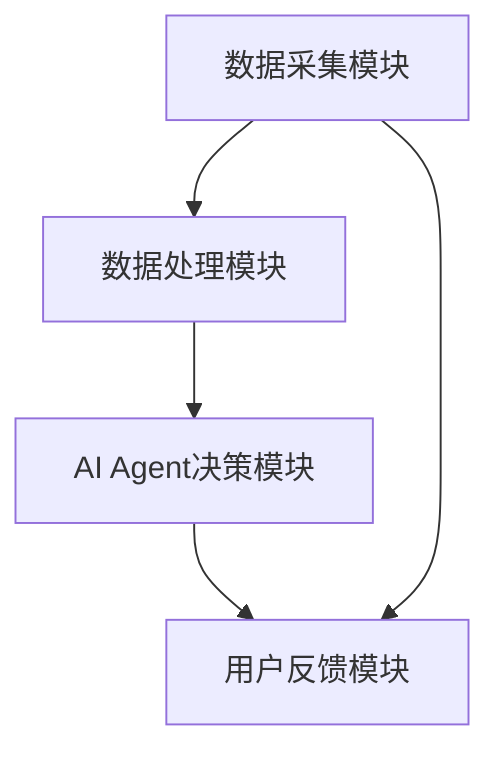
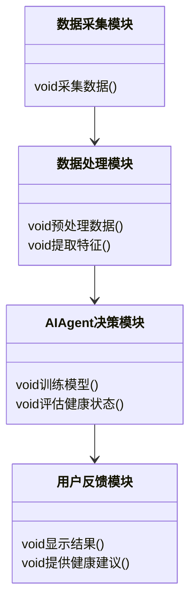
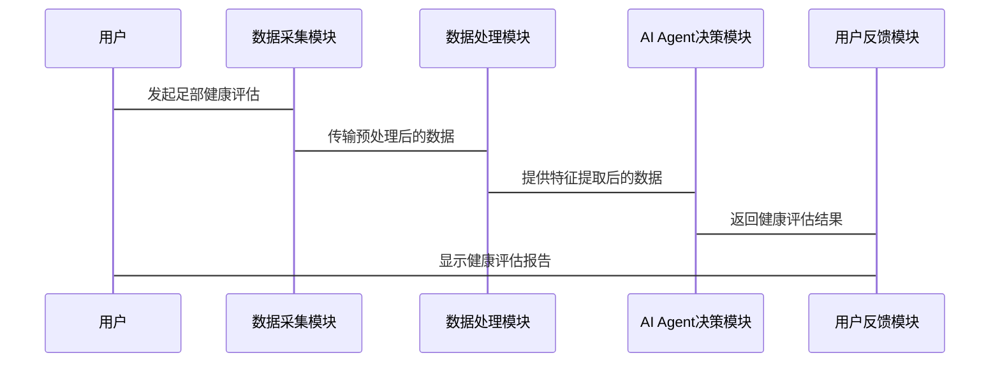

                 


# 第4章: AI Agent在足部健康评估中的算法原理

## 4.1 数据采集与预处理

### 4.1.1 数据采集
智能拖鞋通过内置的多种传感器（如压力传感器、加速度计、陀螺仪等）采集足部的动态数据。传感器数据包括：
- 压力分布数据：测量足部不同区域的压力值，用于分析足部受力情况。
- 加速度数据：测量足部运动时的加速度，用于分析足部运动的动态特征。
- 陀螺仪数据：测量足部运动时的旋转角度，用于分析足部运动的姿态。

### 4.1.2 数据预处理
在数据采集之后，需要对数据进行预处理，以确保数据的准确性和一致性。主要的预处理步骤包括：
1. **数据清洗**：去除噪声和异常值，确保数据的完整性。
2. **数据标准化**：将不同传感器的数据进行归一化处理，使其具有可比性。
3. **数据分割**：将连续的传感器数据分割成独立的时间窗口，每个时间窗口对应一个足部动作或姿势。

### 4.1.3 数据的特征提取
从原始数据中提取有用的特征，是后续算法分析的基础。特征提取的关键步骤包括：
1. **时间特征**：如均值、方差、最大值、最小值、标准差等。
2. **频率特征**：如频谱分析中的频率成分。
3. **空间特征**：如压力中心的位置、压力分布的均匀性等。

---

## 4.2 算法选择与实现

### 4.2.1 基于机器学习的分类算法
为了实现足部健康评估，可以采用多种机器学习算法进行分类或回归分析。以下是一些常用的算法及其适用场景：

#### 1. 支持向量机（SVM）
- **原理**：SVM通过构建一个超平面，将数据点分为两类。适用于小规模、高维数据的分类问题。
- **优点**：对噪声和冗余特征有较强的鲁棒性。
- **缺点**：对于大规模数据，训练时间较长。

#### 2. 神经网络模型
- **原理**：神经网络通过多层非线性变换，能够捕捉数据中的复杂模式。
- **优点**：能够处理非线性关系，适用于复杂的足部健康评估场景。
- **缺点**：需要大量的训练数据，且模型的解释性较差。

#### 3. 随机森林算法
- **原理**：随机森林通过构建多个决策树，并将它们的结果进行集成，提高分类的准确率。
- **优点**：对特征选择具有较好的鲁棒性，适合处理高维数据。
- **缺点**：计算复杂度较高。

### 4.2.2 算法的训练与优化
在选择合适的算法后，需要对模型进行训练和优化。主要步骤包括：
1. **数据分割**：将数据集分为训练集和测试集。
2. **模型训练**：使用训练数据对模型进行参数优化。
3. **模型评估**：通过测试集评估模型的性能，如准确率、召回率、F1分数等。
4. **模型优化**：通过调整模型参数或优化算法，进一步提高模型的性能。

---

## 4.3 算法的数学模型与公式

### 4.3.1 支持向量机（SVM）模型
SVM的目标是最小化以下优化问题：
$$
\min_{w, b, \xi} \frac{1}{2}||w||^2 + C \sum_{i=1}^{n}\xi_i \\
s.t. \quad y_i(w \cdot x_i + b) \geq 1 - \xi_i, \quad \xi_i \geq 0
$$
其中，$w$ 是权重向量，$b$ 是偏置项，$C$ 是惩罚系数，$\xi_i$ 是松弛变量。

### 4.3.2 神经网络模型
神经网络的基本结构包括输入层、隐藏层和输出层。神经网络的前向传播公式为：
$$
a^{(l+1)} = \sigma(w^{(l)} a^{(l)} + b^{(l)})
$$
其中，$a^{(l)}$ 是第 $l$ 层的激活值，$w^{(l)}$ 是权重矩阵，$b^{(l)}$ 是偏置向量，$\sigma$ 是激活函数。

### 4.3.3 随机森林算法
随机森林通过集成多个决策树的预测结果，最终得到一个概率分布：
$$
P(y|x) = \frac{1}{N} \sum_{i=1}^{N} I(y_i = y)
$$
其中，$N$ 是决策树的数量，$I(y_i = y)$ 是指示函数。

---

# 第5章: 系统架构与设计

## 5.1 系统功能设计

### 5.1.1 数据采集模块
数据采集模块负责从智能拖鞋的传感器获取足部的动态数据，包括压力、加速度和旋转角度等。

### 5.1.2 数据处理模块
数据处理模块对采集到的数据进行预处理和特征提取，为后续的健康评估提供基础。

### 5.1.3 AI Agent决策模块
AI Agent决策模块基于机器学习模型对足部健康状态进行分类和预测，生成健康评估报告。

### 5.1.4 用户反馈模块
用户反馈模块将健康评估结果以可视化的方式呈现给用户，并提供个性化的健康建议。

---

## 5.2 系统架构设计

### 5.2.1 系统架构图
以下是系统的整体架构图：



### 5.2.2 系统类图
以下是系统的类图：



### 5.2.3 系统交互序列图
以下是系统的交互序列图：



---

## 5.3 项目实战

### 5.3.1 环境安装
需要安装的环境包括：
1. Python 3.8+
2. TensorFlow 或 Scikit-learn
3. Mermaid 或其他绘图工具
4. 数据采集模块（可模拟传感器数据）

### 5.3.2 核心实现代码
以下是AI Agent决策模块的核心实现代码：

```python
import numpy as np
from sklearn import svm
from sklearn.ensemble import RandomForestClassifier

# 数据预处理
def preprocess_data(data):
    # 数据标准化
    normalized_data = (data - np.mean(data, axis=0)) / np.std(data, axis=0)
    return normalized_data

# 特征提取
def extract_features(data, window_size=10):
    features = []
    for i in range(0, len(data), window_size):
        window = data[i:i+window_size]
        features.append([
            np.mean(window),
            np.std(window),
            np.max(window),
            np.min(window)
        ])
    return features

# 模型训练
def train_model(features, labels):
    # 使用SVM进行训练
    model = svm.SVC()
    model.fit(features, labels)
    return model

# 模型预测
def predict_health(model, new_data):
    normalized_new_data = preprocess_data(new_data)
    extracted_features = extract_features(normalized_new_data)
    prediction = model.predict(extracted_features)
    return prediction

# 示例
data = np.random.rand(100, 3)  # 模拟传感器数据
labels = np.array([0] * 50 + [1] * 50)  # 假设两类健康状态

model = train_model(extract_features(data), labels)
result = predict_health(model, np.random.rand(10, 3))
print(result)
```

### 5.3.3 应用解读
上述代码实现了从数据预处理到模型训练再到预测的完整流程。通过`preprocess_data`函数对数据进行标准化处理，通过`extract_features`函数提取特征，使用SVM进行模型训练，并最终对新的数据进行健康状态预测。

---

## 5.4 小结

通过以上系统架构和算法设计，可以实现一个基于AI Agent的足部健康评估系统。该系统能够实时采集足部数据，通过预处理和特征提取，利用机器学习算法进行健康状态评估，并将结果反馈给用户。这种系统在医疗健康领域具有广阔的应用前景。

