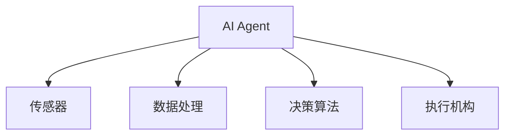
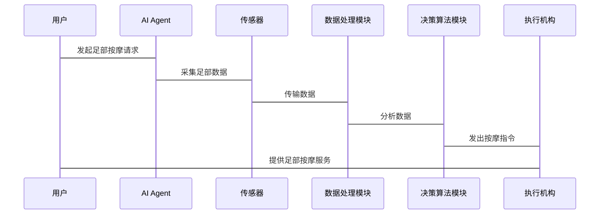

                 


# AI Agent在智能拖鞋中的足部按摩定制

> **关键词**: AI Agent, 足部按摩, 智能拖鞋, 个性化健康, 传感器技术, 算法设计, 系统架构

> **摘要**: 本文详细探讨了AI Agent在智能拖鞋中的足部按摩定制应用，从问题背景、核心概念、算法原理到系统架构、项目实战，全面解析了AI Agent如何实现个性化的足部按摩体验。文章通过技术细节和实际案例，展示了AI Agent在智能拖鞋中的潜力和实现方式。

---

# 第1章: 问题背景与核心概念

## 1.1 问题背景

足部按摩是一种通过刺激足部穴位来改善健康状况的传统疗法。然而，传统足部按摩存在以下问题：

- **个性化不足**: 每个人的足部穴位和健康需求不同，传统按摩方式难以实现个性化服务。
- **效率低下**: 传统足部按摩依赖人工操作，效率低且难以标准化。
- **缺乏反馈机制**: 无法实时监测足部按摩的效果并进行调整。

AI Agent的引入为足部按摩的个性化和智能化提供了可能。通过传感器技术、数据处理和智能算法，AI Agent能够实时感知足部状态，并根据用户需求提供定制化的按摩方案。

## 1.2 核心概念

### 1.2.1 AI Agent的基本定义
AI Agent（人工智能代理）是一种能够感知环境、执行任务并做出决策的智能实体。在足部按摩中，AI Agent通过传感器收集足部数据，分析用户需求，并通过执行机构提供按摩服务。

### 1.2.2 足部按摩定制的核心要素
- **传感器**: 用于采集足部的压力、温度、湿度等数据。
- **AI算法**: 用于分析数据并生成个性化的按摩方案。
- **执行机构**: 用于根据AI算法的指令提供按摩服务。

### 1.2.3 AI Agent与足部按摩的关系
AI Agent通过传感器获取足部数据，分析用户需求后，通过执行机构提供个性化的按摩服务。这种交互式体验能够显著提升用户的健康效果和使用体验。

## 1.3 问题描述

足部按摩的个性化需求与传统按摩方式的低效之间存在矛盾。AI Agent通过智能化的传感器和算法，能够解决以下问题：

- 如何实时感知足部状态并提供个性化按摩方案。
- 如何通过传感器和AI算法实现智能化的足部按摩。
- 如何设计高效的系统架构以支持AI Agent的运行。

## 1.4 问题解决

### 1.4.1 AI Agent的核心功能
- **感知功能**: 通过传感器采集足部数据。
- **决策功能**: 根据数据生成个性化按摩方案。
- **执行功能**: 通过执行机构提供按摩服务。

### 1.4.2 足部按摩定制的实现方式
- **传感器数据采集**: 采集足部的压力、温度、湿度等数据。
- **数据分析与处理**: 使用AI算法分析数据并生成按摩方案。
- **按摩执行**: 根据方案通过执行机构提供按摩服务。

### 1.4.3 智能拖鞋的系统架构
- **硬件部分**: 包括传感器、执行机构和通信模块。
- **软件部分**: 包括数据处理算法、AI算法和控制模块。

---

# 第2章: AI Agent与足部按摩的核心概念

## 2.1 AI Agent的基本原理

### 2.1.1 AI Agent的定义与分类
AI Agent可以分为两类：**反应式AI Agent**和**认知式AI Agent**。反应式AI Agent通过实时感知环境并做出反应，而认知式AI Agent则具备更高的自主决策能力。

### 2.1.2 AI Agent的核心功能
- **感知功能**: 通过传感器获取环境数据。
- **决策功能**: 基于数据做出决策。
- **执行功能**: 执行决策并输出结果。

### 2.1.3 AI Agent的交互方式
AI Agent可以通过以下方式与用户交互：
1. **语音交互**: 用户通过语音指令与AI Agent互动。
2. **触控交互**: 用户通过触控界面与AI Agent互动。
3. **手势交互**: 用户通过手势指令与AI Agent互动。

## 2.2 足部按摩的核心原理

### 2.2.1 足部按摩的基本原理
足部按摩通过刺激足部穴位来调节人体的生理功能，从而达到健康效果。

### 2.2.2 足部按摩的个性化需求
每个人的身体状况和健康需求不同，因此需要个性化的足部按摩方案。

### 2.2.3 足部按摩的健康效果
足部按摩可以缓解疲劳、促进血液循环、改善睡眠质量等。

## 2.3 AI Agent与足部按摩的结合

### 2.3.1 AI Agent在足部按摩中的作用
- **数据采集**: 通过传感器采集足部数据。
- **数据分析**: 通过AI算法分析数据并生成按摩方案。
- **按摩执行**: 根据方案执行按摩操作。

### 2.3.2 足部按摩定制的核心要素
- **传感器**: 采集足部数据。
- **AI算法**: 分析数据并生成方案。
- **执行机构**: 执行按摩操作。

### 2.3.3 AI Agent与足部按摩的交互流程
1. **数据采集**: 传感器采集足部数据。
2. **数据分析**: AI算法分析数据并生成按摩方案。
3. **按摩执行**: 执行机构根据方案提供按摩服务。

---

# 第3章: AI Agent在足部按摩中的算法原理

## 3.1 AI Agent的感知算法

### 3.1.1 数据采集与处理
- **数据采集**: 通过传感器采集足部数据。
- **数据预处理**: 对采集的数据进行清洗和标准化处理。
- **特征提取**: 提取数据中的关键特征。

### 3.1.2 数据分析与分类
- **数据分类**: 使用机器学习算法对数据进行分类。
- **特征选择**: 选择对分类有重要影响的特征。

### 3.1.3 数据可视化
- **数据可视化**: 使用图表展示数据分布和分类结果。

## 3.2 AI Agent的决策算法

### 3.2.1 基于规则的决策算法
- **规则定义**: 定义决策规则。
- **规则执行**: 根据规则做出决策。

### 3.2.2 基于机器学习的决策算法
- **模型训练**: 使用训练数据训练模型。
- **模型预测**: 使用模型对新数据进行预测。

### 3.2.3 基于深度学习的决策算法
- **神经网络模型**: 使用深度神经网络进行决策。
- **模型优化**: 对模型进行优化和调参。

## 3.3 算法实现

### 3.3.1 算法实现步骤
1. **数据采集**: 采集足部数据。
2. **数据预处理**: 对数据进行清洗和标准化。
3. **特征提取**: 提取数据中的关键特征。
4. **模型训练**: 使用训练数据训练模型。
5. **模型预测**: 使用模型对新数据进行预测。

### 3.3.2 算法实现代码
```python
import numpy as np
from sklearn import datasets
from sklearn.tree import DecisionTreeClassifier

# 数据集加载
iris = datasets.load_iris()
X = iris.data
y = iris.target

# 模型训练
clf = DecisionTreeClassifier()
clf.fit(X, y)

# 模型预测
new_data = np.array([[5.0, 3.0, 1.0, 0.2]])
print(clf.predict(new_data))
```

---

# 第4章: AI Agent在足部按摩中的系统架构设计

## 4.1 系统架构概述

### 4.1.1 系统架构图


### 4.1.2 系统功能模块
- **传感器模块**: 采集足部数据。
- **数据处理模块**: 对数据进行处理和分析。
- **决策算法模块**: 根据数据生成按摩方案。
- **执行机构模块**: 执行按摩操作。

## 4.2 系统接口设计

### 4.2.1 系统接口
- **传感器接口**: 连接传感器和数据处理模块。
- **数据处理接口**: 连接数据处理模块和决策算法模块。
- **执行机构接口**: 连接决策算法模块和执行机构模块。

## 4.3 系统交互流程

### 4.3.1 系统交互流程图


---

# 第5章: 项目实战

## 5.1 环境安装

### 5.1.1 环境需求
- **Python**: 3.6+
- **TensorFlow**: 2.0+
- **NumPy**: 1.20+

### 5.1.2 安装依赖
```bash
pip install numpy tensorflow scikit-learn
```

## 5.2 核心实现

### 5.2.1 传感器数据采集
```python
import numpy as np
import serial

# 连接传感器
ser = serial.Serial('COM3', 9600)
data = ser.readline().decode().strip()
print("传感器数据:", data)
```

### 5.2.2 数据分析与处理
```python
import pandas as pd
from sklearn import preprocessing

# 数据预处理
data = pd.DataFrame({'特征1': [1, 2, 3], '特征2': [4, 5, 6]})
data_normalized = preprocessing.normalize(data)
print("标准化数据:", data_normalized)
```

### 5.2.3 AI算法实现
```python
from sklearn.tree import DecisionTreeClassifier

# 训练决策树模型
model = DecisionTreeClassifier()
model.fit(X_train, y_train)
print("模型训练完成")
```

## 5.3 项目案例分析

### 5.3.1 案例分析
假设一个用户的足部数据如下：
- 特征1: 5
- 特征2: 3

通过AI算法分析，生成个性化的按摩方案，并通过执行机构提供按摩服务。

### 5.3.2 案例小结
通过AI Agent的感知、决策和执行功能，用户能够获得个性化的足部按摩服务，显著提升健康效果和使用体验。

---

# 第6章: 最佳实践与总结

## 6.1 小结

AI Agent在智能拖鞋中的足部按摩定制是一种创新的健康解决方案。通过传感器技术、AI算法和执行机构的结合，用户能够获得个性化的足部按摩服务，显著提升健康效果和使用体验。

## 6.2 注意事项

- **数据隐私**: 确保用户数据的安全性和隐私性。
- **系统稳定性**: 确保系统的稳定性和可靠性。
- **用户体验**: 提供良好的用户体验和交互设计。

## 6.3 拓展阅读

- **传感器技术**: 探索更多传感器类型和应用。
- **AI算法优化**: 深入研究AI算法的优化和改进。
- **系统架构设计**: 学习更复杂的系统架构设计方法。

---

通过本文的详细讲解，读者可以全面了解AI Agent在智能拖鞋中的足部按摩定制的实现过程和技术细节。从问题背景到系统架构设计，再到项目实战，本文为读者提供了完整的解决方案和实际案例分析，帮助读者更好地理解和应用AI Agent技术。

