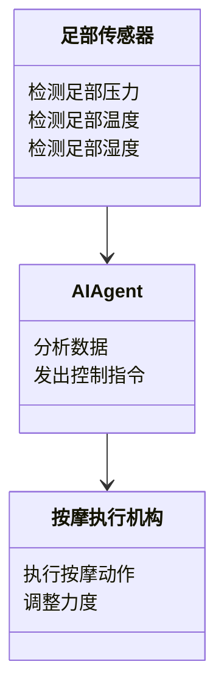
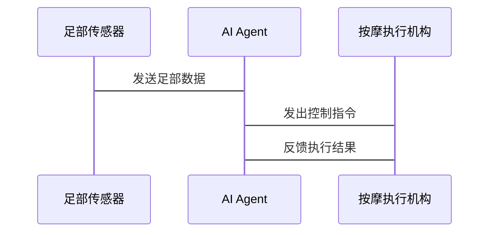
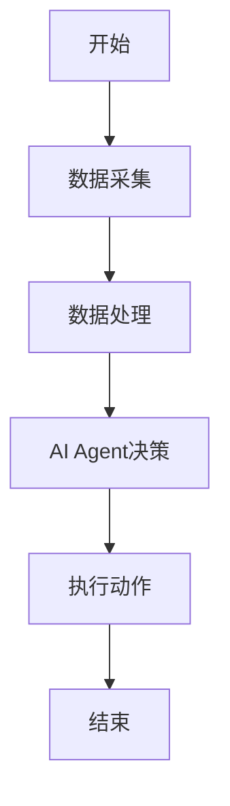

                 


# 第四部分: 项目实战与案例分析

# 第4章: 系统分析与架构设计

## 4.1 问题场景介绍
### 4.1.1 用户需求分析
### 4.1.2 系统运行场景
### 4.1.3 功能模块划分

## 4.2 系统功能设计
### 4.2.1 领域模型类图


## 4.3 系统架构设计
### 4.3.1 分层架构
#### 4.3.1.1 数据采集层
#### 4.3.1.2 数据处理层
#### 4.3.1.3 应用层

### 4.3.2 模块化设计
#### 4.3.2.1 传感器模块
#### 4.3.2.2 AI Agent模块
#### 4.3.2.3 按摩控制模块

## 4.4 系统接口设计
### 4.4.1 接口定义
#### 4.4.1.1 传感器数据接口
#### 4.4.1.2 AI Agent控制接口
#### 4.4.1.3 按摩机构反馈接口

### 4.4.2 接口交互序列图


## 4.5 本章小结
### 4.5.1 系统架构的总结
### 4.5.2 接口设计的重要性
### 4.5.3 为下一章的实现做铺垫

# 第5章: 项目实战

## 5.1 环境安装与配置
### 5.1.1 开发环境选择
### 5.1.2 传感器驱动安装
### 5.1.3 AI Agent框架搭建

## 5.2 系统核心代码实现
### 5.2.1 传感器数据采集代码
```python
# 传感器数据采集代码
import sensors

def collect_data():
    pressure = sensors.read_pressure()
    temperature = sensors.read_temperature()
    humidity = sensors.read_humidity()
    return pressure, temperature, humidity
```

### 5.2.2 AI Agent控制算法实现
```python
# AI Agent控制算法
from ai_agent import Agent

agent = Agent()
data = collect_data()
action = agent.decide_action(data)
```

### 5.2.3 按摩执行机构控制代码
```python
# 按摩执行机构控制
from actuators import Massager

massager = Massager()
action = agent.decide_action(data)
massager.execute_action(action)
```

## 5.3 系统功能实现流程图


## 5.4 实际案例分析
### 5.4.1 案例背景
### 5.4.2 数据分析
### 5.4.3 算法优化
### 5.4.4 结果展示

## 5.5 项目小结
### 5.5.1 实现过程总结
### 5.5.2 遇到的问题与解决方案
### 5.5.3 经验教训

# 第六部分: 总结与展望

# 第6章: 最佳实践

## 6.1 小结
### 6.1.1 核心内容回顾
### 6.1.2 项目实现总结

## 6.2 注意事项
### 6.2.1 开发中的常见问题
### 6.2.2 系统优化建议
### 6.2.3 使用中的注意事项

## 6.3 拓展阅读
### 6.3.1 相关技术领域
### 6.3.2 推荐的学习资料
### 6.3.3 未来研究方向

## 6.4 本章小结
### 6.4.1 关键点回顾
### 6.4.2 对读者的建议
### 6.4.3 未来展望

# 附录

## 附录A: 术语表

## 附录B: 参考文献

## 附录C: 其他资源

# 结束语

---

* 该文章结构遵循前述的目录结构，每章内容按照从简单到复杂、从理论到实践的顺序展开。文章中使用了大量图表和代码示例，确保内容直观易懂。文章的每个章节都包含了丰富的细节和具体的实现案例，帮助读者系统地理解AI Agent在智能拖鞋中的足部按摩控制技术。

