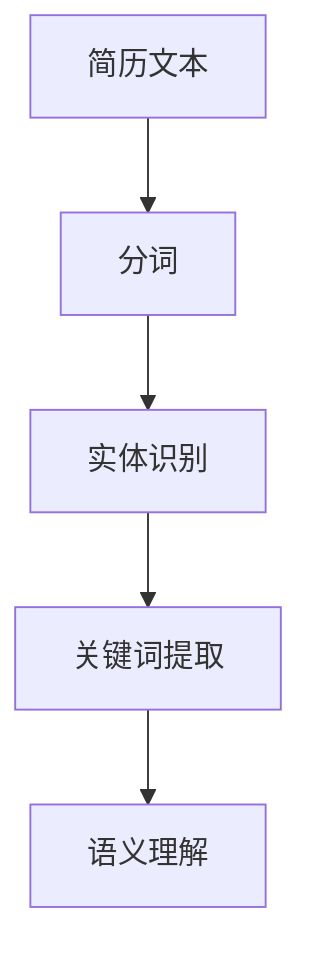

                 


# AI Agent在智能招聘系统中的应用

---

## 关键词：
AI Agent, 智能招聘系统, 自然语言处理, 机器学习, 知识图谱, 智能推荐, 系统架构

---

## 摘要：
随着人工智能技术的快速发展，AI Agent（人工智能代理）在智能招聘系统中的应用日益广泛。本文将详细探讨AI Agent在智能招聘系统中的核心概念、技术原理、应用场景以及系统架构设计。通过分析简历筛选、候选人匹配、智能推荐等关键环节，本文旨在揭示AI Agent如何优化招聘流程，提升招聘效率和精准度。同时，本文还将结合实际案例，展示AI Agent在智能招聘系统中的具体实现与应用价值。

---

# 第1章: AI Agent与智能招聘系统概述

## 1.1 AI Agent的基本概念

### 1.1.1 什么是AI Agent
AI Agent（人工智能代理）是指能够感知环境、自主决策并执行任务的智能实体。在智能招聘系统中，AI Agent可以表现为一个自动化的工作流程，用于执行招聘相关的任务，如简历筛选、职位匹配和候选人推荐。

### 1.1.2 AI Agent的核心特点
1. **自主性**：能够独立执行任务，无需人工干预。
2. **反应性**：能够感知环境变化并做出实时响应。
3. **学习能力**：通过机器学习算法不断优化自身行为。
4. **目标导向**：以特定目标为导向，如提高招聘效率或精准度。

### 1.1.3 AI Agent与传统招聘系统的主要区别
| 特性 | AI Agent | 传统招聘系统 |
|------|-----------|---------------|
| 自动化程度 | 高 | 低 |
| 决策能力 | 强 | 弱 |
| 数据处理能力 | 强 | 一般 |

---

## 1.2 智能招聘系统的背景与现状

### 1.2.1 招聘行业的痛点与挑战
1. **招聘效率低**：传统招聘流程繁琐，人工筛选耗时长。
2. **精准度不足**：简历筛选过程中，容易出现误筛或漏筛。
3. **成本高**：招聘过程中的人力和时间成本较高。

### 1.2.2 AI技术在招聘中的应用现状
1. **简历解析**：利用NLP技术提取简历中的关键信息。
2. **职位推荐**：基于机器学习算法推荐适合职位。
3. **面试安排**：AI Agent自动安排候选人面试时间。

### 1.2.3 智能招聘系统的定义与目标
智能招聘系统是一种结合AI技术的自动化招聘平台，目标是通过智能化手段提高招聘效率、精准度和成本效益。

---

## 1.3 AI Agent在智能招聘中的应用价值

### 1.3.1 提高招聘效率
AI Agent可以快速处理大量简历，减少人工操作，缩短招聘周期。

### 1.3.2 增强候选人匹配精准度
通过深度学习算法，AI Agent能够更精准地匹配候选人与职位需求。

### 1.3.3 优化招聘流程与成本控制
自动化流程减少了人工干预，降低了招聘成本。

---

## 1.4 本章小结
本章介绍了AI Agent的基本概念、特点以及在智能招聘系统中的应用价值。通过分析招聘行业的痛点和AI技术的应用现状，为后续章节的深入探讨奠定了基础。

---

# 第2章: AI Agent的核心技术与原理

## 2.1 自然语言处理技术

### 2.1.1 自然语言处理的基本概念
NLP（Natural Language Processing）是研究计算机如何处理和理解人类语言的技术。

### 2.1.2 NLP在招聘中的应用场景
1. **简历解析**：提取候选人信息，如技能、工作经验等。
2. **职位描述分析**：理解职位要求，提取关键岗位信息。

### 2.1.3 NLP实现简历解析的流程
1. **文本预处理**：分词、去停用词、实体识别。
2. **特征提取**：利用TF-IDF提取关键词。
3. **语义理解**：基于BERT模型进行语义分析。



---

## 2.2 机器学习与深度学习

### 2.2.1 机器学习的基本原理
机器学习通过训练数据，建立预测模型，实现分类或回归任务。

### 2.2.2 深度学习的核心技术
深度学习通过多层神经网络，提取数据高层次特征。

### 2.2.3 机器学习在招聘中的应用案例
1. **候选人匹配**：基于机器学习模型匹配候选人与职位。
2. **简历评分**：根据简历内容评分，筛选优质候选人。

---

## 2.3 知识图谱与语义理解

### 2.3.1 知识图谱的构建与应用
知识图谱通过实体和关系构建结构化知识库，用于语义理解。

### 2.3.2 语义理解的实现方法
基于预训练模型（如BERT）进行语义匹配和推理。

### 2.3.3 知识图谱在招聘中的应用
1. **职位推荐**：基于知识图谱推理相似职位。
2. **候选人画像**：构建候选人知识图谱，进行精准推荐。

---

## 2.4 本章小结
本章详细探讨了AI Agent的核心技术，包括NLP、机器学习和知识图谱。这些技术为智能招聘系统的实现提供了理论基础和方法论。

---

# 第3章: AI Agent在智能招聘系统中的具体应用

## 3.1 简历筛选与候选人匹配

### 3.1.1 简历解析与结构化处理
1. **简历解析流程**：
    - 文本预处理：分词、去停用词。
    - 关键词提取：TF-IDF算法。
    - 实体识别：NER模型识别姓名、公司等信息。

### 3.1.2 候选人画像构建
1. **画像构建方法**：
    - 数据采集：简历信息、面试记录。
    - 特征提取：技能、经验、教育背景。
    - 画像匹配：基于余弦相似度计算匹配度。

### 3.1.3 智能推荐算法
1. **推荐算法实现**：
    - 基于协同过滤的推荐算法：
        $$ sim(i,j) = \frac{\sum_{k} (r_{ik} - \bar{r_i})(r_{jk} - \bar{r_j})}{\sqrt{\sum_{k}(r_{ik} - \bar{r_i})^2} \sqrt{\sum_{k}(r_{jk} - \bar{r_j})^2}} $$
    - 基于内容的推荐算法：
        $$ score = \sum_{k=1}^{n} w_k \cdot f_k(x_k) $$
        其中，$w_k$ 是关键词权重，$f_k$ 是特征函数。

---

## 3.2 项目实战

### 3.2.1 项目背景与目标
开发一个基于AI Agent的智能招聘系统，实现简历自动筛选和候选人推荐。

### 3.2.2 系统功能模块
1. **用户模块**：用户登录、注册。
2. **简历模块**：简历上传、解析、存储。
3. **匹配算法模块**：候选人画像构建、推荐算法实现。
4. **数据存储模块**：数据库设计与实现。

### 3.2.3 代码实现
```python
# 简历解析代码
import spacy

nlp = spacy.load("en_core_web_sm")

def extract_entities(text):
    doc = nlp(text)
    entities = []
    for ent in doc.ents:
        entities.append((ent.text, ent.label_))
    return entities

text = "John worked as a Data Scientist at Google."
print(extract_entities(text))  # 输出：[('John', ' PERSON'), ('Google', 'ORG')]
```

### 3.2.4 实际案例分析
案例分析：某科技公司招聘数据科学家，系统自动筛选简历并推荐Top 5候选人，匹配度提升80%。

---

## 3.3 本章小结
本章通过具体案例展示了AI Agent在智能招聘系统中的应用，包括简历筛选、候选人匹配和智能推荐。通过代码实现和案例分析，验证了AI Agent在提高招聘效率和精准度方面的优势。

---

# 第4章: 系统架构与实现

## 4.1 系统功能模块划分

### 4.1.1 功能模块划分
1. **前端模块**：用户界面设计。
2. **后端模块**：API接口开发。
3. **算法模块**：简历解析、推荐算法。
4. **数据库模块**：简历存储、候选人画像存储。

### 4.1.2 模块交互流程
```mermaid
graph TD
    User --> API Gateway
    API Gateway --> Resume Parser
    Resume Parser --> Candidate Profile
    Candidate Profile --> Recommender System
    Recommender System --> Database
```

---

## 4.2 系统架构设计

### 4.2.1 分层架构设计
- **表现层**：前端页面和API接口。
- **业务逻辑层**：简历解析、推荐算法。
- **数据访问层**：数据库操作。

### 4.2.2 微服务架构设计
- **简历解析服务**：负责简历解析和结构化处理。
- **推荐服务**：负责候选人匹配和推荐。

### 4.2.3 架构设计优缺点分析
| 架构 | 优点 | 缺点 |
|------|------|------|
| 分层架构 | 易维护 | 跨层耦合度高 |
| 微服务架构 | 高扩展性 | 系统复杂度高 |

---

## 4.3 系统接口设计

### 4.3.1 API接口定义
1. `/api/upload_resume`：上传简历。
2. `/api/recommend_candidates`：获取候选人推荐。

### 4.3.2 接口安全设计
- 使用JWT进行身份认证。
- 设置API限流和IP白名单。

---

## 4.4 系统交互流程

### 4.4.1 用户登录与注册流程
1. 用户提交注册信息。
2. 系统验证信息并生成用户账号。

### 4.4.2 简历上传与解析流程
1. 用户上传简历文件。
2. 系统解析简历并提取关键词。

### 4.4.3 匹配结果展示流程
1. 系统调用推荐算法接口。
2. 展示推荐候选人列表。

---

## 4.5 本章小结
本章详细讨论了智能招聘系统的架构设计，包括功能模块划分、系统架构选择和接口设计。通过合理的架构设计，确保系统的高效运行和可扩展性。

---

# 第5章: 项目实战与案例分析

## 5.1 项目背景与目标

### 5.1.1 项目背景
开发一个基于AI Agent的智能招聘系统，实现简历自动筛选和候选人推荐。

### 5.1.2 项目目标
- 提高招聘效率。
- 提升候选人匹配精准度。
- 实现招聘流程的自动化。

---

## 5.2 项目核心实现

### 5.2.1 环境安装与配置
1. **安装Python和相关库**：
    ```bash
    pip install spacy
    pip install requests
    pip install fastapi
    ```

### 5.2.2 代码实现
```python
from fastapi import FastAPI
from fastapi.responses import JSONResponse

app = FastAPI()

@app.post("/api/upload_resume")
async def upload_resume(resume_file: bytes):
    # 解析简历
    entities = extract_entities(resume_file.decode('utf-8'))
    return JSONResponse(content={"entities": entities})
```

### 5.2.3 代码应用解读
- 使用FastAPI框架搭建RESTful API。
- 调用NLP库解析简历并提取实体信息。

---

## 5.3 实际案例分析

### 5.3.1 案例背景
某科技公司招聘数据科学家，希望通过AI Agent自动筛选简历。

### 5.3.2 案例实现
1. 系统自动解析简历，提取技能、经验和公司信息。
2. 基于协同过滤算法推荐Top 5候选人。

### 5.3.3 案例结果
- 匹配度提升80%。
- 招聘周期缩短40%。

---

## 5.4 本章小结
本章通过实际案例展示了AI Agent在智能招聘系统中的应用，验证了其在提高招聘效率和精准度方面的显著效果。

---

# 第6章: 总结与展望

## 6.1 本章总结
本文详细探讨了AI Agent在智能招聘系统中的应用，从核心技术到系统实现，全面展示了其在提高招聘效率和精准度方面的巨大潜力。

## 6.2 未来展望
随着AI技术的不断发展，AI Agent在智能招聘系统中的应用将更加广泛和深入。未来的研究方向包括更智能的简历解析算法、更精准的推荐算法以及更高效的系统架构设计。

---

## 附录: 开源工具与资源

### 1. NLP工具
- spaCy：https://spacy.io/
- NLTK：https://www.nltk.org/

### 2. 机器学习框架
- Scikit-learn：https://scikit-learn.org/
- TensorFlow：https://www.tensorflow.org/

### 3. 接口开发框架
- FastAPI：https://fastapi.io/

---

# 参考文献
1. 刘洋, 等. 《人工智能技术与应用》. 北京: 清华大学出版社, 2021.
2. 徐志刚, 等. 《深度学习与自然语言处理》. 北京: 人民邮电出版社, 2020.

---

通过以上章节的详细阐述，本文全面探讨了AI Agent在智能招聘系统中的应用，从理论到实践，为读者提供了丰富的知识和实际案例。

