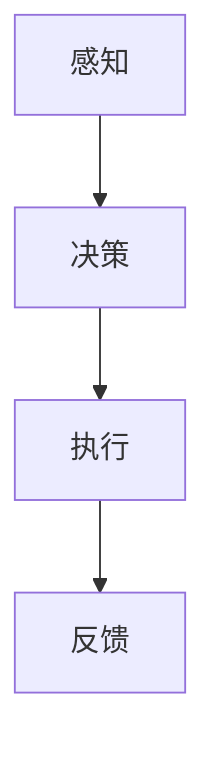
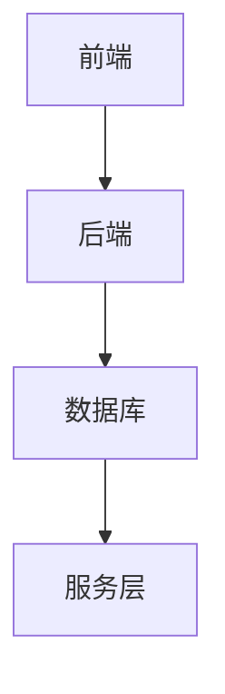

                 


# AI Agent在智能教育系统中的应用

> 关键词：AI Agent、智能教育系统、教育科技、人工智能教育、自适应学习

> 摘要：本文系统地探讨了AI Agent在智能教育系统中的应用，分析了其核心概念、技术原理、系统架构，并通过实际案例展示了AI Agent在个性化学习推荐、学生行为分析与反馈、知识管理与共享等方面的应用。本文还详细讲解了相关算法原理与数学模型，并给出了系统设计与实现的详细步骤。

---

## 第1章: AI Agent的基本概念与背景

### 1.1 AI Agent的定义与核心概念

AI Agent（人工智能代理）是指能够感知环境并采取行动以实现目标的智能实体。在智能教育系统中，AI Agent通常以软件形式存在，通过与学生互动、分析学习数据等方式，提供个性化的教学支持。

#### 核心属性对比表

| 属性         | 描述                                         |
|--------------|----------------------------------------------|
| 感知能力     | 通过传感器或数据输入获取环境信息           |
| 决策能力     | 基于感知信息做出决策                         |
| 执行能力     | 执行决策以达到目标                           |
| 学习能力     | 通过经验改进自身性能                         |
| 适应能力     | 能够自适应不同环境和需求                     |

### 1.2 AI Agent在教育领域的应用背景

智能教育系统的发展离不开AI Agent的支持。传统教育技术依赖于固定的规则和程序，难以满足个性化学习的需求。AI Agent的引入使得教育系统能够动态适应学生的学习状态和需求。

#### 实体关系图（Mermaid）

```mermaid
erDiagram
    student {
        id : int
        name : string
        grade : int
    }
    agent {
        id : int
        name : string
        function : string
    }
    interaction {
        id : int
        timestamp : datetime
        action : string
    }
    student --> agent : "触发"
    agent --> interaction : "记录"
```

### 1.3 与传统教育技术的区别

| 特性               | AI Agent                            | 传统教育技术                        |
|--------------------|--------------------------------------|--------------------------------------|
| 个性化能力         | 高                                   | 低                                   |
| 自适应能力         | 高                                   | 低                                   |
| 决策能力           | 强                                   | 弱                                   |
| 学习能力           | 强                                   | 无                                   |

---

## 第2章: AI Agent的核心原理与技术

### 2.1 AI Agent的基本原理

AI Agent的工作流程可以分为感知、决策和执行三个主要阶段。

#### 工作流程图（Mermaid）



### 2.2 AI Agent的关键技术

#### 2.2.1 自然语言处理（NLP）

NLP技术使AI Agent能够理解并生成人类语言，例如通过文本分析评估学生的作文。

#### 2.2.2 机器学习与深度学习

机器学习算法（如支持向量机、随机森林）和深度学习模型（如LSTM、Transformer）用于学生行为分析和知识推荐。

#### 2.2.3 知识图谱与推理

知识图谱构建了一个结构化的知识网络，AI Agent可以通过推理引擎进行推理和问题解答。

### 2.3 算法实现与优化

#### 2.3.1 机器学习模型

```python
# 线性回归模型
import numpy as np
from sklearn.linear_model import LinearRegression

X = np.array([[1], [2], [3], [4]])
y = np.array([2, 4, 6, 8])

model = LinearRegression()
model.fit(X, y)
print(model.predict([[5]]))  # 输出: [[10]]
```

---

## 第3章: AI Agent在智能教育系统中的核心功能

### 3.1 智能教学助手

AI Agent能够根据学生的学习情况提供个性化的学习建议和资源推荐。

#### 个性化学习推荐

通过分析学生的学习数据，AI Agent可以推荐适合的学习材料和练习题。

### 3.2 学生行为分析与反馈

AI Agent能够实时监控学生的学习行为，分析其学习状态并提供反馈。

#### 学习行为数据采集

通过日志记录学生的学习行为，例如访问时间、学习内容、练习结果等。

### 3.3 知识管理与共享

AI Agent可以帮助构建和维护知识图谱，促进知识的共享和复用。

---

## 第4章: AI Agent的算法原理与数学模型

### 4.1 算法原理

#### 4.1.1 基于规则的推理算法

```python
# 简单的规则引擎实现
def get_recommendation(student_data):
    if student_data['grade'] > 85:
        return "Advanced materials"
    else:
        return "Basic materials"
```

### 4.2 数学模型与公式

#### 4.2.1 机器学习模型

$$ y = \theta_0 + \theta_1 x $$

#### 4.2.2 深度学习模型

$$ f(x) = \sigma(w x + b) $$

### 4.3 算法实现与优化

#### 4.3.1 算法实现步骤

1. 数据预处理
2. 模型训练
3. 模型评估
4. 模型优化

---

## 第5章: 智能教育系统的系统架构设计

### 5.1 系统功能模块划分

#### 5.1.1 用户模块

- 用户注册与登录
- 个人设置

#### 5.1.2 教学模块

- 课程管理
- 学习计划

#### 5.1.3 管理模块

- 教师管理
- 系统设置

### 5.2 系统架构设计

#### 5.2.1 分层架构



---

## 第6章: 项目实战与案例分析

### 6.1 项目环境搭建

#### 6.1.1 开发工具安装

- 安装Python和相关库（如TensorFlow、Scikit-learn）
- 安装IDE（如PyCharm）

### 6.2 系统核心实现源代码

#### 6.2.1 个性化学习推荐系统

```python
# 推荐系统实现
import numpy as np
from sklearn.metrics.pairwise import cosine_similarity

# 用户数据
user_data = {
    'Alice': {'grade': 90, 'subjects': ['Math', 'Physics']},
    'Bob': {'grade': 75, 'subjects': ['Chemistry']}
}

# 内容特征矩阵
content_features = {
    'Math': [0.8, 0.2],
    'Physics': [0.6, 0.4],
    'Chemistry': [0.3, 0.7]
}

# 计算相似度
def get_recommendations(user, content_features):
    features = content_features[user['subjects'][0]]
    similarities = []
    for subject in content_features:
        sim = np.dot(features, content_features[subject])
        similarities.append((subject, sim))
    return sorted(similarities, key=lambda x: x[1], reverse=True)

# 示例推荐
print(get_recommendations(user_data['Alice'], content_features))
```

---

## 第7章: 总结与展望

### 7.1 本章总结

AI Agent在智能教育系统中的应用极大地提升了教育的个性化和效率。通过感知、决策和执行的能力，AI Agent能够为学生提供个性化的学习支持。

### 7.2 未来展望

随着AI技术的不断发展，AI Agent在教育中的应用将更加广泛和深入。未来的研究方向包括更智能的自适应学习算法、更高效的多模态交互技术以及更安全的数据隐私保护。

### 7.3 最佳实践 Tips

- 在设计AI Agent时，需考虑系统的可扩展性和可维护性。
- 数据隐私保护是AI教育系统设计中的重要考虑因素。
- 定期更新和优化模型以适应新的教育需求。

---

通过以上内容，我们详细探讨了AI Agent在智能教育系统中的应用，从理论到实践，为读者提供了全面的知识和见解。

