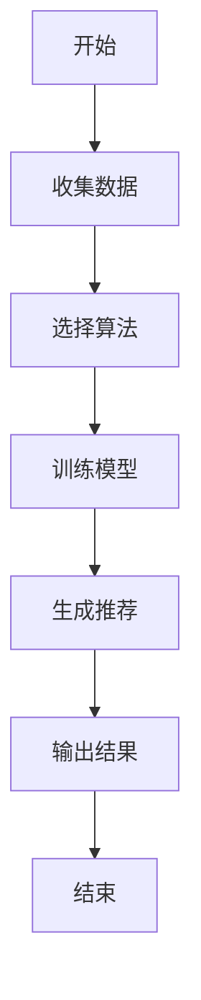
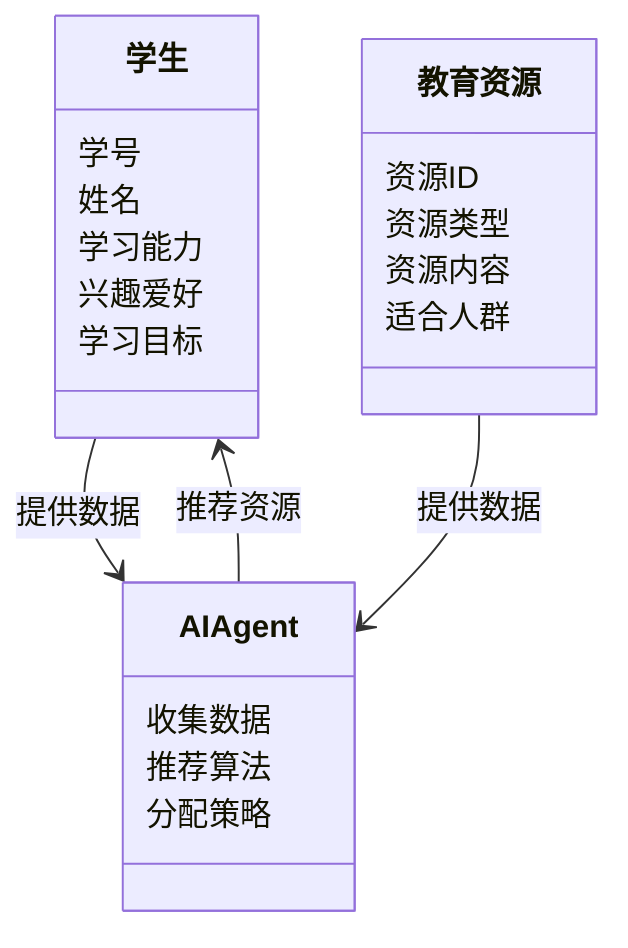
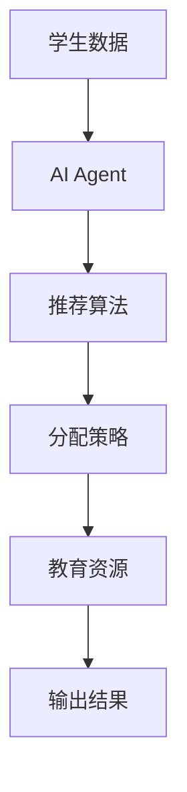

                 


# AI Agent在智能教育资源个性化分配中的应用

## 关键词：
AI Agent, 个性化教育, 教育资源分配, 推荐系统, 算法原理, 系统架构

## 摘要：
本文探讨了AI Agent在智能教育资源个性化分配中的应用，分析了教育资源分配的现状与挑战，详细讲解了AI Agent的核心概念与原理，推荐系统的算法实现，系统架构设计，以及实际项目中的应用案例。文章通过背景介绍、核心概念、算法原理、系统架构、项目实战和最佳实践等部分，全面展示了AI Agent如何优化教育资源分配，实现个性化教育。

---

# 第一部分: AI Agent与智能教育资源个性化分配的背景与概念

## 第1章: 问题背景与描述

### 1.1 教育资源分配的现状与挑战
#### 1.1.1 当前教育资源分配的问题
教育资源分配的不均衡性：不同地区、学校和家庭之间存在教育资源分配不均的问题，部分学生无法获得高质量的教育资源。
个性化教育需求未被满足：学生的学习能力和兴趣爱好各不相同，传统教育模式难以满足每个学生的个性化需求。
教育资源利用效率低下：教育资源的分配和使用效率不高，部分资源被闲置，而部分需求却得不到满足。

#### 1.1.2 个性化教育的需求
个性化学习：根据学生的学习能力和兴趣爱好，提供定制化的学习计划和资源。
精准匹配：通过数据分析和智能推荐，将合适的教育资源精准匹配给需要的学生。
动态调整：根据学生的学习进展和反馈，动态调整教育资源的分配策略。

#### 1.1.3 AI Agent在教育领域的潜力
AI Agent是一种能够感知环境、自主决策并执行任务的智能体，能够通过数据分析和机器学习算法，优化教育资源的分配。
AI Agent可以实现教育资源的智能化推荐和个性化分配，提高教育资源的利用效率，满足学生的个性化学习需求。

### 1.2 问题解决与边界
#### 1.2.1 AI Agent如何解决教育资源分配问题
AI Agent通过收集和分析学生的学习数据，利用推荐算法，将教育资源精准匹配给最需要的学生。
AI Agent能够实时监控学生的学习进展，动态调整教育资源的分配策略，确保每个学生都能获得适合的学习资源。

#### 1.2.2 问题的边界与外延
教育资源分配的边界：AI Agent在教育资源分配中的应用，主要集中在教育资源的推荐和匹配方面，不涉及教育资源的实际分配和管理。
个性化教育的外延：个性化教育不仅包括学习资源的分配，还包括教学方法、课程设计等多个方面。

#### 1.2.3 核心概念与关键要素
核心概念：AI Agent、个性化教育、教育资源分配。
关键要素：学生数据、教育资源、推荐算法、分配策略。

### 1.3 本章小结
本章通过分析教育资源分配的现状与挑战，提出了AI Agent在个性化教育中的应用潜力。AI Agent能够通过智能化的推荐和动态调整，优化教育资源的分配，满足学生的个性化学习需求。

---

## 第2章: AI Agent的基本原理

### 2.1 AI Agent的定义与特征
#### 2.1.1 AI Agent的定义
AI Agent是一种能够感知环境、自主决策并执行任务的智能体，能够通过数据驱动的方法，实现复杂任务的自动化和智能化。

#### 2.1.2 AI Agent的核心特征
- 感知环境：AI Agent能够通过传感器或数据接口，感知外部环境的状态。
- 自主决策：AI Agent能够基于感知到的信息，通过算法进行决策。
- 执行任务：AI Agent能够根据决策结果，执行相应的任务。

#### 2.1.3 AI Agent与传统算法的区别
AI Agent不仅能够执行任务，还能够通过与环境的交互，不断优化自身的决策策略。

### 2.2 个性化教育的实现原理
#### 2.2.1 个性化教育的需求分析
个性化教育的核心是根据学生的学习能力和兴趣爱好，提供定制化的学习资源和教学方法。

#### 2.2.2 个性化推荐的算法基础
个性化推荐算法是实现个性化教育的核心技术，主要包括协同过滤、基于内容的推荐和混合推荐模型。

#### 2.2.3 个性化教育的实现步骤
1. 收集学生数据：包括学习能力、兴趣爱好、学习目标等。
2. 构建推荐模型：基于学生数据，构建推荐算法模型。
3. 实现推荐系统：通过推荐算法，将教育资源推荐给学生。
4. 动态调整：根据学生的学习反馈，动态调整推荐策略。

### 2.3 AI Agent与个性化教育的关系
#### 2.3.1 AI Agent在个性化教育中的角色
AI Agent作为个性化教育的执行者，能够通过推荐算法，将教育资源精准匹配给学生。

#### 2.3.2 AI Agent与教育系统的交互
AI Agent通过与教育系统的交互，获取学生数据，执行推荐算法，实现教育资源的个性化分配。

#### 2.3.3 AI Agent的教育应用场景
- 教材推荐：根据学生的学习能力和兴趣爱好，推荐适合的教材。
- 课程推荐：根据学生的学习目标，推荐适合的课程。
- 学习路径推荐：根据学生的学习进展，推荐适合的学习路径。

### 2.4 本章小结
本章详细介绍了AI Agent的基本原理及其在个性化教育中的应用。AI Agent通过智能化的推荐算法，能够实现教育资源的精准分配，满足学生的个性化学习需求。

---

## 第3章: 推荐系统算法基础

### 3.1 协同过滤算法
#### 3.1.1 基于用户的协同过滤
基于用户的协同过滤算法，是通过分析用户的行为数据，找到与目标用户相似的用户群体，推荐他们喜欢的资源。

#### 3.1.2 基于物品的协同过滤
基于物品的协同过滤算法，是通过分析物品的特征数据，找到与目标物品相似的物品，推荐给用户。

#### 3.1.3 混合协同过滤
混合协同过滤算法是将基于用户的协同过滤和基于物品的协同过滤结合起来，利用两者的优势，提高推荐的准确性。

### 3.2 基于内容的推荐算法
#### 3.2.1 基于内容特征的相似度计算
通过分析教育资源的内容特征，计算资源之间的相似度，推荐相似的资源给用户。

#### 3.2.2 基于向量空间模型的推荐
将教育资源的内容特征表示为向量，通过计算向量之间的相似度，推荐相似的资源。

#### 3.2.3 基于深度学习的内容推荐
利用深度学习模型，如神经网络，对教育资源的内容进行特征提取和表示，推荐给用户。

### 3.3 混合推荐模型
#### 3.3.1 混合推荐的定义与优势
混合推荐模型是将多种推荐算法结合起来，利用不同算法的优势，提高推荐的准确性和多样性。

#### 3.3.2 混合推荐的实现方法
混合推荐模型的实现方法包括投票法、加权法和融合法。

#### 3.3.3 混合推荐的优缺点分析
混合推荐模型的优势是能够结合多种算法的优势，提高推荐的准确性；缺点是实现复杂，计算量较大。

### 3.4 算法流程图


### 3.5 本章小结
本章详细讲解了推荐系统算法的基础，包括协同过滤、基于内容的推荐和混合推荐模型。这些算法是实现教育资源个性化分配的核心技术。

---

## 第4章: 系统分析与架构设计

### 4.1 问题场景分析
#### 4.1.1 教育资源分配的场景描述
教育资源分配的场景包括学生、教师、学校和教育资源提供方等多个角色。

#### 4.1.2 系统的目标与功能
系统的目标是实现教育资源的个性化分配，功能包括数据采集、推荐算法实现、结果输出等。

#### 4.1.3 系统的输入与输出
输入：学生数据、教育资源数据。
输出：推荐结果、分配策略。

### 4.2 领域模型设计


### 4.3 系统架构设计


### 4.4 系统接口设计
#### 4.4.1 系统接口的定义
系统接口包括数据输入接口、算法接口、结果输出接口。

#### 4.4.2 接口的输入输出格式
数据输入接口：JSON格式。
算法接口：函数调用。
结果输出接口：JSON格式。

#### 4.4.3 接口的调用流程
1. 数据输入：学生数据和教育资源数据通过数据输入接口进入系统。
2. 算法调用：AI Agent调用推荐算法，生成推荐结果。
3. 结果输出：推荐结果通过结果输出接口返回给用户。

### 4.5 本章小结
本章通过系统分析与架构设计，详细展示了AI Agent在教育资源个性化分配中的实现过程。系统架构的设计为后续的实现提供了清晰的指导。

---

## 第5章: 项目实战

### 5.1 环境安装与配置
#### 5.1.1 Python环境安装
安装Python 3.x版本，确保环境满足要求。

#### 5.1.2 库的安装
安装必要的库，如numpy、pandas、scikit-learn等。

### 5.2 系统核心实现
#### 5.2.1 推荐算法实现
实现协同过滤、基于内容的推荐和混合推荐模型。

#### 5.2.2 系统功能实现
实现数据采集、推荐算法调用、结果输出等功能。

### 5.3 代码实现与解读
#### 5.3.1 协同过滤算法实现
```python
import numpy as np
from sklearn.metrics.pairwise import cosine_similarity

def collaborative_filtering(user_matrix):
    similarity = cosine_similarity(user_matrix)
    return similarity
```

#### 5.3.2 基于内容的推荐实现
```python
from sklearn.feature_extraction.text import TfidfVectorizer

def content_based_recommendation(corpus):
    vectorizer = TfidfVectorizer()
    tfidf = vectorizer.fit_transform(corpus)
    return tfidf
```

### 5.4 项目案例分析
#### 5.4.1 案例背景
某学校希望利用AI Agent实现教育资源的个性化分配。

#### 5.4.2 数据收集与处理
收集学生的学习能力和兴趣爱好数据，处理教育资源数据。

#### 5.4.3 算法实现与结果分析
通过协同过滤算法，推荐适合的教材；通过基于内容的推荐，推荐适合的课程。

### 5.5 本章小结
本章通过项目实战，展示了AI Agent在教育资源个性化分配中的具体实现。通过代码实现和案例分析，读者可以更好地理解AI Agent的应用。

---

## 第6章: 最佳实践与小结

### 6.1 最佳实践 tips
- 数据是关键：确保数据的准确性和完整性。
- 算法选择：根据具体需求选择合适的推荐算法。
- 系统优化：不断优化系统架构和算法，提高推荐的准确性和效率。

### 6.2 小结
AI Agent在智能教育资源个性化分配中的应用，不仅能够提高教育资源的利用效率，还能够满足学生的个性化学习需求。通过本文的分析和实践，读者可以更好地理解和应用AI Agent技术。

### 6.3 注意事项
- 数据隐私：注意保护学生数据的隐私和安全。
- 算法选择：根据具体需求选择合适的算法，避免过度复杂化。
- 系统维护：定期维护和优化系统，确保系统的稳定性和高效性。

### 6.4 拓展阅读
- 推荐系统相关的书籍和论文。
- AI Agent在其他领域的应用案例。

---

## 附录
### 附录A: 相关代码
```python
import numpy as np
from sklearn.metrics.pairwise import cosine_similarity
from sklearn.feature_extraction.text import TfidfVectorizer

def collaborative_filtering(user_matrix):
    similarity = cosine_similarity(user_matrix)
    return similarity

def content_based_recommendation(corpus):
    vectorizer = TfidfVectorizer()
    tfidf = vectorizer.fit_transform(corpus)
    return tfidf
```

### 附录B: 算法公式
$$\text{相似度计算} = \frac{\sum_{i=1}^{n} w_i \cdot x_i y_i}{\sqrt{\sum_{i=1}^{n} w_i^2 x_i^2} \cdot \sqrt{\sum_{i=1}^{n} w_i^2 y_i^2}}$$

### 附录C: 系统架构图


---

通过本文的详细讲解和实践，读者可以深入了解AI Agent在智能教育资源个性化分配中的应用，掌握推荐系统的实现方法，并能够将其应用到实际项目中。

