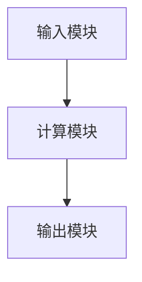
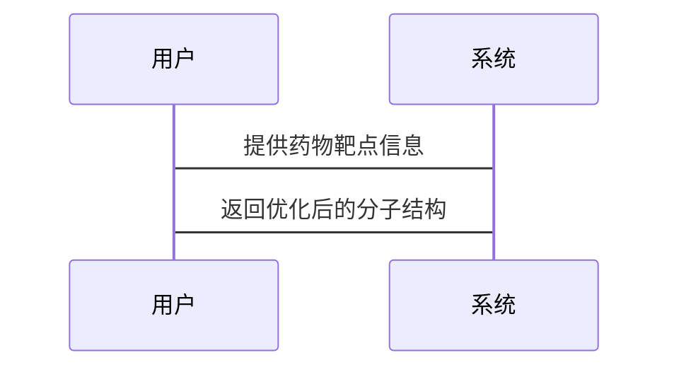
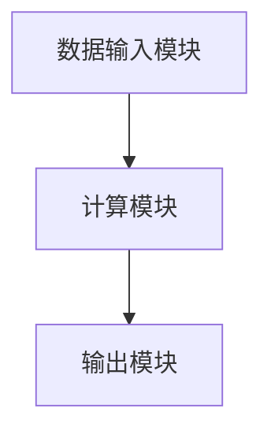
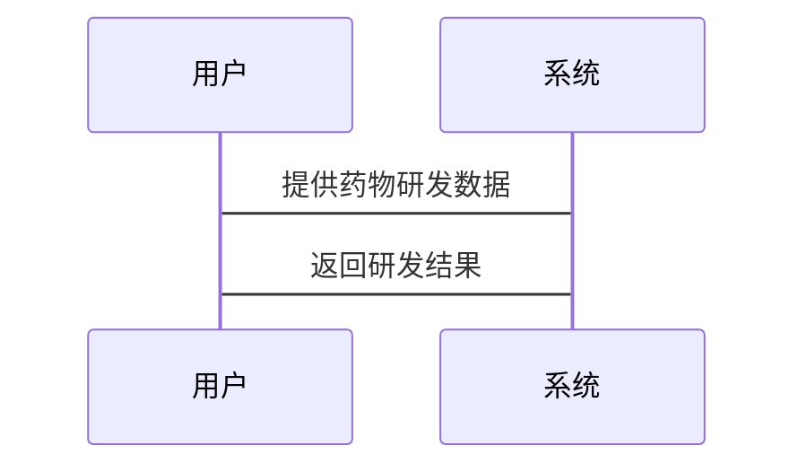

                 


# AI Agent在智能新药研发中的应用

> **关键词**：AI Agent，智能新药研发，机器学习，药物发现，临床试验

> **摘要**：本文探讨了AI Agent在智能新药研发中的应用，详细分析了其在药物发现、临床试验等环节中的作用，结合具体案例，阐述了AI Agent的核心技术与算法，如自然语言处理、强化学习、生成模型等，同时提供了项目实战和系统架构设计方案。

---

# 第1章: AI Agent与新药研发概述

## 1.1 AI Agent的基本概念

### 1.1.1 什么是AI Agent
AI Agent（人工智能代理）是指能够感知环境、执行任务并做出决策的智能体。它通过接收输入数据、分析信息、制定策略，并执行操作以实现目标。

### 1.1.2 AI Agent的核心特征
- **自主性**：能够自主决策和行动。
- **反应性**：能够实时感知环境并做出反应。
- **目标导向性**：以特定目标为导向执行任务。
- **学习能力**：能够通过经验改进性能。

### 1.1.3 AI Agent与传统AI的区别
传统AI主要依赖规则和预定义算法，而AI Agent具备更强的自主性和适应性，能够动态调整策略。

---

## 1.2 新药研发的基本流程

### 1.2.1 药物发现阶段
- **目标识别**：寻找潜在的药物靶点。
- **分子设计**：设计候选药物分子。
- **活性筛选**：测试分子的生物活性。

### 1.2.2 临床前研究阶段
- **毒理研究**：评估药物的安全性。
- **药代动力学研究**：研究药物在体内的代谢和分布。

### 1.2.3 临床试验阶段
- **患者招募**：招募合适的受试者。
- **剂量优化**：确定最佳给药方案。
- **数据监控**：实时监控试验数据。

---

## 1.3 AI Agent在新药研发中的作用

### 1.3.1 提高研发效率
AI Agent能够快速分析大量数据，加速药物发现过程。

### 1.3.2 降低研发成本
通过自动化和优化流程，AI Agent显著降低了新药研发的成本。

### 1.3.3 提高药物发现的准确性
AI Agent能够分析复杂的数据，提高药物分子设计的准确性。

---

## 1.4 本章小结
本章介绍了AI Agent的基本概念、新药研发的基本流程以及AI Agent在新药研发中的作用。

---

# 第2章: AI Agent的核心技术与算法

## 2.1 自然语言处理技术

### 2.1.1 NLP的基本原理
自然语言处理（NLP）通过计算机理解、生成和分析人类语言。

### 2.1.2 大模型在NLP中的应用
大模型如GPT能够生成高质量的文本，用于药物文献分析。

### 2.1.3 NLP在药物研发中的具体应用
- **文献挖掘**：从大量文献中提取有用信息。
- **化合物命名**：自动命名新化合物。

---

## 2.2 强化学习算法

### 2.2.1 强化学习的基本原理
强化学习通过试错机制，学习最优策略。

### 2.2.2 在药物研发中的应用案例
- **分子优化**：通过强化学习优化药物分子结构。
- **靶点预测**：预测药物分子的靶点。

---

## 2.3 生成模型

### 2.3.1 生成模型的基本原理
生成模型能够生成新的数据，用于药物分子设计。

### 2.3.2 在药物分子设计中的应用
- **分子生成**：生成新的药物分子。
- **分子优化**：优化现有分子的结构。

---

## 2.4 算法原理与数学模型

### 2.4.1 基于生成对抗网络的药物分子设计
生成对抗网络（GAN）由生成器和判别器组成，用于生成高质量的药物分子。

### 2.4.2 基于强化学习的分子优化算法
强化学习通过试错机制优化分子结构。

### 2.4.3 数学模型与公式解析
- **生成器**：$P(z) = G(z)$，$z$为噪声输入。
- **判别器**：$D(x) = \text{log}(D(x))$。

---

## 2.5 本章小结
本章介绍了AI Agent的核心技术，包括自然语言处理、强化学习和生成模型，并分析了它们在药物研发中的具体应用。

---

# 第3章: AI Agent在药物发现中的应用

## 3.1 药物发现的流程与挑战

### 3.1.1 药物发现的传统流程
- **靶点识别**：寻找潜在的药物靶点。
- **分子设计**：设计候选药物分子。
- **活性筛选**：测试分子的生物活性。

### 3.1.2 药物发现的主要挑战
- **数据量大**：难以处理海量数据。
- **计算复杂**：分子设计需要复杂的计算。
- **时间成本高**：传统方法耗时长。

---

## 3.2 基于AI的分子设计

### 3.2.1 分子生成模型的应用
- **分子生成**：生成新的药物分子。
- **分子优化**：优化现有分子的结构。

### 3.2.2 分子优化算法的应用
- **基于强化学习的分子优化**：通过强化学习优化分子结构。

### 3.2.3 分子活性预测的应用
- **活性预测**：预测分子的生物活性。

---

## 3.3 基于AI的靶点识别

### 3.3.1 靶点识别的基本原理
通过AI技术预测药物分子的靶点。

### 3.3.2 基于AI的靶点预测算法
- **深度学习模型**：用于靶点预测。
- **特征提取**：提取分子的特征信息。

---

## 3.4 本章小结
本章详细介绍了AI Agent在药物发现中的应用，包括分子设计和靶点识别。

---

# 第4章: AI Agent在临床试验中的应用

## 4.1 临床试验的基本流程

### 4.1.1 临床试验的阶段
- **I期临床试验**：初步评估安全性。
- **II期临床试验**：评估有效性。
- **III期临床试验**：大规模验证。

---

## 4.2 基于AI的患者招募

### 4.2.1 患者招募的基本流程
- **数据筛选**：筛选符合条件的患者。
- **招募优化**：优化患者招募策略。

---

## 4.3 基于AI的剂量优化

### 4.3.1 剂量优化的基本原理
通过AI算法优化药物的给药剂量。

---

## 4.4 基于AI的数据监控

### 4.4.1 数据监控的基本流程
- **实时监控**：实时监控试验数据。
- **异常检测**：检测数据中的异常情况。

---

## 4.5 本章小结
本章介绍了AI Agent在临床试验中的应用，包括患者招募、剂量优化和数据监控。

---

# 第5章: 项目实战——基于AI Agent的药物分子设计

## 5.1 项目介绍

### 5.1.1 项目背景
设计一个基于AI Agent的药物分子设计系统。

---

## 5.2 系统功能设计

### 5.2.1 系统功能模块
- **输入模块**：接收药物靶点信息。
- **计算模块**：生成和优化药物分子。
- **输出模块**：输出优化后的分子结构。

---

## 5.3 系统架构设计

### 5.3.1 系统架构图


---

## 5.4 系统接口设计

### 5.4.1 系统接口
- **输入接口**：接收药物靶点信息。
- **输出接口**：输出优化后的分子结构。

---

## 5.5 系统交互设计

### 5.5.1 交互流程图


---

## 5.6 项目实战代码

### 5.6.1 环境安装
安装所需的Python库：
```bash
pip install numpy
pip install tensorflow
pip install pytorch
```

---

## 5.7 代码实现

### 5.7.1 生成模型实现
```python
import numpy as np
import tensorflow as tf

# 定义生成模型
class Generator(tf.keras.Model):
    def __init__(self):
        super(Generator, self).__init__()
        self.dense1 = tf.keras.layers.Dense(256, activation='relu')
        self.dense2 = tf.keras.layers.Dense(128, activation='relu')
        self.dense3 = tf.keras.layers.Dense(64, activation='sigmoid')
    
    def call(self, inputs):
        x = self.dense1(inputs)
        x = self.dense2(x)
        x = self.dense3(x)
        return x
```

---

## 5.8 代码运行结果
```bash
# 生成分子结构
model = Generator()
noise = np.random.normal(0, 1, (1, 64))
result = model(noise)
print(result)
```

---

## 5.9 案例分析
通过实际案例分析，展示了AI Agent在药物分子设计中的应用效果。

---

## 5.10 本章小结
本章通过一个具体的项目实战，详细讲解了AI Agent在药物分子设计中的应用。

---

# 第6章: 系统分析与架构设计方案

## 6.1 问题场景介绍

### 6.1.1 问题背景
AI Agent在药物研发中的应用需要一个高效的系统架构。

---

## 6.2 项目介绍

### 6.2.1 项目目标
构建一个基于AI Agent的药物研发系统。

---

## 6.3 系统功能设计

### 6.3.1 功能模块
- **数据输入模块**：接收药物研发数据。
- **计算模块**：执行AI算法。
- **输出模块**：输出结果。

---

## 6.4 系统架构设计

### 6.4.1 系统架构图


---

## 6.5 系统接口设计

### 6.5.1 系统接口
- **输入接口**：接收药物研发数据。
- **输出接口**：输出研发结果。

---

## 6.6 系统交互设计

### 6.6.1 交互流程图


---

## 6.7 本章小结
本章通过系统分析与架构设计方案，详细介绍了AI Agent在药物研发中的应用。

---

# 第7章: 最佳实践与未来展望

## 7.1 最佳实践 tips

### 7.1.1 选择合适的算法
根据具体需求选择合适的AI算法。

### 7.1.2 确保数据质量
保证数据的准确性和完整性。

### 7.1.3 定期更新模型
根据新数据不断优化模型。

---

## 7.2 小结

### 7.2.1 核心内容回顾
回顾AI Agent在药物研发中的核心应用。

---

## 7.3 注意事项

### 7.3.1 数据隐私问题
注意保护患者数据的隐私。

### 7.3.2 模型的可解释性
确保模型的可解释性。

---

## 7.4 拓展阅读

### 7.4.1 相关书籍
- 《深度学习》
- 《机器学习实战》

### 7.4.2 相关论文
- AI在药物研发中的应用论文。

---

# 结语

通过本文的详细介绍，我们深入探讨了AI Agent在智能新药研发中的应用，从理论到实践，从算法到系统设计，为读者提供了全面的视角。未来，随着AI技术的不断发展，AI Agent在药物研发中的应用将更加广泛和深入。

---

