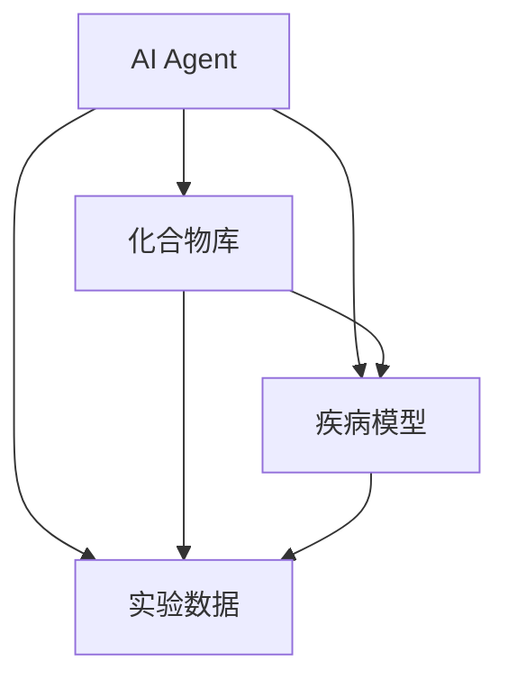
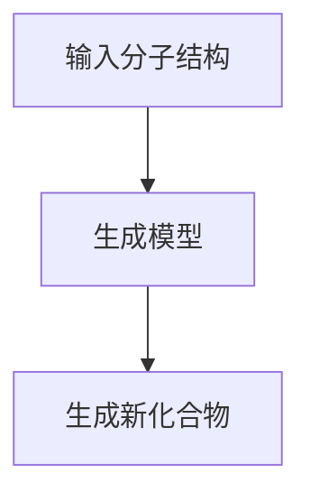
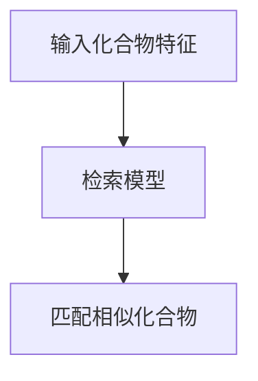
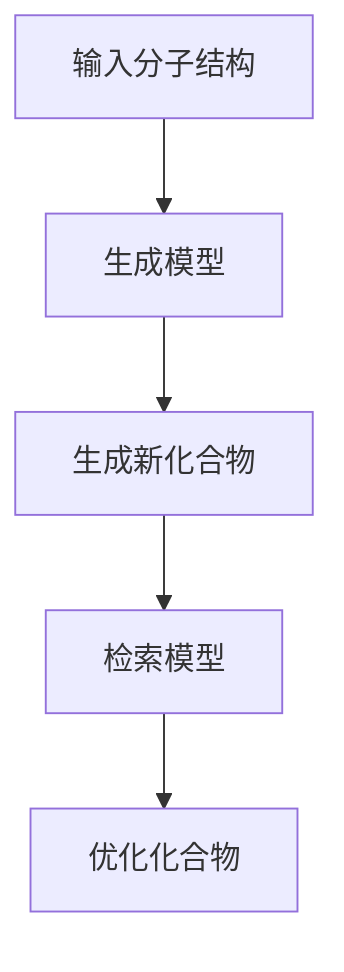
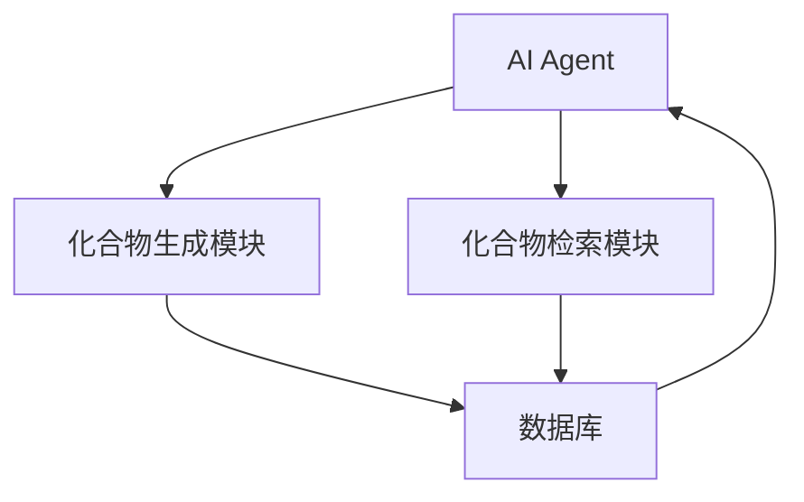
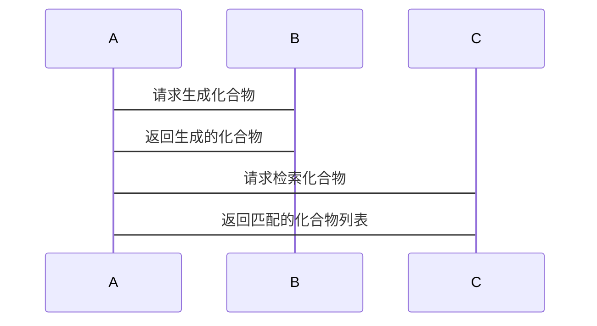

                 


# AI Agent在智能新药筛选中的应用

## 关键词：AI Agent, 新药筛选, 生成模型, 检索模型, 药物研发

## 摘要：本文系统地探讨了AI Agent在智能新药筛选中的应用，从AI Agent的基本概念、算法原理到实际应用案例，全面分析了其在新药研发中的潜力和挑战。通过生成模型、检索模型和混合模型的详细讲解，结合系统架构设计和项目实战，为读者提供了从理论到实践的完整指南。

---

## 第一部分: AI Agent与智能新药筛选的背景与基础

### 第1章: AI Agent与新药筛选的概述

#### 1.1 AI Agent的基本概念
##### 1.1.1 AI Agent的定义与特点
AI Agent（人工智能代理）是一种能够感知环境、执行任务并做出决策的智能实体。它具有自主性、反应性、目标导向和社交能力等特点。在新药筛选中，AI Agent可以用于生成化合物结构、优化实验方案和预测药物效果。

##### 1.1.2 AI Agent的核心要素与分类
AI Agent的核心要素包括感知能力、决策能力、执行能力和学习能力。根据应用场景的不同，可以将AI Agent分为基于生成模型的Agent和基于检索模型的Agent。

##### 1.1.3 AI Agent在药物研发中的应用潜力
AI Agent可以通过生成新化合物结构、优化实验条件和预测药物副作用，显著提高新药研发的效率和成功率。

#### 1.2 新药筛选的背景与挑战
##### 1.2.1 新药研发的流程与痛点
新药研发通常包括发现靶点、化合物设计、临床前研究和临床试验四个阶段。传统方法耗时长、成本高，且成功率低。

##### 1.2.2 传统新药筛选方法的局限性
传统方法依赖实验验证，数据量有限，难以发现新的药物结构。

##### 1.2.3 AI技术在新药筛选中的优势
AI技术可以通过数据分析和模式识别，快速发现潜在的药物候选，降低研发成本。

#### 1.3 AI Agent在新药筛选中的应用前景
##### 1.3.1 AI Agent在分子设计中的作用
AI Agent可以生成具有特定功能的化合物结构，加速药物发现过程。

##### 1.3.2 AI Agent在化合物库筛选中的应用
通过检索模型，AI Agent可以快速匹配相似化合物，提高筛选效率。

##### 1.3.3 AI Agent在临床试验优化中的潜力
AI Agent可以预测患者对药物的反应，优化临床试验设计。

### 第2章: AI Agent的核心概念与联系

#### 2.1 AI Agent的核心原理
##### 2.1.1 生成模型的原理
生成模型通过学习数据分布，生成新的化合物结构。常用的方法包括变分自编码器（VAE）和生成对抗网络（GAN）。

##### 2.1.2 检索模型的原理
检索模型通过计算化合物的相似性，从数据库中匹配最接近的目标化合物。常用的方法包括基于分子指纹的相似性检索和基于深度学习的嵌入检索。

##### 2.1.3 混合模型的原理
混合模型结合生成模型和检索模型的优势，先生成候选化合物，再通过检索模型优化结果。

#### 2.2 核心概念对比表
##### 2.2.1 生成模型与检索模型的对比
| 特性         | 生成模型             | 检索模型             |
|--------------|----------------------|----------------------|
| 输入         | 分子结构或属性       | 化合物特征           |
| 输出         | 新化合物结构         | 相似化合物           |
| 优势         | 创新性强             | 精度高               |
| 局限性         | 结果可能不够准确       | 创新性差             |

##### 2.2.2 不同AI Agent模型的性能对比
| 模型类型     | 生成模型             | 检索模型             | 混合模型             |
|--------------|----------------------|----------------------|----------------------|
| 精度         | 中等                 | 高                  | 高                  |
| 创新性       | 高                  | 中等                | 高                  |
| 计算成本     | 高                  | 低                  | 中等                |

##### 2.2.3 AI Agent与传统机器学习模型的对比
| 特性         | AI Agent             | 传统机器学习模型     |
|--------------|----------------------|----------------------|
| 自适应性       | 强                  | 弱                  |
| 决策能力       | 强                  | 一般                |
| 环境交互       | 是                  | 否                  |

#### 2.3 ER实体关系图


### 第3章: AI Agent的算法原理

#### 3.1 生成模型的算法流程
##### 3.1.1 生成模型的流程

##### 3.1.2 生成模型的数学公式
生成模型的目标是最小化生成分布与真实分布的差异：
$$\min_{\theta} \mathbb{E}_{x}[ \log P_\theta(x) ]$$
其中，$x$ 表示生成的化合物结构。

#### 3.2 检索模型的算法流程
##### 3.2.1 检索模型的流程

##### 3.2.2 检索模型的数学公式
检索模型通过计算化合物的相似性得分：
$$similarity(x,y) = \frac{x \cdot y}{\|x\| \|y\|}$$
其中，$x$ 和 $y$ 分别是两个化合物的嵌入向量。

#### 3.3 混合模型的算法流程
##### 3.3.1 混合模型的流程

##### 3.3.2 混合模型的数学公式
混合模型结合生成模型和检索模型，优化生成的化合物结构：
$$P(y|x) = \lambda P_{\text{生成}}(y|x) + (1-\lambda) P_{\text{检索}}(y|x)$$
其中，$\lambda$ 是平衡参数。

#### 3.4 生成模型的实现代码
```python
import tensorflow as tf
from tensorflow.keras import layers

def build_generator():
    model = tf.keras.Sequential()
    model.add(layers.Dense(256, activation='relu', input_shape=(128,)))
    model.add(layers.Dense(256, activation='relu'))
    model.add(layers.Dense(1024, activation='sigmoid'))
    return model
```

---

## 第二部分: AI Agent在新药筛选中的系统设计与应用

### 第4章: 系统分析与架构设计方案

#### 4.1 问题场景介绍
新药筛选系统需要处理大量的化合物数据和实验数据，AI Agent作为核心模块，负责生成和检索化合物。

#### 4.2 项目介绍
本项目旨在开发一个基于AI Agent的新药筛选系统，包括化合物生成、化合物检索和优化模块。

#### 4.3 系统功能设计
##### 4.3.1 领域模型类图
```mermaid
classDiagram
class Compound {
    - id: int
    - structure: str
    - properties: dict
}
class AI_Agent {
    - model: object
    - database: object
    + generate(compound: Compound): Compound
    + search(query: Compound): list[Compound]
}
class Database {
    + store(compound: Compound): void
    + retrieve(query: Compound): list[Compound]
}
AI_Agent o Database
Compound o Database
```

##### 4.3.2 系统架构图


##### 4.3.3 系统接口设计
- 生成接口：`generate(compound: Compound) -> Compound`
- 检索接口：`search(query: Compound) -> list[Compound]`

##### 4.3.4 系统交互序列图


### 第5章: 项目实战与案例分析

#### 5.1 环境安装
安装必要的库：
```bash
pip install tensorflow numpy scikit-learn
```

#### 5.2 系统核心实现源代码
##### 5.2.1 生成模型实现
```python
import tensorflow as tf
from tensorflow.keras import layers

def build_generator():
    model = tf.keras.Sequential()
    model.add(layers.Dense(256, activation='relu', input_shape=(128,)))
    model.add(layers.Dense(256, activation='relu'))
    model.add(layers.Dense(1024, activation='sigmoid'))
    return model
```

##### 5.2.2 检索模型实现
```python
from sklearn.metrics.pairwise import cosine_similarity

def build_retrieval_model():
    model = cosine_similarity
    return model
```

##### 5.2.3 混合模型实现
```python
def hybrid_model():
    generator = build_generator()
    retriever = build_retrieval_model()
    return generator, retriever
```

#### 5.3 代码应用解读与分析
- 生成模型通过训练生成新的化合物结构，检索模型从数据库中匹配相似化合物，混合模型结合两者的优势，优化结果。

#### 5.4 实际案例分析和详细讲解剖析
案例：使用AI Agent生成并优化一个候选化合物。
1. 输入分子结构。
2. 生成模型生成候选化合物。
3. 检索模型匹配相似化合物。
4. 综合结果，优化化合物结构。

#### 5.5 项目小结
本项目展示了AI Agent在新药筛选中的实际应用，通过生成模型和检索模型的结合，显著提高了药物研发的效率。

### 第6章: 总结与展望

#### 6.1 总结
本文详细介绍了AI Agent在新药筛选中的应用，从理论到实践，展示了其在生成化合物、检索化合物和优化临床试验中的潜力。

#### 6.2 展望
未来，AI Agent在新药筛选中的应用将更加广泛，可能涉及多模态模型和量子计算等新技术。

---

通过以上目录和内容的详细设计，我希望能够为用户提供一篇结构清晰、内容详实的技术博客文章，满足用户的需求。

