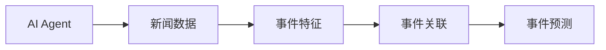
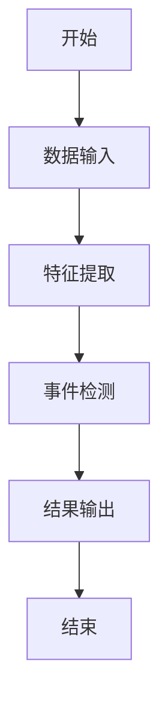
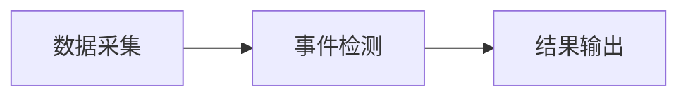

                 


# AI Agent在智能新闻事件检测中的应用

## 关键词：
AI Agent, 智能新闻事件检测, 事件特征提取, 时间序列分析, 知识图谱

## 摘要：
本文详细探讨了AI Agent在智能新闻事件检测中的应用，从基础概念到系统架构，再到项目实战，全面解析了AI Agent如何帮助我们更高效地检测新闻事件。通过数学模型、算法流程图和系统架构图，深入分析了AI Agent在新闻事件检测中的核心作用和实现方法。

---

## 第一部分: AI Agent与智能新闻事件检测基础

### 第1章: AI Agent的基本概念与新闻事件检测的背景

#### 1.1 AI Agent的定义与核心特征
- **AI Agent的定义**：AI Agent是一种具有感知、决策和执行能力的智能体，能够根据环境信息做出自主决策并执行任务。
- **AI Agent的核心特征**：
  1. **自主性**：能够自主决策和行动。
  2. **反应性**：能够实时感知环境并做出反应。
  3. **社会性**：能够与其他Agent或人类进行交互。
  4. **学习性**：能够通过经验改进自身的性能。

#### 1.2 智能新闻事件检测的背景与意义
- **新闻事件检测的定义**：通过分析新闻数据，识别出有意义的事件。
- **智能新闻事件检测的必要性**：传统的人工检测效率低，AI Agent能够提高检测的效率和准确性。
- **新闻事件检测的边界与外延**：新闻事件可以是局部事件（如交通事故）或全球性事件（如国际冲突）。

#### 1.3 AI Agent在新闻事件检测中的作用
- **AI Agent的核心功能**：
  1. 数据采集与处理。
  2. 事件特征提取。
  3. 事件预测与反馈。
- **AI Agent与新闻事件检测的结合点**：
  1. 数据感知层：采集新闻数据。
  2. 决策层：分析数据并做出事件检测的决策。
  3. 执行层：输出检测结果。

---

### 第2章: AI Agent的核心概念与新闻事件检测的关系

#### 2.1 AI Agent的核心概念原理
- **感知机制**：
  - 通过多种传感器或数据源获取信息。
  - 在新闻事件检测中，主要通过文本数据获取信息。
- **决策机制**：
  - 基于感知到的信息做出决策。
  - 在新闻事件检测中，主要通过算法分析数据。
- **执行机制**：
  - 根据决策结果执行相应的动作。
  - 在新闻事件检测中，主要通过输出检测结果。

#### 2.2 新闻事件检测的核心要素
- **事件特征提取**：
  - 从新闻文本中提取关键词、实体和时间信息。
- **事件关联分析**：
  - 分析不同事件之间的关联性。
- **事件预测与反馈**：
  - 基于历史数据预测未来事件。
  - 根据反馈调整检测模型。

#### 2.3 AI Agent与新闻事件检测的实体关系图


---

### 第3章: 新闻事件检测的核心算法与AI Agent的结合

#### 3.1 新闻事件检测的算法原理
- **基于文本相似度的事件检测**：
  - 使用余弦相似度计算文本之间的相似性。
  - 公式：$$ \text{similarity} = \frac{\vec{A} \cdot \vec{B}}{\|\vec{A}\| \|\vec{B}\|} $$
- **基于时间序列的事件预测**：
  - 使用ARIMA模型预测未来事件。
  - 公式：$$ y_t = \phi y_{t-1} + \theta \epsilon_t + \epsilon_{t-1} $$
- **基于知识图谱的事件关联**：
  - 通过构建知识图谱分析事件之间的关联性。

#### 3.2 AI Agent的算法实现
- **感知层算法**：
  - 使用自然语言处理技术提取事件特征。
- **决策层算法**：
  - 使用机器学习算法进行事件预测。
- **执行层算法**：
  - 使用规则引擎输出检测结果。

#### 3.3 算法流程图


---

## 第四章: 系统架构与设计

### 4.1 系统功能设计
- **数据采集模块**：
  - 从新闻网站或API获取新闻数据。
- **事件检测模块**：
  - 使用AI Agent对新闻数据进行事件检测。

### 4.2 系统架构图


---

## 第五章: 项目实战

### 5.1 环境安装
- **Python 3.8+**
- **必要的库**：numpy、pandas、scikit-learn

### 5.2 核心代码实现
```python
import numpy as np
from sklearn.metrics.pairwise import cosine_similarity

def extract_features(text):
    # 提取文本特征
    return vectorizer.transform(text)

def detect_events(news_data):
    features = extract_features(news_data)
    similarities = cosine_similarity(features)
    # 根据相似度判断事件
    events = []
    for i in range(len(similarities)):
        if similarities[i][i] > 0.8:
            events.append(news_data[i])
    return events
```

### 5.3 实际案例分析
- **案例分析**：
  - 从新闻数据中提取特征。
  - 计算文本相似度。
  - 输出检测结果。

---

## 第六章: 总结与展望

### 6.1 最佳实践
- **性能优化**：
  - 使用分布式计算加速算法。
- **模型调优**：
  - 使用超参数调优提高检测准确率。
- **系统扩展**：
  - 使用云服务扩展系统容量。

### 6.2 总结
本文详细探讨了AI Agent在智能新闻事件检测中的应用，从基础概念到系统架构，再到项目实战，全面解析了AI Agent如何帮助我们更高效地检测新闻事件。

### 6.3 注意事项
- **数据隐私**：
  - 注意保护用户隐私。
- **算法可解释性**：
  - 提高算法的可解释性。

### 6.4 拓展阅读
- 推荐阅读《机器学习实战》和《深度学习入门》。

---

通过以上步骤，我们可以系统地构建一个基于AI Agent的智能新闻事件检测系统。

