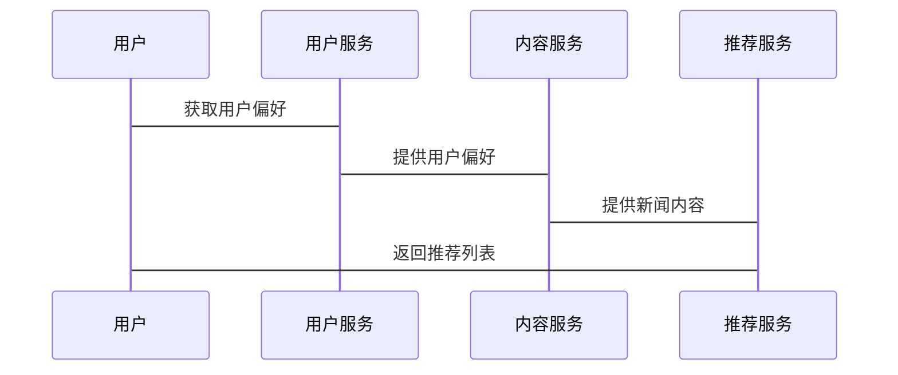

                 


# AI Agent在智能新闻聚合与推荐中的应用

## 关键词：AI Agent、智能新闻聚合、推荐系统、自然语言处理、知识图谱

## 摘要：  
随着人工智能技术的快速发展，AI Agent（人工智能代理）在新闻聚合与推荐中的应用日益广泛。本文系统地探讨了AI Agent在智能新闻聚合与推荐中的核心概念、技术原理、系统架构设计以及实际应用案例。通过分析AI Agent的工作流程、算法原理和系统架构，本文旨在为读者提供一个全面的技术视角，帮助理解AI Agent如何通过自然语言处理、知识图谱和推荐算法实现智能新闻聚合与个性化推荐。  

---

# 第1章: AI Agent与智能新闻聚合概述

## 1.1 AI Agent的基本概念
### 1.1.1 AI Agent的定义与特征
AI Agent（人工智能代理）是指能够感知环境、理解用户需求并执行任务的智能实体。其核心特征包括：
- **自主性**：能够独立决策和执行任务。
- **反应性**：能够实时感知环境并做出反应。
- **学习能力**：能够通过数据和反馈不断优化自身行为。

### 1.1.2 AI Agent的核心功能与应用场景
AI Agent在新闻聚合中的核心功能包括：
- **内容理解**：通过自然语言处理技术理解新闻内容。
- **个性化推荐**：基于用户行为和偏好生成个性化推荐。
- **动态优化**：根据用户反馈动态调整推荐策略。

### 1.1.3 AI Agent与传统新闻聚合系统的区别
传统新闻聚合系统通常基于关键词匹配或简单的分类算法，而AI Agent能够通过深度学习和知识图谱技术实现更精准的理解与推荐。

| **特性**         | **传统新闻聚合系统**             | **AI Agent**                   |
|------------------|--------------------------------|--------------------------------|
| **内容理解**     | 基于关键词匹配                   | 基于深度学习和语义理解         |
| **推荐策略**     | 简单的规则-based推荐             | 基于用户行为和偏好动态优化推荐 |
| **学习能力**     | 无                             | 具备自主学习能力               |

---

## 1.2 智能新闻聚合的背景与需求
### 1.2.1 传统新闻聚合的局限性
传统新闻聚合系统存在以下问题：
- **内容理解能力有限**：无法准确理解新闻内容的语义。
- **个性化推荐不足**：难以满足用户的个性化需求。
- **实时性不足**：难以实时更新推荐结果。

### 1.2.2 用户需求与个性化推荐的重要性
用户在新闻聚合中的需求包括：
- **获取相关性高的新闻内容**。
- **个性化推荐**：根据用户的兴趣和偏好推荐新闻。
- **实时性**：希望得到最新的新闻内容。

### 1.2.3 AI Agent在新闻聚合中的优势
AI Agent通过以下方式解决传统新闻聚合的局限性：
- **深度语义理解**：利用自然语言处理技术理解新闻内容。
- **个性化推荐**：基于用户行为和偏好动态优化推荐策略。
- **实时性**：能够实时更新推荐结果。

---

## 1.3 AI Agent在新闻推荐中的应用价值
### 1.3.1 提高用户信息获取效率
AI Agent通过智能聚合和推荐，帮助用户快速找到感兴趣的内容，节省时间。

### 1.3.2 个性化推荐的实现
通过深度学习和知识图谱技术，AI Agent能够实现精准的个性化推荐。

### 1.3.3 多模态新闻内容的理解与处理
AI Agent能够处理文本、图像、视频等多种形式的新闻内容，实现多模态信息的融合与推荐。

---

## 1.4 本章小结
本章介绍了AI Agent的基本概念、核心功能以及在智能新闻聚合中的应用价值。通过对比传统新闻聚合系统与AI Agent，我们可以看到AI Agent在新闻推荐中的显著优势。

---

# 第2章: AI Agent的核心概念与原理

## 2.1 AI Agent的构成要素
### 2.1.1 知识表示与理解
AI Agent需要通过知识图谱或语义网络表示新闻内容的语义关系。

### 2.1.2 自然语言处理技术
自然语言处理技术（NLP）用于理解新闻内容的语义和上下文。

### 2.1.3 推荐算法与策略
推荐算法包括基于协同过滤、基于内容的推荐以及基于深度学习的推荐。

---

## 2.2 AI Agent的工作流程
### 2.2.1 用户需求分析
通过分析用户的行为数据（如点击、停留时间等）和偏好，生成用户的兴趣模型。

### 2.2.2 内容理解和语义分析
利用NLP技术对新闻内容进行语义分析，提取关键词、实体和情感倾向。

### 2.2.3 个性化推荐生成
基于用户的兴趣模型和新闻内容的语义分析，生成个性化推荐列表。

### 2.2.4 反馈机制与优化
通过用户的反馈（如点击、点赞等）优化推荐算法和策略。

---

## 2.3 AI Agent的核心算法与模型
### 2.3.1 基于深度学习的推荐模型
常用的深度学习推荐模型包括：
- **神经协同过滤（Neural Collaborative Filtering, NCF）**。
- **深度兴趣网络（Deep Interest Network, DIN）**。

### 2.3.2 基于知识图谱的推荐方法
通过构建新闻知识图谱，利用图嵌入技术生成推荐内容。

### 2.3.3 联合学习与多模态数据处理
联合学习（Federated Learning）和多模态数据处理技术能够提升推荐的准确性和多样性。

---

## 2.4 本章小结
本章详细介绍了AI Agent的核心构成要素、工作流程以及推荐算法与模型。通过这些内容，我们可以更好地理解AI Agent在智能新闻聚合与推荐中的技术原理。

---

# 第3章: AI Agent的算法原理与数学模型

## 3.1 基于深度学习的推荐模型
### 3.1.1 神经协同过滤（NCF）
NCF模型通过深度神经网络学习用户和物品的嵌入向量，生成推荐结果。

**公式**：
$$
p(u,i) = g(u,i) \cdot h(u,i)
$$
其中，$g(u,i)$和$h(u,i)$是通过深度神经网络生成的用户和物品的嵌入向量。

### 3.1.2 深度兴趣网络（DIN）
DIN模型通过多层感知机（MLP）提取用户的兴趣特征，生成推荐结果。

**公式**：
$$
y(u,i) = \sum_{k=1}^{n} \beta_k x_k
$$
其中，$\beta_k$是兴趣特征的权重，$x_k$是用户的兴趣特征。

---

## 3.2 基于知识图谱的推荐方法
### 3.2.1 知识图谱构建
通过爬取和解析新闻数据，构建新闻知识图谱。

### 3.2.2 图嵌入技术
利用图嵌入技术（如Word2Vec、GloVe）生成新闻内容的向量表示。

### 3.2.3 基于图嵌入的推荐
通过计算用户与新闻内容的向量相似度，生成推荐结果。

---

## 3.3 本章小结
本章详细讲解了AI Agent在推荐系统中的算法原理与数学模型，包括基于深度学习的推荐模型和基于知识图谱的推荐方法。

---

# 第4章: AI Agent的系统架构设计

## 4.1 系统功能设计
### 4.1.1 用户需求分析模块
通过用户行为数据和偏好分析，生成用户的兴趣模型。

### 4.1.2 内容理解与语义分析模块
利用NLP技术对新闻内容进行语义分析，提取关键词和实体。

### 4.1.3 推荐算法与策略模块
基于用户的兴趣模型和新闻内容的语义分析，生成个性化推荐列表。

### 4.1.4 反馈机制与优化模块
通过用户的反馈优化推荐算法和策略。

---

## 4.2 系统架构设计
### 4.2.1 微服务架构
系统采用微服务架构，包括：
- **用户服务**：处理用户注册、登录和偏好设置。
- **内容服务**：处理新闻内容的聚合和语义分析。
- **推荐服务**：生成个性化推荐列表。

### 4.2.2 系统交互流程
用户发起新闻聚合请求，系统通过用户服务获取用户偏好，内容服务进行语义分析，推荐服务生成推荐列表。

**Mermaid图**：


---

## 4.3 本章小结
本章详细介绍了AI Agent的系统功能设计和架构设计，为后续的项目实施提供了理论基础。

---

# 第5章: AI Agent的项目实战

## 5.1 环境安装与配置
### 5.1.1 安装Python和相关库
- 安装Python 3.8及以上版本。
- 安装必要的库：`numpy`, `pandas`, `tensorflow`, `transformers`。

### 5.1.2 安装自然语言处理库
- 安装`spaCy`和`Gensim`。

---

## 5.2 核心代码实现
### 5.2.1 用户偏好分析
```python
import pandas as pd

# 用户行为数据
user_behavior = pd.read_csv('user_behavior.csv')
# 统计用户的点击行为
click_count = user_behavior['article_id'].value_counts()
# 统计用户的偏好
preference = user_behavior.groupby('user_id')['article_id'].apply(list)
```

### 5.2.2 新闻内容解析
```python
from transformers import pipeline

# 使用预训练的BERT模型进行新闻内容解析
nlp = pipeline('sentiment-analysis')
article = 'Recent advances in AI have revolutionized the field of natural language processing.'
result = nlp(article)
print(result)
```

### 5.2.3 推荐算法实现
```python
import tensorflow as tf

# 定义推荐模型
class NCF(tf.keras.Model):
    def __init__(self, user_embedding_dim, item_embedding_dim):
        super(NCF, self).__init__()
        self.user_embedding = tf.keras.layers.Embedding(..., input_dim=user_embedding_dim)
        self.item_embedding = tf.keras.layers.Embedding(..., input_dim=item_embedding_dim)
        self.dense = tf.keras.layers.Dense(64, activation='relu')
        self.output_layer = tf.keras.layers.Dense(1, activation='sigmoid')

    def call(self, inputs):
        user_id, item_id = inputs
        user_emb = self.user_embedding(user_id)
        item_emb = self.item_embedding(item_id)
        features = tf.concat([user_emb, item_emb], axis=-1)
        features = self.dense(features)
        output = self.output_layer(features)
        return output
```

---

## 5.3 项目小结
本章通过实际的项目案例，详细讲解了AI Agent在智能新闻聚合与推荐中的实现过程，包括环境配置、核心代码实现以及系统优化。

---

# 第6章: 总结与展望

## 6.1 本章总结
本文系统地探讨了AI Agent在智能新闻聚合与推荐中的应用，包括核心概念、技术原理、系统架构设计以及项目实战。通过这些内容，我们能够更好地理解AI Agent在新闻推荐中的技术优势。

## 6.2 未来展望
随着人工智能技术的不断发展，AI Agent在新闻聚合与推荐中的应用将更加广泛。未来的研究方向包括：
- **多模态数据处理**：进一步提升对多模态数据的处理能力。
- **实时推荐**：实现更实时的新闻推荐。
- **隐私保护**：在推荐过程中保护用户的隐私。

---

# 附录: AI Agent相关工具与资源

## 附录A: 开源框架与库
- **深度学习框架**：TensorFlow, PyTorch。
- **自然语言处理库**：spaCy, Gensim, Hugging Face Transformers。

## 附录B: 推荐的书籍与论文
- **书籍**：《深度学习》（Deep Learning, Ian Goodfellow等著）。
- **论文**：《Neural Collaborative Filtering for Recommender Systems》（SIGIR 2017）。

---

# 结语
AI Agent作为人工智能领域的重要技术，正在逐步改变新闻聚合与推荐的方式。通过本文的探讨，我们希望读者能够更好地理解AI Agent的技术原理和应用价值，并在实际项目中加以应用。

