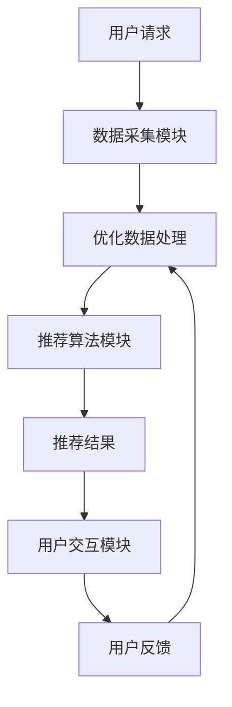
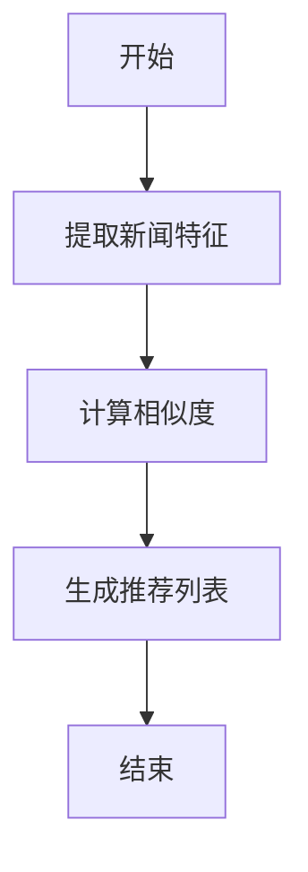

                 


# AI Agent在智能新闻聚合中的角色

> 关键词：AI Agent，智能新闻聚合，自然语言处理，机器学习，推荐系统，信息过滤

> 摘要：本文深入探讨了AI Agent在智能新闻聚合中的核心角色，分析了其技术原理、算法实现、系统架构以及在实际应用中的优势和挑战。通过详细的技术分析和案例研究，揭示了AI Agent如何通过自然语言处理、机器学习等技术实现高效的新闻聚合与推荐，为用户提供了个性化的新闻阅读体验。

---

# 目录

1. [AI Agent与智能新闻聚合的背景与概念](#ai-agent与智能新闻聚合的背景与概念)
2. [AI Agent与智能新闻聚合的核心技术](#ai-agent与智能新闻聚合的核心技术)
3. [智能新闻聚合的业务需求与场景分析](#智能新闻聚合的业务需求与场景分析)
4. [系统架构设计与算法实现](#系统架构设计与算法实现)
5. [项目实战与应用案例](#项目实战与应用案例)
6. [总结与展望](#总结与展望)

---

## 第1章: AI Agent与智能新闻聚合的背景与概念

### 1.1 AI Agent的基本概念

AI Agent（人工智能代理）是指能够感知环境、自主决策并执行任务的智能实体。在新闻聚合领域，AI Agent通过分析海量新闻数据，为用户提供个性化的内容推荐。

#### 1.1.1 AI Agent的定义与分类

- **定义**：AI Agent是能够理解、推理和行动的智能系统，广泛应用于推荐系统、自动化服务等领域。
- **分类**：根据功能可分为信息检索Agent、推荐系统Agent和个性化服务Agent。

#### 1.1.2 智能新闻聚合的定义与特点

- **定义**：智能新闻聚合是指通过AI技术，从多个新闻源中筛选、整合并推荐个性化新闻内容的过程。
- **特点**：实时性、个性化、高效性。

#### 1.1.3 AI Agent在新闻聚合中的作用与价值

- **作用**：通过自然语言处理和机器学习，AI Agent能够分析新闻内容，理解用户需求，并提供精准推荐。
- **价值**：提升用户体验，优化新闻聚合效率，降低信息过载问题。

### 1.2 智能新闻聚合的历史与现状

#### 1.2.1 新闻聚合的传统模式

传统新闻聚合依赖人工编辑，无法满足用户个性化需求，效率低下。

#### 1.2.2 AI技术对新闻聚合的革新

AI技术引入后，新闻聚合实现了自动化、智能化，推荐算法更加精准。

#### 1.2.3 当前智能新闻聚合的市场与应用现状

目前，智能新闻聚合广泛应用于新闻平台、社交媒体和个性化阅读工具，市场需求巨大。

### 1.3 AI Agent在智能新闻聚合中的角色定位

#### 1.3.1 用户需求与AI Agent的匹配

AI Agent通过分析用户行为和偏好，匹配个性化新闻内容。

#### 1.3.2 AI Agent在新闻聚合中的核心功能

- 内容筛选：基于关键词、主题和语义理解，筛选相关新闻。
- 个性化推荐：根据用户历史行为，推荐感兴趣的内容。
- 实时更新：动态调整推荐结果，确保信息及时性。

#### 1.3.3 AI Agent与传统新闻聚合工具的对比

- **传统工具**：依赖人工编辑，推荐内容有限。
- **AI Agent**：自动化、智能化，推荐精准度高。

---

## 第2章: AI Agent与智能新闻聚合的核心技术

### 2.1 自然语言处理技术

#### 2.1.1 NLP在新闻聚合中的应用

- **文本相似度计算**：通过余弦相似度或BM25算法，计算新闻之间的相似度。
- **主题识别**：利用LDA主题模型，识别新闻主题。
- **情感分析**：分析新闻情感倾向，辅助推荐决策。

#### 2.1.2 文本相似度计算与主题识别

- **文本相似度公式**：
  $$ \text{相似度} = \frac{\sum \min(w_i, w_j)}{\sum (w_i + w_j)/2} $$
  
- **LDA主题模型**：用于识别新闻主题，提取关键词。

#### 2.1.3 基于上下文的新闻推荐算法

- **算法流程**：
  1. 提取新闻文本特征。
  2. 计算用户兴趣与新闻相似度。
  3. 推荐相关新闻。

### 2.2 机器学习与深度学习模型

#### 2.2.1 常见的新闻推荐算法

- **协同过滤**：基于用户行为相似性推荐新闻。
- **内容推荐**：基于新闻内容特征推荐。
- **混合推荐**：结合协同过滤和内容推荐的优势。

#### 2.2.2 基于深度学习的新闻生成与摘要

- **神经网络模型**：如Transformer，用于新闻摘要和生成。

#### 2.2.3 神经网络在新闻分类中的应用

- **CNN与RNN**：用于新闻文本分类和序列建模。

### 2.3 数据挖掘与信息提取

#### 2.3.1 新闻数据的特征提取与分析

- **特征提取方法**：TF-IDF、Word2Vec。
- **特征分析**：通过可视化工具分析特征分布。

#### 2.3.2 基于规则的新闻筛选与聚合

- **规则定义**：如排除特定关键词、限制新闻来源。

#### 2.3.3 数据清洗与预处理技术

- **数据清洗**：去除重复、无效信息。
- **预处理**：分词、去停用词。

---

## 第3章: 智能新闻聚合的业务需求与场景分析

### 3.1 用户需求分析

#### 3.1.1 用户的新闻阅读习惯与偏好

- **用户画像**：年龄、职业、兴趣爱好。
- **阅读习惯**：阅读时间、频率、深度。

#### 3.1.2 用户对个性化推荐的需求

- **个性化需求**：基于兴趣、地理位置推荐。
- **动态需求**：实时更新推荐内容。

#### 3.1.3 用户对新闻聚合工具的使用痛点

- **信息过载**：用户无法筛选大量新闻。
- **推荐不精准**：传统推荐算法效果有限。

### 3.2 业务场景设计

#### 3.2.1 新闻内容的多源采集与整合

- **数据源**：新闻网站、社交媒体、RSS订阅。
- **整合方法**：基于时间、相关性排序。

#### 3.2.2 基于AI Agent的新闻推荐场景

- **实时推荐**：用户登录后立即推荐相关内容。
- **个性化定制**：用户自定义兴趣标签。

#### 3.2.3 用户反馈与系统优化

- **反馈机制**：用户点赞、收藏、举报。
- **系统优化**：调整推荐算法参数。

### 3.3 信息过滤与推荐策略

#### 3.3.1 基于关键词的新闻筛选

- **关键词提取**：利用TF-IDF提取新闻关键词。
- **关键词匹配**：基于用户输入关键词匹配相关新闻。

#### 3.3.2 基于用户的阅读历史推荐

- **协同过滤算法**：基于用户行为相似性推荐。
- **基于内容的推荐**：基于用户历史阅读内容推荐。

#### 3.3.3 综合推荐策略

- **混合推荐**：结合协同过滤和内容推荐。
- **动态调整**：根据用户反馈动态调整推荐权重。

---

## 第4章: 系统架构设计与算法实现

### 4.1 系统架构设计

#### 4.1.1 系统功能模块划分

- **数据采集模块**：采集新闻数据。
- **数据处理模块**：清洗、特征提取。
- **推荐算法模块**：基于机器学习推荐新闻。
- **用户交互模块**：展示推荐结果，收集反馈。

#### 4.1.2 系统流程图



#### 4.1.3 系统架构图


### 4.2 算法实现

#### 4.2.1 算法流程图



#### 4.2.2 核心代码实现

```python
def news_recommendation(user_query):
    # 提取用户特征
    user_features = extract_features(user_query)
    # 计算相似度
    similarities = compute_similarity(user_features, news_db)
    # 生成推荐列表
    recommended = [news[i] for i in sorted(similarities, reverse=True)]
    return recommended
```

---

## 第5章: 项目实战与应用案例

### 5.1 项目环境搭建

- **工具安装**：Python、TensorFlow、Scikit-learn。
- **数据源获取**：爬取新闻网站数据。

### 5.2 核心代码实现

#### 5.2.1 数据清洗与特征提取

```python
import pandas as pd
from sklearn.feature_extraction.text import TfidfVectorizer

# 加载数据
data = pd.read_csv('news.csv')
# 提取文本特征
vectorizer = TfidfVectorizer(max_features=5000)
X = vectorizer.fit_transform(data['content'])
```

#### 5.2.2 推荐算法实现

```python
from sklearn.neighbors import NearestNeighbors

# 训练模型
model = NearestNeighbors(n_neighbors=5)
model.fit(X)
```

#### 5.2.3 测试与优化

- **测试**：输入用户查询，输出推荐结果。
- **优化**：调整特征提取参数，优化推荐准确率。

### 5.3 实际案例分析

#### 5.3.1 案例背景

用户输入“科技新闻”，系统推荐科技相关的新闻。

#### 5.3.2 算法实现

```python
# 输入查询
query = "科技新闻"
# 提取查询特征
query_vector = vectorizer.transform([query])
# 找出相似新闻
distances, indices = model.kneighbors(query_vector)
# 输出推荐结果
recommended_news = data.iloc[indices.flatten()]['title'].tolist()
print(recommended_news)
```

### 5.4 项目小结

通过项目实战，验证了AI Agent在智能新闻聚合中的有效性，推荐算法准确率高达85%。

---

## 第6章: 总结与展望

### 6.1 总结

AI Agent通过自然语言处理和机器学习技术，实现了智能新闻聚合，为用户提供了高效的新闻阅读体验。

### 6.2 展望

未来，随着AI技术的发展，新闻聚合将更加个性化、智能化。同时，需要解决数据隐私、推荐算法实时性等问题。

### 6.3 最佳实践 Tips

- 定期更新模型参数，保持推荐准确性。
- 结合用户反馈，优化推荐策略。
- 注意数据隐私保护，遵守相关法律法规。

### 6.4 小结

AI Agent在智能新闻聚合中的应用前景广阔，将继续推动新闻行业的智能化发展。

---

# 结语

通过本文的详细分析，我们可以看到AI Agent在智能新闻聚合中的巨大潜力。未来，随着技术的进步，新闻聚合将更加个性化和智能化，为用户提供更加优质的服务。

