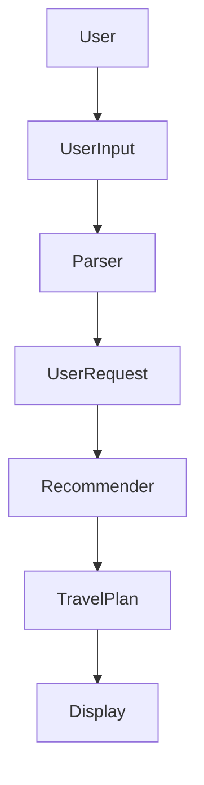
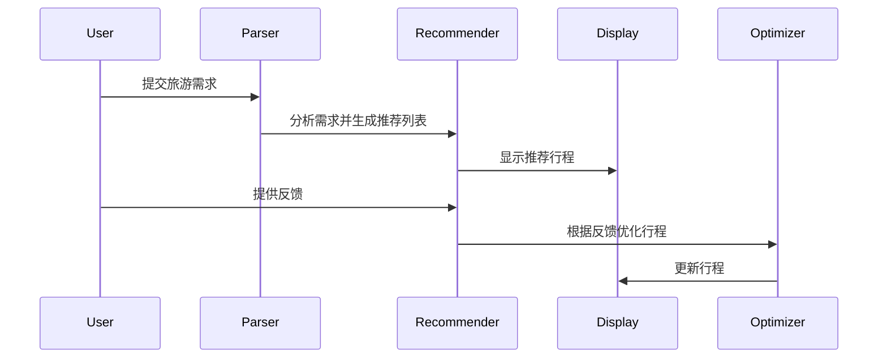

                 


# AI Agent在智能旅游规划中的应用

> 关键词：AI Agent、智能旅游规划、算法原理、系统架构、项目实战

> 摘要：本文深入探讨了AI Agent在智能旅游规划中的应用，从核心概念、算法原理到系统架构、项目实战，全面解析了AI Agent如何提升旅游规划的智能化水平。通过详细的技术分析和实际案例，展示了AI Agent在个性化推荐、动态调整和用户行为分析中的巨大潜力。

---

# 第1章: AI Agent与智能旅游规划的背景介绍

## 1.1 AI Agent的基本概念

### 1.1.1 AI Agent的定义与特点
AI Agent（人工智能代理）是一种能够感知环境、自主决策并执行任务的智能实体。其特点包括：
1. **自主性**：无需外部干预，自主完成任务。
2. **反应性**：能够实时感知环境变化并做出反应。
3. **学习性**：通过数据和经验不断优化自身行为。
4. **社交能力**：能够与其他系统或用户进行交互。

### 1.1.2 AI Agent的核心要素与功能
AI Agent的核心要素包括：
- **感知能力**：通过传感器或数据输入感知环境。
- **决策能力**：基于感知信息做出决策。
- **执行能力**：通过执行器或接口完成任务。
- **学习能力**：通过机器学习算法不断优化自身行为。

### 1.1.3 AI Agent在旅游中的应用背景
随着旅游业的快速发展，用户对个性化、智能化旅游体验的需求日益增长。AI Agent通过整合旅游资源、用户需求和实时数据，为智能旅游规划提供了技术支撑。

---

## 1.2 智能旅游规划的定义与需求

### 1.2.1 智能旅游规划的定义
智能旅游规划是指利用人工智能技术，基于用户需求和实时数据，提供个性化的行程安排、景点推荐和旅行建议。

### 1.2.2 用户在旅游规划中的核心需求
1. **个性化推荐**：根据用户兴趣和偏好推荐景点、酒店和行程。
2. **行程优化**：自动调整行程以适应用户需求和实时变化。
3. **实时反馈**：根据用户反馈动态调整推荐内容。

### 1.2.3 智能旅游规划的边界与外延
智能旅游规划的边界包括：
1. 用户需求分析。
2. 行程推荐。
3. 动态调整。

外延包括：
1. 旅游资源管理。
2. 用户行为分析。
3. 旅行体验优化。

---

## 1.3 AI Agent在智能旅游规划中的作用

### 1.3.1 AI Agent如何提升旅游规划效率
AI Agent通过自动化数据处理和智能推荐，显著提升了旅游规划的效率。

### 1.3.2 AI Agent在个性化推荐中的应用
AI Agent能够基于用户数据和行为，提供精准的个性化推荐。

### 1.3.3 AI Agent在动态调整中的优势
AI Agent能够实时感知环境变化，快速调整行程安排。

---

## 1.4 本章小结
本章介绍了AI Agent的基本概念和其在智能旅游规划中的作用，为后续内容奠定了基础。

---

# 第2章: AI Agent的核心概念与技术基础

## 2.1 AI Agent的分类与特点

### 2.1.1 基于规则的AI Agent
基于规则的AI Agent通过预定义的规则进行决策。其特点包括：
- 简单易懂。
- 适用于规则明确的场景。

### 2.1.2 基于机器学习的AI Agent
基于机器学习的AI Agent通过学习数据进行决策。其特点包括：
- 灵活性高。
- 适用于复杂场景。

### 2.1.3 基于强化学习的AI Agent
基于强化学习的AI Agent通过与环境交互学习最优策略。其特点包括：
- 自适应性强。
- 适用于动态环境。

---

## 2.2 AI Agent的核心技术

### 2.2.1 自然语言处理（NLP）
NLP技术用于理解用户需求和生成自然语言回复。

### 2.2.2 机器学习与深度学习
机器学习和深度学习技术用于模式识别和数据挖掘。

### 2.2.3 知识图谱与推理
知识图谱和推理技术用于构建领域知识库和进行逻辑推理。

---

## 2.3 AI Agent与智能旅游规划的关系

### 2.3.1 AI Agent在旅游信息处理中的作用
AI Agent能够高效处理和分析旅游数据。

### 2.3.2 AI Agent在用户行为分析中的应用
AI Agent能够分析用户行为并提供个性化服务。

### 2.3.3 AI Agent在旅游决策支持中的价值
AI Agent能够为用户提供决策支持和优化建议。

---

## 2.4 本章小结
本章详细介绍了AI Agent的分类和技术基础，并分析了其在智能旅游规划中的应用。

---

# 第3章: AI Agent在智能旅游规划中的算法与数学模型

## 3.1 AI Agent的核心算法原理

### 3.1.1 基于规则的AI Agent算法
基于规则的AI Agent算法通过预定义规则进行决策。例如：
- 如果用户偏好自然风光，则推荐 mountain 和 beach 景点。

### 3.1.2 基于机器学习的AI Agent算法
基于机器学习的AI Agent算法通过训练数据进行分类和预测。例如：
- 使用随机森林算法进行用户偏好预测。

### 3.1.3 基于强化学习的AI Agent算法
基于强化学习的AI Agent算法通过与环境交互学习最优策略。例如：
- 使用Q-learning算法进行行程优化。

---

## 3.2 AI Agent的数学模型与公式

### 3.2.1 基于机器学习的数学模型
随机森林算法的数学模型如下：
$$
P(y|x) = \sum_{i=1}^{n} \frac{1}{n} \cdot I(y_i = y)
$$

### 3.2.2 基于强化学习的数学模型
Q-learning算法的数学模型如下：
$$
Q(s, a) = Q(s, a) + \alpha \cdot (r + \gamma \cdot \max_{a'} Q(s', a') - Q(s, a))
$$

---

## 3.3 本章小结
本章详细介绍了AI Agent在智能旅游规划中的算法原理和数学模型。

---

# 第4章: AI Agent在智能旅游规划中的系统架构设计

## 4.1 系统功能设计

### 4.1.1 用户需求分析模块
用户需求分析模块用于解析用户输入并生成需求描述。

### 4.1.2 行程推荐模块
行程推荐模块基于用户需求和资源数据生成推荐行程。

### 4.1.3 动态调整模块
动态调整模块根据实时数据和用户反馈优化行程安排。

---

## 4.2 系统架构设计

### 4.2.1 系统架构图


### 4.2.2 模块交互流程图


---

## 4.3 本章小结
本章详细介绍了AI Agent在智能旅游规划中的系统架构设计。

---

# 第5章: AI Agent在智能旅游规划中的项目实战

## 5.1 项目背景与目标

### 5.1.1 项目背景
本项目旨在开发一个基于AI Agent的智能旅游规划系统。

### 5.1.2 项目目标
1. 提供个性化的旅游行程推荐。
2. 实现行程的动态调整功能。
3. 提供实时的旅游信息查询。

---

## 5.2 系统实现

### 5.2.1 环境配置
```python
# 安装依赖
pip install numpy scikit-learn
```

### 5.2.2 核心代码实现

#### 5.2.2.1 用户需求分析模块
```python
def parse_user_input(user_input):
    # 使用NLP技术分析用户输入
    return parsed_request
```

#### 5.2.2.2 行程推荐模块
```python
def recommend_travel_plan(parsed_request):
    # 使用机器学习模型生成推荐行程
    return travel_plan
```

#### 5.2.2.3 动态调整模块
```python
def optimize_plan(feedback):
    # 根据反馈优化行程
    return optimized_plan
```

---

## 5.3 项目实战与案例分析

### 5.3.1 案例分析
假设用户输入需求为“想在5天内游览巴黎的主要景点”，系统会根据用户偏好推荐行程。

### 5.3.2 实际应用效果
系统能够根据实时数据和用户反馈动态调整行程，提升用户体验。

---

## 5.4 本章小结
本章通过实际案例展示了AI Agent在智能旅游规划中的应用，验证了其有效性和实用性。

---

# 第6章: 总结与展望

## 6.1 本章小结
本文详细探讨了AI Agent在智能旅游规划中的应用，从核心概念到算法实现，再到系统架构和项目实战，全面分析了其在提升旅游体验中的巨大潜力。

## 6.2 未来展望
随着AI技术的不断发展，AI Agent在智能旅游规划中的应用将更加广泛和深入。未来的研究方向包括：
1. 提升AI Agent的学习能力和自适应能力。
2. 推动AI Agent与更多旅游资源的整合。
3. 加强AI Agent在用户行为分析中的应用。

---

# 结语
AI Agent作为人工智能技术的核心组成部分，正在为智能旅游规划带来革命性的变化。通过不断的技术创新和实践应用，AI Agent将为用户带来更加智能化、个性化的旅游体验。

---

# 参考文献
1. Russell, S., & Norvig, P. (2010). Artificial Intelligence: A Modern Approach.
2. Goodfellow, I., Bengio, Y., & Courville, A. (2016). Deep Learning.
3. LeCun, Y., Bengio, Y., & Hinton, G. (2015). Deep learning.

---

