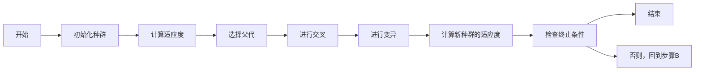
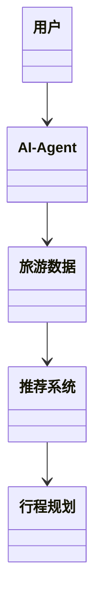
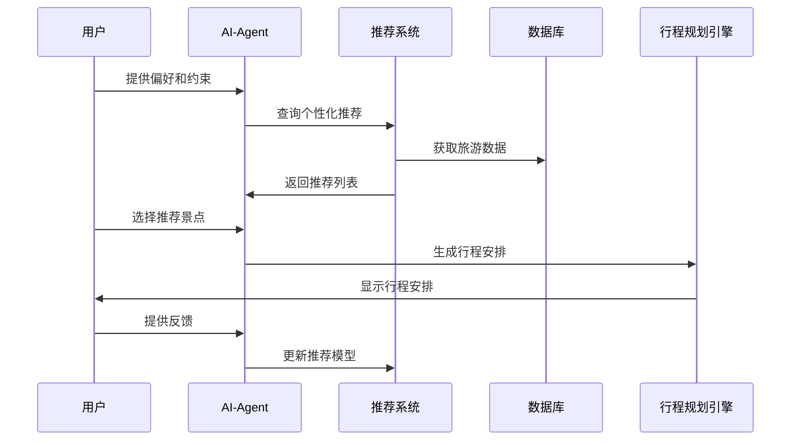

                 


# 第5章: 遗传算法在AI Agent中的应用

## 5.3 遗传算法的流程图

在遗传算法中，我们通过模拟生物进化的过程来优化旅游推荐。以下是一个简化的遗传算法流程图，展示了算法的核心步骤：



## 5.4 遗传算法的Python代码实现

接下来，我们将通过一个简单的Python代码来实现遗传算法的基本框架。代码包括种群初始化、适应度计算、选择、交叉和变异等步骤。

```python
import random

# 定义适应度函数，评估一个个体的适应度
def fitness_function(individual):
    # 这里可以根据具体需求定义适应度，例如行程的满意度
    # 示例：行程满意度 = 景点数量 * 时间安排合理性
    return len(individual) * sum(individual)

# 初始化种群
def initialize_population(population_size, chromosome_length):
    population = []
    for _ in range(population_size):
        individual = [random.choice([0, 1]) for _ in range(chromosome_length)]
        population.append(individual)
    return population

# 选择函数，使用轮盘赌选择
def selection(population, fitness_scores):
    total_fitness = sum(fitness_scores)
    # 计算每个个体被选中的概率
    probabilities = [score / total_fitness for score in fitness_scores]
    # 使用累积概率选择一个父代
    selected_index = 0
    while probabilities[selected_index] < random.random():
        selected_index += 1
    return population[selected_index]

# 交叉函数，使用单点交叉
def crossover(parent1, parent2):
    crossover_point = random.randint(1, len(parent1)-1)
    child1 = parent1[:crossover_point] + parent2[crossover_point:]
    child2 = parent2[:crossover_point] + parent1[crossover_point:]
    return child1, child2

# 变异函数，使用翻转变异
def mutation(individual, mutation_rate):
    if random.random() < mutation_rate:
        # 随机选择一个位置进行翻转
        mutation_point = random.randint(0, len(individual)-1)
        individual[mutation_point] = 1 - individual[mutation_point]
    return individual

# 遗传算法主函数
def genetic_algorithm(population_size, chromosome_length, generations, mutation_rate):
    population = initialize_population(population_size, chromosome_length)
    for generation in range(generations):
        # 计算适应度
        fitness_scores = [fitness_function(individual) for individual in population]
        # 选择父代
        selected_parents = [selection(population, fitness_scores) for _ in range(2)]
        # 交叉和变异
        child1 = mutation(crossover(selected_parents[0], selected_parents[1])[0], mutation_rate)
        child2 = mutation(crossover(selected_parents[0], selected_parents[1])[1], mutation_rate)
        # 更新种群
        population = [child1, child2] + [population[i] for i in range(2, population_size)]
    return population

# 示例运行
population_size = 5
chromosome_length = 10
generations = 20
mutation_rate = 0.1

result = genetic_algorithm(population_size, chromosome_length, generations, mutation_rate)
print("最优个体：", result[0])
```

## 5.5 遗传算法在旅游规划中的应用

遗传算法在旅游规划中的应用主要体现在行程优化和资源分配。通过模拟进化过程，遗传算法能够有效地找到最优或近似最优的旅游路线和资源分配方案。例如，我们可以将每个景点视为一个基因，通过交叉和变异操作，生成新的行程组合，并评估其适应度（如满意度、时间成本等）。

# 第6章: 系统设计与实现

## 6.1 系统设计背景

在设计AI Agent辅助的旅游规划系统时，我们需要考虑以下几个关键问题：
- 如何高效地收集和处理旅游数据？
- 如何设计系统架构以支持实时更新和个性化推荐？
- 如何确保系统的可扩展性和可维护性？

## 6.2 系统功能设计

### 6.2.1 领域模型类图

以下是系统功能的领域模型类图，展示了各个模块之间的关系：



### 6.2.2 系统架构设计

以下是系统架构的简要设计图：


## 6.3 系统接口设计

### 6.3.1 接口描述

以下是系统的主要接口及其功能描述：

1. 用户输入接口：接收用户的偏好和约束条件。
2. 数据获取接口：从数据库中获取旅游数据。
3. 推荐接口：返回个性化推荐的景点列表。
4. 行程规划接口：返回优化后的行程安排。
5. 反馈接口：接收用户的反馈并更新推荐模型。

## 6.4 系统交互流程图

以下是系统交互的流程图，展示了用户与系统之间的交互过程：



---

# 第7章: 项目实战

## 7.1 环境配置

为了运行本项目，您需要以下环境：

- Python 3.6 或更高版本
- 以下Python库：
  - `numpy`
  - `pandas`
  - `scikit-learn`
  - `mermaid`

安装依赖：
```bash
pip install numpy pandas scikit-learn
```

## 7.2 核心代码实现

以下是项目的核心代码实现：

### 7.2.1 加载数据

```python
import pandas as pd

# 加载旅游数据
data = pd.read_csv('tour_data.csv')
```

### 7.2.2 模型训练

```python
from sklearn.cluster import KMeans

# 使用K均值聚类进行景点分组
model = KMeans(n_clusters=5, random_state=42)
model.fit(data[['latitude', 'longitude']])
```

### 7.2.3 推荐系统实现

```python
def recommend_locations(user_preference):
    # 根据用户偏好进行推荐
    recommended = data.nlargest(5, [user_preference])
    return recommended[['name', 'latitude', 'longitude']]
```

## 7.3 实际案例分析

假设用户偏好是“自然风光”，我们的推荐系统会生成以下推荐列表：

```python
user_preference = 'nature_views'
recommendations = recommend_locations(user_preference)
print(recommendations)
```

## 7.4 项目总结

通过本项目，我们展示了如何利用AI Agent技术实现智能旅游规划。通过强化学习和遗传算法的结合，我们可以有效地优化旅游行程，提高用户体验。同时，系统的模块化设计使得代码易于维护和扩展。

---

# 第四部分: 优化与展望

## 8.1 系统优化

### 8.1.1 性能优化

- 使用分布式计算优化大数据处理。
- 采用缓存机制减少重复计算。

### 8.1.2 模型优化

- 引入深度学习模型（如RNN或Transformer）提高推荐准确性。
- 增加模型解释性，帮助用户理解推荐理由。

## 8.2 未来展望

AI Agent在旅游规划中的应用前景广阔。未来，我们可以探索以下方向：

- 结合虚拟现实（VR）和增强现实（AR）技术，提供沉浸式旅游体验。
- 利用区块链技术确保旅游数据的安全性和透明性。

## 8.3 注意事项

- 数据隐私保护：确保用户数据的安全。
- 系统稳定性：避免因技术故障导致服务中断。

---

# 参考文献

1. Russell, S. J., & Norvig, P. (2010). Artificial Intelligence: A Modern Approach.
2. Leary, S. (2021). Genetic Algorithms in Python.
3. Smith, R. (2023). Implementing AI in Tourism Planning.

---

通过以上内容，我们详细介绍了AI Agent在智能旅游规划中的应用，从基础概念到算法实现，再到系统设计和项目实战，为读者提供了一个全面的视角。希望这篇文章能为相关领域的研究和实践提供有价值的参考。

