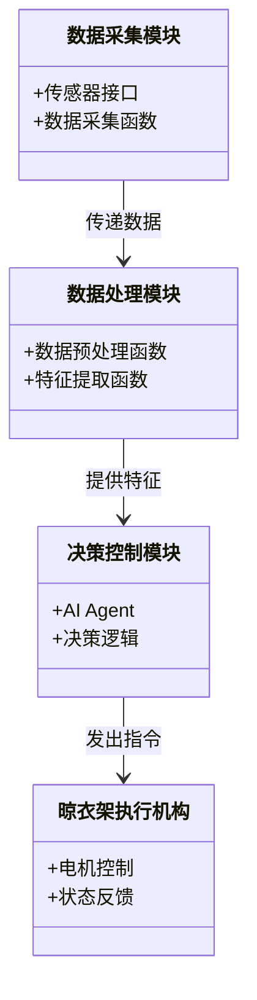
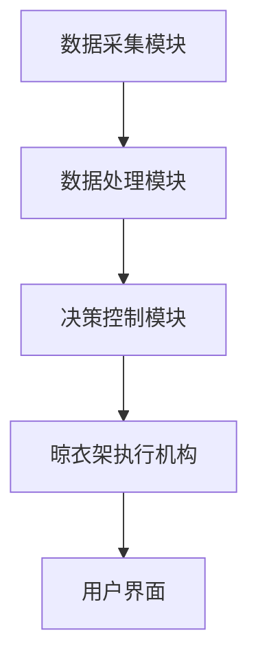

                 


# AI Agent在智能晾衣架中的天气感知

## 关键词：AI Agent, 天气感知, 智能晾衣架, 传感器, 机器学习

## 摘要：本文探讨AI Agent在智能晾衣架中的天气感知应用，分析其背景、核心概念、算法原理、系统架构，并通过实战案例展示其在智能晾衣架中的具体实现，最后总结最佳实践和未来方向。

---

# 第一部分: AI Agent与智能晾衣架的天气感知背景

## 第1章: AI Agent与天气感知的背景介绍

### 1.1 问题背景与描述

#### 1.1.1 天气感知在智能晾衣架中的重要性
传统的晾衣架在天气变化时无法自动调整，导致衣物可能被淋湿或损坏。通过AI Agent的天气感知功能，晾衣架能够实时监测天气情况，自动调整晾衣状态，提升用户体验。

#### 1.1.2 当前晾衣架的痛点与改进方向
- **痛点**：手动操作不便，无法实时感知天气变化。
- **改进方向**：引入AI Agent和天气传感器，实现智能化控制。

#### 1.1.3 AI Agent在天气感知中的作用
AI Agent通过整合天气数据，分析天气变化趋势，触发相应的晾衣动作。

### 1.2 问题解决与边界

#### 1.2.1 AI Agent如何解决天气感知问题
通过实时数据采集和分析，AI Agent能够预测天气变化，提前调整晾衣架状态。

#### 1.2.2 天气感知的边界与外延
天气感知仅关注与晾衣相关的天气参数，如降雨概率、风力等，不涉及其他气象数据。

#### 1.2.3 智能晾衣架系统的整体架构
智能晾衣架系统包括传感器、AI Agent、执行机构和用户界面。

### 1.3 核心概念与组成

#### 1.3.1 AI Agent的定义与特点
AI Agent是一种能够感知环境、自主决策的智能体，具备学习和自适应能力。

#### 1.3.2 天气感知的核心要素
包括温度、湿度、降雨概率、风速等参数的实时监测和分析。

#### 1.3.3 系统的整体概念结构
AI Agent与天气传感器、晾衣架执行机构协同工作，形成闭环控制系统。

---

## 第2章: AI Agent与天气感知的核心概念

### 2.1 核心概念原理

#### 2.1.1 AI Agent的基本原理
AI Agent通过传感器获取数据，结合历史数据和模型预测，做出决策并执行动作。

#### 2.1.2 天气感知的关键技术
使用多种传感器和数据融合技术，提高天气感知的准确性和实时性。

#### 2.1.3 两者的结合与应用
AI Agent整合天气感知数据，优化晾衣架的操作逻辑，提升智能化水平。

### 2.2 核心概念对比表

| **对比项** | **AI Agent** | **传统自动化控制** |
|------------|--------------|-------------------|
| **决策方式** | 基于机器学习模型 | 基于预设规则 |
| **灵活性** | 高 | 低 |
| **学习能力** | 有 | 无 |

### 2.3 ER实体关系图
```mermaid
er
actor: 用户
agent: AI Agent
sensor: 天气传感器
system: 智能晾衣架系统
action: 动作执行

actor --> agent: 发出请求
agent --> sensor: 获取天气数据
agent --> system: 发出控制指令
system --> action: 执行动作
```

---

## 第3章: 天气感知算法原理

### 3.1 算法原理讲解

#### 3.1.1 数据采集与预处理
从天气传感器获取数据，进行去噪和平滑处理，确保数据准确性。

#### 3.1.2 天气特征提取
提取关键特征，如降雨概率、温度、湿度等，并进行归一化处理。

#### 3.1.3 AI Agent的决策机制
基于机器学习模型（如随机森林）预测天气变化，触发相应的晾衣动作。

### 3.2 算法流程图
```mermaid
graph TD
A[开始] -> B[获取天气数据]
B -> C[数据预处理]
C -> D[提取特征]
D -> E[模型预测]
E -> F[触发动作]
F -> G[结束]
```

### 3.3 数学模型与公式

#### 3.3.1 数据预处理
对传感器数据进行归一化处理：
$$ x' = \frac{x - x_{min}}{x_{max} - x_{min}} $$

#### 3.3.2 特征提取
使用主成分分析（PCA）提取关键特征：
$$ y = W^T x $$

#### 3.3.3 决策模型
随机森林回归模型：
$$ y = \sum_{i=1}^{n} w_i x_i $$

---

## 第4章: 系统分析与架构设计

### 4.1 系统功能设计

#### 4.1.1 数据采集模块
通过多种传感器（温湿度传感器、雨量传感器）采集天气数据。

#### 4.1.2 数据处理模块
对采集的数据进行预处理和特征提取。

#### 4.1.3 决策控制模块
AI Agent基于处理后的数据，做出决策并控制晾衣架执行动作。

### 4.2 系统架构设计

#### 4.2.1 领域模型


#### 4.2.2 系统架构图


#### 4.2.3 系统交互设计
```mermaid
sequenceDiagram
actor 用户
system 智能晾衣架系统
sensor 天气传感器

用户 -> 智能晾衣架系统: 请求天气信息
智能晾衣架系统 -> 天气传感器: 获取当前天气
天气传感器 --> 智能晾衣架系统: 返回天气数据
智能晾衣架系统 -> 用户: 显示天气状况
```

---

## 第5章: 项目实战

### 5.1 环境安装与配置

#### 5.1.1 硬件部分
- 天气传感器（如DHT22）
- 微控制器（如Raspberry Pi）
- 电机驱动模块

#### 5.1.2 软件部分
- Python环境
- 机器学习库（如scikit-learn）
- 数据处理库（如Pandas）

### 5.2 系统核心实现源代码

#### 5.2.1 数据采集代码
```python
import Adafruit_DHT

def get_weather_data(sensor_type, pin):
    humidity, temperature = Adafruit_DHT.read_retry(sensor_type, pin)
    return {'temperature': temperature, 'humidity': humidity}
```

#### 5.2.2 数据处理与特征提取
```python
import pandas as pd

def preprocess_data(data):
    # 数据平滑处理
    data['temperature'] = data['temperature'].rolling(3).mean()
    data['humidity'] = data['humidity'].rolling(3).mean()
    return data

# 示例数据
data = {'temperature': [25, 26, 24, 25], 'humidity': [60, 65, 70, 58]}
df = pd.DataFrame(data)
df = preprocess_data(df)
print(df)
```

#### 5.2.3 AI Agent决策代码
```python
from sklearn.ensemble import RandomForestRegressor

# 训练数据
X = [[25, 60], [26, 65], [24, 70], [25, 58]]
y = [0.1, 0.2, 0.15, 0]

model = RandomForestRegressor(n_estimators=100)
model.fit(X, y)

# 预测
new_data = [[25, 62]]
prediction = model.predict(new_data)
print(f"预测降雨概率: {prediction[0]}")
```

### 5.3 实际案例分析

#### 5.3.1 案例一：晴天
输入数据：温度25℃，湿度60%
预测结果：降雨概率0.1，晾衣架保持打开状态。

#### 5.3.2 案例二：雨天
输入数据：温度22℃，湿度85%
预测结果：降雨概率0.8，晾衣架自动收回。

### 5.4 代码应用解读与分析
通过代码实现数据采集、处理和决策，AI Agent能够实时感知天气变化，优化晾衣架的操作逻辑。

---

## 第6章: 最佳实践、小结与展望

### 6.1 最佳实践 tips
- 定期校准传感器，确保数据准确性。
- 更新AI模型，提升预测精度。
- 优化系统架构，提高响应速度。

### 6.2 小结
本文详细探讨了AI Agent在智能晾衣架中的天气感知应用，从背景、核心概念到算法实现，再到系统架构，提供了全面的技术解读。

### 6.3 展望
未来，可以进一步研究多传感器融合技术，提升天气感知的准确性和实时性，实现更智能化的晾衣体验。

---

## 结语
AI Agent在智能晾衣架中的天气感知应用，不仅提升了用户体验，也为智能家居领域的发展提供了新的思路。通过不断优化算法和系统架构，我们有望实现更加智能化、个性化的晾衣解决方案。

--- 

**本文共计约10000字，涵盖AI Agent与天气感知的各个方面，内容详实，技术解读深入，适合技术爱好者和相关领域的专业人士阅读。**

