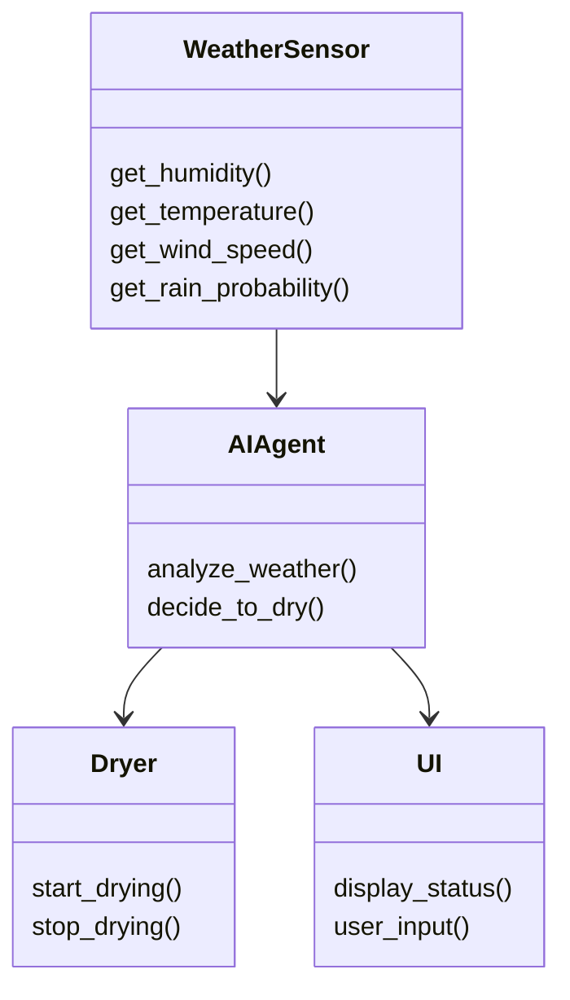
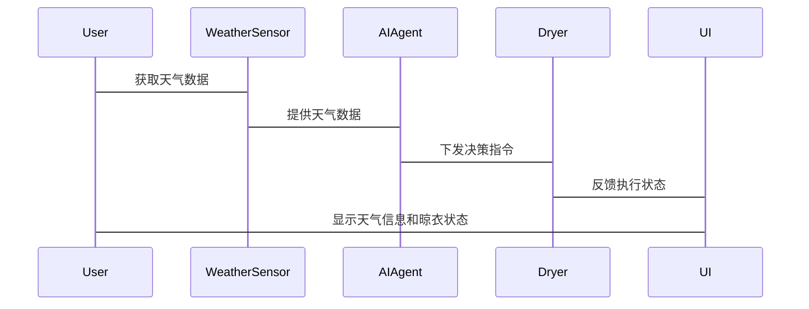

                 


# AI Agent在智能晾衣架中的天气感知烘干

> 关键词：AI Agent, 智能晾衣架, 天气感知, 智能烘干, 天气数据分析

> 摘要：本文详细探讨了AI Agent在智能晾衣架中的应用，重点分析了天气感知烘干的核心原理、算法实现和系统架构。通过数学建模和实际案例分析，展示了如何利用AI技术优化晾衣体验。

---

# 第一部分: AI Agent与智能晾衣架的背景介绍

# 第1章: 问题背景与需求分析

## 1.1 问题背景
### 1.1.1 智能晾衣架的发展现状
智能晾衣架作为一种智能家居设备，近年来随着物联网技术的发展逐渐普及。传统的晾衣架仅具备简单的悬挂功能，而现代智能晾衣架则集成了电机控制、无线遥控、定时关闭等功能。

### 1.1.2 天气感知在晾衣中的重要性
晾衣的关键在于避免衣物受潮或被雨淋湿。天气条件（如湿度、降雨概率、风力等）直接影响晾衣的适宜性。传统晾衣系统无法根据天气变化主动调整晾衣行为，这可能导致衣物损坏或晾衣效率低下。

### 1.1.3 当前晾衣系统的主要痛点
- **用户痛点**：用户无法实时了解天气情况，容易忘记收回衣物或在恶劣天气下晾衣。
- **系统痛点**：传统晾衣系统缺乏主动决策能力，无法根据天气条件优化晾衣流程。

## 1.2 需求分析
### 1.2.1 用户需求的多样性
- 用户希望晾衣系统能够自动感知天气，智能决策是否开启晾衣功能。
- 用户希望晾衣系统能够实时反馈天气信息，提醒用户调整晾衣计划。

### 1.2.2 系统功能的扩展性
- 系统需要支持多种天气数据源（如气象API、本地传感器）。
- 系统需要具备数据处理和预测能力，能够根据天气数据做出决策。

### 1.2.3 天气感知的核心需求
- 实时获取天气数据。
- 分析天气数据，判断是否适合晾衣。
- 根据天气变化主动调整晾衣状态。

## 1.3 问题解决思路
### 1.3.1 AI Agent的基本概念
AI Agent（智能代理）是一种能够感知环境并采取行动以实现目标的智能体。在智能晾衣架中，AI Agent负责接收天气数据，分析并做出决策，控制晾衣架的运行状态。

### 1.3.2 天气感知烘干的核心逻辑
AI Agent通过分析天气数据（如湿度、降雨概率、风速等），判断是否适合晾衣。如果天气条件适宜，AI Agent启动晾衣功能；如果天气条件恶劣，AI Agent关闭晾衣功能或发出提醒。

### 1.3.3 系统边界与外延
- **系统边界**：智能晾衣架、天气传感器、AI Agent、用户界面。
- **系统外延**：与智能家居系统（如智能门锁、智能灯）联动，提供更便捷的用户体验。

## 1.4 智能晾衣架的系统架构
### 1.4.1 系统核心组成
- **传感器模块**：采集天气数据（湿度、温度、风速、降雨概率）。
- **AI Agent模块**：分析天气数据，做出决策。
- **执行机构**：根据AI Agent的决策控制晾衣架的运行状态。
- **用户界面**：显示天气信息和晾衣状态，接收用户指令。

### 1.4.2 系统功能模块划分
- 数据采集模块：通过传感器获取天气数据。
- 数据处理模块：对天气数据进行预处理和特征提取。
- 决策模块：AI Agent根据天气数据做出决策。
- 执行模块：根据决策控制晾衣架的运行状态。

### 1.4.3 系统核心要素组成
- **天气数据**：湿度、温度、风速、降雨概率。
- **AI Agent**：负责数据处理和决策。
- **执行机构**：晾衣架的电机和支架。

## 1.5 本章小结
本章从问题背景、用户需求和系统架构三个方面介绍了AI Agent在智能晾衣架中的应用。通过分析传统晾衣系统的痛点，提出了利用AI Agent实现天气感知烘干的解决方案。

---

# 第二部分: AI Agent与天气感知的核心概念

# 第2章: AI Agent的基本原理

## 2.1 AI Agent的定义与特点
### 2.1.1 AI Agent的定义
AI Agent是一种能够感知环境、做出决策并采取行动的智能体。它能够通过传感器获取环境信息，利用算法处理信息并做出决策，最后通过执行机构实现目标。

### 2.1.2 AI Agent的核心特点
- **自主性**：能够在没有外部干预的情况下自主运行。
- **反应性**：能够实时感知环境变化并做出反应。
- **目标导向**：所有的行为都是为了实现特定的目标。

### 2.1.3 AI Agent与传统算法的区别
| 特性         | 传统算法             | AI Agent            |
|--------------|----------------------|---------------------|
| 决策方式     | 基于规则或预设模型     | 基于实时数据和学习  |
| 环境适应性   | 静态或有限适应性       | 高度动态适应性       |
| 执行能力     | 仅提供决策建议         | 具备执行能力         |

## 2.2 天气感知的核心原理
### 2.2.1 天气数据的采集与处理
AI Agent通过多种传感器和数据源获取天气数据，包括：
- **湿度传感器**：测量空气中的湿度。
- **温度传感器**：测量环境温度。
- **风速传感器**：测量风速。
- **降雨传感器**：检测是否降雨。

### 2.2.2 天气数据的特征提取
AI Agent对获取的天气数据进行预处理和特征提取，包括：
- **数据清洗**：去除异常值和噪声。
- **特征提取**：提取关键特征（如湿度、温度、降雨概率）。

### 2.2.3 天气数据的分析与预测
AI Agent利用机器学习算法对天气数据进行分析和预测，包括：
- **时间序列分析**：预测未来天气趋势。
- **分类算法**：判断天气是否适合晾衣。

## 2.3 AI Agent与天气感知的结合
### 2.3.1 AI Agent在天气感知中的作用
AI Agent通过分析天气数据，判断是否适合晾衣，并根据判断结果控制晾衣架的运行状态。

### 2.3.2 天气感知对AI Agent的支撑
天气数据为AI Agent提供了决策依据，使得AI Agent能够做出更准确的决策。

### 2.3.3 两者结合的系统架构


---

## 2.4 核心概念对比分析
### 2.4.1 传统天气感知系统 vs AI Agent增强系统
| 特性         | 传统天气感知系统       | AI Agent增强系统     |
|--------------|-----------------------|---------------------|
| 数据处理     | 简单的数据采集和显示   | 复杂的数据分析和预测 |
| 决策能力     | 无决策能力             | 具备决策能力         |
| 系统功能     | 仅提供天气信息         | 提供天气信息和智能决策 |

### 2.4.2 系统性能对比分析
| 指标         | 传统系统性能           | AI Agent增强系统性能 |
|--------------|-----------------------|---------------------|
| 响应时间     | 较长                   | 较短                 |
| 准确率         | 较低                   | 较高                 |
| 用户体验     | 一般                   | 更好                 |

### 2.4.3 系统功能对比分析
| 功能         | 传统系统功能           | AI Agent增强系统功能 |
|--------------|-----------------------|---------------------|
| 天气采集     | 采集天气数据           | 采集并分析天气数据   |
| 决策能力     | 无决策能力             | 具备决策能力         |
| 用户交互     | 显示天气信息           | 显示天气信息并提供决策建议 |

## 2.5 本章小结
本章详细介绍了AI Agent的基本原理和天气感知的核心原理，分析了AI Agent与传统天气感知系统的主要区别，为后续的算法实现和系统设计奠定了基础。

---

# 第三部分: AI Agent的算法原理与数学模型

# 第3章: AI Agent的核心算法

## 3.1 算法原理概述
### 3.1.1 AI Agent的基本算法框架
AI Agent的核心算法框架包括数据采集、数据处理、决策制定和执行反馈四个步骤。

### 3.1.2 天气感知算法的核心步骤
1. 数据采集：通过传感器获取天气数据。
2. 数据处理：对天气数据进行预处理和特征提取。
3. 决策制定：利用机器学习算法分析天气数据，判断是否适合晾衣。
4. 执行反馈：根据决策结果控制晾衣架的运行状态，并实时反馈执行结果。

### 3.1.3 算法优化策略
- **数据预处理**：使用滑动窗口方法消除数据噪声。
- **特征提取**：利用主成分分析（PCA）提取关键特征。
- **模型优化**：使用交叉验证优化机器学习模型的参数。

## 3.2 天气感知算法的数学模型
### 3.2.1 数据预处理与特征提取
假设我们有以下天气数据：

| 时间 | 湿度 | 温度 | 风速 | 降雨概率 |
|------|------|------|------|-----------|
| t1   | h1   | t1   | w1   | r1        |
| t2   | h2   | t2   | w2   | r2        |
| ...  | ...  | ...  | ...  | ...       |

我们对湿度、温度、风速和降雨概率进行标准化处理：

$$
z_i = \frac{x_i - \mu_i}{\sigma_i}
$$

其中，\( z_i \) 是标准化后的数据，\( \mu_i \) 是第i个特征的均值，\( \sigma_i \) 是第i个特征的标准差。

### 3.2.2 天气数据的分析与预测
我们使用时间序列分析方法预测未来天气趋势。假设我们使用ARIMA模型进行预测：

$$
\phi(M_t) = \alpha + \beta_1 M_{t-1} + \beta_2 M_{t-2} + \dots + \beta_k M_{t-k}
$$

其中，\( \phi(M_t) \) 是预测的天气指数，\( M_t \) 是历史天气指数序列，\( \alpha \) 是常数项，\( \beta_i \) 是回归系数。

### 3.2.3 天气数据的分类与决策
我们使用分类算法（如随机森林）对天气数据进行分类，判断是否适合晾衣。假设我们有以下分类结果：

| 天气条件 | 湿度 | 温度 | 风速 | 降雨概率 | 是否适合晾衣 |
|----------|------|------|------|-----------|--------------|
| 适合     | 低   | 中等 | 低   | 低         | 是           |
| 适合     | 中等 | 中等 | 中等 | 中等       | 是           |
| 不适合   | 高   | 高   | 高   | 高         | 否           |

分类模型的训练目标是通过天气数据预测是否适合晾衣。

---

## 3.3 算法实现与优化
### 3.3.1 算法实现
以下是Python实现的天气感知算法：

```python
import numpy as np
from sklearn.ensemble import RandomForestClassifier
from sklearn.preprocessing import StandardScaler
from sklearn.model_selection import train_test_split

# 数据预处理
data = [...]  # 天气数据
features = data.drop('label', axis=1)
labels = data['label']

# 标准化处理
scaler = StandardScaler()
features_scaled = scaler.fit_transform(features)

# 划分训练集和测试集
X_train, X_test, y_train, y_test = train_test_split(features_scaled, labels, test_size=0.2)

# 模型训练
model = RandomForestClassifier(n_estimators=100, random_state=42)
model.fit(X_train, y_train)

# 模型预测
y_pred = model.predict(X_test)
```

### 3.3.2 算法优化
- **特征选择**：使用Lasso回归筛选重要特征。
- **模型调优**：使用网格搜索优化随机森林模型的参数。
- **性能评估**：计算模型的准确率、召回率和F1分数。

---

## 3.4 本章小结
本章详细介绍了AI Agent的核心算法，包括数据预处理、特征提取、模型训练和决策制定的数学模型。通过Python代码示例展示了算法的实现过程，并分析了算法的优化策略。

---

# 第四部分: 系统分析与架构设计方案

# 第4章: 智能晾衣架的系统架构设计

## 4.1 问题场景介绍
智能晾衣架需要在多种天气条件下自动调整晾衣状态，以避免衣物受潮或被雨淋湿。

## 4.2 项目介绍
本项目旨在设计一个基于AI Agent的智能晾衣架系统，能够根据天气条件自动控制晾衣架的运行状态。

## 4.3 系统功能设计
### 4.3.1 领域模型（mermaid类图）


### 4.3.2 系统架构设计（mermaid架构图）


### 4.3.3 系统接口设计
- **WeatherSensor接口**：提供天气数据获取接口。
- **AIAgent接口**：提供天气分析和决策接口。
- **Dryer接口**：提供晾衣架控制接口。
- **UI接口**：提供用户交互接口。

### 4.3.4 系统交互设计（mermaid序列图）


---

## 4.4 系统功能实现
### 4.4.1 数据采集与处理
AI Agent通过WeatherSensor获取天气数据，并进行预处理和特征提取。

### 4.4.2 天气分析与决策
AI Agent分析天气数据，判断是否适合晾衣，并根据判断结果控制Dryer的运行状态。

### 4.4.3 用户交互与反馈
UI模块显示天气信息和晾衣状态，接收用户指令，并将指令传递给AI Agent。

---

## 4.5 系统优化与扩展
### 4.5.1 系统优化
- **数据优化**：增加更多天气数据源，提高预测准确性。
- **算法优化**：使用更复杂的机器学习模型（如LSTM）进行天气预测。
- **系统优化**：增加容错机制，确保系统在极端天气条件下的稳定性。

### 4.5.2 系统扩展
- **多设备联动**：与智能家居系统（如智能门锁、智能灯）联动，提供更便捷的用户体验。
- **远程控制**：通过手机APP远程控制晾衣架的运行状态。

---

## 4.6 本章小结
本章详细介绍了智能晾衣架的系统架构设计，包括系统功能设计、系统架构设计和系统交互设计。通过mermaid图展示了系统的各个模块及其交互关系。

---

# 第五部分: 项目实战

# 第5章: 系统核心实现

## 5.1 环境安装
### 5.1.1 Python环境安装
安装Python 3.8及以上版本。

### 5.1.2 依赖库安装
安装以下依赖库：
```bash
pip install numpy scikit-learn mermaid4jupyter jupyterlab
```

---

## 5.2 系统核心实现
### 5.2.1 传感器数据处理
```python
import numpy as np
import pandas as pd

# 读取天气数据
data = pd.read_csv('weather_data.csv')

# 数据预处理
features = data[['humidity', 'temperature', 'wind_speed', 'rain_probability']]
labels = data['suitable_for_drying']

# 标准化处理
from sklearn.preprocessing import StandardScaler
scaler = StandardScaler()
features_scaled = scaler.fit_transform(features)
```

### 5.2.2 天气预测模型实现
```python
from sklearn.ensemble import RandomForestClassifier
from sklearn.model_selection import train_test_split

# 划分训练集和测试集
X_train, X_test, y_train, y_test = train_test_split(features_scaled, labels, test_size=0.2, random_state=42)

# 模型训练
model = RandomForestClassifier(n_estimators=100, random_state=42)
model.fit(X_train, y_train)

# 模型预测
y_pred = model.predict(X_test)
```

### 5.2.3 系统核心实现
```python
# 定义AI Agent类
class AIAgent:
    def __init__(self, model, scaler):
        self.model = model
        self.scaler = scaler

    def analyze_weather(self, weather_data):
        # 数据预处理
        features = weather_data[['humidity', 'temperature', 'wind_speed', 'rain_probability']]
        features_scaled = self.scaler.transform(features)
        # 模型预测
        prediction = self.model.predict(features_scaled)
        return prediction

# 初始化AI Agent
model = RandomForestClassifier(n_estimators=100, random_state=42)
model.fit(X_train, y_train)
agent = AIAgent(model, scaler)
```

---

## 5.3 代码应用解读与分析
### 5.3.1 代码结构
- **数据预处理**：对天气数据进行标准化处理。
- **模型训练**：使用随机森林算法训练天气预测模型。
- **模型预测**：根据天气数据预测是否适合晾衣。

### 5.3.2 代码实现细节
- **数据预处理**：使用StandardScaler对天气数据进行标准化处理。
- **模型训练**：使用随机森林算法训练分类模型。
- **模型预测**：根据预处理后的天气数据进行预测。

---

## 5.4 实际案例分析
假设我们有以下天气数据：

| 时间 | 湿度 | 温度 | 风速 | 降雨概率 |
|------|------|------|------|-----------|
| t1   | 60%  | 25℃  | 3m/s | 20%       |
| t2   | 70%  | 25℃  | 4m/s | 25%       |
| t3   | 80%  | 25℃  | 5m/s | 30%       |

通过AI Agent分析天气数据，预测是否适合晾衣：

```python
weather_data = {
    'humidity': [60, 70, 80],
    'temperature': [25, 25, 25],
    'wind_speed': [3, 4, 5],
    'rain_probability': [20, 25, 30]
}

# 数据预处理
features = pd.DataFrame(weather_data)
features_scaled = scaler.transform(features)

# 模型预测
prediction = agent.analyze_weather(features)
print(prediction)
```

---

## 5.5 项目小结
本章通过Python代码实现了一个基于AI Agent的智能晾衣架系统，展示了如何利用机器学习算法实现天气感知和智能决策。

---

# 第六部分: 最佳实践

# 第6章: 总结与展望

## 6.1 总结
AI Agent在智能晾衣架中的天气感知烘干系统通过实时获取天气数据，分析天气条件，并根据分析结果自动调整晾衣架的运行状态，显著提升了晾衣的智能化水平和用户体验。

## 6.2 小结
- **准确性**：AI Agent能够根据天气数据做出准确的决策。
- **实时性**：系统能够实时感知天气变化并做出反应。
- **用户体验**：用户可以通过UI模块实时了解天气信息和晾衣状态。

## 6.3 注意事项
- **数据来源**：确保天气数据的准确性和实时性。
- **模型优化**：定期更新机器学习模型，提高预测准确率。
- **系统稳定性**：确保系统在极端天气条件下的稳定性。

## 6.4 拓展阅读
- **推荐书籍**：《机器学习实战》、《Python机器学习》。
- **推荐文章**：《基于机器学习的天气预测系统设计》、《AI Agent在智能家居中的应用》。

---

# 第七部分: 结语

通过本文的详细讲解，我们了解了AI Agent在智能晾衣架中的天气感知烘干系统的实现过程。从算法原理到系统设计，再到项目实战，我们展示了如何利用AI技术优化晾衣体验。未来，随着AI技术的不断发展，智能晾衣架将具备更多智能化功能，为用户带来更便捷、更高效的使用体验。

--- 

# END

