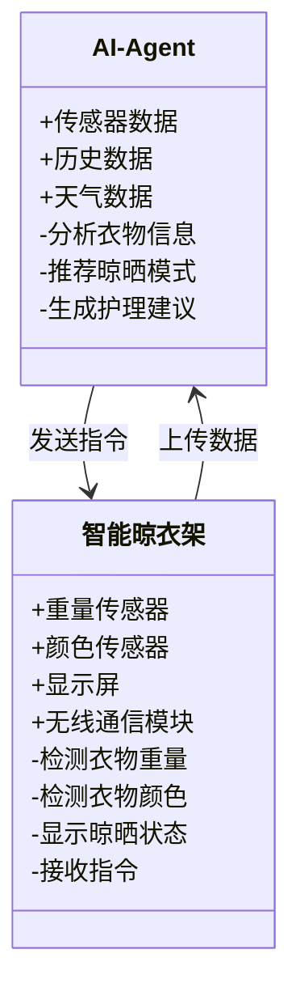
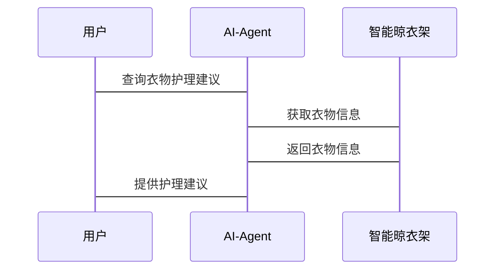

                 


# AI Agent在智能晾衣架中的衣物护理建议

> 关键词：AI Agent, 智能晾衣架, 衣物护理, 机器学习, 自然语言处理, 物联网, 系统架构

> 摘要：本文详细探讨了AI Agent在智能晾衣架中的应用，重点分析了AI Agent如何通过机器学习和自然语言处理技术，为用户提供智能化的衣物护理建议。文章从背景介绍、核心概念、算法原理、系统架构设计到项目实战，全面解析了AI Agent在智能晾衣架中的实现与应用。通过本文，读者将深入了解AI Agent如何帮助用户优化衣物护理流程，提升生活质量。

---

# 第1章: AI Agent与智能晾衣架的背景介绍

## 1.1 问题背景

### 1.1.1 当前衣物护理的主要问题
- 衣物护理过程繁琐，用户需要手动分类、晾晒和存储衣物。
- 不同材质的衣物需要不同的护理方法，用户难以记住所有细节。
- 衣物护理知识分散，用户难以快速获取准确的建议。

### 1.1.2 智能晾衣架的出现背景
- 物联网技术的发展推动了智能家居设备的普及。
- 用户对高效、便捷衣物护理的需求日益增加。
- 智能晾衣架通过传感器和智能算法，实现了衣物晾晒的自动化管理。

### 1.1.3 AI Agent在衣物护理中的应用潜力
- AI Agent可以通过学习用户的衣物护理习惯，提供个性化的建议。
- AI Agent可以实时分析衣物状态，优化晾晒和存储方案。
- AI Agent可以通过与智能晾衣架的协同工作，实现衣物护理的智能化和自动化。

## 1.2 问题描述

### 1.2.1 衣物护理中的常见问题
- 衣物分类错误导致损坏。
- 衣物晾晒时间不当导致发黄或起球。
- 衣物存储不当导致受潮或发霉。

### 1.2.2 智能晾衣架的功能需求
- 自动检测衣物材质和颜色。
- 根据天气和环境调整晾晒参数。
- 提供衣物护理知识的智能推荐。

### 1.2.3 AI Agent在衣物护理中的具体应用场景
- 根据衣物材质推荐晾晒温度和时间。
- 根据天气预报自动调整晾晒模式。
- 提供衣物护理知识的实时查询。

## 1.3 问题解决思路

### 1.3.1 AI Agent的核心功能
- 数据采集与分析：通过传感器和摄像头采集衣物信息。
- 智能决策：基于机器学习模型生成衣物护理建议。
- 人机交互：通过语音或App与用户互动。

### 1.3.2 智能晾衣架的技术实现
- 传感器技术：检测衣物重量、材质、颜色等信息。
- 无线通信：与智能家居系统和其他设备联动。
- 智能控制：根据AI Agent的建议自动调整晾晒模式。

### 1.3.3 AI Agent与智能晾衣架的结合方式
- 数据共享：AI Agent通过传感器获取衣物信息。
- 智能控制：AI Agent向智能晾衣架发送指令。
- 用户交互：AI Agent通过App或语音助手与用户互动。

## 1.4 问题的边界与外延

### 1.4.1 AI Agent的功能边界
- 不处理硬件层面的传感器故障。
- 仅提供衣物护理建议，不直接控制其他智能家居设备。
- 不处理网络连接以外的物理问题。

### 1.4.2 智能晾衣架的使用场景
- 家庭环境下的衣物晾晒。
- 商业洗衣房的智能管理（扩展场景）。
- 特殊环境下的衣物护理（如防紫外线晾晒）。

### 1.4.3 问题的扩展与延伸
- AI Agent在其他智能家居设备中的应用。
- 智能晾衣架的能源管理与优化。
- AI Agent在衣物护理数据隐私保护。

## 1.5 概念结构与核心要素

### 1.5.1 AI Agent的核心要素
| 核心要素 | 描述 |
|----------|------|
| 数据源   | 衣物传感器、摄像头、天气数据 |
| 算法     | 机器学习模型、规则引擎 |
| 用户交互 | App、语音助手 |

### 1.5.2 智能晾衣架的组成结构
| 组件     | 描述 |
|----------|------|
| 传感器   | 检测衣物重量、材质、颜色 |
| 控制器   | 调整晾晒模式、风速、温度 |
| 显示屏   | 显示晾晒状态、建议 |
| 无线通信 | 连接智能家居系统 |

### 1.5.3 两者的结合方式
- 数据共享：AI Agent通过传感器获取衣物信息。
- 智能控制：AI Agent向智能晾衣架发送指令。
- 用户交互：AI Agent通过App或语音助手与用户互动。

---

# 第2章: AI Agent与智能晾衣架的核心概念

## 2.1 AI Agent的基本概念

### 2.1.1 AI Agent的定义
AI Agent是一种智能体，能够通过传感器和算法感知环境，并通过执行动作来优化目标。在智能晾衣架中，AI Agent负责分析衣物信息和环境数据，提供智能化的衣物护理建议。

### 2.1.2 AI Agent的核心特征
| 特征     | 描述 |
|----------|------|
| 智能性   | 基于机器学习模型进行决策 |
| 自适应性 | 根据用户习惯和环境变化优化建议 |
| 交互性   | 通过App或语音助手与用户互动 |

### 2.1.3 AI Agent的分类
| 类型     | 描述 |
|----------|------|
| 简单规则引擎 | 基于预设规则生成建议 |
| 机器学习模型 | 基于历史数据训练模型生成建议 |
| 混合型   | 结合规则引擎和机器学习模型 |

## 2.2 智能晾衣架的基本原理

### 2.2.1 智能晾衣架的功能模块
| 模块     | 描述 |
|----------|------|
| 传感器模块 | 检测衣物重量、材质、颜色 |
| 控制模块 | 调整晾晒模式、风速、温度 |
| 显示模块 | 显示晾晒状态、建议 |
| 通信模块 | 连接智能家居系统 |

### 2.2.2 智能晾衣架的技术实现
- 传感器技术：重量传感器检测衣物重量，颜色传感器检测衣物颜色。
- 无线通信：通过Wi-Fi或蓝牙与智能家居系统连接。
- 智能控制：根据AI Agent的建议调整晾晒模式。

### 2.2.3 智能晾衣架的用户界面
- App界面：显示衣物状态、晾晒建议、控制按钮。
- 语音交互：通过语音助手（如Alexa、Siri）与用户互动。

## 2.3 AI Agent与智能晾衣架的关系

### 2.3.1 AI Agent在智能晾衣架中的角色
- 数据分析：AI Agent通过传感器数据和历史数据，分析衣物材质和用户习惯。
- 智能决策：AI Agent根据分析结果，生成衣物护理建议。
- 用户交互：AI Agent通过App或语音助手与用户互动，提供实时建议。

### 2.3.2 两者结合的逻辑关系
- AI Agent通过传感器获取衣物信息。
- AI Agent分析数据，生成护理建议。
- 智能晾衣架根据AI Agent的建议调整晾晒模式。

### 2.3.3 两者的协同工作方式
- 数据共享：AI Agent通过传感器获取衣物信息。
- 智能控制：AI Agent向智能晾衣架发送指令。
- 用户交互：AI Agent通过App或语音助手与用户互动。

---

# 第3章: AI Agent的核心算法与实现

## 3.1 AI Agent的核心算法

### 3.1.1 机器学习算法
- 决策树：根据衣物材质和天气条件，推荐晾晒模式。
- 随机森林：综合考虑多个因素，生成最优建议。

### 3.1.2 自然语言处理算法
- 分词：将用户输入的衣物护理问题进行分词。
- 情感分析：分析用户对衣物护理建议的满意度。

### 3.1.3 规则引擎
- 基于预设规则，生成简单的衣物护理建议。

## 3.2 算法原理

### 3.2.1 决策树算法

#### 3.2.1.1 算法流程
1. 数据采集：获取衣物材质、颜色、天气数据。
2. 数据预处理：清洗数据，提取特征。
3. 模型训练：使用ID3算法训练决策树模型。
4. 模型预测：根据输入数据，生成衣物护理建议。

#### 3.2.1.2 代码示例
```python
from sklearn.tree import DecisionTreeClassifier
import pandas as pd

# 数据加载
data = pd.read_csv('clothes_data.csv')

# 特征与标签分离
X = data[['material', 'color', 'weather']]
y = data['suggestion']

# 模型训练
model = DecisionTreeClassifier()
model.fit(X, y)

# 预测
new_cloth = {'material': '棉', 'color': '白色', 'weather': '晴'}
new_cloth_df = pd.DataFrame([new_cloth])
prediction = model.predict(new_cloth_df)
print(prediction)
```

### 3.2.2 随机森林算法

#### 3.2.2.1 算法流程
1. 数据采集：获取衣物材质、颜色、天气数据。
2. 数据预处理：清洗数据，提取特征。
3. 模型训练：使用随机森林算法训练模型。
4. 模型预测：根据输入数据，生成衣物护理建议。

#### 3.2.2.2 代码示例
```python
from sklearn.ensemble import RandomForestClassifier
import pandas as pd

# 数据加载
data = pd.read_csv('clothes_data.csv')

# 特征与标签分离
X = data[['material', 'color', 'weather']]
y = data['suggestion']

# 模型训练
model = RandomForestClassifier()
model.fit(X, y)

# 预测
new_cloth = {'material': '棉', 'color': '白色', 'weather': '晴'}
new_cloth_df = pd.DataFrame([new_cloth])
prediction = model.predict(new_cloth_df)
print(prediction)
```

### 3.2.3 支持向量机

#### 3.2.3.1 算法流程
1. 数据采集：获取衣物材质、颜色、天气数据。
2. 数据预处理：清洗数据，提取特征。
3. 模型训练：使用SVM算法训练模型。
4. 模型预测：根据输入数据，生成衣物护理建议。

#### 3.2.3.2 代码示例
```python
from sklearn.svm import SVC
import pandas as pd

# 数据加载
data = pd.read_csv('clothes_data.csv')

# 特征与标签分离
X = data[['material', 'color', 'weather']]
y = data['suggestion']

# 模型训练
model = SVC()
model.fit(X, y)

# 预测
new_cloth = {'material': '棉', 'color': '白色', 'weather': '晴'}
new_cloth_df = pd.DataFrame([new_cloth])
prediction = model.predict(new_cloth_df)
print(prediction)
```

## 3.3 算法原理

### 3.3.1 决策树算法的数学模型
$$ Gini指数 = 1 - \sum (p_i)^2 $$

### 3.3.2 随机森林算法的数学模型
$$ 预测概率 = \frac{1}{n} \sum_{i=1}^{n} y_i $$

### 3.3.3 支持向量机的数学模型
$$ y = \text{sign}(w \cdot x + b) $$

---

# 第4章: AI Agent与智能晾衣架的系统分析与架构设计

## 4.1 问题场景介绍

### 4.1.1 项目背景
- 项目目标：开发一个基于AI Agent的智能晾衣架，为用户提供智能化的衣物护理建议。
- 项目需求：实现衣物分类、晾晒模式推荐、衣物存储建议等功能。

## 4.2 系统功能设计

### 4.2.1 领域模型


### 4.2.2 系统架构设计


### 4.2.3 系统接口设计
- 用户端接口：App和语音助手。
- 系统端接口：传感器数据接口、天气数据接口。

### 4.2.4 系统交互流程


---

# 第5章: AI Agent与智能晾衣架的项目实战

## 5.1 环境安装

### 5.1.1 Python环境安装
```bash
pip install numpy
pip install pandas
pip install scikit-learn
pip install mermaid
```

### 5.1.2 系统安装
- 智能晾衣架硬件安装。
- App开发工具安装。

## 5.2 系统核心实现

### 5.2.1 数据采集与处理
```python
import pandas as pd

# 数据加载
data = pd.read_csv('clothes_data.csv')

# 数据清洗
data.dropna(inplace=True)
data = pd.get_dummies(data, columns=['material', 'color', 'weather'])
```

### 5.2.2 模型训练与预测
```python
from sklearn.tree import DecisionTreeClassifier
from sklearn.ensemble import RandomForestClassifier
from sklearn.svm import SVC

# 模型训练
model = DecisionTreeClassifier()
model.fit(X_train, y_train)

# 模型预测
y_pred = model.predict(X_test)
```

### 5.2.3 系统集成与测试
- 系统功能测试：衣物分类、晾晒模式推荐。
- 系统性能测试：响应时间、准确率。

## 5.3 实际案例分析

### 5.3.1 案例背景
- 用户：张先生，喜欢深色衣物，居住在多雨地区。
- 问题：如何避免深色衣物晾晒后发黄。

### 5.3.2 系统建议
- 建议使用防紫外线晾晒模式。
- 推荐使用防皱夹，避免衣物起皱。

### 5.3.3 系统实现
- AI Agent分析衣物颜色和天气数据，生成晾晒建议。
- 智能晾衣架根据建议调整晾晒模式。

## 5.4 项目小结

### 5.4.1 项目成果
- 成功开发了基于AI Agent的智能晾衣架。
- 提供了智能化的衣物护理建议，提升了用户体验。

### 5.4.2 项目经验
- 数据质量对模型性能影响巨大。
- 系统集成需要考虑硬件和软件的协同工作。

---

# 第6章: AI Agent与智能晾衣架的最佳实践与总结

## 6.1 最佳实践

### 6.1.1 数据采集
- 确保数据的完整性和准确性。
- 定期更新数据集，保持模型的准确性。

### 6.1.2 系统设计
- 系统架构要模块化，便于维护和扩展。
- 系统接口要标准化，便于与其他设备联动。

## 6.2 小结

### 6.2.1 核心内容回顾
- AI Agent在智能晾衣架中的应用，为用户提供智能化的衣物护理建议。
- 通过机器学习和自然语言处理技术，优化衣物晾晒和存储流程。

### 6.2.2 实践意义
- 提升用户体验，降低衣物损坏率。
- 推动智能家居设备的智能化发展。

## 6.3 注意事项

### 6.3.1 数据隐私
- 用户数据要加密存储，防止泄露。
- 用户授权要明确，避免隐私纠纷。

### 6.3.2 系统安全
- 系统要具备防病毒、防攻击的能力。
- 系统更新要及时，修复漏洞。

## 6.4 拓展阅读

### 6.4.1 相关技术
- 机器学习在智能家居中的应用。
- 自然语言处理在用户交互中的应用。

### 6.4.2 实际案例
- 市场上智能晾衣架的实际应用案例。
- 用户对AI Agent衣物护理建议的反馈分析。

---

# 结语

通过本文的详细讲解，读者可以深入了解AI Agent在智能晾衣架中的应用，掌握从背景分析、算法实现到系统设计的全过程。未来，随着人工智能技术的不断发展，AI Agent在智能家居设备中的应用将更加广泛，为用户带来更智能、更便捷的生活体验。

