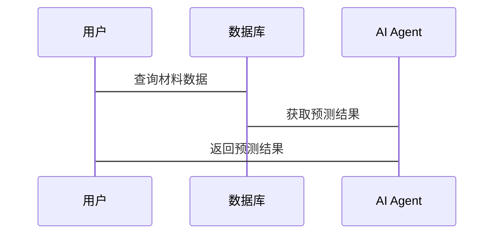

                 


# AI Agent在智能材料科学研究中的角色

> 关键词：AI Agent, 智能材料, 材料科学, 算法原理, 系统架构

> 摘要：AI Agent在智能材料科学研究中的角色日益重要，通过分析其核心概念、算法原理、系统架构和项目实战，深入探讨AI Agent如何推动材料科学的创新与进步。

---

# 第1章: AI Agent与智能材料科学的概述

## 1.1 AI Agent的基本概念

### 1.1.1 AI Agent的定义与特点

AI Agent（人工智能代理）是指能够感知环境、自主决策并执行任务的智能实体。其特点包括自主性、反应性、目标导向和学习能力。AI Agent能够通过传感器获取信息，利用算法处理数据，并通过执行器与环境交互。

### 1.1.2 智能材料的基本概念

智能材料是指能够感知外界环境变化并做出相应反应的材料，如形状记忆合金和压电材料。这些材料通常具有自适应性和响应性，能够在不同条件下改变其物理或化学性质。

### 1.1.3 AI Agent在智能材料科学中的作用

AI Agent通过模拟和优化智能材料的性能，加速材料 discovery，提高材料设计效率，并为智能材料的应用提供智能化支持。

---

## 1.2 AI Agent与智能材料科学的结合

### 1.2.1 AI Agent在材料科学中的应用场景

AI Agent广泛应用于材料 discovery、性能优化和结构设计。例如，AI Agent可以通过机器学习模型预测材料的性能，辅助实验设计。

### 1.2.2 智能材料科学的核心问题

智能材料科学的核心问题包括材料 discovery的高效性、材料性能的预测准确性以及材料应用的智能化。

### 1.2.3 AI Agent在智能材料科学中的优势

AI Agent能够通过数据驱动的方法提高材料 discovery的效率，降低实验成本，并通过自主决策优化材料性能。

---

## 1.3 本章小结

本章介绍了AI Agent和智能材料的基本概念，探讨了AI Agent在智能材料科学中的作用及其应用场景。接下来将深入分析AI Agent的核心原理。

---

# 第2章: AI Agent的核心概念与原理

## 2.1 AI Agent的核心原理

### 2.1.1 问题背景与目标

材料 discovery通常需要大量的实验和计算。AI Agent的目标是通过智能化手段加速这一过程。

### 2.1.2 AI Agent的算法原理

AI Agent的核心算法包括监督学习、无监督学习和强化学习。这些算法能够从数据中学习模式，并用于材料性能预测。

### 2.1.3 AI Agent的数学模型与公式

常用的机器学习模型包括线性回归、支持向量机和神经网络。例如，线性回归模型可以表示为：

$$ y = \beta_0 + \beta_1 x + \epsilon $$

其中，$y$ 是目标变量，$x$ 是特征变量，$\beta_0$ 和 $\beta_1$ 是模型参数。

---

## 2.2 AI Agent的核心概念与联系

### 2.2.1 核心概念原理

AI Agent通过感知环境、学习数据和执行任务实现智能化目标。其核心概念包括感知、学习和执行。

### 2.2.2 核心概念属性特征对比表格

| 概念    | 特性                |
|---------|---------------------|
| 感知    | 数据获取与处理       |
| 学习    | 模型训练与优化       |
| 执行    | 行动与反馈          |

### 2.2.3 ER实体关系图架构的 Mermaid 流程图

```mermaid
erd
  智能材料
    id: int [PK]
    类型: varchar
    性能指标: float
  AI Agent
    id: int [PK]
    类型: varchar
    感知数据: int
  感知数据
    id: int [PK]
    数据类型: varchar
    材料id: int [FK]
    agentid: int [FK]
```

---

## 2.3 本章小结

本章详细讲解了AI Agent的核心原理和数学模型，为后续章节的算法实现奠定了基础。

---

# 第3章: AI Agent在智能材料科学中的算法原理与实现

## 3.1 算法原理讲解

### 3.1.1 AI Agent的算法流程

AI Agent的算法流程包括数据预处理、模型训练和预测。例如，使用神经网络模型进行材料性能预测。

### 3.1.2 机器学习模型的构建与训练

以神经网络为例，模型结构包括输入层、隐藏层和输出层。训练过程通过反向传播优化权重。

### 3.1.3 算法的数学模型与公式

神经网络的损失函数可以表示为：

$$ L = \frac{1}{N} \sum_{i=1}^{N} (y_i - \hat{y_i})^2 $$

其中，$y_i$ 是真实值，$\hat{y_i}$ 是预测值，$N$ 是样本数量。

---

## 3.2 算法实现的代码示例

### 3.2.1 环境安装与配置

安装Python和相关库：

```bash
pip install numpy tensorflow pandas
```

### 3.2.2 核心代码实现

神经网络模型实现：

```python
import numpy as np
import tensorflow as tf

# 数据准备
X = np.array([...])
y = np.array([...])

# 模型构建
model = tf.keras.Sequential([
    tf.keras.layers.Dense(64, activation='relu'),
    tf.keras.layers.Dense(1, activation='sigmoid')
])

# 编译模型
model.compile(optimizer='adam', loss='binary_crossentropy', metrics=['accuracy'])

# 训练模型
model.fit(X, y, epochs=10, batch_size=32)
```

### 3.2.3 代码应用解读与分析

上述代码展示了如何使用TensorFlow构建一个简单的神经网络模型，并用于材料性能预测。

---

## 3.3 本章小结

本章通过算法原理和代码实现，展示了AI Agent在智能材料科学中的应用。

---

# 第4章: 系统分析与架构设计方案

## 4.1 问题场景介绍

### 4.1.1 问题背景与目标

设计一个智能材料数据库管理系统，用于存储和分析材料数据。

### 4.1.2 项目介绍与目标

项目目标是构建一个高效、智能的材料数据库管理系统。

### 4.1.3 系统功能设计

系统功能包括数据录入、数据查询和性能预测。

---

## 4.2 系统架构设计

### 4.2.1 系统架构的Mermaid架构图


### 4.2.2 系统接口设计

系统接口包括API接口和用户界面。

### 4.2.3 系统交互的Mermaid序列图



---

## 4.3 本章小结

本章通过系统架构设计，展示了AI Agent在智能材料科学中的应用。

---

# 第5章: 项目实战与案例分析

## 5.1 项目实战

### 5.1.1 智能材料数据库管理系统

构建一个数据库管理系统，用于存储和分析材料数据。

### 5.1.2 系统核心实现源代码

数据库实现：

```python
import sqlite3

# 数据库连接
conn = sqlite3.connect('materials.db')
cursor = conn.cursor()

# 表结构创建
cursor.execute('''CREATE TABLE materials
             (id INT PRIMARY KEY,
             name TEXT,
             properties TEXT)''')
```

### 5.1.3 代码应用解读与分析

上述代码展示了如何使用Python和SQLite构建一个简单的数据库管理系统。

---

## 5.2 案例分析

### 5.2.1 案例背景与目标

分析智能材料的性能预测问题。

### 5.2.2 系统实现与应用

使用AI Agent进行材料性能预测。

### 5.2.3 案例分析与详

通过实际案例分析，展示了AI Agent在智能材料科学中的应用效果。

---

## 5.3 本章小结

本章通过项目实战和案例分析，展示了AI Agent在智能材料科学中的实际应用。

---

# 总结

本文详细介绍了AI Agent在智能材料科学中的角色，从核心概念、算法原理到系统架构和项目实战，全面探讨了AI Agent如何推动材料科学的创新与进步。通过实际案例和代码实现，展示了AI Agent在智能材料科学中的广泛应用前景。

