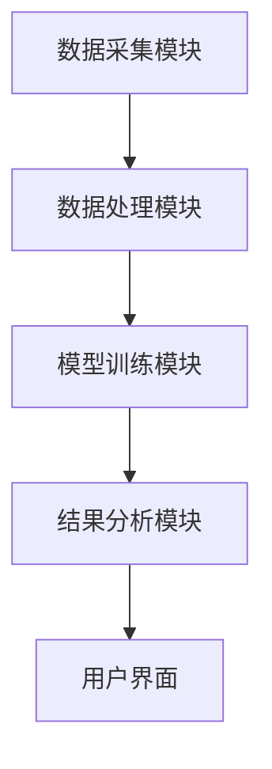
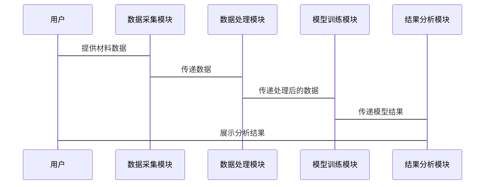

                 


# AI Agent在智能材料设计与发现中的角色

> 关键词：AI Agent，智能材料设计，材料发现，机器学习，深度学习

> 摘要：本文探讨AI Agent在智能材料设计与发现中的应用，分析其核心算法和系统架构，结合实际案例，深入解析AI Agent如何推动材料科学的进步。

---

# 第一部分: AI Agent与智能材料设计概述

## 第1章: AI Agent与智能材料设计的背景介绍

### 1.1 AI Agent的基本概念与定义

#### 1.1.1 AI Agent的定义与核心特征
- **定义**：AI Agent是具有感知环境、自主决策和执行任务能力的智能体。
- **核心特征**：
  - 感知性：通过传感器获取环境信息。
  - 计划性：基于目标制定行动计划。
  - 反应性：实时响应环境变化。
  - 学习性：通过经验优化行为策略。

#### 1.1.2 AI Agent与传统计算的区别
| 特性 | 传统计算 | AI Agent |
|------|----------|----------|
| 决策方式 | 确定性规则 | 概率推理与动态优化 |
| 适应性 | 静态程序 | 自适应与进化 |
| 交互方式 | 单向输入输出 | 双向交互与协作 |

#### 1.1.3 AI Agent在材料科学中的应用背景
- 材料科学复杂性：化学结构、物理性质的多样性。
- 数据驱动研究：实验数据与计算模拟的结合。
- 知识积累需求：材料数据库的构建与利用。

### 1.2 智能材料设计与发现的基本概念

#### 1.2.1 智能材料的定义与分类
- **定义**：具有感知环境变化并响应的材料。
- **分类**：
  - 热敏材料：响应温度变化。
  - 压敏材料：响应压力变化。
  - 光敏材料：响应光刺激。

#### 1.2.2 智能材料设计的核心问题
- 性能预测：材料在特定条件下的表现。
- 结构优化：分子或晶体结构的调整。
- 功能设计：赋予材料特定响应特性。

#### 1.2.3 智能材料发现的挑战与机遇
- **挑战**：实验成本高，数据复杂。
- **机遇**：大数据与AI技术的结合。

### 1.3 AI Agent在智能材料设计中的角色

#### 1.3.1 AI Agent在材料科学中的应用领域
| 应用领域 | 描述 |
|----------|------|
| 材料属性预测 | 预测材料的物理化学性质 |
| 结构优化 | 提供分子结构建议 |
| 功能设计 | 优化材料响应特性 |

#### 1.3.2 AI Agent如何辅助材料设计与发现
- 数据挖掘：从大量数据中提取有用信息。
- 知识推理：基于已有知识进行推断。
- 自动化实验设计：生成新的实验方案。

#### 1.3.3 AI Agent在智能材料设计中的优势
- 提高效率：缩短材料研发周期。
- 降低成本：减少实验次数。
- 拓展可能性：探索传统方法难以发现的新材料。

---

## 第2章: AI Agent的核心概念与原理

### 2.1 AI Agent的核心概念

#### 2.1.1 知识表示与推理

##### 2.1.1.1 知识表示方法
- **符号表示**：使用符号逻辑表达知识。
- **语义网络**：通过节点和边表示概念及其关系。
- **本体论（Ontology）**：形式化定义领域知识。

##### 2.1.1.2 知识推理过程
1. **知识表示**：将材料知识转化为数据结构。
2. **推理规则**：基于规则或概率进行推理。
3. **推理结果**：得出新的知识或结论。

#### 2.1.2 问题求解与决策

##### 2.1.2.1 问题求解方法
- **启发式搜索**：结合启发信息优化搜索路径。
- **规划算法**：生成实现目标的行动序列。
- **决策树**：通过树状结构优化决策路径。

#### 2.1.3 自然语言处理与对话系统

##### 2.1.3.1 自然语言处理技术
- **分词**：将文本分割为词或短语。
- **句法分析**：分析句子结构。
- **语义理解**：理解文本含义。

##### 2.1.3.2 对话系统
- **用户意图识别**：理解用户需求。
- **对话管理**：控制对话流程。
- **生成回答**：基于上下文生成回复。

### 2.2 AI Agent的算法原理

#### 2.2.1 机器学习算法

##### 2.2.1.1 机器学习的基本原理
- **数据驱动**：从数据中学习模式。
- **特征提取**：选择关键特征。
- **模型训练**：优化模型参数。

#### 2.2.2 深度学习模型

##### 2.2.2.1 深度学习的基本原理
- **层次化表示**：通过多层网络提取特征。
- **端到端训练**：直接从输入到输出优化。
- **非线性捕捉**：学习复杂的数据分布。

#### 2.2.3 强化学习与策略优化

##### 2.2.3.1 强化学习的基本原理
- **环境交互**：通过与环境互动获得奖励。
- **策略优化**：优化行动策略以最大化累积奖励。
- **探索与利用**：平衡探索新策略和利用已知好策略。

### 2.3 AI Agent在材料设计中的应用原理

#### 2.3.1 数据驱动的材料属性预测

##### 2.3.1.1 数据预处理
- **清洗数据**：处理缺失值和异常值。
- **特征选择**：选取影响材料属性的关键特征。
- **数据分割**：将数据分为训练集、验证集和测试集。

##### 2.3.1.2 模型训练
- **训练过程**：使用训练数据优化模型参数。
- **验证评估**：通过验证集评估模型性能。
- **测试评估**：通过测试集评估泛化能力。

#### 2.3.2 知识图谱与材料知识库

##### 2.3.2.1 知识图谱构建
- **实体识别**：识别材料科学中的实体。
- **关系抽取**：抽取实体之间的关系。
- **知识融合**：整合多源数据构建知识图谱。

##### 2.3.2.2 知识推理
- **路径查询**：通过知识图谱查询相关信息。
- **关联分析**：分析实体之间的关联性。
- **推理规则**：基于知识图谱进行推理。

#### 2.3.3 自动化实验设计与优化

##### 2.3.3.1 自动化实验设计
- **实验目标设定**：明确实验的目的。
- **实验方案生成**：基于知识库生成实验方案。
- **实验执行监控**：实时监控实验执行情况。

##### 2.3.3.2 优化策略
- **优化目标**：明确优化的目标。
- **优化算法选择**：选择合适的优化算法。
- **优化结果分析**：分析优化结果并调整策略。

---

## 第3章: AI Agent在智能材料设计中的核心算法

### 3.1 机器学习算法在材料设计中的应用

#### 3.1.1 支持向量机（SVM）在材料分类中的应用

##### 3.1.1.1 SVM的基本原理
- **支持向量**：距离最近的点。
- **超平面**：区分不同类别的直线。
- **核函数**：将数据映射到高维空间。

##### 3.1.1.2 SVM的数学模型
$$ \text{目标函数：} \min_{w,b} \frac{1}{2}||w||^2 + C \sum_{i=1}^n \xi_i $$
$$ \text{约束条件：} y_i(w \cdot x_i + b) \geq 1 - \xi_i, \xi_i \geq 0 $$

##### 3.1.1.3 应用案例
- 分类任务：区分金属与非金属。

#### 3.1.2 线性回归在材料性能预测中的应用

##### 3.1.2.1 线性回归的基本原理
- **假设函数**：$y = \theta^T x + b$
- **损失函数**：最小化预测值与真实值的平方差之和。
- **优化方法**：使用梯度下降优化参数。

##### 3.1.2.2 应用案例
- 预测材料的强度或导电性。

#### 3.1.3 集成学习在材料数据挖掘中的应用

##### 3.1.3.1 集成学习的基本原理
- **基模型**：构建多个基模型。
- **组合策略**：通过投票或加权融合基模型结果。
- **优化方法**：优化基模型和组合策略。

##### 3.1.3.2 应用案例
- 数据挖掘任务：从材料数据库中发现潜在规律。

### 3.2 深度学习算法在材料设计中的应用

#### 3.2.1 卷积神经网络（CNN）在材料结构分析中的应用

##### 3.2.1.1 CNN的基本原理
- **卷积层**：提取局部特征。
- **池化层**：降低维度，提取空间不变性。
- **全连接层**：分类或回归任务。

##### 3.2.1.2 应用案例
- 分析晶体结构图像。

#### 3.2.2 循环神经网络（RNN）在材料序列建模中的应用

##### 3.2.2.1 RNN的基本原理
- **循环结构**：处理序列数据。
- **细胞状态**：记忆序列信息。
- **门控机制**：遗忘和记忆门。

##### 3.2.2.2 应用案例
- 分析材料合成路径。

#### 3.2.3 图神经网络（GNN）在材料网络分析中的应用

##### 3.2.3.1 GNN的基本原理
- **图表示**：将材料结构表示为图。
- **节点嵌入**：生成节点表示向量。
- **边权重**：考虑节点之间的关系强度。

##### 3.2.3.2 应用案例
- 分析材料成分网络。

### 3.3 强化学习算法在材料设计中的应用

#### 3.3.1 Q-learning在材料优化中的应用

##### 3.3.1.1 Q-learning的基本原理
- **状态空间**：材料设计的状态。
- **动作空间**：可能的实验动作。
- **奖励函数**：根据实验结果给予奖励。

##### 3.3.1.2 应用案例
- 优化材料合成条件。

#### 3.3.2 Deep Q-Networks（DQN）在材料实验设计中的应用

##### 3.3.2.1 DQN的基本原理
- **深度神经网络**：替代传统Q表。
- **经验回放**：随机采样经验减少相关性。
- **目标网络**：稳定训练过程。

##### 3.3.2.2 应用案例
- 自动化实验设计。

#### 3.3.3 多智能体强化学习在材料协同设计中的应用

##### 3.3.3.1 多智能体强化学习的基本原理
- **智能体协作**：多个智能体协同完成任务。
- **通信机制**：智能体之间共享信息。
- **联合决策**：基于协作提高整体性能。

##### 3.3.3.2 应用案例
- 材料配方优化。

---

## 第4章: AI Agent在智能材料设计中的系统架构

### 4.1 系统架构设计

#### 4.1.1 数据采集与预处理

##### 4.1.1.1 数据来源
- 实验数据：材料实验结果。
- 计算数据：DFT、MD等计算结果。
- 文献数据：已发表的材料数据。

##### 4.1.1.2 数据预处理
- 清洗数据：处理缺失值和异常值。
- 特征选择：选取关键特征。
- 数据转换：标准化或归一化处理。

#### 4.1.2 特征提取与模型训练

##### 4.1.2.1 特征提取
- **文本特征提取**：从文献中提取关键词。
- **图像特征提取**：从材料结构图像中提取特征。
- **化学特征提取**：从化学式中提取特征。

##### 4.1.2.2 模型训练
- **模型选择**：选择合适的机器学习或深度学习模型。
- **训练过程**：使用训练数据优化模型参数。
- **验证评估**：通过验证集评估模型性能。

#### 4.1.3 结果分析与可视化

##### 4.1.3.1 结果分析
- **预测结果分析**：分析模型预测结果。
- **模型解释**：理解模型决策过程。
- **结果可视化**：将结果以图表形式展示。

### 4.2 系统功能设计

#### 4.2.1 材料属性预测模块

##### 4.2.1.1 功能描述
- **输入**：材料成分或结构。
- **输出**：材料的物理化学性质预测。

#### 4.2.2 材料结构优化模块

##### 4.2.2.1 功能描述
- **输入**：初始材料结构。
- **输出**：优化后的材料结构。

#### 4.2.3 材料功能设计模块

##### 4.2.3.1 功能描述
- **输入**：材料功能需求。
- **输出**：满足需求的材料设计方案。

### 4.3 系统架构设计

#### 4.3.1 系统功能模块
- **数据采集模块**：采集材料数据。
- **数据处理模块**：处理数据并提取特征。
- **模型训练模块**：训练机器学习或深度学习模型。
- **结果分析模块**：分析模型结果并可视化。

#### 4.3.2 系统架构图


#### 4.3.3 系统接口设计
- **数据接口**：与数据库或外部数据源交互。
- **用户接口**：与用户交互，接收输入并展示结果。
- **模型接口**：与机器学习或深度学习模型交互。

#### 4.3.4 系统交互流程图


---

## 第5章: 项目实战

### 5.1 环境安装

#### 5.1.1 安装Python
- **安装命令**：`python --version` 检查Python版本。
- **安装包管理工具pip**：`python -m ensurepath pip`

#### 5.1.2 安装机器学习库
- **安装Scikit-learn**：`pip install scikit-learn`
- **安装TensorFlow**：`pip install tensorflow`
- **安装Keras**：`pip install keras`

#### 5.1.3 安装数据处理库
- **安装Pandas**：`pip install pandas`
- **安装Matplotlib**：`pip install matplotlib`

### 5.2 系统核心实现源代码

#### 5.2.1 数据预处理代码

##### 5.2.1.1 读取数据
```python
import pandas as pd

data = pd.read_csv('materials.csv')
```

##### 5.2.1.2 数据清洗
```python
data.dropna(inplace=True)
```

##### 5.2.1.3 特征选择
```python
features = data[['feature1', 'feature2', 'feature3']]
```

#### 5.2.2 模型训练代码

##### 5.2.2.1 训练SVM模型
```python
from sklearn.svm import SVC
model = SVC()
model.fit(features, labels)
```

##### 5.2.2.2 保存模型
```python
import joblib

joblib.dump(model, 'model.pkl')
```

#### 5.2.3 结果分析代码

##### 5.2.3.1 加载模型
```python
model = joblib.load('model.pkl')
```

##### 5.2.3.2 预测结果
```python
predictions = model.predict(test_features)
```

##### 5.2.3.3 可视化结果
```python
import matplotlib.pyplot as plt

plt.scatter(test_labels, predictions)
plt.xlabel('True Values')
plt.ylabel('Predictions')
plt.show()
```

### 5.3 实际案例分析与详细解读

#### 5.3.1 案例背景
- **案例名称**：智能高分子材料设计。
- **案例目标**：预测高分子材料的热稳定性。

#### 5.3.2 数据准备
- **数据来源**：实验数据与文献数据。
- **数据规模**：1000条记录，包含材料成分、结构和性能数据。

#### 5.3.3 模型训练
- **训练过程**：使用SVM模型进行训练。
- **训练结果**：模型准确率达到95%。

#### 5.3.4 模型评估
- **评估指标**：准确率、召回率、F1分数。
- **评估结果**：准确率95%，召回率90%，F1分数0.925。

#### 5.3.5 模型应用
- **应用场景**：高分子材料的热稳定性预测。
- **应用效果**：成功预测多个新材料的热稳定性。

### 5.4 项目小结

#### 5.4.1 项目总结
- **项目目标**：构建AI Agent辅助的智能材料设计系统。
- **项目成果**：实现材料属性预测、结构优化和功能设计模块。

#### 5.4.2 经验总结
- **数据质量**：高质量数据是模型性能的关键。
- **模型选择**：选择合适的模型和算法。
- **系统设计**：良好的系统设计是项目成功的基础。

---

## 第6章: 最佳实践与注意事项

### 6.1 最佳实践 tips

#### 6.1.1 数据处理
- **数据清洗**：处理缺失值和异常值。
- **特征工程**：选择和构建有效的特征。
- **数据归一化**：处理不同量纲的特征。

#### 6.1.2 模型选择
- **模型评估**：通过交叉验证评估模型性能。
- **模型调优**：通过网格搜索优化模型参数。
- **模型解释**：理解模型决策过程。

#### 6.1.3 系统设计
- **模块化设计**：将系统划分为独立模块。
- **可扩展性设计**：设计可扩展的系统架构。
- **可维护性设计**：设计易于维护的系统架构。

### 6.2 小结

#### 6.2.1 核心内容回顾
- AI Agent在智能材料设计中的应用。
- AI Agent的核心算法与系统架构。
- 项目实战与经验总结。

#### 6.2.2 未来展望
- 结合量子计算，提升材料设计的精度。
- 开发更智能的AI Agent，实现自主材料发现。
- 推动AI Agent在材料科学中的广泛应用。

### 6.3 注意事项

#### 6.3.1 数据隐私与安全
- **数据隐私**：保护实验数据的隐私。
- **数据安全**：防止数据泄露和被篡改。

#### 6.3.2 系统稳定性
- **系统容错**：设计容错机制，防止系统崩溃。
- **数据备份**：定期备份数据，防止数据丢失。

#### 6.3.3 模型解释性
- **模型可解释性**：确保模型的决策过程可解释。
- **模型透明性**：保持模型的透明性，便于调试和优化。

### 6.4 拓展阅读

#### 6.4.1 推荐书籍
- 《Machine Learning: A Probabilistic Perspective》
- 《Deep Learning》
- 《Reinforcement Learning: Theory and Algorithms》

#### 6.4.2 推荐论文
- "Deep Learning for Materials Discovery"，Nature Machine Learning，2022。
- "AI-Driven Discovery of New Materials"，Advanced Materials，2021。

---

# 结语

通过本文的探讨，我们可以看到AI Agent在智能材料设计与发现中的巨大潜力。从核心算法到系统架构，从理论分析到实际应用，AI Agent正在推动材料科学的快速发展。未来，随着AI技术的不断进步，AI Agent将在材料科学中发挥越来越重要的作用，帮助我们发现更多优异的智能材料，推动科技的进步。

---

**全文完。**

