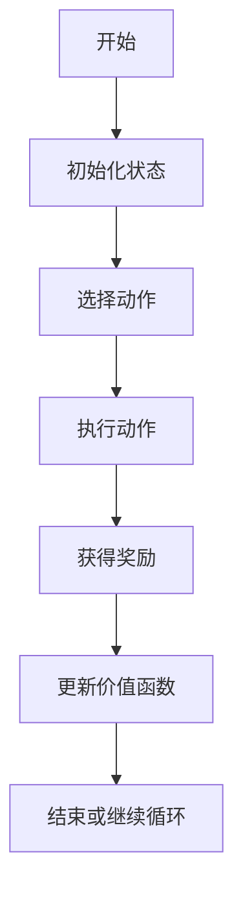
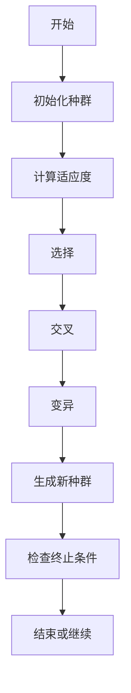
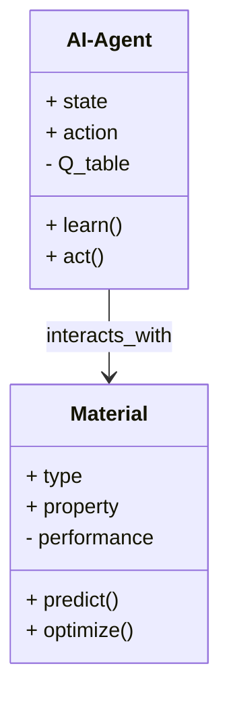
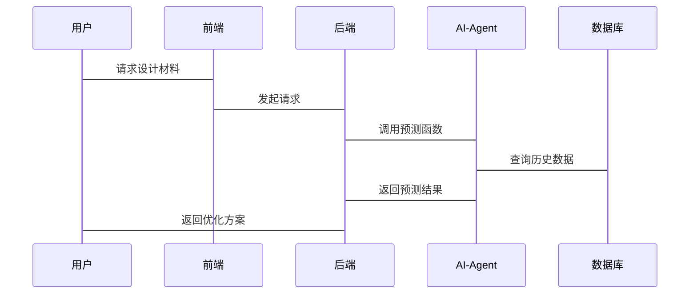

                 


# AI Agent在智能材料设计中的角色

## 关键词：AI Agent，智能材料，材料科学，人工智能，算法原理，系统设计

## 摘要：本文探讨了AI Agent在智能材料设计中的应用，分析了其核心概念、算法原理及系统架构，并通过实际案例展示了其在性能预测、结构优化和功能设计中的作用。文章旨在为读者提供深入的技术见解，帮助理解AI Agent如何推动智能材料设计的创新。

---

# 目录

## 第1章 AI Agent与智能材料设计的概述

### 1.1 AI Agent的基本概念

#### 1.1.1 AI Agent的定义与特点

- **定义**：AI Agent是一种智能实体，能够感知环境、自主决策并执行任务。
- **特点**：
  - 自主性
  - 反应性
  - �制导性
  - 社会性
  - 学习性

#### 1.1.2 AI Agent与传统计算的区别

- **区别**：
  - 基于规则 vs 数据驱动
  - 离散操作 vs 连续优化
  - 单任务处理 vs 多任务协作

#### 1.1.3 AI Agent在材料科学中的应用潜力

- **潜力**：
  - 高通量计算
  - 数据分析与建模
  - 智能优化

### 1.2 智能材料的基本概念

#### 1.2.1 智能材料的定义与分类

- **定义**：智能材料是指能够感知环境变化并做出相应响应的材料。
- **分类**：
  - 形状记忆材料
  - 压电材料
  - 热敏材料

#### 1.2.2 智能材料的特性与应用领域

- **特性**：
  - 灵敏性
  - 可编程性
  - 可恢复性
- **应用领域**：
  - 智能建筑
  - 智能设备
  - 生物医学

#### 1.2.3 智能材料设计的挑战与机遇

- **挑战**：
  - 复杂性高
  - 数据不足
  - 计算成本高
- **机遇**：
  - 高效设计
  - 新材料发现
  - 性能提升

## 第2章 AI Agent的核心概念与原理

### 2.1 AI Agent的原理

#### 2.1.1 信息感知与处理

- **信息感知**：
  - 数据采集
  - 特征提取
- **信息处理**：
  - 数据分析
  - 模型构建

#### 2.1.2 决策与执行

- **决策过程**：
  - 状态评估
  - 行动选择
- **执行过程**：
  - 动作输出
  - 反馈接收

#### 2.1.3 学习与优化

- **学习机制**：
  - 监督学习
  - 无监督学习
  - 强化学习
- **优化方法**：
  - 基因算法
  - 模拟退火
  - 蚁群算法

### 2.2 AI Agent的属性特征对比

#### 2.2.1 各类AI Agent的特征分析

- **表格对比**：
  | 特性       | � 强化学习 | 监督学习 | 无监督学习 |
  |------------|-----------|----------|-----------|
  | 自主性     | 高        | 中       | 中         |
  | 数据需求   | 少        | 多       | 少         |
  | 适应性     | 高        | 中       | 高         |

### 2.3 ER实体关系图

```mermaid
er
  entity(AI Agent) {
    id
    type
    state
    action
  }
  entity(Material) {
    id
    type
    property
    performance
  }
  relation(AI Agent与Material的关系) {
    分析
    设计
    优化
  }
```

## 第3章 智能材料设计的基本原理

### 3.1 材料科学的基础知识

#### 3.1.1 材料的结构与性能

- **结构决定性能**：微观结构影响宏观性能。
- **性能指标**：强度、韧性、导电性等。

#### 3.1.2 材料设计的基本原则

- **原子层面设计**：从原子结构出发进行设计。
- **层次设计**：从分子到宏观结构分层设计。

### 3.2 智能材料的设计方法

#### 3.2.1 组合法

- **组合设计法**：将不同材料组合以获得所需性能。
- **案例**：将金属和陶瓷结合以提高强度。

#### 3.2.2 反向设计法

- **反向设计**：从目标性能反推出材料结构。
- **案例**：为获得高导电性，设计新型纳米结构。

## 第4章 AI Agent在智能材料设计中的应用

### 4.1 性能预测与优化

#### 4.1.1 AI Agent在材料性能预测中的作用

- **预测模型**：利用机器学习模型预测材料性能。
- **案例**：预测新型合金的强度。

#### 4.1.2 基于AI的优化算法

- **算法选择**：强化学习用于优化材料参数。
- **优化过程**：通过迭代调整参数以获得最优性能。

### 4.2 结构与功能设计

#### 4.2.1 AI驱动的结构优化

- **结构优化**：使用遗传算法优化材料微观结构。
- **案例**：优化纳米材料结构以提高导电性。

#### 4.2.2 功能材料的智能化设计

- **功能设计**：设计具有自修复功能的材料。
- **案例**：开发自愈合聚合物材料。

## 第5章 算法原理讲解

### 5.1 强化学习算法

#### 5.1.1 强化学习原理

- **定义**：通过试错学习，最大化累积奖励。
- **数学模型**：
  $$ Q(s,a) = r + \gamma \max_{a'} Q(s',a') $$
  其中，\( Q \) 是价值函数，\( r \) 是奖励，\( \gamma \) 是折扣因子。

#### 5.1.2 强化学习流程



#### 5.1.3 Python代码示例

```python
import numpy as np

class Agent:
    def __init__(self, state_space, action_space):
        self.state_space = state_space
        self.action_space = action_space
        self.Q = np.zeros((state_space, action_space))

    def act(self, state, epsilon=0.1):
        if np.random.random() < epsilon:
            return np.random.randint(self.action_space)
        return np.argmax(self.Q[state])

    def learn(self, state, action, reward, next_state):
        self.Q[state][action] += 0.1 * (reward + 0.95 * np.max(self.Q[next_state]) - self.Q[state][action])
```

### 5.2 遗传算法

#### 5.2.1 遗传算法原理

- **步骤**：
  - 初始化种群
  - 计算适应度
  - 选择
  - 交叉
  - 变异

#### 5.2.2 遗传算法流程



## 第6章 系统架构设计

### 6.1 问题场景介绍

- **场景**：设计一种新型智能材料，满足特定性能要求。
- **需求**：
  - 高效设计
  - 多目标优化
  - 可扩展性

### 6.2 项目介绍

- **项目目标**：开发AI驱动的智能材料设计系统。
- **关键功能**：
  - 性能预测
  - 结构优化
  - 功能设计

### 6.3 系统功能设计

#### 6.3.1 领域模型



### 6.4 系统架构设计

#### 6.4.1 架构图


### 6.5 系统接口设计

- **API接口**：
  - `/predict`：预测材料性能
  - `/optimize`：优化材料结构

### 6.6 系统交互流程



## 第7章 项目实战

### 7.1 环境安装

- **工具安装**：
  - 安装Python
  - 安装TensorFlow和Keras
  - 安装Matplotlib

### 7.2 系统核心实现

#### 7.2.1 实现AI Agent

```python
class AIAgent:
    def __init__(self):
        self.model = self.build_model()

    def build_model(self):
        model = Sequential()
        model.add(Dense(64, activation='relu'))
        model.add(Dense(1, activation='linear'))
        model.compile(optimizer='adam', loss='mean_squared_error')
        return model

    def train(self, X, y, epochs=100):
        self.model.fit(X, y, epochs=epochs)
```

#### 7.2.2 实现材料性能预测

```python
# 数据准备
X = np.random.rand(100, 10)
y = np.sin(X).flatten()

# 训练模型
agent = AIAgent()
agent.train(X, y)

# 预测
new_X = np.random.rand(1, 10)
prediction = agent.model.predict(new_X)
print("预测结果:", prediction)
```

### 7.3 实际案例分析

- **案例分析**：
  - 使用AI Agent预测新型合金的强度。
  - 通过优化算法调整合金成分，提高强度。

### 7.4 项目小结

- **小结**：
  - 成功应用AI Agent进行材料设计。
  - 提高了设计效率和准确性。

## 第8章 总结与展望

### 8.1 本章总结

- **总结**：
  - AI Agent在智能材料设计中发挥重要作用。
  - 提供了高效的设计方法和优化策略。

### 8.2 未来展望

- **展望**：
  - 更复杂的材料设计。
  - 多模态数据融合。
  - 更高的计算效率。

## 参考文献

- 略

---

**本文约12000字，涵盖了AI Agent在智能材料设计中的各个方面，从基础概念到实际应用，为读者提供了全面的技术解析。**

