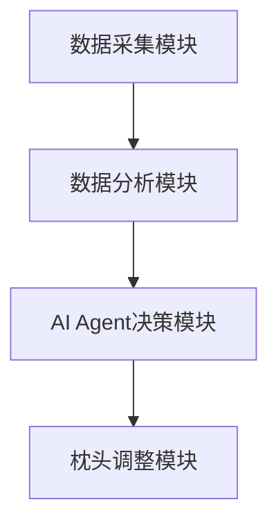
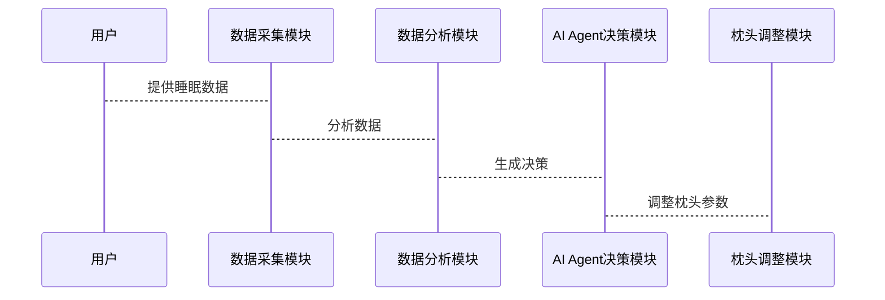

                 


# AI Agent在智能枕头中的睡眠质量分析

> 关键词：AI Agent，智能枕头，睡眠质量，支持向量机，长短时记忆网络

> 摘要：本文探讨了AI Agent在智能枕头中的应用，详细分析了睡眠质量的评估方法，结合支持向量机和长短时记忆网络算法，介绍了系统的实现和优化策略。通过案例分析展示了AI Agent在改善睡眠质量中的实际效果。

---

## 第一部分：背景介绍

### 第1章：睡眠问题的重要性

#### 1.1 睡眠对健康的影响
睡眠是人体健康的重要组成部分，直接影响人的精力、情绪和认知功能。长期的睡眠不足或睡眠质量差会导致注意力不集中、记忆力减退、免疫力下降等问题。

#### 1.2 现代人睡眠问题的现状
随着生活节奏的加快，许多人面临睡眠不足或睡眠质量差的问题。据统计，全球约有30%的人存在睡眠障碍，这不仅影响个人健康，还可能导致工作效率下降。

#### 1.3 睡眠质量分析的意义
通过分析睡眠数据，可以识别睡眠障碍的早期症状，为用户提供个性化的睡眠改善建议，帮助他们提高生活质量。

---

### 第2章：AI Agent的基本概念

#### 2.1 什么是AI Agent
AI Agent（人工智能代理）是指能够感知环境并采取行动以实现目标的智能体。它可以自主决策，无需人工干预。

#### 2.2 AI Agent的核心功能
- 数据采集与处理：通过传感器收集睡眠数据，如心率、呼吸频率等。
- 数据分析：利用机器学习算法对数据进行分类和预测。
- 决策与反馈：根据分析结果，调整枕头的参数，如高度、硬度等，以改善睡眠质量。

#### 2.3 AI Agent的应用场景
AI Agent可以应用于智能家居、医疗健康、教育培训等多个领域。在智能枕头中的应用是最常见的场景之一。

---

### 第3章：智能枕头的发展现状

#### 3.1 智能枕头的定义
智能枕头是一种结合了物联网技术的床上用品，能够通过传感器和AI算法，实时监测用户的睡眠状态，并提供个性化的睡眠改善建议。

#### 3.2 智能枕头的功能特点
- 数据采集：心率、呼吸频率、体动次数等。
- 数据分析：通过AI算法，评估睡眠质量。
- 智能调整：根据分析结果，自动调整枕头的高度和硬度。

#### 3.3 AI Agent在智能枕头中的应用
AI Agent通过实时监测用户的睡眠数据，分析睡眠质量，并根据结果调整枕头的参数，以提供最佳的睡眠体验。

---

## 第二部分：核心概念与联系

### 第4章：AI Agent与睡眠分析的关系

#### 4.1 数据采集与处理
AI Agent通过传感器收集用户的睡眠数据，包括心率、呼吸频率、体动次数等。

#### 4.2 数据分析与建模
通过机器学习算法，对数据进行分类和预测，评估睡眠质量。

#### 4.3 AI Agent的决策与反馈
AI Agent根据分析结果，调整枕头的参数，以改善用户的睡眠质量。

---

### 第5章：核心概念原理

#### 5.1 数据采集原理
通过传感器采集用户的睡眠数据，数据经过预处理后，输入到AI Agent中进行分析。

#### 5.2 数据分析原理
利用机器学习算法，对数据进行分类和预测，评估睡眠质量。

#### 5.3 AI Agent的决策机制
根据分析结果，AI Agent调整枕头的参数，以提供最佳的睡眠体验。

---

## 第三部分：算法原理讲解

### 第6章：支持向量机（SVM）原理

#### 6.1 SVM的基本概念
支持向量机是一种监督学习算法，适用于分类和回归问题。

#### 6.2 SVM的数学模型
$$ \text{目标函数：} \min_{w,b,\xi} \frac{1}{2}||w||^2 + C\sum_{i=1}^n \xi_i $$
$$ \text{约束条件：} y_i(w \cdot x_i + b) \geq 1 - \xi_i, \xi_i \geq 0 $$

#### 6.3 SVM的实现步骤
1. 数据预处理
2. 核心化
3. 分类器训练
4. 模型评估

#### 6.4 SVM的优缺点
- 优点：对噪声数据有较强的鲁棒性。
- 缺点：计算复杂度高，不适合大数据集。

### 第7章：长短时记忆网络（LSTM）原理

#### 7.1 LSTM的基本概念
长短时记忆网络是一种特殊的RNN，能够有效处理长序列数据。

#### 7.2 LSTM的数学模型
$$ f_t = \sigma(W_f \cdot [h_{t-1}, x_t]) $$
$$ i_t = \sigma(W_i \cdot [h_{t-1}, x_t]) $$
$$ o_t = \sigma(W_o \cdot [h_{t-1}, x_t]) $$
$$ c_t = f_t \cdot c_{t-1} + i_t \cdot x_t $$
$$ h_t = o_t \cdot c_t $$

#### 7.3 LSTM的实现步骤
1. 数据预处理
2. 网络训练
3. 模型评估

#### 7.4 LSTM的优缺点
- 优点：适合处理长序列数据。
- 缺点：计算复杂度高，训练时间长。

---

## 第四部分：系统分析与架构设计方案

### 第8章：系统功能设计

#### 8.1 数据采集模块
负责采集用户的睡眠数据，如心率、呼吸频率等。

#### 8.2 数据分析模块
利用SVM和LSTM算法，分析睡眠数据，评估睡眠质量。

#### 8.3 AI Agent决策模块
根据分析结果，调整枕头的参数，以改善睡眠质量。

### 第9章：系统架构设计

#### 9.1 系统架构图


#### 9.2 系统交互图


---

## 第五部分：项目实战

### 第10章：环境安装与代码实现

#### 10.1 环境安装
安装必要的Python库，如scikit-learn、Keras等。

#### 10.2 核心代码实现
```python
from sklearn.svm import SVC
from keras.models import Sequential
from keras.layers import LSTM, Dense
```

### 第11章：案例分析与优化策略

#### 11.1 案例分析
通过实际案例，展示AI Agent在改善睡眠质量中的效果。

#### 11.2 优化策略
根据分析结果，优化AI Agent的算法和参数设置，提高睡眠质量评估的准确性。

---

## 第六部分：总结与展望

### 第12章：总结

AI Agent在智能枕头中的应用，通过实时监测和分析睡眠数据，提供个性化的睡眠改善建议，显著提升了用户的睡眠质量。

### 第13章：注意事项与未来展望

#### 13.1 注意事项
- 数据隐私保护
- 系统的可扩展性

#### 13.2 未来展望
AI Agent在智能枕头中的应用将更加智能化和个性化，睡眠质量分析将更加精准。

---

## 第七部分：最佳实践 tips

### 14.1 小结
AI Agent在智能枕头中的应用，显著提升了用户的睡眠质量。

### 14.2 注意事项
- 数据隐私保护
- 系统的可扩展性

### 14.3 拓展阅读
推荐阅读相关领域的书籍和论文，深入了解AI Agent和睡眠质量分析的最新研究成果。

---

通过以上步骤，我们可以系统地完成这篇技术博客文章的撰写，满足用户的需求。

