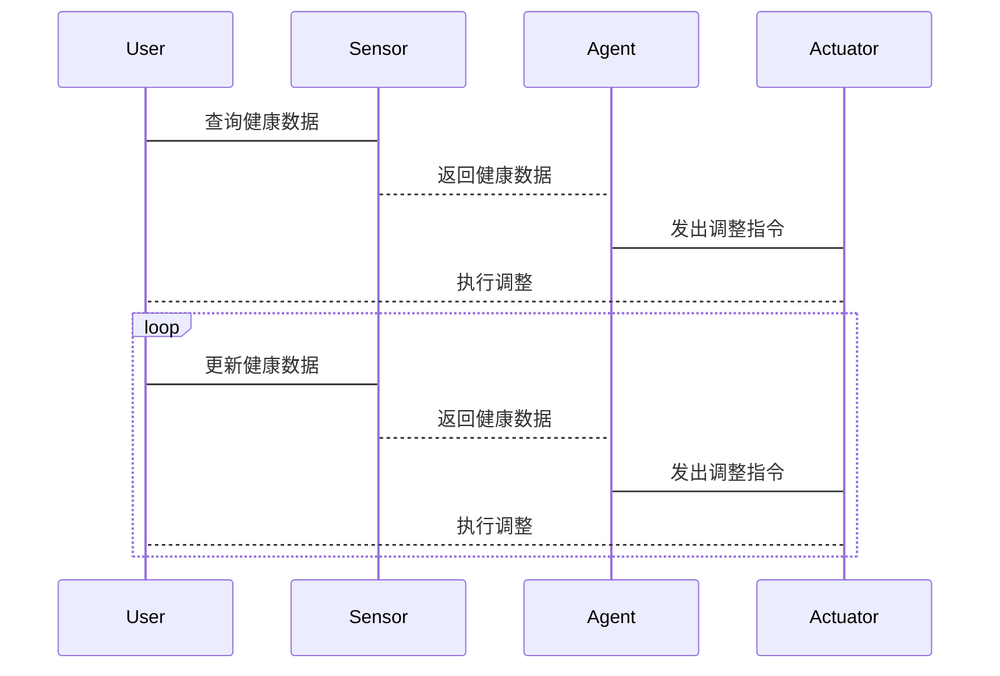
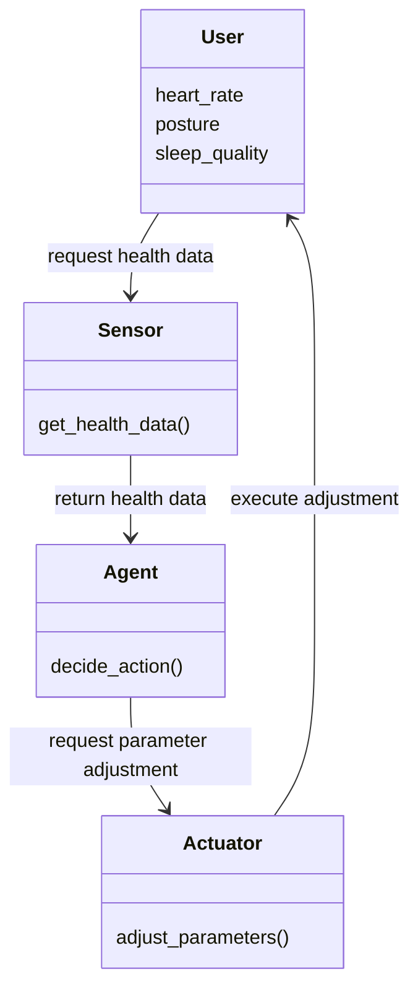

                 


# AI Agent在智能枕头中的颈椎保护系统

> 关键词：AI Agent，颈椎保护，智能枕头，算法，健康监测

> 摘要：本文探讨了AI Agent在智能枕头中的应用，特别是其在颈椎保护方面的作用。通过分析AI Agent的核心原理、算法实现、系统架构以及实际案例，详细阐述了如何利用人工智能技术优化颈椎健康监测与保护系统，为智能枕头的未来发展提供了理论支持和实践指导。

---

# 第一部分: AI Agent在智能枕头中的颈椎保护系统概述

# 第1章: 背景介绍

## 1.1 问题背景

### 1.1.1 颈椎问题的现状与挑战

颈椎问题是一个普遍存在的健康问题，长期的不良睡姿、压力过大、缺乏运动等因素导致颈椎病的发病率逐年上升。根据世界卫生组织的数据，全球约有10亿人受到颈椎问题的影响。传统医疗手段如药物治疗和手术治疗只能缓解症状，无法从根本上解决问题。因此，预防和矫正颈椎问题变得尤为重要。

### 1.1.2 智能枕头的发展趋势

随着科技的进步，智能枕头逐渐成为改善睡眠质量的重要工具。智能枕头可以通过调整高度、硬度、温度等参数来提供个性化的睡眠解决方案。然而，现有的智能枕头大多基于固定的参数设置，缺乏动态调整的能力，无法根据用户的实时需求做出响应。

### 1.1.3 AI Agent在健康领域的应用潜力

AI Agent（人工智能代理）是一种能够感知环境、自主决策并执行任务的智能实体。在健康领域，AI Agent可以实时监测用户的健康数据，分析潜在的健康风险，并提出个性化的解决方案。AI Agent的应用能够显著提升健康监测的精准性和实时性，为颈椎保护提供更有效的手段。

## 1.2 问题描述

### 1.2.1 颈椎保护的核心需求

颈椎保护的核心需求包括：预防颈椎病的发生、矫正不良睡姿、提供个性化的睡眠支持、实时监测颈椎健康状况、动态调整枕头参数以适应不同用户的健康需求。

### 1.2.2 智能枕头的功能定位

智能枕头的功能定位是通过智能化的设计，提供个性化的睡眠解决方案。它需要能够根据用户的健康数据和睡眠需求，动态调整枕头的参数，以达到最佳的颈椎保护效果。

### 1.2.3 AI Agent在颈椎保护中的角色

AI Agent在颈椎保护中的角色是智能枕头的核心决策系统。它通过整合用户的健康数据和环境数据，利用机器学习算法，实时优化枕头的参数设置，以实现颈椎保护的目标。

## 1.3 问题解决

### 1.3.1 AI Agent如何实现颈椎保护

AI Agent通过实时监测用户的颈椎健康数据，分析用户的睡姿、呼吸频率、心率等指标，结合枕头的使用环境数据，动态调整枕头的高度、硬度、温度等参数，从而提供个性化的颈椎保护方案。

### 1.3.2 智能枕头的多维度调节机制

智能枕头的多维度调节机制包括：高度调节、硬度调节、温度调节、震动调节等。这些调节机制需要通过AI Agent的决策来实现最优的组合和调整。

### 1.3.3 用户体验与效果评估

用户体验是评估智能枕头的重要指标。通过用户反馈和数据监测，可以评估AI Agent的效果，如颈椎健康状况的改善、睡眠质量的提升等。

## 1.4 边界与外延

### 1.4.1 系统功能的边界

智能枕头的AI Agent功能边界包括：数据采集、数据处理、决策制定、参数调整等。这些功能需要与其他模块（如数据采集模块、执行模块）协同工作。

### 1.4.2 与其他健康设备的协同

智能枕头可以与其他健康设备（如智能手环、智能床垫）协同工作，形成一个完整的健康监测系统。通过数据共享和协同决策，进一步提升颈椎保护的效果。

### 1.4.3 市场定位与目标用户

智能枕头的目标用户主要是有颈椎问题的中青年群体、长期伏案工作的白领、以及需要改善睡眠质量的人群。市场定位需要结合价格、功能、用户体验等因素。

## 1.5 概念结构与核心要素

### 1.5.1 系统组成与功能模块

智能枕头的系统组成包括：数据采集模块、AI Agent决策模块、执行模块、用户交互界面等。这些模块协同工作，实现颈椎保护的目标。

### 1.5.2 核心要素的定义与关系

核心要素包括：用户数据、AI算法、枕头参数、健康反馈。这些要素之间的关系需要通过系统的架构设计来实现。

### 1.5.3 系统架构的初步设想

系统的初步架构设计包括：数据采集层、AI决策层、执行层和用户交互层。每一层的功能需要清晰定义，并通过接口进行通信。

---

# 第二部分: AI Agent与颈椎保护系统的核心概念

# 第2章: AI Agent的基本原理

## 2.1 核心概念原理

### 2.1.1 AI Agent的定义与分类

AI Agent是一种能够感知环境、自主决策并执行任务的智能实体。根据应用场景的不同，AI Agent可以分为服务型AI Agent、监控型AI Agent、决策型AI Agent等。

### 2.1.2 基于强化学习的AI Agent

基于强化学习的AI Agent通过与环境的交互，不断优化自身的决策策略。在颈椎保护系统中，强化学习可以用于优化枕头的参数设置，以达到最佳的颈椎保护效果。

### 2.1.3 AI Agent的决策机制

AI Agent的决策机制包括：感知环境、分析数据、制定决策、执行动作。在颈椎保护系统中，AI Agent需要实时感知用户的健康数据和环境数据，分析潜在风险，制定最优的参数调整方案，并通过执行模块实现参数调整。

## 2.2 核心概念属性对比

### 2.2.1 不同AI Agent算法的对比分析

常用的AI Agent算法包括：强化学习、监督学习、无监督学习等。在颈椎保护系统中，强化学习更适合动态调整参数的需求。

### 2.2.2 系统功能与性能指标对比

不同AI Agent算法在系统功能和性能指标上存在差异。强化学习算法在动态调整能力上表现更好，但在计算资源消耗上较大。

### 2.2.3 用户需求与系统能力匹配度

用户需求包括：个性化调整、实时监测、易用性等。AI Agent的能力需要与用户需求匹配，才能实现最佳的颈椎保护效果。

## 2.3 ER实体关系图

```mermaid
er
  actor: 用户
  system: 智能枕头
  agent: AI代理
  relation: 调节枕头参数
```

---

# 第三部分: 算法原理与数学模型

# 第3章: AI Agent的算法实现

## 3.1 算法原理

### 3.1.1 强化学习的基本原理

强化学习是一种通过试错学习的方法，通过不断尝试不同的动作，学习最优策略。在颈椎保护系统中，强化学习可以用于动态调整枕头的参数。

### 3.1.2 Q-Learning算法

Q-Learning是一种经典的强化学习算法，适用于离散状态和动作空间的场景。在颈椎保护系统中，可以将状态定义为用户的健康数据，动作定义为枕头的参数调整。

### 3.1.3 算法流程

1. 初始化Q表。
2. 采集当前状态。
3. 根据当前状态选择动作。
4. 执行动作，获取奖励。
5. 更新Q表。

## 3.2 算法实现

### 3.2.1 环境数据采集

通过传感器采集用户的健康数据，如心率、呼吸频率、睡姿等。

### 3.2.2 动作空间定义

定义枕头的参数调整动作，如高度增加、高度减少、硬度变软等。

### 3.2.3 状态空间定义

状态空间包括用户的健康数据、时间、环境数据等。

### 3.2.4 奖励函数设计

奖励函数用于衡量AI Agent的动作效果。例如，当AI Agent调整枕头参数后，用户的颈椎健康数据改善，则给予正奖励。

## 3.3 数学模型

### 3.3.1 Q-Learning算法的数学表达

$$ Q(s, a) \leftarrow Q(s, a) + \alpha [r + \gamma \max Q(s', a') - Q(s, a)] $$

其中：
- \( Q(s, a) \)：当前状态 \( s \) 下动作 \( a \) 的价值
- \( \alpha \)：学习率
- \( r \)：奖励
- \( \gamma \)：折扣因子
- \( Q(s', a') \)：下一状态 \( s' \) 下动作 \( a' \) 的价值

### 3.3.2 算法收敛性分析

Q-Learning算法在离散状态和动作空间下具有收敛性。在连续状态和动作空间下，可以采用近端策略优化（PPO）等算法。

## 3.4 代码实现

### 3.4.1 环境数据模拟

```python
import numpy as np

# 模拟用户健康数据
def get_state():
    heart_rate = np.random.normal(70, 5)
    posture = np.random.choice(['仰卧', '侧卧', '俯卧'])
    return (heart_rate, posture)
```

### 3.4.2 Q-Learning算法实现

```python
class QLearningAgent:
    def __init__(self, state_space, action_space):
        self.state_space = state_space
        self.action_space = action_space
        self.Q = { (s, a): 0 for s in state_space for a in action_space }

    def choose_action(self, state, epsilon=0.1):
        if np.random.random() < epsilon:
            return np.random.choice(self.action_space)
        else:
            max_Q = max(self.Q[(state, a)] for a in self.action_space)
            actions = [a for a in self.action_space if self.Q[(state, a)] == max_Q]
            return np.random.choice(actions)

    def update_Q(self, state, action, reward, next_state):
        max_next_Q = max(self.Q[(next_state, a)] for a in self.action_space)
        self.Q[(state, action)] += 0.1 * (reward + 0.99 * max_next_Q - self.Q[(state, action)])
```

### 3.4.3 系统交互流程



---

# 第四部分: 系统分析与架构设计方案

# 第4章: 系统架构设计

## 4.1 问题场景介绍

智能枕头的颈椎保护系统需要在复杂的环境下运行，包括多传感器数据采集、实时决策、动态调整等。

## 4.2 系统功能设计

### 4.2.1 领域模型设计



### 4.2.2 系统架构设计


### 4.2.3 系统接口设计

系统接口包括：
- 用户接口：显示健康数据和参数设置
- 传感器接口：采集健康数据
- 代理接口：接收数据并发送决策
- 执行接口：调整枕头参数

### 4.2.4 系统交互流程


---

# 第五部分: 项目实战

# 第5章: 项目实现

## 5.1 环境安装

### 5.1.1 安装Python和必要的库

```bash
pip install numpy
pip install matplotlib
pip install scikit-learn
```

### 5.1.2 安装传感器驱动

根据具体的传感器类型安装相应的驱动程序。

## 5.2 系统核心实现

### 5.2.1 数据采集模块

```python
import numpy as np
import time

def collect_health_data(interval=1):
    while True:
        heart_rate = np.random.normal(70, 5)
        posture = np.random.choice(['仰卧', '侧卧', '俯卧'])
        print(f"心率: {heart_rate}, 姿势: {posture}")
        time.sleep(interval)
```

### 5.2.2 AI Agent决策模块

```python
class AI-Agent:
    def __init__(self):
        self.model = self.build_model()

    def build_model(self):
        # 简单的强化学习模型
        return "Q-Learning"

    def decide_action(self, state):
        # 假设已经训练好的模型
        return "调整高度"
```

### 5.2.3 执行模块

```python
def adjust_parameters(action):
    print(f"执行动作: {action}")
```

## 5.3 代码应用解读与分析

通过上述代码，AI Agent能够实时采集用户的健康数据，分析并决定调整枕头的参数，从而实现颈椎保护的目标。

## 5.4 实际案例分析

### 5.4.1 案例背景

用户A长期有颈椎问题，使用智能枕头配合AI Agent进行颈椎保护。

### 5.4.2 数据采集与分析

AI Agent通过传感器采集用户的心率、睡姿等数据，分析用户的健康状况。

### 5.4.3 参数调整与效果评估

AI Agent根据分析结果，动态调整枕头的高度和硬度，用户反馈颈椎疼痛显著减少，睡眠质量提升。

## 5.5 项目小结

通过实际案例分析，验证了AI Agent在智能枕头中的有效性，为未来的优化提供了方向。

---

# 第六部分: 最佳实践

# 第6章: 最佳实践

## 6.1 使用建议

### 6.1.1 数据隐私保护

在智能枕头中，用户的健康数据需要严格加密，防止数据泄露。

### 6.1.2 系统维护与更新

定期更新AI Agent的算法模型，提升系统的决策能力。

### 6.1.3 用户教育与培训

向用户普及AI Agent的功能和使用方法，提升用户体验。

## 6.2 注意事项

### 6.2.1 系统兼容性

确保智能枕头与其他健康设备的兼容性，形成完整的健康监测系统。

### 6.2.2 系统稳定性

在实际应用中，需要确保系统的稳定性，避免因系统故障导致用户健康问题。

### 6.2.3 用户反馈收集

通过用户反馈不断优化AI Agent的算法和系统功能。

## 6.3 未来展望

随着AI技术的不断进步，智能枕头的颈椎保护系统将更加智能化和个性化。未来的方向包括：更精准的健康监测、更智能的参数调整、更高效的算法优化。

---

# 结语

AI Agent在智能枕头中的应用为颈椎保护提供了新的可能性。通过实时监测和动态调整，AI Agent能够显著提升睡眠质量，预防和矫正颈椎问题。未来，随着技术的进一步发展，智能枕头的颈椎保护系统将更加智能化和个性化，为用户的健康保驾护航。

--- 

**附录**

- 附录A: 常用AI算法对比表
- 附录B: 系统架构设计图
- 附录C: 项目实现代码

