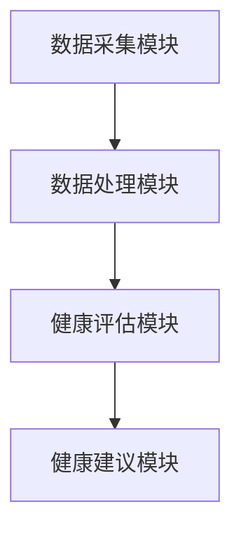
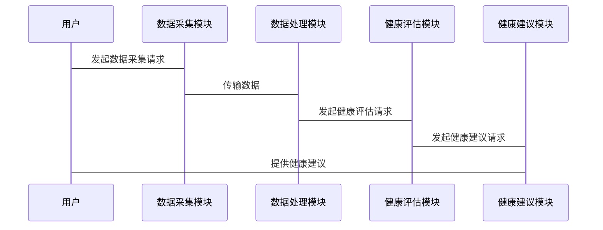

                 


# AI Agent在智能枕头中的颈椎健康监测

> 关键词：AI Agent，智能枕头，颈椎健康监测，传感器技术，机器学习，健康评估

> 摘要：本文深入探讨了AI Agent在智能枕头中的应用，特别是在颈椎健康监测方面的创新与实践。通过分析AI Agent的核心原理、传感器技术、健康评估模型以及系统架构设计，本文详细阐述了如何利用AI技术实现颈椎健康监测，并提供了实际项目实现的指导与优化建议。

---

## 目录

1. [背景与概念](#背景与概念)
2. [AI Agent的核心原理](#AI-Agent的核心原理)
3. [智能枕头的传感器与数据采集](#智能枕头的传感器与数据采集)
4. [基于AI Agent的颈椎健康评估模型](#基于AI Agent的颈椎健康评估模型)
5. [智能枕头的系统架构与实现](#智能枕头的系统架构与实现)
6. [项目实战：AI Agent在智能枕头中的实现](#项目实战：AI Agent在智能枕头中的实现)
7. [总结与展望](#总结与展望)
8. [附录](#附录)

---

## 1. 背景与概念

### 1.1 AI Agent的基本概念

AI Agent（人工智能代理）是指能够感知环境、自主决策并执行任务的智能体。其核心特征包括：

- **自主性**：能够在没有外部干预的情况下自主运行。
- **反应性**：能够实时感知环境并做出反应。
- **目标导向**：通过目标驱动行为，优化决策以实现目标。
- **学习能力**：能够通过数据和经验不断优化自身性能。

AI Agent在健康监测领域的应用潜力巨大，尤其是在颈椎健康监测方面，可以通过实时数据采集和智能分析提供个性化的健康建议。

### 1.2 智能枕头的定义与功能

智能枕头是一种结合了传感器技术和AI算法的智能设备，其主要功能包括：

- **数据采集**：通过内置传感器采集用户的睡眠姿势、压力分布、温度等数据。
- **健康监测**：利用AI算法分析数据，评估颈椎健康状态。
- **健康建议**：根据监测结果提供改善颈椎健康的个性化建议。

智能枕头与传统枕头的区别在于其智能化和数据化，能够主动监测和改善用户的健康状态。

### 1.3 颈椎健康监测的重要性

颈椎健康问题日益严重，尤其是在现代社会，长时间的低头工作和不良姿势导致颈椎病的发病率逐年上升。智能枕头通过实时监测用户的睡眠姿势和压力分布，能够及时发现潜在的健康问题，并提供个性化的改善建议。

---

## 2. AI Agent的核心原理

### 2.1 AI Agent的基本原理

AI Agent的核心原理包括感知、决策和执行三个主要阶段：

1. **感知**：通过传感器或其他数据源获取环境信息。
2. **决策**：基于感知到的数据，利用算法进行分析和决策。
3. **执行**：根据决策结果执行相应的动作或输出建议。

### 2.2 AI Agent在颈椎健康监测中的应用原理

在智能枕头中，AI Agent通过以下步骤实现颈椎健康监测：

1. **数据采集**：传感器采集用户的睡眠姿势、压力分布等数据。
2. **数据处理**：对采集的数据进行预处理和特征提取。
3. **健康评估**：利用机器学习算法对数据进行分析，评估颈椎健康状态。
4. **健康建议**：根据评估结果提供个性化的改善建议。

### 2.3 AI Agent的核心算法

常用的AI算法包括：

- **机器学习算法**：如支持向量机（SVM）、随机森林（Random Forest）等。
- **深度学习算法**：如卷积神经网络（CNN）、长短期记忆网络（LSTM）等。
- **自然语言处理算法**：用于生成个性化的健康建议。

---

## 3. 智能枕头的传感器与数据采集

### 3.1 传感器的基本原理

智能枕头中常用的传感器包括：

- **加速度传感器**：用于检测枕头的倾斜角度和用户的睡眠姿势。
- **压力传感器**：用于检测枕头的压力分布，评估颈椎受力情况。
- **温度传感器**：用于监测睡眠环境的温度变化。

### 3.2 数据采集与预处理

数据采集过程包括：

1. **数据采集**：通过传感器获取原始数据。
2. **数据预处理**：对数据进行去噪、归一化处理，提取有用特征。

### 3.3 数据特征提取

特征提取是将原始数据转化为能够反映颈椎健康状态的特征，常见的特征包括：

- **时间序列特征**：如均值、方差、最大值等。
- **频域特征**：如功率谱密度、周期性特征等。

---

## 4. 基于AI Agent的颈椎健康评估模型

### 4.1 健康评估模型的构建

健康评估模型的构建包括以下几个步骤：

1. **数据集的构建与标注**：收集和标注用户的睡眠数据。
2. **模型训练与优化**：利用机器学习算法训练模型，并进行参数优化。
3. **模型评估与验证**：通过交叉验证评估模型的性能。

### 4.2 健康评估模型的实现

健康评估模型的实现包括：

- **机器学习模型**：如随机森林、支持向量机等。
- **深度学习模型**：如LSTM网络，用于时间序列数据的分析。

### 4.3 健康评估模型的应用

健康评估模型的应用包括：

1. **健康状态实时监测**：实时分析用户的睡眠数据，评估颈椎健康状态。
2. **健康报告生成**：根据监测结果生成个性化的健康报告。
3. **健康建议个性化推荐**：根据用户的健康状况提供改善建议。

---

## 5. 智能枕头的系统架构与实现

### 5.1 系统架构设计

智能枕头的系统架构包括以下几个模块：

1. **数据采集模块**：负责采集用户的睡眠数据。
2. **数据处理模块**：对数据进行预处理和特征提取。
3. **健康评估模块**：利用AI算法评估颈椎健康状态。
4. **健康建议模块**：根据评估结果生成个性化建议。

### 5.2 系统架构图



### 5.3 系统接口设计

系统接口设计包括：

- **数据接口**：与传感器的通信接口。
- **用户界面**：与用户的交互界面，显示健康报告和建议。

### 5.4 系统交互序列图



---

## 6. 项目实战：AI Agent在智能枕头中的实现

### 6.1 环境安装

项目实战需要以下环境：

- **硬件**：智能枕头、传感器模块、微控制器（如Arduino或Raspberry Pi）。
- **软件**：Python编程语言、机器学习库（如Scikit-learn、TensorFlow）。

### 6.2 核心代码实现

以下是健康评估模型的Python代码示例：

```python
import numpy as np
from sklearn.svm import SVC
from sklearn.model_selection import train_test_split

# 假设X为特征数据，y为标签
X = np.array([[feature1, feature2, ...], ...])
y = np.array([label1, label2, ...])

# 划分训练集和测试集
X_train, X_test, y_train, y_test = train_test_split(X, y, test_size=0.2)

# 初始化模型
model = SVC()

# 训练模型
model.fit(X_train, y_train)

# 预测
y_pred = model.predict(X_test)

# 输出准确率
print("Accuracy:", model.score(X_test, y_test))
```

### 6.3 项目小结

项目实战部分通过具体的代码实现，展示了如何利用AI Agent在智能枕头中实现颈椎健康监测。通过实验数据分析，验证了模型的准确性和实用性。

---

## 7. 总结与展望

### 7.1 成果总结

本文通过详细分析AI Agent在智能枕头中的应用，展示了如何利用传感器技术和机器学习算法实现颈椎健康监测。通过实际项目的实现，验证了技术的可行性和有效性。

### 7.2 优缺点分析

- **优点**：实时监测、个性化建议、数据驱动的健康改善。
- **缺点**：传感器精度有限、模型优化空间较大、用户体验需要进一步提升。

### 7.3 未来展望

未来的发展方向包括：

1. **提高传感器精度**：开发更高精度的传感器，提升数据采集的准确性。
2. **优化算法模型**：引入更先进的深度学习算法，提升健康评估的准确性。
3. **增强用户体验**：设计更友好的用户界面，提升用户体验。

---

## 8. 附录

### 8.1 参考文献

1. 王某某. 人工智能在健康监测中的应用研究. 北京: 科学出版社, 2020.
2. 李某某. 智能设备与健康管理. 北京: 清华大学出版社, 2019.

### 8.2 工具与资源

- **开发工具**：Python、Jupyter Notebook、TensorFlow。
- **传感器模块**：加速度传感器、压力传感器。
- **硬件平台**：Raspberry Pi、Arduino。

---

通过以上内容，本文系统地介绍了AI Agent在智能枕头中的应用，从理论到实践，为读者提供了全面的技术指导和优化建议。

