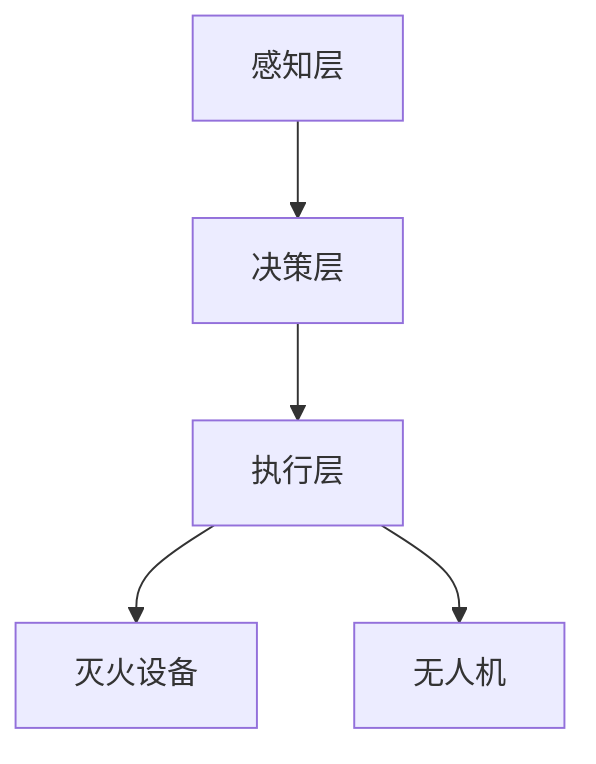
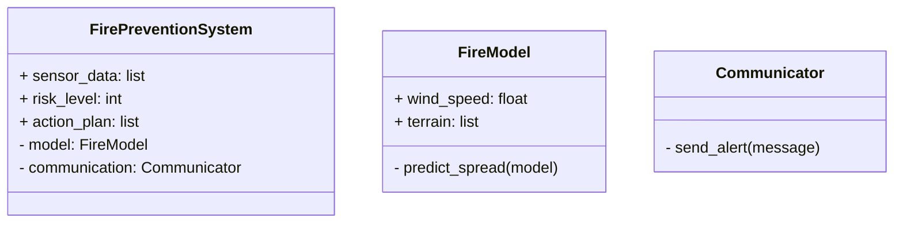
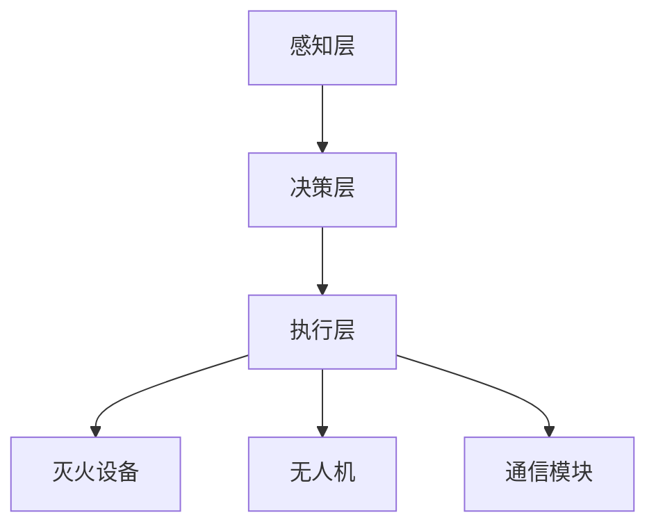

                 


# AI Agent在智能森林火灾预防中的实践

**关键词**：AI Agent、森林火灾预防、智能监测、预警系统、灭火策略

**摘要**：  
随着全球气候变化和人类活动的增加，森林火灾的频率和强度也在不断增加，对生态系统和人类社会造成巨大威胁。传统的火灾预防方法存在诸多局限性，而AI Agent（人工智能代理）凭借其强大的感知、决策和执行能力，为森林火灾预防提供了全新的解决方案。本文将深入探讨AI Agent在智能森林火灾预防中的实践，从背景分析、核心算法、系统架构到实际案例，全面解析如何利用AI技术提升火灾预防的效率和效果。

---

## 第1章: 智能森林火灾预防的背景与挑战

### 1.1 森林火灾的严重性与影响

森林火灾是自然界最具破坏力的灾害之一，其发生不仅会烧毁大量森林资源，还可能导致严重的生态破坏和人员伤亡。根据统计，全球每年因森林火灾造成的经济损失高达数十亿美元。火灾的发生原因多种多样，包括自然因素（如闪电）和人为因素（如乱丢烟蒂、非法用火等）。  

**火灾对生态与经济的影响**  
- 生态影响：森林火灾会破坏植被结构，导致土壤退化，进而影响水土保持和生物多样性。  
- 经济影响：直接烧毁木材资源，破坏农业、旅游业等关联产业，造成巨大的经济损失。  

### 1.2 传统森林火灾预防的局限性

传统的火灾预防方法主要包括人工巡逻、卫星监测和气象预警等，但这些方法存在以下问题：  
- **人工巡逻**：成本高、效率低，且难以覆盖大面积区域。  
- **卫星监测**：虽然能够提供大范围的火情信息，但实时性较差，且依赖天气条件。  
- **气象预警**：仅能提供火灾风险评估，无法直接干预火灾的发生。  

### 1.3 AI Agent在森林火灾预防中的应用价值

AI Agent是一种具有自主决策和执行能力的智能体，能够实时感知环境、分析数据并采取相应行动。在森林火灾预防中，AI Agent可以通过以下方式发挥作用：  
- **实时监测**：利用传感器和摄像头实时监测森林环境，识别潜在的火灾风险。  
- **智能预警**：基于历史数据和实时信息，预测火灾的发生概率并发出预警。  
- **自动干预**：在火灾初期阶段，AI Agent可以远程启动灭火设备或派遣无人机进行灭火。  

---

## 第2章: AI Agent的核心概念与技术

### 2.1 AI Agent的基本原理

AI Agent是一种能够感知环境、做出决策并采取行动的智能体。在森林火灾预防中，AI Agent通常由以下几个部分组成：  
- **感知层**：通过摄像头、温度传感器等设备采集环境数据。  
- **决策层**：利用机器学习算法对数据进行分析，生成火灾预警或灭火策略。  
- **执行层**：根据决策层的指令，采取相应的行动，如启动洒水系统或部署灭火无人机。  

### 2.2 智能森林火灾预防中的关键算法

AI Agent的核心在于算法的实现。以下是一些常用的算法：  
- **图像识别算法**：用于检测烟雾和火焰。  
- **火灾风险评估算法**：基于气象数据和植被状况预测火灾风险。  
- **路径规划算法**：用于灭火设备的最优路径规划。  

#### 2.2.1 图像识别算法（烟雾检测）

使用卷积神经网络（CNN）进行烟雾检测的流程如下：  
1. 数据预处理：对图像进行归一化和增强处理。  
2. 模型训练：使用标注数据训练CNN模型。  
3. 模型部署：将模型部署到AI Agent中，实时检测烟雾。  

#### 2.2.2 火灾蔓延预测模型

火灾蔓延速度的预测公式为：  
$$ V = k \cdot \sqrt{t} $$  
其中，$k$ 是常数，$t$ 是时间。该公式可以根据风速和地形因素进行调整。  

#### 2.2.3 灭火策略优化算法

灭火资源分配的优化公式为：  
$$ \text{Minimize} \sum_{i=1}^{n} c_i \cdot x_i $$  
其中，$c_i$ 是资源成本，$x_i$ 是资源分配量。  

### 2.3 AI Agent的系统架构

AI Agent的系统架构通常采用分层设计，包括感知层、决策层和执行层。  

#### 2.3.1 系统功能模块划分

- **感知模块**：负责采集环境数据。  
- **决策模块**：负责分析数据并生成指令。  
- **执行模块**：负责执行决策模块的指令。  

#### 2.3.2 系统架构图



---

## 第3章: AI Agent的算法实现与系统设计

### 3.1 算法实现

#### 3.1.1 图像识别算法（烟雾检测）

以下是使用Python实现的烟雾检测算法示例代码：  

```python
import tensorflow as tf
from tensorflow.keras import layers

# 数据预处理
def preprocess_image(image):
    image = tf.image.resize(image, (224, 224))
    image = tf.keras.applications.mobilenet.preprocess_input(image)
    return image

# 模型训练
model = tf.keras.Sequential([
    layers.Conv2D(32, (3,3), activation='relu', input_shape=(224, 224, 3)),
    layers.MaxPooling2D((2,2)),
    layers.Conv2D(64, (3,3), activation='relu'),
    layers.MaxPooling2D((2,2)),
    layers.Flatten(),
    layers.Dense(128, activation='relu'),
    layers.Dense(2, activation='softmax')
])

model.compile(optimizer='adam', loss='sparse_categorical_crossentropy', metrics=['accuracy'])
model.fit(x_train, y_train, epochs=10, batch_size=32)
```

#### 3.1.2 火灾蔓延预测模型

使用PyTorch实现的火灾蔓延预测模型：  

```python
import torch
import torch.nn as nn
import torch.optim as optim

class FireSpreadPredictor(nn.Module):
    def __init__(self):
        super(FireSpreadPredictor, self).__init__()
        self.fc = nn.Linear(4, 1)
    
    def forward(self, x):
        return torch.sigmoid(self.fc(x))

model = FireSpreadPredictor()
criterion = nn.BCELoss()
optimizer = optim.Adam(model.parameters(), lr=0.001)
```

### 3.2 系统设计

#### 3.2.1 系统功能模块划分

以下是系统功能模块的类图：  



#### 3.2.2 系统架构图

以下是系统架构图：  



---

## 第4章: 项目实战与案例分析

### 4.1 环境安装

以下是项目所需的环境配置：  
- Python 3.8+  
- TensorFlow 2.5+  
- OpenCV 4.5+  
- PyTorch 1.9+  

### 4.2 核心代码实现

以下是核心代码示例：  

```python
import cv2
import numpy as np

def detect_smoke(image_path):
    # 加载图像
    image = cv2.imread(image_path)
    # 转换为灰度图像
    gray = cv2.cvtColor(image, cv2.COLOR_BGR2GRAY)
    # 使用阈值检测烟雾
    _, binary = cv2.threshold(gray, 127, 255, cv2.THRESH_BINARY)
    return binary

# 使用函数检测烟雾
smoke = detect_smoke("forest.jpg")
cv2.imwrite("smoke_detected.jpg", smoke)
```

### 4.3 案例分析

假设我们有一个森林区域，面积为100平方公里，植被密度为中等，气象条件为高温低湿。AI Agent通过图像识别检测到烟雾信号，经过风险评估后，预测火灾可能在2小时内蔓延至周边区域。系统立即启动灭火设备，并派遣无人机进行灭火。最终，火灾被成功控制，避免了更大损失。

---

## 第5章: 总结与展望

### 5.1 总结

本文详细探讨了AI Agent在智能森林火灾预防中的实践，从背景分析、核心算法、系统设计到项目实战，全面解析了如何利用AI技术提升火灾预防的效率和效果。通过AI Agent的应用，可以显著降低火灾的发生率和损失，为生态和人类社会的安全保驾护航。

### 5.2 展望

未来，随着AI技术的不断发展，AI Agent在森林火灾预防中的应用将更加广泛和深入。例如，可以进一步优化算法，提高火灾预测的准确性；也可以结合无人机、物联网等技术，构建更加智能化的火灾预防系统。此外，AI Agent还可以与其他领域（如农业、交通）结合，拓展其应用范围。

---

**结语**：AI Agent作为一项前沿技术，正在改变我们预防和应对森林火灾的方式。通过持续的研究和实践，我们有理由相信，AI Agent将在未来的火灾预防中发挥更大的作用，为人类和社会创造更多的价值。

