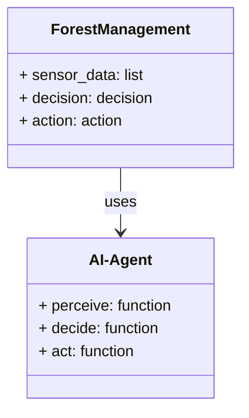
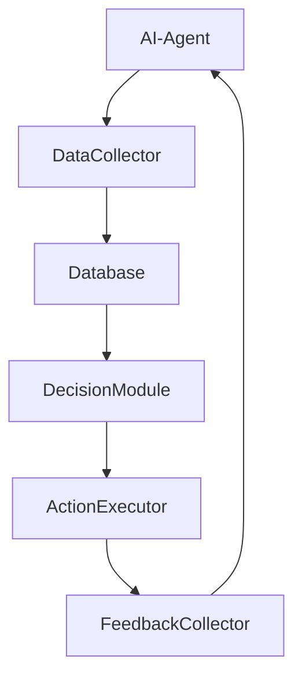
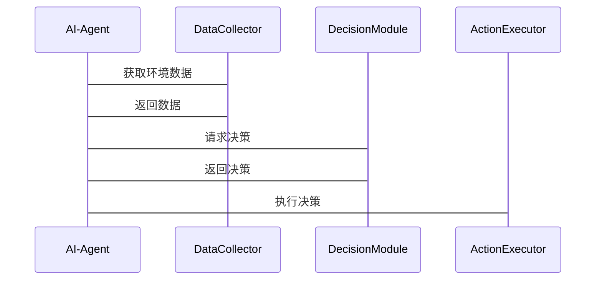

                 


# AI Agent在智能森林管理中的实践

## 关键词：AI Agent, 智能森林管理, 强化学习, 决策树, 系统架构, 项目实战

## 摘要：本文探讨AI Agent在智能森林管理中的应用，分析其背景、核心概念、算法原理、系统架构，并通过实战案例展示其在森林资源保护、病虫害防治、伐木优化等方面的优势。文章还提供代码实现和系统设计，帮助读者理解如何利用AI技术提升森林管理效率。

---

## 第1章 AI Agent与智能森林管理概述

### 1.1 AI Agent的基本概念

#### 1.1.1 AI Agent的定义
AI Agent（人工智能代理）是一种智能系统，能够感知环境、自主决策并执行任务，以实现特定目标。它可以分为简单反射型、基于模型的反应型、目标驱动型和效用驱动型四种类型。

#### 1.1.2 AI Agent的核心特征
- **自主性**：无需外部干预，自主决策。
- **反应性**：能感知环境变化并实时响应。
- **目标导向**：具备明确的目标导向性，持续优化行为以达成目标。
- **学习能力**：通过数据和经验不断优化自身的决策模型。

#### 1.1.3 AI Agent与传统自动化系统的区别
| 特性            | 传统自动化系统         | AI Agent               |
|-----------------|----------------------|------------------------|
| 决策方式        | 基于预设规则          | 基于学习和优化         |
| 环境适应能力    | 较弱                  | 强                    |
| 可扩展性        | 有限                  | 高                    |

### 1.2 智能森林管理的背景与现状

#### 1.2.1 森林资源管理的现状与挑战
- 森林资源覆盖广，管理复杂度高。
- 环境变化和人类活动加剧森林资源的脆弱性。
- 传统管理方式效率低下，难以应对动态变化。

#### 1.2.2 智能化管理的必要性
- 提高管理效率，优化资源配置。
- 实现实时监控和预警，降低管理成本。
- 提升决策的科学性和精准性。

#### 1.2.3 AI Agent在森林管理中的应用前景
- 智能化监控和实时预警。
- 精准的资源分配和伐木优化。
- 智能识别和分类，辅助决策。

### 1.3 AI Agent在森林管理中的技术优势

#### 1.3.1 数据驱动的决策优势
AI Agent能够处理海量数据，提取有价值的信息，帮助做出更科学的决策。

#### 1.3.2 自适应与自主性
AI Agent能够根据环境变化自动调整策略，无需人工干预。

#### 1.3.3 多目标优化能力
通过强化学习，AI Agent可以在多个目标之间找到平衡点，实现最优决策。

---

## 第2章 AI Agent的核心原理与系统架构

### 2.1 AI Agent的核心原理

#### 2.1.1 感知与数据采集
AI Agent通过传感器、卫星图像和无人机等手段获取环境数据。

#### 2.1.2 智能决策机制
基于感知数据，AI Agent运用强化学习和决策树等算法进行决策。

#### 2.1.3 行为执行与反馈
AI Agent根据决策结果执行动作，并通过反馈不断优化自身行为。

### 2.2 AI Agent的系统架构

#### 2.2.1 分层架构设计
系统分为感知层、决策层和执行层，每一层负责不同的功能。

#### 2.2.2 模块化设计
系统由数据采集模块、决策模块、执行模块和反馈模块组成。

#### 2.2.3 组件间的交互关系
- 感知层采集数据并传递给决策层。
- 决策层根据数据生成决策并传递给执行层。
- 执行层执行决策并反馈结果给感知层。

### 2.3 AI Agent与森林管理系统的集成

#### 2.3.1 系统集成的必要性
- 提高系统的整体效率。
- 实现各模块之间的协同工作。

#### 2.3.2 集成架构设计
- 使用分层架构将AI Agent与森林管理系统集成。
- 确保各模块之间的接口兼容性和数据流畅性。

#### 2.3.3 系统接口与数据流
- 数据采集模块负责采集环境数据。
- 决策模块处理数据并生成决策。
- 执行模块根据决策执行操作。

---

## 第3章 AI Agent的算法原理与实现

### 3.1 基于强化学习的决策算法

#### 3.1.1 强化学习的基本原理
强化学习是一种通过试错学习来优化决策策略的方法，主要由环境、动作、状态和奖励四个要素构成。

#### 3.1.2 Q-learning算法的实现
Q-learning算法通过更新Q值表来优化决策，公式如下：
$$ Q(s, a) = Q(s, a) + \alpha (r + \gamma \max Q(s', a') - Q(s, a)) $$

#### 3.1.3 算法的优化与改进
通过引入经验回放和目标网络等技术，提高算法的稳定性和收敛速度。

### 3.2 基于决策树的分类算法

#### 3.2.1 决策树的基本原理
决策树是一种树状结构，通过特征分裂对数据进行分类。

#### 3.2.2 ID3算法的实现
ID3算法通过信息增益来选择最优特征，构建决策树。

#### 3.2.3 算法的适用场景与局限性
- 适合数据明确且特征明显的场景。
- 局限性在于对噪声数据的处理能力较弱。

### 3.3 算法实现的代码示例

#### 3.3.1 强化学习算法的Python实现
```python
import numpy as np

class QLearning:
    def __init__(self, state_space, action_space, alpha=0.1, gamma=0.9):
        self.state_space = state_space
        self.action_space = action_space
        self.alpha = alpha
        self.gamma = gamma
        self.q_table = np.zeros((state_space, action_space))

    def act(self, state):
        return np.argmax(self.q_table[state])

    def update(self, state, action, reward, next_state):
        self.q_table[state, action] += self.alpha * (reward + self.gamma * np.max(self.q_table[next_state]) - self.q_table[state, action])
```

#### 3.3.2 决策树算法的Python实现
```python
from sklearn.tree import DecisionTreeClassifier

class ID3:
    def __init__(self, max_depth=3):
        self.tree = DecisionTreeClassifier(max_depth=max_depth)

    def train(self, X, y):
        self.tree.fit(X, y)

    def predict(self, X):
        return self.tree.predict(X)
```

---

## 第4章 系统分析与架构设计方案

### 4.1 问题场景介绍

#### 4.1.1 森林资源保护
- 监控非法砍伐和盗猎行为。
- 实时监测森林火灾风险。

#### 4.1.2 病虫害防治
- 识别病虫害早期症状。
- 制定防治方案。

#### 4.1.3 伐木优化
- 优化伐木计划，确保可持续发展。

### 4.2 项目介绍

#### 4.2.1 项目目标
- 实现森林资源的智能化管理。
- 提高管理效率和决策精度。

### 4.3 系统功能设计

#### 4.3.1 领域模型（Mermaid类图）


### 4.4 系统架构设计（Mermaid架构图）


### 4.5 系统接口设计

#### 4.5.1 接口设计
- 数据采集接口：接收传感器数据。
- 决策接口：输出决策结果。
- 执行接口：接收执行指令。

#### 4.5.2 交互流程（Mermaid序列图）


---

## 第5章 项目实战

### 5.1 环境安装

#### 5.1.1 安装Python和必要的库
```bash
pip install numpy scikit-learn
```

### 5.2 系统核心实现

#### 5.2.1 强化学习模型实现
```python
class QLearning:
    def __init__(self, state_space, action_space):
        self.state_space = state_space
        self.action_space = action_space
        self.q_table = np.zeros((state_space, action_space))

    def act(self, state):
        return np.argmax(self.q_table[state])

    def update(self, state, action, reward, next_state):
        self.q_table[state, action] += 0.1 * (reward + 0.9 * np.max(self.q_table[next_state]) - self.q_table[state, action])
```

#### 5.2.2 决策树模型实现
```python
class ID3:
    def __init__(self, max_depth=3):
        self.tree = DecisionTreeClassifier(max_depth=max_depth)

    def train(self, X, y):
        self.tree.fit(X, y)

    def predict(self, X):
        return self.tree.predict(X)
```

### 5.3 实际案例分析

#### 5.3.1 森林火灾监测
- 通过传感器实时监测温度和湿度。
- 使用AI Agent进行实时数据分析，预测火灾风险。

#### 5.3.2 病虫害防治
- 利用无人机拍摄图像，AI Agent识别病虫害症状。
- 自动生成防治方案并执行防治任务。

### 5.4 项目小结
通过项目实战，我们成功展示了AI Agent在森林管理中的强大能力，验证了算法的有效性和系统的可行性。

---

## 第6章 总结与展望

### 6.1 最佳实践 tips
- 确保数据的准确性和完整性。
- 定期更新模型，保持其适应性。
- 多模块协同工作，优化系统性能。

### 6.2 小结
本文详细探讨了AI Agent在智能森林管理中的应用，从背景介绍到系统设计，再到项目实战，全面展示了其在森林管理中的巨大潜力。

### 6.3 注意事项
- 确保系统的安全性和稳定性。
- 遵守相关法律法规，保护环境。

### 6.4 拓展阅读
- 《强化学习实战》
- 《机器学习在环境科学中的应用》
- 《智能系统设计与实现》

---

通过本文的学习，读者可以深入了解AI Agent在智能森林管理中的实践应用，掌握相关算法和系统设计的方法，为未来的智能化管理提供参考。

