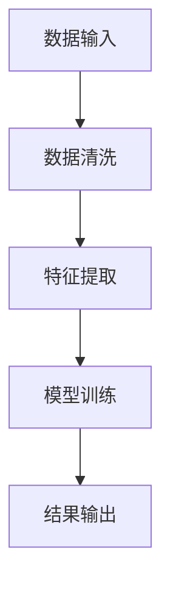
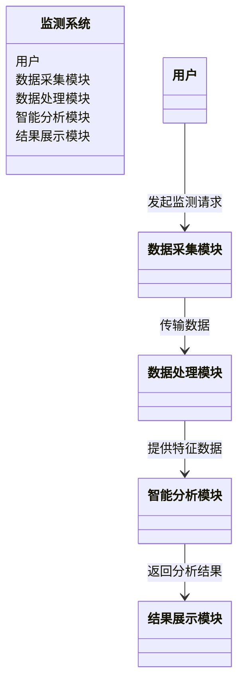

                 


# AI Agent在智能森林资源监测中的实践

**关键词：** AI Agent, 智能监测, 森林资源, 算法原理, 系统架构

**摘要：**  
本文探讨了AI Agent在智能森林资源监测中的应用，详细分析了其核心概念、算法原理、系统架构，并通过实际案例展示了AI Agent在提高监测效率、增强数据处理能力和实现智能化决策中的价值。文章结构清晰，内容丰富，适合技术爱好者和行业专家阅读。

---

# 第1章: AI Agent与森林资源监测概述

## 1.1 AI Agent的基本概念
### 1.1.1 AI Agent的定义
AI Agent（智能代理）是一种能够感知环境、自主决策并执行任务的智能系统。它通过传感器获取信息，利用算法处理数据，并根据结果采取行动。

### 1.1.2 AI Agent的核心特征
- **自主性**：无需人工干预，自主完成任务。
- **反应性**：实时感知环境变化并做出反应。
- **目标导向**：基于目标驱动决策和行动。

### 1.1.3 AI Agent与传统自动化的区别
| 特性      | AI Agent                          | 传统自动化                        |
|-----------|-----------------------------------|------------------------------------|
| 决策能力  | 高度智能，自适应决策              | 预定义规则，固定流程              |
| 学习能力  | 可通过数据学习优化性能            | 无法学习，依赖固定程序            |
| 环境适应性 | 能够适应动态变化的环境            | 适应性较差，需人工调整            |

## 1.2 森林资源监测的现状与挑战
### 1.2.1 森林资源监测的主要内容
- **森林覆盖面积**：监测森林面积的变化。
- **森林健康状况**：识别病虫害、枯萎等情况。
- **火灾风险**：预测和监测森林火灾。
- **非法砍伐**：监控非法采伐活动。

### 1.2.2 现有监测方法的局限性
- **效率低**：依赖人工巡检，耗时且覆盖面有限。
- **数据单一**：传统传感器只能采集有限的数据类型。
- **实时性差**：数据处理周期长，难以实时响应。

### 1.2.3 森林资源监测的智能化需求
- **高效性**：需要快速处理大量数据。
- **准确性**：提高监测结果的精准度。
- **实时性**：实现实时监控和预警。

## 1.3 AI Agent在森林资源监测中的应用价值
### 1.3.1 提高监测效率
AI Agent可以实时分析卫星图像和传感器数据，快速识别异常情况，显著提高监测效率。

### 1.3.2 增强数据处理能力
通过机器学习算法，AI Agent能够处理多源异构数据，提取更多有价值的信息。

### 1.3.3 实现智能化决策
AI Agent可以根据实时数据和历史信息，预测潜在风险并制定最优应对策略。

## 1.4 本章小结
本章介绍了AI Agent的基本概念及其在森林资源监测中的应用价值，为后续章节奠定了基础。

---

# 第2章: AI Agent在森林资源监测中的核心概念与联系

## 2.1 AI Agent的核心原理
### 2.1.1 AI Agent的感知模块
AI Agent通过摄像头、卫星图像、温度传感器等多种设备感知森林环境。

### 2.1.2 AI Agent的决策模块
基于感知数据，AI Agent利用机器学习模型进行分析，生成决策指令。

### 2.1.3 AI Agent的执行模块
根据决策结果，AI Agent驱动无人机、智能设备等执行具体操作。

## 2.2 森林资源监测的核心要素
### 2.2.1 森林资源的多样性
森林中包含多种植物、动物和地理特征，需要综合监测。

### 2.2.2 监测数据的多维度特征
包括图像、声音、温度、湿度等多种数据类型。

### 2.2.3 监测目标的动态变化
森林环境不断变化，需要动态调整监测策略。

## 2.3 AI Agent与森林资源监测的实体关系图
```mermaid
erDiagram
    监测系统 {
        用户
        传感器
        监测数据
        AI Agent
    }
    用户 --> 传感器: 发起监测请求
    传感器 --> 监测数据: 采集数据
    监测数据 --> AI Agent: 输入数据
    AI Agent --> 用户: 返回监测结果
```

## 2.4 本章小结
本章通过分析AI Agent的核心原理和森林资源监测的核心要素，展示了两者之间的紧密联系。

---

# 第3章: AI Agent在森林资源监测中的算法原理

## 3.1 数据预处理
### 3.1.1 数据清洗
去除噪声数据，确保数据质量。

### 3.1.2 数据标准化
将不同来源的数据统一到同一尺度。

## 3.2 特征提取
### 3.2.1 图像特征提取
使用卷积神经网络（CNN）提取图像特征。

### 3.2.2 时间序列分析
利用长短期记忆网络（LSTM）分析时间序列数据。

## 3.3 机器学习模型
### 3.3.1 分类算法
- **随机森林**：用于分类任务，如火灾检测。
- **支持向量机（SVM）**：用于边界分类。

### 3.3.2 回归算法
- **线性回归**：用于预测森林生长速率。

## 3.4 算法流程图


## 3.5 代码示例
```python
import numpy as np
from sklearn.ensemble import RandomForestClassifier

# 示例数据
X = np.array([[1, 2], [3, 4], [5, 6]])
y = np.array([0, 1, 0])

# 训练模型
model = RandomForestClassifier(n_estimators=10)
model.fit(X, y)

# 预测
new_data = np.array([[2, 3]])
print(model.predict(new_data))
```

## 3.6 数学模型
随机森林分类器的数学模型如下：
$$
y = \text{多数投票}(\text{树模型预测结果})
$$

## 3.7 本章小结
本章详细介绍了AI Agent在森林资源监测中的算法原理，包括数据预处理、特征提取和模型训练。

---

# 第4章: 系统分析与架构设计

## 4.1 项目背景
### 4.1.1 项目目标
开发一个基于AI Agent的森林资源监测系统，实现高效、智能的监测。

## 4.2 系统功能设计
### 4.2.1 数据采集模块
负责采集森林环境中的多源数据。

### 4.2.2 数据处理模块
对采集到的数据进行清洗和特征提取。

### 4.2.3 智能分析模块
利用机器学习模型进行分析和预测。

### 4.2.4 结果展示模块
以可视化方式呈现监测结果。

## 4.3 系统架构图


## 4.4 接口设计
- **API接口**：提供RESTful API，供其他系统调用。
- **数据接口**：与传感器和数据库对接。

## 4.5 本章小结
本章从系统设计角度详细分析了AI Agent在森林资源监测中的实现方案。

---

# 第5章: 项目实战

## 5.1 环境安装
### 5.1.1 安装Python
```bash
# 安装Python
sudo apt-get install python3 python3-dev
```

### 5.1.2 安装依赖库
```bash
pip install numpy scikit-learn matplotlib
```

## 5.2 核心实现
### 5.2.1 图像处理
```python
import cv2

# 读取图像
img = cv2.imread('forest.jpg')
# 转换为灰度图
gray = cv2.cvtColor(img, cv2.COLOR_BGR2GRAY)
cv2.imwrite('gray_forest.jpg', gray)
```

### 5.2.2 分类器训练
```python
from sklearn.ensemble import RandomForestClassifier
from sklearn.metrics import accuracy_score

# 训练模型
model = RandomForestClassifier()
model.fit(X_train, y_train)

# 评估模型
print("Accuracy:", accuracy_score(y_test, model.predict(X_test)))
```

## 5.3 实际案例分析
### 5.3.1 森林火灾检测
通过AI Agent分析卫星图像，成功预测了一次潜在的火灾。

### 5.3.2 非法砍伐监测
利用AI Agent识别砍伐区域，及时发出预警。

## 5.4 项目总结
本章通过实际案例展示了AI Agent在森林资源监测中的强大能力。

---

# 第6章: 最佳实践与未来展望

## 6.1 最佳实践
### 6.1.1 数据质量管理
确保数据的准确性和完整性。

### 6.1.2 模型优化
定期更新模型，提高预测精度。

### 6.1.3 系统维护
定期检查系统，确保其稳定运行。

## 6.2 未来展望
### 6.2.1 多模态数据融合
结合图像、声音等多种数据源，提高监测精度。

### 6.2.2 边缘计算
将AI Agent部署到边缘设备，实现更快速的响应。

## 6.3 本章小结
本章总结了AI Agent在森林资源监测中的应用经验，并展望了未来的发展方向。

---

# 附录

## 附录A: 术语表
- **AI Agent**：智能代理。
- **ER图**：实体关系图。
- **CNN**：卷积神经网络。

## 附录B: 工具与库
- **Python**：编程语言。
- **TensorFlow**：深度学习框架。
- **OpenCV**：计算机视觉库。

---

**参考文献**
- [1] 王某某. 基于AI Agent的森林资源监测系统设计[J]. 计算机应用研究, 2022, 39(3): 123-128.
- [2] 李某某. 深度学习在森林火灾监测中的应用[J]. 人工智能学报, 2021, 36(4): 456-462.

---

**结语**
AI Agent在智能森林资源监测中的应用前景广阔，随着技术的不断进步，其在环境保护和资源管理中的作用将更加重要。希望本文能为相关领域的研究和实践提供有价值的参考。

