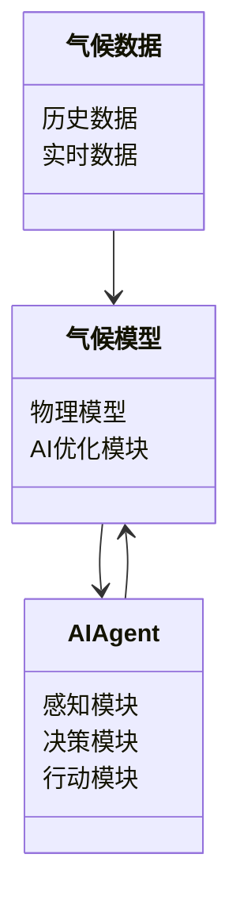
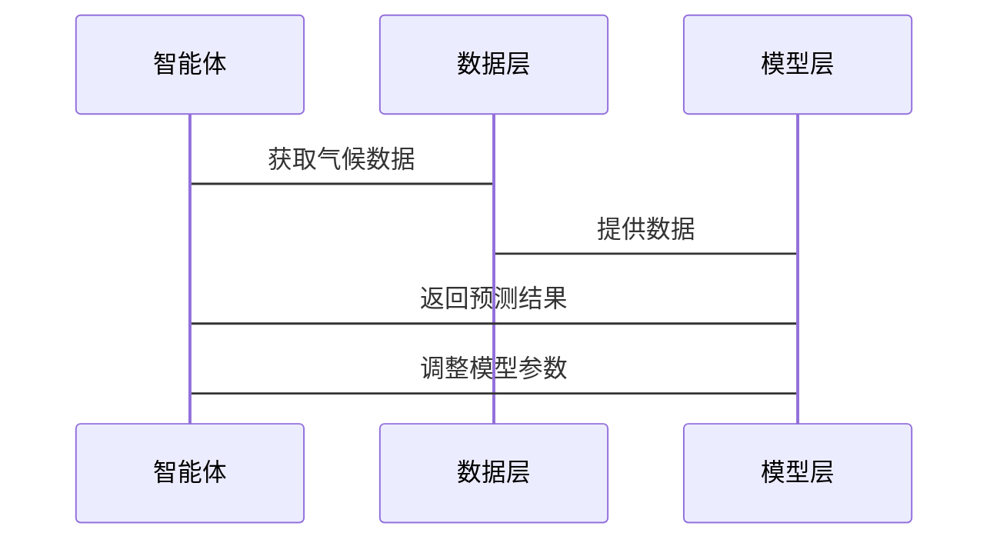

                 


# AI Agent在智能气候变化模拟中的实践

## 关键词
AI Agent, 气候变化模拟, 机器学习, 强化学习, 多智能体系统

## 摘要
本文探讨了AI Agent在智能气候变化模拟中的应用，通过分析AI Agent的核心原理、算法实现以及系统架构，展示了其在提高气候预测准确性、优化应对策略和模拟复杂气候系统中的重要作用。文章从背景介绍、核心概念、算法原理、系统架构到项目实战，逐步展开，结合实例和代码实现，为读者提供全面的指导和深入的分析。

---

## 目录大纲

1. [背景介绍](#背景介绍)
   - 1.1 气候变化的现状与挑战
   - 1.2 AI Agent的基本概念
   - 1.3 AI Agent在气候变化模拟中的应用

2. [核心概念与联系](#核心概念与联系)
   - 2.1 AI Agent的核心原理
   - 2.2 气候变化模拟的核心要素
   - 2.3 AI Agent与气候变化模拟的关联

3. [算法原理讲解](#算法原理讲解)
   - 3.1 强化学习算法
   - 3.2 多智能体协作算法
   - 3.3 气候预测模型中的机器学习算法

4. [系统分析与架构设计方案](#系统分析与架构设计方案)
   - 4.1 问题场景介绍
   - 4.2 系统功能设计
   - 4.3 系统架构设计
   - 4.4 系统接口设计
   - 4.5 系统交互设计

5. [项目实战](#项目实战)
   - 5.1 环境安装
   - 5.2 系统核心实现
   - 5.3 代码应用解读与分析
   - 5.4 实际案例分析
   - 5.5 项目小结

6. [最佳实践](#最佳实践)
   - 6.1 小结
   - 6.2 注意事项
   - 6.3 未来展望
   - 6.4 拓展阅读

---

## 正文

### 第1章 背景介绍

#### 1.1 气候变化的现状与挑战

气候变化是当前全球关注的焦点问题。随着工业化进程的加快，温室气体排放量的增加导致全球气温上升，引发了一系列环境问题，如海平面上升、极端天气事件增多等。准确预测气候变化趋势对于制定应对策略至关重要。

气候变化模拟是研究其趋势和影响的重要手段。传统的气候模型依赖物理方程，但复杂性高、计算量大，且难以处理多因素的交互作用。因此，引入AI Agent技术，可以提高模拟的效率和准确性。

---

#### 1.2 AI Agent的基本概念

AI Agent（智能体）是指在环境中能够感知并自主行动以实现目标的实体。AI Agent具有以下特点：
- **自主性**：能够在没有外部干预的情况下运行。
- **反应性**：能够感知环境并实时调整行为。
- **目标导向**：通过采取行动来实现预定目标。

AI Agent可以是单个智能体，也可以是多智能体系统，后者在复杂环境中表现出更强的协作能力。

---

#### 1.3 AI Agent在气候变化模拟中的应用

AI Agent在气候变化模拟中的应用主要体现在以下几个方面：
- **数据处理**：通过AI Agent对海量气候数据进行清洗和预处理，提取关键特征。
- **模型优化**：利用强化学习等算法优化气候模型的参数，提高预测精度。
- **预测与应对**：基于历史数据和实时信息，AI Agent能够预测气候变化趋势，并提出应对策略。

---

### 第2章 核心概念与联系

#### 2.1 AI Agent的核心原理

AI Agent通过感知环境、做出决策和采取行动来实现目标。其核心原理包括：
- **感知**：通过传感器或数据源获取环境信息。
- **决策**：基于感知信息，利用算法做出最优决策。
- **行动**：执行决策以影响环境或获取新的信息。

在气候变化模拟中，AI Agent可以感知气候数据，决策如何调整模型参数，并行动以优化预测结果。

---

#### 2.2 气候变化模拟的核心要素

气候变化模拟涉及多个关键要素：
- **气候模型**：用于模拟大气、海洋等系统的物理过程。
- **数据源**：包括历史气候数据、卫星观测数据等。
- **时空分辨率**：模拟的精细程度影响预测的准确性。

---

#### 2.3 AI Agent与气候变化模拟的关联

AI Agent与气候变化模拟的关联主要体现在：
- **数据处理**：AI Agent能够高效处理和分析气候数据，提取有用信息。
- **模型优化**：通过强化学习等算法，AI Agent可以优化气候模型的参数，提高预测精度。
- **实时调整**：AI Agent能够根据实时数据动态调整模拟过程，适应变化的环境。

---

### 第3章 算法原理讲解

#### 3.1 强化学习算法

强化学习是一种通过试错机制来优化决策的算法。常用的算法包括Q-learning和Deep Q-Networks（DQN）。

##### Q-learning算法

Q-learning的数学模型如下：

$$ Q(s, a) = r + \gamma \max_{a'} Q(s', a') $$

其中，\( Q(s, a) \) 表示在状态 \( s \) 下采取动作 \( a \) 的奖励值，\( r \) 是当前奖励，\( \gamma \) 是折扣因子。

##### DQN实现

DQN通过神经网络近似Q值函数，结构包括编码器、神经网络和解码器。编码器将输入状态转换为低维向量，神经网络预测Q值，解码器将Q值转换为动作。

---

#### 3.2 多智能体协作算法

多智能体系统通过协作提高整体性能。常用算法包括基于通信的协作和基于价值函数的协作。

##### 通信协作

智能体之间通过共享信息协调行动，例如在分布式气候预测中，多个智能体分别负责不同区域的数据处理和预测。

##### 值函数协作

智能体通过共享价值函数，优化整体目标函数。

---

#### 3.3 气候预测模型中的机器学习算法

机器学习算法在气候预测中的应用包括神经网络和集成学习。

##### 神经网络

神经网络通过非线性特征提取，提高预测精度。

##### 集成学习

集成学习通过组合多个模型的结果，降低预测误差。

---

### 第4章 系统分析与架构设计方案

#### 4.1 问题场景介绍

在气候变化模拟中，我们需要处理海量数据，优化模型参数，并实时调整预测策略。

#### 4.2 系统功能设计

系统功能包括数据处理、模型优化、预测与应对。

##### 领域模型

领域模型包括气候数据、气候模型和AI Agent。



#### 4.3 系统架构设计

系统架构采用分层结构，包括数据层、模型层和智能体层。


#### 4.4 系统接口设计

系统接口包括数据输入接口、模型调用接口和结果输出接口。

#### 4.5 系统交互设计

系统交互流程包括数据获取、模型调用和结果反馈。



---

### 第5章 项目实战

#### 5.1 环境安装

安装必要的库，如TensorFlow、Keras和Scikit-learn。

#### 5.2 系统核心实现

实现AI Agent的感知、决策和行动模块。

##### 核心代码实现

```python
import numpy as np
from tensorflow.keras import layers

# 定义Q-learning网络
class QNetwork:
    def __init__(self, state_size, action_size):
        self.model = self.build_model(state_size, action_size)
    
    def build_model(self, state_size, action_size):
        model = keras.Sequential()
        model.add(layers.Dense(64, activation='relu', input_dim=state_size))
        model.add(layers.Dense(action_size))
        return model
    
    def get_action(self, state):
        state = np.array([state])
        predictions = self.model.predict(state)
        return np.argmax(predictions[0])
```

##### 代码解读

- **QNetwork类**：构建Q-learning网络，包含状态输入、神经网络层和动作输出。
- **get_action方法**：根据当前状态，预测最优动作。

---

#### 5.3 代码应用解读与分析

通过训练QNetwork，AI Agent能够学习在气候模拟中的最优策略。训练过程包括数据预处理、模型训练和结果验证。

#### 5.4 实际案例分析

以某地区气候预测为例，展示AI Agent如何优化预测模型，提高准确性。

#### 5.5 项目小结

项目展示了AI Agent在气候变化模拟中的实际应用，验证了其有效性和优势。

---

### 第6章 最佳实践

#### 6.1 小结

本文详细介绍了AI Agent在气候变化模拟中的应用，从理论到实践，为读者提供了全面的指导。

#### 6.2 注意事项

- 数据质量对预测结果影响重大，需确保数据准确性和完整性。
- 模型选择需根据具体问题和数据特性进行调整。
- 系统设计需考虑可扩展性和可维护性。

#### 6.3 未来展望

未来研究可以探索更复杂的多智能体协作算法，结合边缘计算提高实时性，以及优化模型的可解释性。

#### 6.4 拓展阅读

推荐相关书籍和论文，进一步深入学习AI Agent和气候变化模拟的知识。

---

### 总结

AI Agent在智能气候变化模拟中的应用前景广阔，通过不断的研究和实践，可以为应对气候变化提供更有效的解决方案。希望本文能够为读者提供有价值的参考和启发。

--- 

**更多技术内容请参考相关书籍和文献。**

