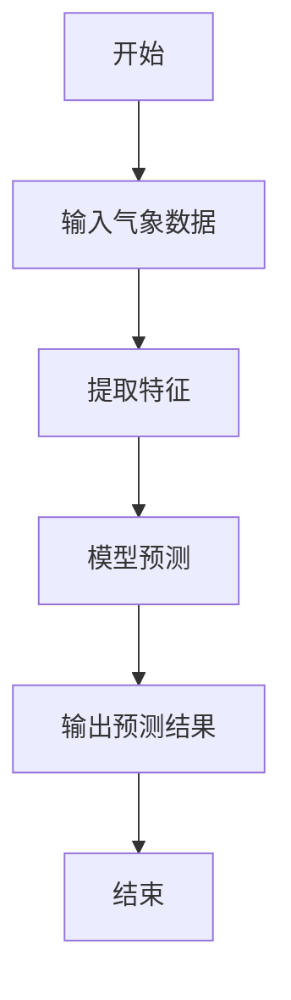
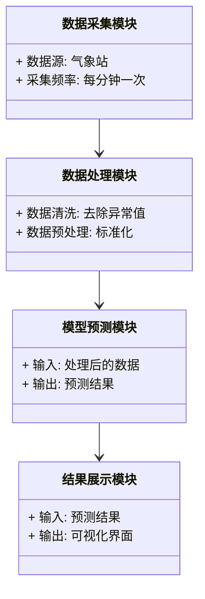
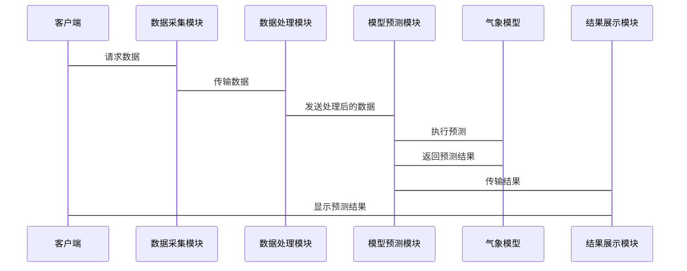

                 


# AI Agent在智能气象预报中的应用

## 关键词：
AI Agent, 智能气象预报, 机器学习, 强化学习, 气象数据, 系统架构, 项目实战

## 摘要：
本文探讨了AI Agent在智能气象预报中的应用，从背景介绍、核心概念、算法原理、系统架构到项目实战，全面分析了AI Agent如何提升气象预报的准确性和实时性。通过详细讲解强化学习算法和系统架构设计，结合实际案例，展示了AI Agent在气象预报中的潜力和实现方法。

---

# 第一部分: AI Agent与智能气象预报的背景介绍

## 第1章: AI Agent的基本概念与背景

### 1.1 AI Agent的定义与核心概念

#### 1.1.1 AI Agent的定义
AI Agent（人工智能代理）是指能够感知环境并采取行动以实现目标的智能实体。它可以是一个软件程序、机器人或其他智能系统。

#### 1.1.2 AI Agent的核心特征
- **自主性**：能够在没有外部干预的情况下运行。
- **反应性**：能够实时感知环境并做出反应。
- **目标导向**：具有明确的目标，行动围绕目标展开。
- **学习能力**：能够通过经验改进性能。

#### 1.1.3 AI Agent的分类与应用场景
- **基于规则的AI Agent**：通过预定义的规则进行决策，适用于简单任务。
- **基于机器学习的AI Agent**：通过数据学习，适用于复杂任务。
- **基于强化学习的AI Agent**：通过试错学习，适用于动态环境。

| 类型 | 描述 | 适用场景 |
|------|------|----------|
| 基于规则的AI Agent | 通过预定义规则进行决策 | 简单任务，如交通信号灯控制 |
| 基于机器学习的AI Agent | 通过数据学习进行决策 | 复杂任务，如气象预报 |
| 基于强化学习的AI Agent | 通过试错学习进行决策 | 动态环境，如游戏AI |

### 1.2 智能气象预报的背景与需求

#### 1.2.1 气象预报的重要性
气象预报在农业、航空、航海等领域具有重要意义，能够帮助人们避免自然灾害，优化资源配置。

#### 1.2.2 传统气象预报的局限性
- 数据量有限：传统方法依赖有限的气象站数据。
- 计算能力不足：复杂模型需要高性能计算。
- 预测精度有限：受模型假设和数据质量影响。

#### 1.2.3 智能化气象预报的目标与价值
目标：提高预测精度，缩短预测时间，扩大数据来源。
价值：帮助人们更好地应对自然灾害，优化经济活动。

### 1.3 AI Agent在智能气象预报中的结合

#### 1.3.1 AI Agent与气象数据的关系
AI Agent能够实时处理和分析海量气象数据，提供更精准的预测。

#### 1.3.2 AI Agent在气象预报中的优势
- 高效性：能够快速处理大量数据。
- 精准性：通过机器学习模型提高预测精度。
- 实时性：能够实时更新预测结果。

#### 1.3.3 当前研究与应用现状
当前，AI Agent在气象预报中的应用主要集中在数据处理、模型优化和实时预测方面。

---

## 第2章: AI Agent与智能气象预报的核心概念

### 2.1 AI Agent的核心原理

#### 2.1.1 AI Agent的感知模块
感知模块负责从环境中获取信息，如温度、湿度、气压等气象数据。

#### 2.1.2 AI Agent的决策模块
决策模块基于感知到的信息，通过算法做出预测或决策。

#### 2.1.3 AI Agent的执行模块
执行模块负责将决策转化为实际行动，如触发预警系统。

### 2.2 智能气象预报的核心要素

#### 2.2.1 气象数据的多样性
气象数据包括温度、湿度、风速、气压等多种类型。

#### 2.2.2 气象模型的复杂性
气象模型涉及流体力学、热力学等复杂物理过程。

#### 2.2.3 智能预报的实时性与准确性
智能预报需要在短时间内提供高精度的预测结果。

### 2.3 AI Agent与智能气象预报的关系

#### 2.3.1 AI Agent在气象预报中的角色
AI Agent作为智能气象预报的核心，负责数据处理、模型优化和预测输出。

#### 2.3.2 智能气象预报对AI Agent的需求
- 高效的数据处理能力。
- 强大的学习和优化能力。
- 实时的预测能力。

#### 2.3.3 两者结合的系统架构
AI Agent与智能气象预报的结合形成了一个高效、精准的气象预报系统。

---

## 第3章: AI Agent在智能气象预报中的算法原理

### 3.1 基于强化学习的天气预测模型

#### 3.1.1 强化学习的基本原理
强化学习是一种通过试错学习的算法，智能体通过与环境交互，逐步优化策略。

#### 3.1.2 天气预测模型的设计思路
- 数据输入：温度、湿度、风速等气象数据。
- 状态空间：当前气象条件。
- 动作空间：预测结果。
- 奖励函数：预测准确度。

#### 3.1.3 算法的数学模型与公式
**损失函数**：$$L = \frac{1}{n}\sum_{i=1}^{n}(y_i - \hat{y}_i)^2$$**

**优化器**：使用Adam优化器，$$\theta_{t+1} = \theta_t - \eta \nabla L$$

### 3.2 算法流程图（Mermaid）



### 3.3 Python代码实现

```python
import numpy as np
from sklearn.metrics import mean_squared_error

# 示例数据
X = np.random.rand(100, 5)  # 100个样本，5个特征
y = np.random.rand(100, 1)   # 标签

# 定义模型
class WeatherPredictor:
    def __init__(self, input_dim, output_dim):
        self.theta = np.random.randn(input_dim, output_dim)
    
    def predict(self, X):
        return np.dot(X, self.theta)
    
    def loss(self, y_pred, y_true):
        return mean_squared_error(y_pred, y_true)
    
    def update(self, X, y_true, learning_rate=0.01):
        y_pred = self.predict(X)
        gradient = (2 * np.dot(X.T, (y_pred - y_true))) / X.shape[0]
        self.theta -= learning_rate * gradient

# 训练模型
model = WeatherPredictor(5, 1)
for _ in range(100):
    y_pred = model.predict(X)
    loss = model.loss(y_pred, y)
    model.update(X, y)
```

### 3.4 数学模型与公式

**预测公式**：$$\hat{y} = X\theta$$

**损失函数**：$$L = \frac{1}{2n}\sum_{i=1}^{n}(y_i - \hat{y}_i)^2$$**

**优化过程**：$$\theta_{t+1} = \theta_t - \eta \nabla L$$

---

## 第4章: 系统分析与架构设计方案

### 4.1 问题场景介绍

#### 4.1.1 问题场景
气象预报系统需要实时处理海量数据，快速生成预测结果。

### 4.2 项目介绍

#### 4.2.1 项目目标
开发一个基于AI Agent的智能气象预报系统。

### 4.3 系统功能设计

#### 4.3.1 功能模块
- 数据采集模块：从气象站获取实时数据。
- 数据处理模块：清洗和预处理数据。
- 模型预测模块：使用强化学习模型进行预测。
- 结果展示模块：将预测结果以可视化形式呈现。

#### 4.3.2 领域模型（Mermaid类图）



### 4.4 系统架构设计

#### 4.4.1 系统架构（Mermaid架构图）


### 4.5 系统接口设计

#### 4.5.1 接口描述
- 数据接口：提供实时气象数据。
- 预测接口：接受预测请求，返回预测结果。
- 展示接口：提供可视化结果。

### 4.6 系统交互流程图（Mermaid序列图）



---

## 第5章: 项目实战

### 5.1 环境安装

#### 5.1.1 安装Python
```bash
python --version
pip install numpy scikit-learn
```

### 5.2 系统核心实现源代码

#### 5.2.1 数据采集模块
```python
import requests

def fetch_weather_data():
    response = requests.get("http://api.weather.com/data")
    return response.json()
```

#### 5.2.2 数据处理模块
```python
import pandas as pd

def preprocess_data(data):
    df = pd.DataFrame(data)
    df.dropna(inplace=True)
    df = df[['temperature', 'humidity', 'wind_speed']]
    return df
```

#### 5.2.3 模型预测模块
```python
class WeatherModel:
    def __init__(self):
        self.model = self.build_model()
    
    def build_model(self):
        # 定义模型结构
        pass
    
    def train(self, X, y):
        # 训练模型
        pass
    
    def predict(self, X):
        # 预测结果
        pass
```

#### 5.2.4 结果展示模块
```python
import matplotlib.pyplot as plt

def plot_prediction(true, predicted):
    plt.plot(true, label='True')
    plt.plot(predicted, label='Predicted')
    plt.legend()
    plt.show()
```

### 5.3 代码应用解读与分析

#### 5.3.1 数据采集模块
从气象API获取实时数据。

#### 5.3.2 数据处理模块
清洗数据，去除异常值，进行标准化处理。

#### 5.3.3 模型预测模块
使用机器学习模型进行训练和预测。

#### 5.3.4 结果展示模块
将预测结果可视化，方便用户查看。

### 5.4 实际案例分析

#### 5.4.1 案例背景
以某地区未来24小时的气象预测为例。

#### 5.4.2 数据处理
清洗和预处理数据，提取关键特征。

#### 5.4.3 模型预测
训练模型，生成预测结果。

#### 5.4.4 预测结果分析
分析预测结果的准确性，优化模型参数。

### 5.5 项目小结

#### 5.5.1 成果总结
成功开发了一个基于AI Agent的智能气象预报系统。

#### 5.5.2 不足之处
预测精度有待提高，系统稳定性需要优化。

---

## 第6章: 最佳实践

### 6.1 小结

#### 6.1.1 核心知识点总结
AI Agent在气象预报中的应用，强化学习算法，系统架构设计。

### 6.2 注意事项

#### 6.2.1 数据质量
确保数据的准确性和完整性。

#### 6.2.2 模型优化
定期更新模型，提高预测精度。

#### 6.2.3 系统维护
保持系统的稳定性和安全性。

### 6.3 拓展阅读

#### 6.3.1 推荐书籍
- 《强化学习入门》
- 《机器学习实战》

#### 6.3.2 技术博客
- [AI Agent技术博客](https://example.com)

---

# 结语

通过本文的详细介绍，读者可以全面了解AI Agent在智能气象预报中的应用，从理论到实践，掌握相关的核心技术。希望本文能为相关领域的研究和应用提供有价值的参考。

