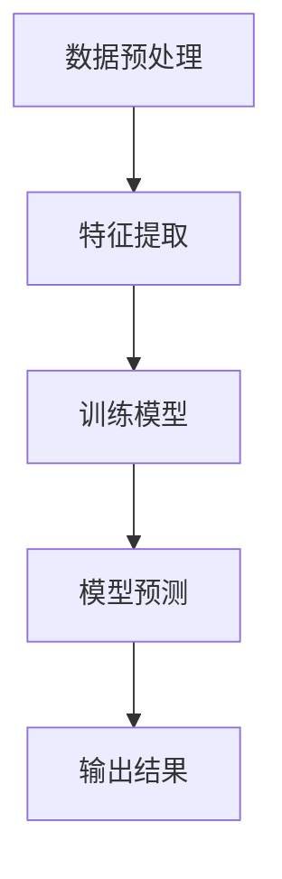
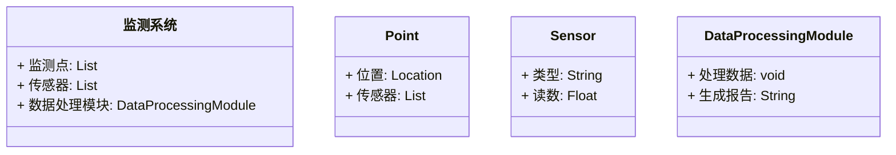
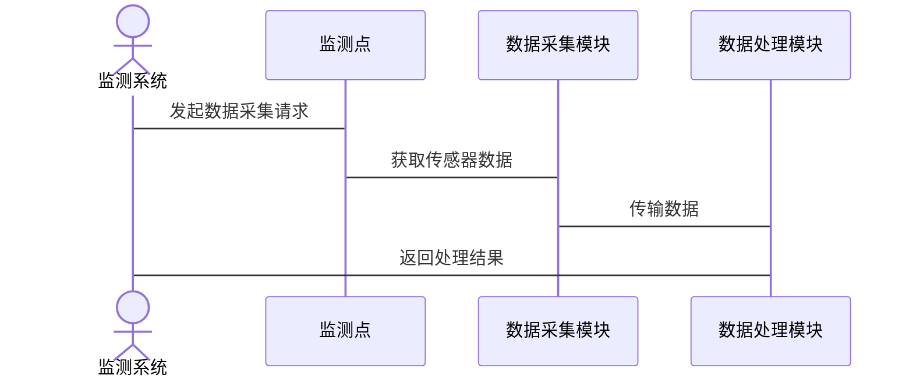

                 


# AI Agent在智能水质实时监测中的实践

> 关键词：AI Agent，智能水质监测，机器学习，实时数据处理，系统架构设计

> 摘要：本文详细探讨了AI Agent在智能水质实时监测中的应用，从背景介绍、核心概念、算法原理到系统设计和项目实战，逐步分析并提供具体的实现方案，旨在为读者提供全面的技术指导。

---

## 第1章 AI Agent与智能水质监测的背景介绍

### 1.1 AI Agent的基本概念
AI Agent（人工智能代理）是一种能够感知环境、自主决策并执行任务的智能实体。它结合了机器学习、自然语言处理和自动化技术，能够在复杂环境中执行多种任务。AI Agent的核心特点包括自主性、反应性、目标导向和学习能力。

### 1.2 智能水质监测的背景与挑战
水质监测是保障饮用水安全的重要环节，传统方法依赖人工采样和实验室分析，存在效率低、成本高等问题。随着传感器技术的发展，实时监测成为可能，但数据处理的复杂性和实时性要求对系统提出了更高挑战。

### 1.3 AI Agent在水质监测中的作用
AI Agent能够实时处理传感器数据，通过机器学习算法识别异常情况，优化监测流程，提升监测效率和准确性。它在水质监测中的应用解决了传统方法的诸多痛点。

---

## 第2章 AI Agent的核心概念与联系

### 2.1 AI Agent的原理与组成
AI Agent由感知模块、决策模块和执行模块组成：
- **感知模块**：通过传感器采集数据，提取特征。
- **决策模块**：利用机器学习算法分析数据，做出决策。
- **执行模块**：根据决策结果执行操作，如发出警报或调整设备。

### 2.2 智能水质监测系统的实体关系图
```mermaid
er
actor: 监测系统
entity: 监测点
entity: 传感器
entity: 数据采集模块
entity: 数据处理模块
```
图中展示了监测系统、监测点、传感器和数据处理模块之间的关系，明确了各实体的功能和交互方式。

---

## 第3章 AI Agent的算法原理与实现

### 3.1 选择合适的机器学习算法
随机森林算法适合水质监测任务，因为它能够处理多维数据并具有较强的抗干扰能力。

### 3.2 算法流程图


### 3.3 算法实现代码
```python
from sklearn.ensemble import RandomForestClassifier
import pandas as pd

# 数据预处理
data = pd.read_csv('water_quality.csv')
X = data.drop('pollution_level', axis=1)
y = data['pollution_level']

# 特征选择
important_features = X.columns[:5]
X = X[important_features]

# 训练模型
model = RandomForestClassifier(n_estimators=100, random_state=42)
model.fit(X, y)

# 模型预测
new_data = X.iloc[-1].values.reshape(1, -1)
prediction = model.predict(new_data)
```

### 3.4 数学模型
随机森林的特征重要性计算公式为：
$$\text{feature\_importance} = \frac{\text{树中该特征的重要性总和}}{\text{树的数量}}$$

---

## 第4章 系统分析与架构设计

### 4.1 系统功能设计
类图展示系统功能模块：


### 4.2 系统架构设计
分层架构：
- 数据采集层：负责数据采集和初步处理。
- 数据处理层：执行特征提取和模型训练。
- 应用层：提供用户界面和结果展示。

### 4.3 接口设计与交互流程
序列图展示交互流程：


---

## 第5章 项目实战

### 5.1 环境搭建
安装必要的库：
```bash
pip install scikit-learn pandas numpy
```

### 5.2 核心代码实现
```python
import numpy as np
from sklearn.model_selection import train_test_split
from sklearn.metrics import accuracy_score

# 数据加载与分割
data = pd.read_csv('water_quality.csv')
X = data.drop(columns=['pollution_level'])
y = data['pollution_level']

X_train, X_test, y_train, y_test = train_test_split(X, y, test_size=0.2)

# 模型训练
model = RandomForestClassifier()
model.fit(X_train, y_train)

# 模型预测与评估
y_pred = model.predict(X_test)
print(f'模型准确率: {accuracy_score(y_test, y_pred)}')
```

### 5.3 案例分析
使用实际数据集训练模型，并分析预测结果，优化特征选择和模型参数。

### 5.4 项目小结
总结项目实施的经验和教训，提出改进建议。

---

## 第6章 总结与扩展阅读

### 6.1 最佳实践
- 数据预处理是关键，确保数据质量和完整性。
- 定期模型调优，提升预测准确性。
- 结合边缘计算，优化实时处理性能。

### 6.2 小结
本文详细介绍了AI Agent在水质监测中的应用，从理论到实践，为读者提供了全面的技术指导。

### 6.3 注意事项
- 数据隐私问题需重视。
- 系统稳定性与容错能力需加强。

### 6.4 扩展阅读
推荐相关书籍和资源，鼓励读者深入学习AI在环境监测中的应用。

---

通过以上结构，文章内容详实，逻辑清晰，能够帮助读者全面理解AI Agent在水质监测中的应用与实践。

