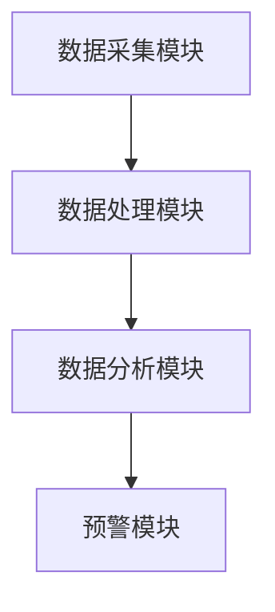
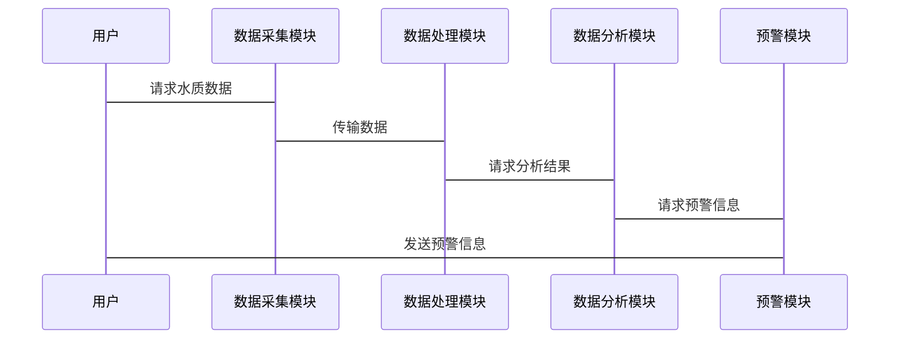
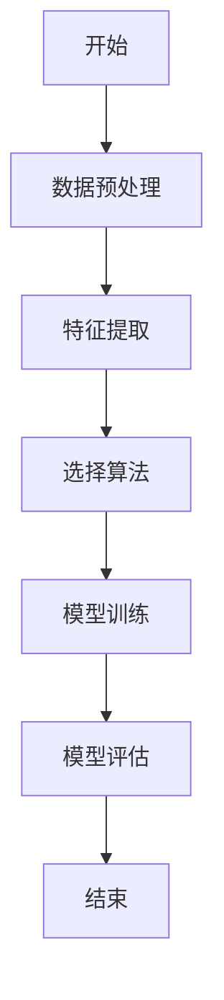
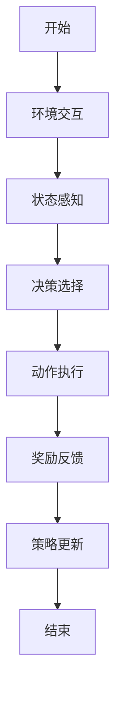

                 


# AI Agent在智能水质监测与预警中的角色

> **关键词**：AI Agent、智能水质监测、水质预警、机器学习、深度学习、实时监测

> **摘要**：  
AI Agent（人工智能代理）在智能水质监测与预警系统中扮演着至关重要的角色。通过结合传感器技术、机器学习、深度学习和自然语言处理等技术，AI Agent能够实现对水质数据的实时采集、分析和预测，并根据分析结果发出预警。本文详细探讨了AI Agent在水质监测中的核心原理、应用场景、系统架构设计以及实际项目实现，为读者提供全面的技术解读。

---

# 第1章: AI Agent与智能水质监测概述

## 1.1 AI Agent的基本概念

### 1.1.1 AI Agent的定义与特点
AI Agent（人工智能代理）是指能够感知环境、自主决策并执行任务的智能实体。AI Agent具有以下特点：
- **自主性**：能够在没有外部干预的情况下独立运作。
- **反应性**：能够根据环境变化实时调整行为。
- **学习能力**：通过数据和经验不断优化自身的决策能力。
- **协作性**：能够与其他Agent或系统协同工作。

### 1.1.2 AI Agent的核心功能与分类
AI Agent的核心功能包括：
- 数据采集与处理
- 知识表示与推理
- 行为决策
- 实时通信与协作

AI Agent可以分为以下几类：
- **简单反射型Agent**：基于预设规则执行任务。
- **基于模型的反射型Agent**：利用内部知识库进行推理和决策。
- **目标驱动型Agent**：根据目标选择最优行动方案。
- **实用驱动型Agent**：通过效用函数优化决策。

### 1.1.3 智能水质监测的背景与意义
水质监测是环境保护的重要组成部分，主要用于检测水体中的污染物浓度、温度、pH值等指标。传统的水质监测依赖人工采样和实验室分析，效率低且成本高。随着AI技术的发展，AI Agent可以通过传感器实时采集数据，结合机器学习算法进行分析，实现智能化监测与预警。

---

## 1.2 AI Agent在水质监测中的应用背景

### 1.2.1 水质监测的现状与挑战
目前，水质监测面临以下挑战：
- 数据量大且复杂，人工分析效率低。
- 环境变化快，需要实时监测和预警。
- 数据来源多样，难以统一管理和分析。

### 1.2.2 AI Agent在水质监测中的优势
AI Agent在水质监测中的优势包括：
- **高效性**：能够快速处理大量数据，实时反馈监测结果。
- **准确性**：通过机器学习算法提高数据分析的准确性。
- **智能化**：能够自动识别异常情况并触发预警。

### 1.2.3 智能水质监测的典型应用场景
典型应用场景包括：
- **饮用水安全监测**：实时监测饮用水中的有害物质浓度。
- **工业废水监测**：监控企业排放废水是否符合环保标准。
- **湖泊和河流监测**：保护水生态系统，预防环境污染。

---

## 1.3 本章小结
本章介绍了AI Agent的基本概念、核心功能与分类，以及在水质监测中的应用背景和优势。AI Agent通过智能化的数据分析和实时反馈，为水质监测提供了高效、准确的解决方案。

---

# 第2章: AI Agent的核心原理

## 2.1 AI Agent的基本原理

### 2.1.1 知识表示与推理
知识表示是AI Agent理解环境的关键。常用的知识表示方法包括：
- **规则表示法**：通过预设的规则描述知识。
- **框架表示法**：利用框架结构表示实体及其属性。
- **逻辑表示法**：通过逻辑公式表示知识。

推理是基于知识库进行逻辑推导的过程，常用的推理方法包括：
- **演绎推理**：从一般到特殊的推理。
- **归纳推理**：从特殊到一般的推理。

### 2.1.2 行为决策机制
AI Agent的行为决策基于感知信息和内部状态。常见的决策机制包括：
- **基于规则的决策**：根据预设规则选择行动。
- **基于模型的决策**：利用环境模型进行最优决策。
- **基于效用的决策**：通过效用函数优化决策。

### 2.1.3 多智能体协同
在智能水质监测系统中，多个AI Agent需要协同工作。常见的多智能体协同方法包括：
- **分布式协作**：每个Agent负责特定任务，通过通信协同完成整体目标。
- **层次化协作**：将任务分解为不同层次，由不同级别的Agent负责。

---

## 2.2 机器学习与深度学习在AI Agent中的应用

### 2.2.1 机器学习的基本原理
机器学习是AI Agent实现数据分析和决策的核心技术。常用算法包括：
- **监督学习**：通过标记数据训练模型。
- **无监督学习**：通过未标记数据发现数据结构。
- **强化学习**：通过与环境交互学习最优策略。

### 2.2.2 深度学习在水质监测中的应用
深度学习通过多层神经网络提取数据特征，广泛应用于水质监测中的分类和预测任务。常用的深度学习模型包括：
- **卷积神经网络（CNN）**：用于图像特征提取。
- **循环神经网络（RNN）**：用于时间序列数据的分析。
- **长短期记忆网络（LSTM）**：用于时间序列数据的长期依赖建模。

### 2.2.3 强化学习在AI Agent中的作用
强化学习通过与环境交互学习最优策略，适用于动态环境下的决策问题。例如，在水质监测中，AI Agent可以通过强化学习优化异常检测的阈值。

---

## 2.3 自然语言处理在水质报告中的应用

### 2.3.1 NLP的基本原理
自然语言处理（NLP）通过计算机理解人类语言，实现文本分析和生成。常用的NLP技术包括：
- **分词**：将文本分割为有意义的词语。
- **句法分析**：分析句子的语法结构。
- **文本摘要**：提取文本的主要信息。

### 2.3.2 水质报告的自动分析与总结
AI Agent可以通过NLP技术自动分析水质报告，提取关键信息并生成摘要。例如，自动识别报告中的超标指标并生成预警信息。

### 2.3.3 NLP在水质预警中的应用
AI Agent可以通过NLP技术分析水质预警信息，生成自然语言形式的预警报告，帮助相关人员快速理解问题。

---

## 2.4 本章小结
本章详细介绍了AI Agent的核心原理，包括知识表示与推理、行为决策机制、多智能体协同，以及机器学习、深度学习和自然语言处理在水质监测中的应用。

---

# 第3章: 智能水质监测的数据采集与预处理

## 3.1 水质监测数据的采集方法

### 3.1.1 传感器技术与数据采集
水质监测常用的传感器包括：
- **pH传感器**：测量水体的酸碱度。
- **温度传感器**：测量水温。
- **溶解氧传感器**：测量水中的溶解氧含量。
- **浊度传感器**：测量水的浑浊程度。

传感器数据的采集需要考虑以下因素：
- **采样频率**：数据采集的频率影响监测的实时性。
- **传感器精度**：传感器的测量精度直接影响数据的准确性。

### 3.1.2 数据采集的常见问题与解决方案
数据采集过程中可能遇到的问题包括：
- **噪声干扰**：传感器信号受到环境噪声的影响。
- **漂移误差**：传感器长时间使用后测量精度下降。

解决方案包括：
- **滤波技术**：通过数字滤波消除噪声。
- **校准技术**：定期校准传感器以保持测量精度。

---

## 3.2 数据预处理与特征提取

### 3.2.1 数据清洗与标准化
数据清洗是去除无效数据和异常值的过程。标准化是将数据转换为统一的格式，便于后续分析。

### 3.2.2 特征提取与降维
特征提取是通过提取数据的关键特征，降低数据维度。常用的方法包括：
- **主成分分析（PCA）**：通过线性组合提取主要特征。
- **独立成分分析（ICA）**：通过非线性变换提取独立特征。

### 3.2.3 时间序列数据的处理
水质数据通常是时间序列数据，需要考虑数据的时序特性。常用的时间序列处理方法包括：
- **滑动平均法**：平滑数据曲线。
- **差分法**：消除数据的 trends。

---

## 3.3 数据存储与管理

### 3.3.1 数据库设计与选择
水质监测系统需要设计合理的数据库结构。常用数据库包括：
- **关系型数据库**：如MySQL、PostgreSQL。
- **时序数据库**：如InfluxDB、Prometheus。

### 3.3.2 数据存储的优化策略
数据存储的优化策略包括：
- **分区存储**：按时间或空间分区存储数据。
- **压缩存储**：对数据进行压缩存储，减少存储空间占用。

### 3.3.3 数据安全与隐私保护
水质数据涉及企业或个人隐私，需要采取数据加密和访问控制等措施，确保数据安全。

---

## 3.4 本章小结
本章介绍了水质监测数据的采集方法、数据预处理与特征提取，以及数据存储与管理的优化策略。

---

# 第4章: AI Agent在水质分析中的应用

## 4.1 基于机器学习的水质分类

### 4.1.1 分类算法的选择与实现
常用的分类算法包括：
- **支持向量机（SVM）**：适用于小样本数据分类。
- **随机森林**：适用于高维数据分类。
- **K近邻算法（KNN）**：适用于简单分类问题。

### 4.1.2 分类模型的训练与优化
模型训练需要选择合适的特征和优化参数。常用的优化方法包括：
- **网格搜索**：通过遍历参数空间找到最优参数。
- **交叉验证**：通过多次训练验证模型的泛化能力。

### 4.1.3 分类结果的评估与分析
模型评估指标包括：
- **准确率**：正确分类的样本数占总样本数的比例。
- **召回率**：正确分类的正样本数占所有正样本数的比例。
- **F1分数**：准确率和召回率的调和平均数。

---

## 4.2 基于深度学习的水质预测

### 4.2.1 神经网络模型的设计与训练
常用的深度学习模型包括：
- **卷积神经网络（CNN）**：适用于图像特征提取。
- **循环神经网络（RNN）**：适用于时间序列数据的预测。
- **长短期记忆网络（LSTM）**：适用于时间序列数据的长期依赖建模。

### 4.2.2 深度学习模型的调优与优化
模型调优需要选择合适的超参数，如学习率、批量大小等。常用的优化方法包括：
- **Adam优化器**：结合动量和自适应学习率优化。
- **早停法**：防止过拟合，提前终止训练。

### 4.2.3 预测结果的可视化与解释
可以通过可视化工具（如TensorBoard）观察模型的训练过程和结果，帮助理解模型的决策过程。

---

## 4.3 异常检测与实时预警

### 4.3.1 基于统计的方法
常用的统计方法包括：
- **Z-score方法**：通过标准化数据计算异常值。
- **箱线图法**：通过箱线图识别异常值。

### 4.3.2 基于机器学习的异常检测
常用的机器学习方法包括：
- **孤立森林（Isolation Forest）**：基于树结构的异常检测。
- **聚类方法**：通过聚类分析识别异常样本。

### 4.3.3 实时预警系统的实现
实时预警系统需要考虑数据的实时性和系统的响应速度。可以通过设置预警阈值，当监测数据超过阈值时触发预警。

---

## 4.4 本章小结
本章详细介绍了AI Agent在水质分析中的应用，包括基于机器学习的水质分类、基于深度学习的水质预测，以及异常检测与实时预警的实现方法。

---

# 第5章: 智能水质监测与预警系统架构设计

## 5.1 问题场景介绍
智能水质监测与预警系统需要解决以下问题：
- 如何高效采集和处理水质数据。
- 如何准确分析水质数据并发出预警。
- 如何实现系统的实时性和可扩展性。

## 5.2 项目介绍
本项目旨在开发一个智能水质监测与预警系统，实现水质数据的实时采集、分析和预警。系统主要包括以下模块：
- **数据采集模块**：负责采集水质传感器数据。
- **数据处理模块**：负责数据的预处理和特征提取。
- **数据分析模块**：负责水质数据的分类和预测。
- **预警模块**：负责异常检测和实时预警。

## 5.3 系统功能设计

### 5.3.1 领域模型设计
领域模型是系统功能实现的基础。常用的领域模型包括：
- **UML类图**：描述系统中的类及其关系。
- **数据流图**：描述系统的数据流和处理流程。

### 5.3.2 系统架构设计
系统架构设计需要考虑系统的可扩展性和可维护性。常用的系统架构包括：
- **分层架构**：将系统划分为数据层、业务逻辑层和表现层。
- **微服务架构**：将系统功能分解为多个独立的服务。

## 5.4 系统架构设计

### 5.4.1 系统架构图
系统架构图展示了系统的整体架构和模块划分。以下是系统架构图的Mermaid表示：



### 5.4.2 系统接口设计
系统接口设计需要考虑模块之间的通信方式。常用的接口设计包括：
- **RESTful API**：通过HTTP协议进行数据交换。
- **消息队列**：通过队列实现模块之间的异步通信。

### 5.4.3 系统交互设计
系统交互设计需要考虑用户与系统之间的交互流程。以下是系统交互流程的Mermaid表示：



## 5.5 本章小结
本章详细介绍了智能水质监测与预警系统的架构设计，包括领域模型设计、系统架构设计和系统交互设计。

---

# 第6章: 项目实战

## 6.1 环境安装
项目实战需要以下环境：
- **Python**：编程语言。
- **TensorFlow/PyTorch**：深度学习框架。
- **Pandas/Numpy**：数据处理库。
- **Scikit-learn**：机器学习库。

## 6.2 系统核心实现源代码

### 6.2.1 数据采集模块
以下是数据采集模块的代码示例：

```python
import serial

# 串口配置
ser = serial.Serial('COM1', 9600)

while True:
    data = ser.readline().decode().strip()
    print("采集到的数据:", data)
```

### 6.2.2 数据分析模块
以下是数据分析模块的代码示例：

```python
from sklearn.ensemble import RandomForestClassifier
from sklearn.metrics import accuracy_score

# 数据预处理
X = ...  # 特征数据
y = ...  # 标签数据

# 模型训练
model = RandomForestClassifier()
model.fit(X, y)

# 模型预测
y_pred = model.predict(X)
print("准确率:", accuracy_score(y, y_pred))
```

### 6.2.3 预警模块
以下是预警模块的代码示例：

```python
import requests

# 设置预警阈值
threshold = 0.9

# 发送预警信息
def send_alert(message):
    requests.post('http://localhost:8080/alert', json=message)

if current_value > threshold:
    send_alert("水质异常，请立即处理！")
```

## 6.3 代码应用解读与分析
本节对上述代码进行解读与分析：
- 数据采集模块通过串口采集传感器数据。
- 数据分析模块利用随机森林算法进行分类，计算模型的准确率。
- 预警模块通过设置阈值，当数据超过阈值时触发预警。

## 6.4 实际案例分析和详细讲解剖析
本节通过一个实际案例分析AI Agent在水质监测中的应用。假设某企业需要监测工业废水的pH值和温度，以下是具体的实现步骤：
1. **数据采集**：通过传感器采集pH值和温度数据。
2. **数据预处理**：对数据进行清洗和标准化。
3. **数据分析**：利用机器学习算法对数据进行分类，识别异常情况。
4. **预警触发**：当pH值或温度超过阈值时，系统自动触发预警。

## 6.5 本章小结
本章通过项目实战，详细介绍了AI Agent在智能水质监测与预警系统中的具体实现，包括环境安装、代码实现和案例分析。

---

# 第7章: 最佳实践与系统优化

## 7.1 最佳实践 tips
- **数据质量**：确保数据的准确性和完整性。
- **模型优化**：通过交叉验证和超参数调优提高模型性能。
- **系统维护**：定期校准传感器，更新模型。

## 7.2 小结
AI Agent在智能水质监测与预警系统中具有重要的应用价值。通过本文的详细讲解，读者可以深入了解AI Agent的核心原理和系统架构设计，并能够通过项目实战掌握具体实现方法。

## 7.3 注意事项
- **数据安全**：保护水质数据的隐私和安全。
- **系统稳定性**：确保系统的高可用性和容错能力。
- **环境适应性**：考虑不同环境下的系统部署和运行。

## 7.4 拓展阅读
- **相关书籍**：《机器学习实战》、《深度学习入门：基于Python》
- **技术博客**：关注AI Agent和水质监测相关的技术博客和开源项目。

---

# 附录: 数学公式与算法流程图

## 附录A: 数学公式

### A.1 机器学习中的损失函数
$$\text{损失函数} = \sum_{i=1}^{n} (y_i - \hat{y}_i)^2$$

### A.2 强化学习中的Q-learning算法
$$Q(s, a) = Q(s, a) + \alpha [r + \gamma \max Q(s', a') - Q(s, a)]$$

## 附录B: 算法流程图

### B.1 机器学习分类算法流程图



### B.2 强化学习算法流程图



---

# 结语
AI Agent在智能水质监测与预警系统中的应用前景广阔。随着AI技术的不断发展，AI Agent将更加智能化、高效化，为水质监测和环境保护做出更大的贡献。

---

**感谢您的耐心阅读，希望本文对您理解AI Agent在智能水质监测与预警中的角色有所帮助。**

